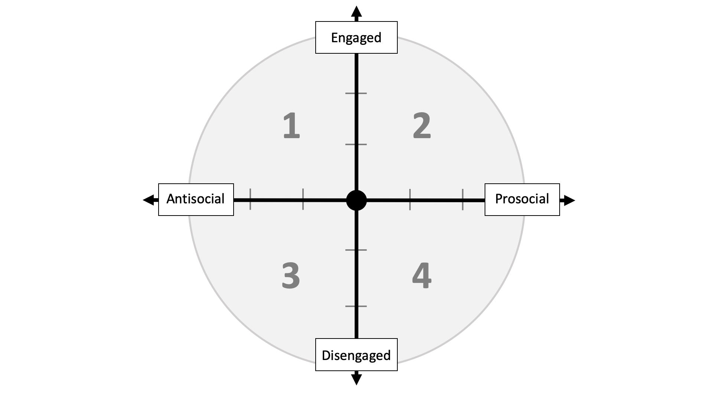
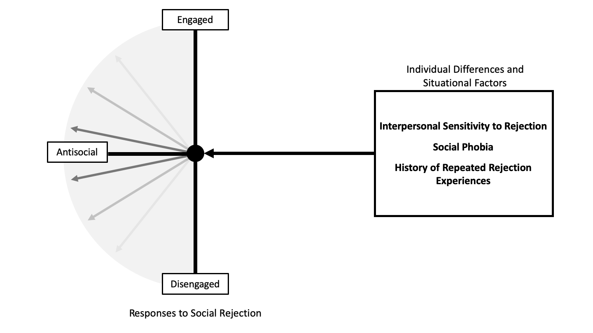
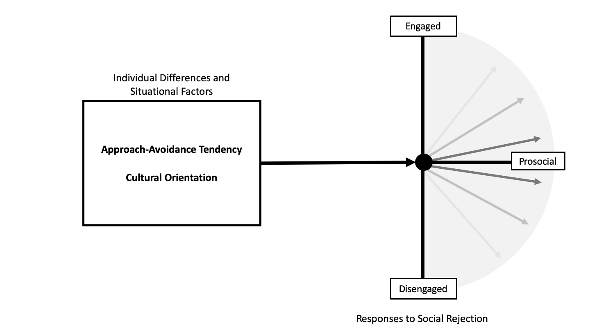
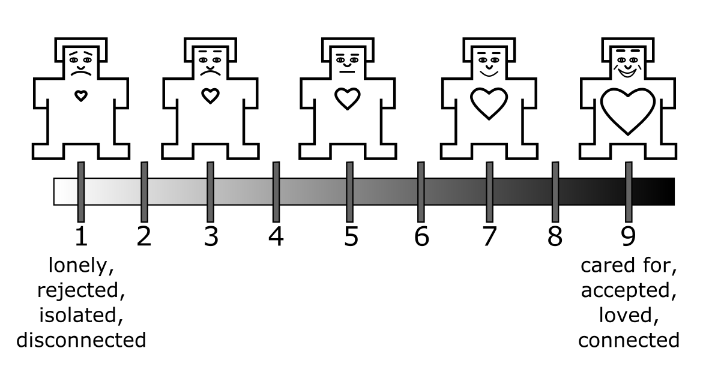
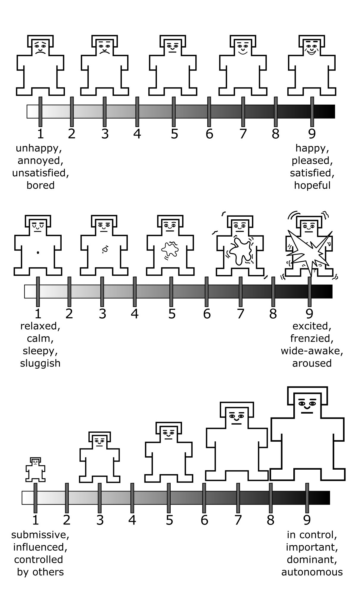
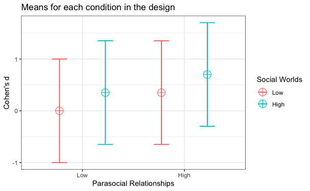

```{r bidr-setup, message=FALSE, warning=FALSE, include=FALSE}
# Chunk Options
knitr::opts_chunk$set(
	echo = FALSE,
	message = FALSE,
	warning = FALSE
)
# Load rmarkdown package to get `metadata`
library(rmarkdown)
```

```{r, echo=FALSE}
library(tidyverse)
library(metathis)
meta() %>%
  meta_description(
    "Nami Sunami's Doctoral Dissertation on Video Games and Belonging "
  ) %>% 
  meta_name("github-repo" = "nsunami/dissertation") %>% 
  meta_viewport() %>% 
  meta_social(
    title = "Playing Alone, Feeling Connected: Do Single-Player Video Games with Social Surrogates Replenish Belonging After Social Rejection?",
    url = "https://nsunami.github.io/dissertation/",
    image = "https://raw.githubusercontent.com/nsunami/dissertation/2f48c254e6c6ebe7410fde51f0dcaf28e9c4779c/img/og.png",
    image_alt = "The title image of the dissertation",
    og_type = "book",
    og_author = "Naoyuki Sunami",
    twitter_card_type = "summary",
    twitter_creator = "@n_sunami"
  )

```


# Overview

People have a fundamental need to belong---to be accepted, loved, and
cared for [@baumeisterNeedBelongDesire1995; @maslow1943]. Being forced to stay at home
during the COVID-19 pandemic, many people experienced threats to
belonging: an experience of feeling rejected, excluded, and unloved. At
the same time, more and more people bought and played video games.
Worldwide spending and Google search interests on video games hit an
all-time high for March, April, and May in 2020, coinciding with the
stay-at-home orders in the US [@beresford2020; @shanley2020;
@superdatastaff2020]. Media reports have suggested that people play
video games to cope with social isolation during the COVID-19 crisis
[@baraniuk2020; @gregory2020; @langille2020; @lazarus2020]. Existing
research supports that playing video games with others online (e.g., in
a multiplayer mode) can increase belonging [@kowert2015; @vella2015].
However, people can also play alone in a single-player mode (solo play),
and whether solo plays can increase belonging remains unknown.
Theoretically, solo plays can help people feel socially connected
through social surrogates: parasocial relationships with non-player
characters and social worlds where players can immerse themselves and
feel like a member of a collective in the game. This raises an empirical
question: Can a player replenish their belonging even when they play
alone themselves? I designed my dissertation to answer this question.

I structure my dissertation as follows. In Chapter 2, I present my
published work on the bi-dimensional rejection taxonomy [@sunamiBIDimensionalRejectionTaxonomy2020]
to highlight the need for more evidence on the disengaged-prosocial
responses: indirect, and hands-off attempts that increase belonging. In
Chapter 3, I suggest that playing a video game in a single-player mode
is an unexamined disengaged-prosocial response to social rejection. I
draw from the social surrogacy hypothesis [@gabrielSocialSurrogatesRejection2017] and the video
games literature to suggest that solo plays can fulfill belonging. In
Chapter 4 (Study 1), I first validated the Heart Self-Assessment Manikin
(Heart Manikin), a single-item pictorial measure of belonging that I
used as a key outcome for Studies 2 and 3. In Chapter 4 (Study 2), I
examined whether recalling a video game with vs. without social
surrogates, would increase belonging following social rejection. In
Chapter 5 (Study 3), I let participants play a custom-made,
single-player role-playing game to examine whether parasocial
relationships or social worlds replenish belonging after social
rejection. In Chapter 6, I discuss the findings of my dissertation and
future avenues for research.

<!--chapter:end:index.Rmd-->

---
editor_options: 
  markdown: 
    wrap: 72
---

# The Bi-Dimensional Rejection Taxonomy

This chapter has been published as, Sunami, N., Nadzan, M. A., &
Jaremka, L. M. (2019). The bi‐dimensional rejection taxonomy: Organizing
responses to interpersonal rejection along antisocial--prosocial and
engaged--disengaged dimensions. Social and Personality Psychology
Compass. <https://doi.org/10.1111/spc3.12497>.

<center>
\begin{center}

Abstract

\end{center}
</center>

Responses to interpersonal rejection vary widely in form and function.
Existing theories of interpersonal rejection have exclusively focused on
organizing these responses on a single antisocial--prosocial dimension.
Accumulating evidence suggests a gap in this approach: variability in
social responses to rejection cannot solely be explained by the
antisocial--prosocial dimension alone. To fill this gap, we propose the
bi-dimensional rejection taxonomy, consisting of the
antisocial--prosocial *x*-axis and engaged-disengaged *y*-axis, a novel
contribution to the literature. We demonstrate that both the *x*- and
*y*-axes are necessary for understanding interpersonal responses to
rejection and avoiding erroneous conclusions. We also show how this new
framework allows researchers to generate more nuanced and accurate
hypotheses about how people respond when rejected. We further
demonstrate how existing research about individual differences and
situational factors that predict responses to rejection can be viewed in
a new light within the bi-dimensional rejection taxonomy. We conclude by
suggesting how the taxonomy inspires innovative questions for future
research.

\newpage
<center>
\begin{center}

The Bi-Dimensional Rejection Taxonomy:

Organizing Responses to Interpersonal Rejection along
Antisocial--Prosocial and Engaged--Disengaged Dimensions

\end{center}
</center>

Traveling with an incomplete map is not very efficient---a traveler may
end up in the wrong place because they are unsure where they are going.
This analogy can also be applied to scientific research---a researcher
is likely to arrive at an incorrect conclusion because they are using an
incomplete theoretical framework. In this paper, we suggest that the
rejection literature is operating with an incomplete theoretical
framework for understanding responses to interpersonal rejection.
Existing theories have already advanced our understanding of how people
respond to rejection, primarily focusing on a single
antisocial--prosocial dimension. Although this dimension is important,
we suggest that not all antisocial and prosocial responses are
identical. To account for this unexplained variability, we incorporate a
second dimension, the engaged--disengaged dimension, adopted from the
coping literature [@carverPersonalityCoping2010; @dijkstraEngagingRatherDisengaging2016]. Accordingly, we propose
the bi-dimensional rejection taxonomy, consisting of an
antisocial--prosocial *x*-axis and an engaged--disengaged *y*-axis
(Figure \@ref(fig:bidr-all)). Adding this second dimension provides a
more thorough theoretical framework for understanding responses to
rejection, equipping researchers with a more complete map for generating
new hypotheses.

(ref:bidr-all) Conceptual figure of the bi-dimensional rejection taxonomy. The antisocial--prosocial *x*-axis refers to rejection responses that function to reduce (antisocial) or promote (prosocial) social connection. The engaged--disengaged *y*-axis represents engaged (direct, active, "hands-on", approach-based) and disengaged (indirect, passive, "hands-off", avoidance-based) attempts to cope with the stressor (the current or future need-threat elicited by the rejection experience). The numbers in the figure represent quadrants: Quadrant 1 (engaged antisocial responses), Quadrant 2 (engaged prosocial responses), Quadrant 3 (disengaged antisocial responses), and Quadrant 4 (disengaged prosocial responses).

```{r bidr-all, out.width = '100%', fig.cap='(ref:bidr-all)'}

```

Our new taxonomy benefits the rejection literature in three ways. First,
it provides a unified map for researchers to organize belonging-relevant
responses to interpersonal rejection. Without this map, researchers
would solely rely on the antisocial--prosocial *x*-axis, leading to
inaccurate conclusions about rejection-elicited responses, as
highlighted throughout the paper. For example, if a researcher only
assessed engaged prosocial responses to rejection, and rejected
participants didn't preferentially display these responses, the
researcher might erroneously conclude that rejection doesn't lead to
prosocial responses at all. Using the bi-dimensional rejection taxonomy,
we can see that rejected participants could still display prosocial
behavior, but in a disengaged manner. Thus, the engaged--disengaged
*y*-axis of the bi-dimensional rejection taxonomy creates a cohesive
framework, preventing researchers from reaching inaccurate conclusions
about rejection-elicited responses.

Second, having a bi-dimensional framework allows researchers to generate
more nuanced and accurate predictions about responses to rejection. In
the past, researchers focused exclusively on how rejection affected
antisocial and prosocial behavior (the *x*-axis) without differentiating
types of behavior within these categories. As a result, existing
hypotheses were limited in specificity. With the bi-dimensional
rejection taxonomy, researchers can generate more nuanced and innovative
hypotheses that incorporate both the antisocial--prosocial *x*-axis and
the engaged--disengaged *y*-axis. For example, without the taxonomy, a
researcher might hypothesize that both Situation A and Situation B lead
to prosocial responses following rejection. However, with the new
taxonomy, researchers can hypothesize that Situation A leads to engaged
prosocial responses (e.g., reaching out to close others for connection),
whereas Situation B leads to disengaged prosocial responses (e.g.,
watching their favorite TV program to feel socially connected). This
hypothesis highlights potential differences between Situation A and B
that would not be apparent without the taxonomy. Thus, the taxonomy arms
researchers with a comprehensive framework of potential response
options. Researchers can then use existing theoretical and empirical
work to generate more nuanced and accurate hypotheses.

Third, the bi-dimensional rejection taxonomy highlights types of
responses that are understudied in the rejection literature. As we
discuss later, the bulk of rejection research has focused on engaged
antisocial and prosocial responses. Using the lens of the bi-dimensional
rejection taxonomy, we can see that many disengaged responses are yet to
be examined in the context of rejection, highlighting the need for
further research.

In proposing the taxonomy, we rely on existing work demonstrating that
self-protective and belonging needs are fundamental to human nature, and
that interpersonal rejection threatens these needs, motivating
behavioral responses [@baumeisterNeedBelongDesire1995; @maslow1943; @murrayBalancingConnectednessSelfprotection2008;
@richmanReactionsDiscriminationStigmatization2009; @williamsOstracismTemporalNeedthreat2009]. Throughout this paper, we use
interpersonal rejection as an overarching phrase that encompasses
threats to belonging, including social exclusion, social rejection,
ostracism, and relational devaluation---referring to experiences when a
person feels like they aren't loved, cared for, or accepted
[@learySelfesteemInterpersonalMonitor1995]. [^bi-dr-1]

[^bi-dr-1]: While being denied a desired opportunity (e.g., employment,
    publication, etc.) is commonly referred to as rejection in lay
    terms, those types of experiences are outside the scope of this
    paper because they are not forms of interpersonal rejection; they do
    not convey to a person that they are uncared for or unloved.
    Similarly, intergroup rejection (a group excluded by a group) is
    outside the scope of this paper.

We exclusively focus on responses to rejection that are purposeful and
voluntary (in contrast to automatic and involuntary responses) since our
goal is to describe how people cope with rejection. This focus is
consistent with the coping literature (on which the *y*-axis is heavily
based) that defines coping as purposeful and conscious attempts to deal
with the stressor [@connor-smithResponsesStressAdolescence2000].
Automatic or involuntary responses (e.g., attentional bias to smiling
faces) are outside the scope of the taxonomy and thus outside the scope
of this paper.

We divide the current paper into two parts. In the first half, we review
previous research supporting the antisocial--prosocial *x*-axis and
introduce a novel engaged--disengaged *y*-axis. In the second half, we
highlight how the taxonomy allows researchers to see existing published
work through a new lens and discuss new directions for future research.

## Existing Dimension: The Antisocial--Prosocial *x*-Axis

In this section, we review existing empirical and theoretical literature
supporting the antisocial-prosocial *x*-axis. This dimension has been
discussed extensively elsewhere [e.g., @murrayOptimizingAssuranceRisk2006; @richmanReactionsDiscriminationStigmatization2009;
@williamsOstracismTemporalNeedthreat2009]. Accordingly, we briefly highlight relevant work on
interpersonal rejection and close relationships to support our use of
the antisocial-prosocial *x*-axis. We discuss the novel
engaged--disengaged *y*-axis in the next section.

### Foundational Theories in the Rejection Literature

The antisocial--prosocial *x*-axis of the bi-dimensional rejection
taxonomy stems from prior empirical research demonstrating that
rejection sometimes leads to antisocial behavior and, at other times,
prosocial behavior [@dewallLittleAcceptanceGoes2010; @dewall2009;
@romero-canyasPayingBelongWhen2010; @twengeIfYouCan2001; @warburtonWhenOstracismLeads2006]. For
example, rejected participants blasted louder and longer noise to a
stranger in one study [an antisocial response; @twengeIfYouCan2001] and worked
harder on a collective task in another study [a prosocial response;
@williams1997] compared with non-rejected participants. Rejection
scholars have developed multiple theoretical frameworks for
understanding these interpersonal responses to rejection that fall along
the antisocial-prosocial *x*-axis. We refer readers to other theoretical
papers for more extensive discussions of this dimension [@richmanReactionsDiscriminationStigmatization2009;
@williamsOstracismTemporalNeedthreat2009] and summarize relevant theories here to support the
antisocial-prosocial *x*-axis of the bi-dimensional rejection taxonomy.

Many previous theories commonly highlight the existence of the
antisocial--prosocial *x*-axis. For example, the multimotive model
defines antisocial responses as those that function to diminish
belonging whereas prosocial responses as those that function to enhance
belonging [@richmanReactionsDiscriminationStigmatization2009]. The need-threat model also identifies
aggression (antisocial responses) and prosocial responses as primary
categories of responses to cope with interpersonal rejection
[@williamsOstracismTemporalNeedthreat2009]. Similarly, the reconnection hypothesis and the resource
redistribution model both agree that responses to rejection range in
function from antisocial to prosocial [@dewall2011; @shilling2015].
These theories all agree that motives to self-protect or regain control
predict antisocial responses, and motives to obtain belonging predict
prosocial responses [@dewall2011; @shilling2015; @williamsOstracismTemporalNeedthreat2009]. In sum,
rejection theories strongly support the existence of the
antisocial--prosocial dimension.

### Foundational Theories in the Close Relationships Literature

Close relationships researchers also support the existence of an
antisocial-prosocial *x*-axis. For instance, the investment model
suggests that responses to relationship decline within a romantic
relationship (a form of perceived rejection) can range from destructive
(e.g., relationship-damaging responses such as leaving the relationship;
similar to antisocial behavior) to constructive [e.g.,
relationship-repairing responses such as voicing a concern; similar to
prosocial behavior; @rusbultExitVoiceLoyalty1982]. Similarly, risk regulation theory
suggests that couples' responses towards each other function to promote
or damage the relationships [@murrayOptimizingAssuranceRisk2006], akin to antisocial and
prosocial behavior within the romantic relationship.

The rapid marital coding system (RMICS) also supports the existence of
the antisocial-prosocial *x*-axis. The RMICS describes behaviors that
partners display towards each other on a continuum ranging from
hostility to positivity [@heyman2004]. On the left end of the continuum,
hostile responses function to reduce connection between partners,
similar to antisocial responses. On the right side of the continuum,
positive responses function to increase connection between partners,
similar to prosocial responses.

These close relationships theories strongly support the existence of the
antisocial--prosocial *x*-axis. This dimension has been identified in
different terms: destructive--constructive in the investment model
[@rusbultExitVoiceLoyalty1982], self-protection--relationship promotion in risk
regulation theory [@murrayOptimizingAssuranceRisk2006], and hostilit*y*--positivity in the
RMICS [@heyman2004]. However, all of the terms reflect the same
underlying concept of behaviors that reduce (antisocial) or increase
(prosocial) connection with others. In addition, similar to the
rejection literature, risk regulation theory argues that antisocial
behaviors are motivated by self-protection concerns whereas prosocial
responses are motivated by belonging needs [@murrayOptimizingAssuranceRisk2006].

### Defining Antisocial and Prosocial Responses

As discussed above, multiple theories in the rejection and close
relationships literatures strongly support an antisocial--prosocial
dimension for understanding interpersonal responses to rejection. This
consensus provides a strong foundation for the *x*-axis in the
bi-dimensional rejection taxonomy. All theories consistently discuss how
antisocial responses function to reduce social connection between the
self and others, motivated by self-protection needs, and how prosocial
responses function to promote social connection, motivated by belonging
needs. Accordingly, we adopt these definitions in the bi-dimensional
rejection taxonomy. Telling someone "I hate you" would thus be an
antisocial response because it functions to reduce social connection
with the other person. On the other hand, telling someone "I love you"
would be a prosocial response because it functions to promote social
connection.

Note that the word prosocial is sometimes used to denote altruistic
behaviors that benefit the welfare of others---these behaviors may or
may not function to promote connection with others
[@batsonAltruismProsocialBehavior2003]. In this paper, we use the label
prosocial to refer to behaviors that promote social connection with
others, consistent with typical uses of the word in rejection research
[@blackhartRejectionImpactSelfdefeating2006;
@richmanReactionsDiscriminationStigmatization2009;
@williamsReactingOstracismRetaliation2005].

## A New Dimension: The Engaged--Disengaged *y*-Axis

A close inspection of existing empirical work reveals that there is
significant variability within antisocial and prosocial
responses---reflecting heterogeneous strategies for responding to
interpersonal rejection. For example, prior research demonstrated that
rejection sometimes leads to direct and active attempts to connect with
others [e.g., spending money to garner acceptance from others;
@manerDoesSocialExclusion2007; @romero-canyasPayingBelongWhen2010]. At
other times, rejection leads to indirect and passive attempts to connect
with others [e.g., experiencing nostalgia;
@derrickSocialSurrogacyHow2009]. No existing theories of interpersonal
rejection can distinguish between these varied responses---both types of
responses are categorized as prosocial in the context of existing
theories. The bi-dimensional rejection taxonomy makes a novel claim that
the antisocial--prosocial *x*-axis captures only one dimension of
responses, and that a new dimension is needed to fully understand
responses to rejection. In this section, we first review foundational
theories that suggest an additional possible dimension. Then, we define
our new engaged--disengaged *y*-axis at the end of this section.

### Foundational Theories

To understand the variation within antisocial and prosocial responses,
we rely on theoretical and empirical work in the coping literature. This
extensive literature describes the ways in which people cope with (i.e.,
voluntarily and purposefully respond to) stressors; thus, this
literature provides a rich foundation for building our *y*-axis.

Coping researchers have proposed various ways to classify coping
responses, including emotion-focused, problem-focused, proactive, and
meaning-focused coping [@aspinwallStitchTimeSelfregulation1997;
@lazarusStressAppraisalCoping1984;
@skinnerSearchingStructureCoping2003]. Using factor analyses and
theoretical discussions, researchers identified an engaged--disengaged
dimension as the critical factor underlying the majority of coping
responses [@carverPersonalityCoping2010;
@compasEffortfulInvoluntaryResponses1997;
@connor-smithResponsesStressAdolescence2000;
@dijkstraEngagingRatherDisengaging2016;
@scheierCopingStressDivergent1986; @skinnerSearchingStructureCoping2003;
@tobinHierarchicalFactorStructure1989]. According to this literature,
engaged coping strategies are direct and active behaviors that confront
the stressor with a "hands-on" approach. A person has used an engaged
coping strategy when they act out their frustrations on others (e.g.,
aggression), seek social support, or behave in other active and direct
ways [@carverPersonalityCoping2010;
@dijkstraEngagingRatherDisengaging2016]. On the other hand, disengaged
coping strategies refer to indirect and passive behaviors that aim to
avoid the stressor. Examples of disengaged coping are social withdrawal,
denial, and wishful thinking [@carverPersonalityCoping2010].

We can easily apply the distinction between engaged and disengaged
coping to understand how people respond to interpersonal rejection. In
the context of rejection, the stressor that people are coping with is
the threat to belonging and self-protection/control experienced by the
rejected person. As noted earlier, these need-threats are
well-documented consequences of experiencing rejection
[@williamsOstracismTemporalNeedthreat2009]. The threats to belonging or
self-protection/control can be present-oriented, when a person is trying
to cope with the current need-threat, or it can be future-oriented, when
a person is trying to pre-emptively cope with a potential future
need-threat. In coping with those stressors, people can respond in ways
that are more engaged versus disengaged. We adopt these ideas in
defining the *y*-axis, as described in the next section.

Although no past theories have explicitly differentiated responses to
rejection as engaged or disengaged, some researchers have implied the
existence of this distinction by separating social withdrawal from other
antisocial responses. For example, the multimotive model identifies
social withdrawal as a subtype of antisocial (belonging-diminishing)
responses that are separate from more overt antisocial responses such as
aggression [@richmanReactionsDiscriminationStigmatization2009].
Attachment theory also differentiated social withdrawal from other overt
forms of behavior (e.g., aggression) as a response to prolonged
rejection from an attachment figure [@bowlbySeparationAnxietyAnger2000;
@horneyNeuroticPersonalityOur1964]. These theories both support the
distinction proposed by the coping literature: disengaged antisocial
responses are different from engaged antisocial responses. As we
describe later, a benefit of formally defining the engaged--disengaged
*y*-axis is that it highlights additional forms of disengaged antisocial
responses that have been neglected by existing theories.

Another theory that supports differentiating antisocial and prosocial
responses is the investment model, a widel*y*-used theoretical model in
the romantic relationships literature. The investment model uses a
two-dimensional space, characterizing how romantic partners behave when
their romantic relationship is in decline [@rusbultExitVoiceLoyalty1982;
@rusbultInterdependenceAnalysisAccommodation1991;
@rusbultResponsesDissatisfactionClose1987]. Specifically, the investment
model proposes the destructive--constructive dimension (similar to our
antisocial--prosocial *x*-axis, as described previously) and the
active--passive dimension (similar to, but also different from, our
engaged--disengaged *y*-axis). Before discussing similarities and
differences between the multimotive model, the investment model, and our
new taxonomy, we first define the disengaged--engaged *y*-axis so that
the reader has a complete understanding of these terms. Then, in the
following section, we discuss how our model contributes over and above
existing work in advancing our understanding of responses to
interpersonal rejection.

### Defining Engaged--Disengaged Responses to Rejection

Based on the literature reviewed above, we propose the
engaged--disengaged *y*-axis that describes whether a response to
rejection represents an engaged or disengaged attempt to cope with the
stressor. Again, the stressor in the context of rejection is the current
or future need-threat [i.e., the threat to self-protection/control or
affiliation needs; @baumeisterNeedBelongDesire1995;
@williamsOstracismTemporalNeedthreat2009]. We define engaged responses
as direct and active attempts to deal with the stressor. They are
"hands-on", approach-based strategies to confront and face the stressor.
An example of an engaged antisocial response is behaving aggressively
towards one's romantic partner, because exerting control over one's
partner actively and directly replenishes the sense of
self-protection/control thwarted by rejection. An example of an engaged
prosocial response is seeking support from a loved one because this
response actively and directly replenishes the sense of belonging
thwarted by rejection [@murrayBalancingConnectednessSelfprotection2008;
@murrayWhenRejectionStings2002].

In contrast, we define disengaged responses as indirect and passive
attempts to handle the stressor. They are "hands-off", avoidance-based
strategies to evade and divert from the stressor. These responses help
to avoid threats to belonging or self-protection/control. An example of
a disengaged antisocial response is social withdrawal, because
withdrawing is a hands-off strategy that allows a person to avoid
further rejection (and thus further threats to belonging or
self-protection/control). An example of a disengaged prosocial response
is relying on social surrogates (e.g., parasocial relationships)---such
as watching one's favorite TV show or passively browsing social media to
obtain social connection. This qualifies as disengaged because social
surrogates allow people to passively and indirectly replenish belonging
while avoiding future rejection.

Importantly, the engaged--disengaged *y*-axis is defined by whether the
response itself is engaged (direct, active, hands-on) or disengaged
(indirect, passive, hands-off); it is not defined by the situation or
environment in which it occurs. At the same time, recognizing the
situation in which the response occurs is important because the
situation limits possible response options. In a person's da*y*-to-day
life, there is often a lot of flexibility in responding. For example, a
rejected person can choose whether to seek social support (an engaged
response) or watch their favorite TV show (a disengaged response) even
if they are in the same situation (e.g., at home with their romantic
partner on a Friday after work). This response flexibility is usually
absent among lab studies where participants are given only one option to
respond (e.g., participating in a noise blast task and deciding how much
noise to blast, but not being given any other response options). Thus,
the situation has the potential to constrain responses to be either
engaged or disengaged, especially in laboratory studies. Using the
engaged--disengaged *y*-axis, researchers can design studies that
include diverse response options, as we highlight in the future
directions section towards the end of the paper.

Together with the antisocial--prosocial *x*-axis, the
engaged--disengaged *y*-axis completes the bi-dimensional rejection
taxonomy. These two dimensions both describe the function of a given
response: whether a response functions to reduce or promote connection
(*x*-axis) and whether a response functions as a direct, active,
hands-on way of coping versus an indirect, passive, hands-off way of
coping with the stressor (*y*-axis). In the next section, we discuss how
the bi-dimensional rejection taxonomy compares with the existing
theories of social behavior. Then, we provide examples of responses
within each quadrant, demonstrating how the two dimensions are
independent from each other.

## Comparisons with Existing Theories

The bi-dimensional rejection taxonomy provides a novel lens through
which to view responses to rejection, incorporating both the
antisocial--prosocial and engaged--disengaged dimensions. How does the
taxonomy compare with other theories? In this section, we discuss the
advantages of the bi-dimensional rejection taxonomy over existing
theories in the rejection and close relationships literatures.

Compared with existing rejection theories, the bi-dimensional rejection
taxonomy provides a more nuanced and accurate depiction of responses to
interpersonal rejection. The main advantage of the taxonomy is its power
to differentiate engaged and disengaged responses, particularly
prosocial responses. Past literature showed that rejected people respond
in ways that qualify as disengaged and prosocial, such as thinking about
one's favorite TV program [e.g., @derrickSocialSurrogacyHow2009] and
that people can fulfill belonging in a variety of ways, including via
social surrogates [e.g., a fictional character; @gabrielSocialSurrogatesRejection2017]. However, no existing theories have formally differentiated these
types of prosocial responses from other more engaged responses (e.g.,
seeking social support from a loved one; Murray et al., 2008). The
bi-dimensional rejection taxonomy also differentiates disengaged
antisocial responses. Among disengaged responses, social withdrawal is
the only form of disengaged antisocial responses currently described by
existing rejection theories, such as the multimotive model
[@richmanReactionsDiscriminationStigmatization2009]. With the current
taxonomy, we can see that there are additional types of disengaged
antisocial responses not described by the multimotive model or any other
existing theory (e.g., passive aggressive behavior, as we describe in
detail later). The bi-dimensional rejection taxonomy thus accounts for
more responses than any other framework available in the rejection
literature.

The bi-dimensional rejection taxonomy also offers advantages over the
investment model in the close relationships literature. The investment
model suggests that responses to romantic relationship decline range
along a two-dimensional space: the destructive--constructive (i.e., how
a response damages or nurtures the romantic relationship) and
active--passive (i.e., how a response overtly or indirectly affects the
romantic relationship) dimensions [@rusbultExitVoiceLoyalty1982]. On the
surface, the bi-dimensional rejection taxonomy seems similar to the
investment model. However, the bi-dimensional rejection taxonomy is more
advantageous than the investment model in considering broader sources of
rejection and targets of the response. The investment model
characterizes situations when the romantic relationship partner is the
source of relationship decline, and it only characterizes responses
towards an existing relationship partner [@rusbultExitVoiceLoyalty1982].
The bi-dimensional rejection taxonomy captures threats to belonging from
any source while also characterizing responses towards any target, not
just the romantic partner. Finally, the engaged-disengaged *y*-axis of
the bi-dimensional rejection taxonomy more accurately captures variation
among antisocial and prosocial responses evident in the rejection
literature. Whereas saying "I hate you" to one's partner is a passive
response (on the bottom half of the *y*-axis) according to the
investment model [@rusbultExitVoiceLoyalty1982], this behavior would
quality as engaged (on the top half of the *y*-axis) according to the
bi-dimensional rejection taxonomy. The *y*-axis of the taxonomy is
founded on decades of work in the coping literature
[@carverPersonalityCoping2010; @compasEffortfulInvoluntaryResponses1997;
@connor-smithResponsesStressAdolescence2000;
@dijkstraEngagingRatherDisengaging2016;
@scheierCopingStressDivergent1986; @skinnerSearchingStructureCoping2003;
@tobinHierarchicalFactorStructure1989], and is also consistent with the
way existing rejection research classifies responses
[@richmanReactionsDiscriminationStigmatization2009].

## Plotting Existing Studies in a Bi-Dimensional Space

In the previous sections, we reviewed literature supporting the
antisocial--prosocial *x*-axis and introduced the engaged-disengaged
*y*-axis to the rejection literature. We also compared this taxonomy
with existing theories, and demonstrated that the taxonomy presents many
advantages. In this section, we discuss select evidence demonstrating
that interpersonal responses to rejection can be plotted in this
two-dimensional space, broadly categorized into four quadrants: engaged
antisocial responses (Quadrant 1), engaged prosocial responses (Quadrant
2), disengaged antisocial responses (Quadrant 3), and disengaged
prosocial responses (Quadrant 4). We present a hypothetical exemplar for
each dimension in \@ref(fig:bidr-exemplars) to illustrate the
differences among quadrants and help the reader understand each
quadrant. We also discuss existing research that falls into each
quadrant in this section. Since no past studies included both of these
new dimensions in their studies, we infer which quadrant a response
falls into based on the properties of the response. We begin by
reviewing existing empirical work that falls into Quadrant 1, and then
move to Quadrants 2, 3, and 4.

The bi-dimensional rejection taxonomy highlights types of responses that
have been understudied in the literature (e.g., passive aggressive
behavior and nostalgia). To better illustrate these new kinds of
responses, we discuss multiple examples for Quadrants 3 and 4 (i.e.,
disengaged antisocial and prosocial responses). Since past literature
has extensively discussed responses in Quadrant 1 and Quadrant 2 (i.e.,
engaged antisocial and prosocial responses, as discussed above), we
highlight only one representative example for these quadrants.

```{r bidr-exemplars,  out.width = '100%', fig.cap='Summary of exemplar responses across quadrants. For each exemplar, we present reasons why we characterize them as antisocial versus prosocial and engaged versus disengaged.'}
knitr::include_graphics("images/bidr-exemplars.png")
```

### Responses in Quadrant 1: Engaged Antisocial Responses

Past studies have demonstrated that rejected people respond in ways that
qualify as engaged and antisocial. For example, rejected people
allocated more hot sauce to a bystander who disliked spicy food,
compared with non-rejected people
[@aydukIndividualDifferencesRejection2008;
@dewallLittleAcceptanceGoes2010]. This response is antisocial because it
functions to reduce connection with others
[@warburtonWhenOstracismLeads2006;
@williamsOstracismTemporalNeedthreat2009]. It also qualifies as engaged
because it is a hands-on, approach-based and direct attempt to
re-establish threatened self-protection/control needs by exercising
dominance or control over others [@warburtonWhenOstracismLeads2006].

### Responses in Quadrant 2: Engaged Prosocial Responses

Past studies showed that people seek their romantic partner's support
when faced with potential rejection from that partner, especially among
people with higher self-esteem
[@murrayBalancingConnectednessSelfprotection2008;
@murrayWhenRejectionStings2002]. Applying our proposed taxonomy, we
suggest that this behavior qualifies as an engaged prosocial response
because seeking social support from a romantic partner functions to
increase social connection (a prosocial response) and actively confronts
the current threat to belonging by directly seeking social connection.

### Responses in Quadrant 3: Disengaged Antisocial Responses

One advantage of the taxonomy is that it highlights disengaged
antisocial responses that are not accounted for by existing theories; we
discuss several examples within this quadrant. Compared with
non-rejected participants, rejected participants desired to withdraw
from subsequent social interactions [@renEvidenceAnotherResponse2015].
This response functions to reduce social connection by avoiding further
social contact. In light of our taxonomy, they are disengaged responses
because they avoid future threats to belonging and
self-protection/control by isolating oneself from others.

In addition to withdrawing socially, rejected people can structure their
environment to prevent social encounters. For instance, rejected people
preferred room configurations that hindered social interactions,
presumably to avoid interacting with other people
[@meagherSeekingSafetySociofugal2017]. This response is antisocial since
doing so reduces opportunities for social connection, and the response
is disengaged since it functions to evade future belonging threats.

Another example of a disengaged antisocial response is being
passive-aggressive by not engaging in a behavior that can prevent harm
to another person [@parrottAddressingCriterionProblem2007;
@southrichardsonEverydayAggressionTakes2014]. For example, a rejected
person might intentionally not speak up to defend their partner when the
partner is insulted by others. This behavior is antisocial since doing
so reduces connection with the partner. It is also a disengaged response
since passive forms of aggression are "hands-off" and indirect means of
dealing with the stressor.

People who feel socially rejected are more prone to stop caring for
themselves by neglecting basic needs, a behavior called self-neglect,
another form of a disengaged antisocial response. Self-neglect refers to
inattention to personal hygiene and health (e.g., not showering or
wearing deodorant), often accompanied by behaviors such as hoarding and
refusal of help from others
[@abramsPredictorsSelfNeglectCommunityDwelling2002;
@dongCrosssectionalPopulationbasedStudy2010]. People who engage in
self-neglecting behavior often report desires to avoid losing control
[@band-wintersteinElderSelfNeglect2012;
@bozinovskiOlderSelfNeglectersInterpersonal2000]. Thus, self-neglect is
a disengaged antisocial response because neglecting one's hygiene or
habitat functions to reduce social connection with others, and it is an
indirect and passive way to avoid future threat to
self-protection/control needs.

### Responses in Quadrant 4: Disengaged Prosocial Responses

Many disengaged prosocial responses involve the use of social
surrogates---human or non-human targets with a psychological, but not
physical, connection [@gabrielSocialSurrogatesRejection2017;
@gabrielSocialSurrogatesSocial2016]. People turn to social surrogates to
obtain belonging [@gabrielSocialSurrogatesRejection2017;
@gabrielSocialSurrogatesSocial2016]. For example, remembering a fight
with a close other (i.e., perceived rejection) led people to think
longer about their favorite TV program (vs. a non-favorite TV program),
interpreted as a prosocial attempt to restore belonging
[@derrickSocialSurrogacyHow2009]. The bi-dimensional rejection taxonomy
regards this response as disengaged and prosocial, since relying on
social surrogates helps people passively avoid future threats to
belonging or control while simultaneously increasing perceived
connection with others.

Another disengaged prosocial response is experiencing nostalgia---a
sentimental yearning for the past and memories of social connections
[@abeytaLookingBackMove2015; @wildschutNostalgiaRepositorySocial2010].
Rejected participants experienced more nostalgia compared with accepted
participants [@wildschutNostalgiaRepositorySocial2010]. Nostalgia is a
disengaged prosocial response because it functions to increase perceived
social connection with other people, but it does so in a hands-off way
that allows people to avoid additional threats to belonging or
self-control.

Taken together, responses to interpersonal rejection can be placed into
the four quadrants of the bi-dimensional rejection taxonomy. Recognizing
these quadrants is important in planning and conducting studies. For
example, if a researcher provides engaged antisocial response options
and finds that rejected participants do not behave more antisocially
than included participants, they may incorrectly conclude that rejection
does not lead to antisocial responses. This conclusion may be inaccurate
because rejected participants may have instead used disengaged
antisocial responses if they were provided with the option to do so.
Researchers who incorporate the bi-dimensional rejection taxonomy can
avoid faulty conclusions and reach a more calibrated interpretation of
their findings.

## Using the Bi-Dimensional Rejection Taxonomy to Frame Existing Research

The bi-dimensional rejection taxonomy provides researchers with a more
nuanced and accurate understanding of responses to rejection.
Previously, researchers were constrained to conclude that certain
individual difference or situational factors caused either antisocial or
prosocial behavior following rejection, without the appropriate language
for specifying the type of antisocial or prosocial behavior being
displayed. In this section, we view past research within the new lens of
the taxonomy to look for individual differences and situational factors
that appear to predict variation along the engaged--disengaged *y*-axis.
In doing so, we make inferences about the *y*-axis post-hoc based on the
available evidence, since the *y*-axis was not a part of the lexicon at
the time those studies were conducted. We omit factors exclusively
predicting variation along the antisocial--prosocial *x*-axis, such as
need fortification [e.g., @williamsOstracismTemporalNeedthreat2009],
because they have been extensively discussed elsewhere
[@learyInterpersonalRejectionDeterminant2006;
@richmanReactionsDiscriminationStigmatization2009;
@williamsOstracismTemporalNeedthreat2009]. We divide this section into
two parts. The first part focuses on variation in engaged and disengaged
antisocial responses, and the second focuses on variation in engaged and
disengaged prosocial responses.

### Factors Predicting Engaged versus Disengaged Antisocial Responses (Figure \@ref(fig:bidr-antisocial))

```{r bidr-antisocial, out.width = '100%', fig.cap='Representative individual differences and situational factors predicting engaged and disengaged antisocial responses. For illustrative purposes, only the antisocial hemisphere is depicted in this diagram. Higher interpersonal sensitivity to rejection (assessed via rejection sensitivity or low self-esteem) predicts engaged antisocial responses. Social phobia and history of repeated prior rejection experiences predict disengaged antisocial responses.'}

```

**Interpersonal Sensitivity to Rejection (Rejection Sensitivity and
Self-Esteem).** Some people worry about being rejected more than others.
This tendency is present among people with higher rejection sensitivity
and lower self-esteem [@downeyImplicationsRejectionSensitivity1996;
@feldmanRejectionSensitivityMediator1994;
@learySelfesteemInterpersonalMonitor1995]. Although these constructs
have important differences, they share significant conceptual
underpinnings representing an overlapping construct, sensitivity to
rejection [@crockerCostlyPursuitSelfesteem2004;
@parkResponsesSelfthreatLinking2010]. For these reasons, we label this
construct as *interpersonal sensitivity to rejection* and discuss the
construct in reference to both indices.

People with higher interpersonal sensitivity to rejection may be more
likely to use engaged antisocial responses rather than disengaged
antisocial responses (Figure \@ref(fig:bidr-antisocial)). Specifically,
past evidence has demonstrated a consistent link between higher
interpersonal sensitivity and engaged antisocial behavior, such as
aggression [@aydukIndividualDifferencesRejection2008;
@downeyRejectionSensitivityChildren1998;
@downeyRejectionSensitivityMale2000;
@downeySelffulfillingProphecyClose1998; @murrayWhenRejectionStings2002].
A review of the rejection sensitivity literature concludes that people
high in rejection sensitivity respond to rejection in hostile and
overtly aggressive ways [@romero-canyasPayingBelongWhen2010]. Also,
following a romantic relationship threat, people with lower self-esteem
derogated their romantic partner as being more lazy and thoughtless
relative to those with higher self-esteem
[@murrayWhenRejectionStings2002]. These engaged antisocial responses may
be the result of a self-fulfilling prophec*y*---people fearfully
expecting rejection can act in ways that provoke rejection from others,
such as putting down their romantic partner during face-to-face
interactions or perpetrating intimate partner violence
[@downeyRejectionSensitivityMale2000;
@downeySelffulfillingProphecyClose1998].

**Social Phobia.** While the literature reviewed above consistently
demonstrates that people with higher interpersonal sensitivity to
rejection behave in engaged antisocial ways following rejection, related
literature shows the opposite pattern. Specifically, people with a
social phobia, an extreme form of interpersonal sensitivity to
rejection, often behave in disengaged antisocial ways. For example,
people with a social phobia often ruminate about social interactions
without engaging in them and avoid interacting with people (and thus
potential rejection) at all costs
[@clarkCognitivePerspectiveSocial2001]. In addition, people with a
social phobia tend to avoid eye contact and emotionally distance
themselves from others when experiencing interpersonal problems
[@aldenInterpersonalProcessesSocial2004]. Thus, at least some forms of
interpersonal sensitivity to rejection, in this case social phobia,
actually predict disengaged rather than engaged antisocial responses.

These subtle differences highlight the importance of the bi-dimensional
rejection taxonomy. Without the taxonomy, researchers would conclude
that people who are highly sensitive to rejection (both in terms of
rejection sensitivity, low self-esteem, and social phobia) behave in
antisocial ways following rejection. Using the bi-dimensional rejection
taxonomy, we can see that the most extreme form of sensitivity to
rejection (social phobia) leads to disengaged antisocial behavior,
whereas other forms of sensitivity to rejection (e.g., low self-esteem)
lead to engaged antisocial behavior. Noticing this subtle yet important
difference in responses allows researchers to begin asking why a
difference exists. For example, armed with the bi-dimensional rejection
taxonomy, we could begin asking whether methodological differences could
explain why interpersonal sensitivity led to engaged versus disengaged
antisocial responses (e.g., did each study provide participants with
both engaged and disengaged antisocial response options?). We could also
begin wondering whether there is something qualitatively different
between a more extreme, clinical interpersonal sensitivity versus those
in the normative range. Without the bi-dimensional rejection taxonomy
that differentiates disengaged and engaged antisocial responses,
researchers wouldn't be able to ask these important questions. The
taxonomy thus sheds light on an existing gap in our knowledge, spurring
future research.

**History of Repeated Rejection Experiences.** Another related
literature about repeated rejection experiences also highlights the
importance of the bi-dimensional rejection taxonomy. People have
different histories of being rejected---some have experienced rejection
more often than others (e.g., students who were bullied vs. those who
were not). A repeated history of rejection plays an important role in
promoting antisocial responses to rejection, as highlighted by existing
theories [@bowlbySeparationAnxietyAnger2000;
@horneyNeurosisHumanGrowth1991]. For example, children who experience
prolonged rejection from an attachment figure develop hostile views
towards others, which then promotes expression of anger and aggression
[@bowlbySeparationAnxietyAnger2000]. In addition, a history of repeated
rejection can foster a sensitivity to interpersonal rejection
[@londonSocialCausesConsequences2007], which leads to antisocial
responses. Thus, a researcher might conclude that both a repeated
history of rejection and an interpersonal sensitivity to rejection lead
to antisocial responses following rejection. This conclusion would be
reasonable prior to the existence of the bi-dimensional rejection
taxonomy. However, a close inspection of the literature, viewed through
the lens of the taxonomy, paints a different picture. Specifically,
repeated rejection results in feelings of helplessness, unworthiness,
submission, withdrawal, and avoidance of social interactions, described
as "going into a little shell" [@rivaChronicSocialExclusion2017;
@williamsOstracismTemporalNeedthreat2009;
@zadroOstracismEmpiricalStudies2004]. Thus, people who experienced
repeated rejection use more disengaged antisocial responses to rejection
(e.g., withdrawing from others), rather than engaged antisocial
responses (e.g., attacking others; Figure \@ref(fig:bidr-antisocial)).
Why would people with a history of repeated rejection behave in
disengaged antisocial ways, whereas those with high rejection
sensitivity behave in engaged antisocial ways---particularly because a
history of rejection can lead to rejection sensitivity? The
bi-dimensional rejection taxonomy offers a more nuanced understanding of
antisocial responses, identifies this knowledge gap, and allows
researchers to ask questions that would previously not have been
possible. Although the taxonomy itself does not directly answer these
questions, it provides researchers with the language needed to ask these
questions in the first place.

### Factors Predicting Engaged versus Disengaged Prosocial Responses (Figure \@ref(fig:bidr-prosocial))

```{r bidr-prosocial, out.width = '100%', fig.cap='Representative individual differences and situational factors predicting prosocial engaged and disengaged responses. Only the prosocial dimension is depicted in this diagram for illustrative purposes. Approach-oriented tendencies and individualistic cultural backgrounds predict engaged prosocial responses. On the other hand, avoidance-oriented tendencies and collectivistic cultural backgrounds predict disengaged prosocial responses.'}

```

**Approach-Avoidance Tendency.** People differ in their tendency to
approach or avoid a social outcome. In general, people with
approach-oriented tendencies actively pursue desirable outcomes, whereas
people with avoidance-oriented tendencies avoid undesirable outcomes
[@elliotApproachAvoidanceMotivation2006]. In the context of rejection,
the desired outcome is re-establishing belonging, and the undesired
outcome is experiencing further rejection. Ultimately, people must
balance these two goals to maintain meaningful interpersonal
relationships [e.g., @murrayOptimizingAssuranceRisk2006]. Prior to the
bi-dimensional rejection taxonomy, researchers would predict that
avoidance-oriented people would not display prosocial responses
following rejection, because the types of prosocial responses typically
studied have risks of further rejection (e.g., actively seeking
acceptance from another person). With the taxonomy, we can see that this
hypothesis may not be accurate. Theoretically, people with higher
avoidance tendencies would display prosocial responses, but they would
do so in disengaged ways (e.g., relying on social surrogates) because
this response style matches their general tendency to use hands-off,
avoidance-oriented strategies.

**Cultural Orientation.** Cultural contexts influence how people rely on
social support, a form of prosocial behavior motivated by a need for
affiliation [@choenaromRoleSenseBelonging2005;
@hagertyEffectsSenseBelonging1999; @kimCultureSocialSupport2008].
Compared with people with individualistic backgrounds (e.g., European
Americans), those with collectivistic backgrounds (e.g., Asian
Americans) sought more *implicit* forms of social support---emotional
comfort obtained through the existing social network without directly
discussing one's problems [@kimCultureSocialSupport2008]. Implicit
support seeking is disengaged because it is a passive behavior that
allows a person to avoid potential rejection and thus future threats to
belonging. On the other hand, explicit support seeking is engaged
because it involves direct communication of the need for support to
close others. Taken together, people with collectivistic backgrounds may
use more disengaged rather than engaged prosocial responses to
rejection, and people with individualistic backgrounds may use more
engaged rather than disengaged prosocial responses to rejection (Figure
\@ref(fig:bidr-prosocial)).

These cultural predictions further highlight the risk of neglecting the
engaged-disengaged *y*-axis, and how doing so could lead to incorrect
conclusions. If a researcher measures only engaged prosocial responses
(i.e., explicit support seeking), they would reach the erroneous
conclusion that people from a collectivistic background do not engage in
prosocial behavior following rejection. However, they theoretically
behave prosocially following rejection, but they do so in disengaged
ways (e.g., implicit support seeking). Considering both dimensions of
the bi-dimensional rejection taxonomy will prevent such faulty
conclusions.

## Using the Bi-Dimensional Rejection Taxonomy to Inspire New and More Accurate Hypotheses

As we highlight throughout the paper, the bi-dimensional rejection
taxonomy is an important advancement to the rejection literature because
it helps researchers generate more nuanced and accurate hypotheses and
prevents inaccurate conclusions. The taxonomy draws on available
theories to make predictions about which individual and situational
characteristics will predict when people will respond in one way or
another. In doing so, the taxonomy allows researchers to generate
innovative hypothesis incorporating all possible response options. In
this section, we discuss how the bi-dimensional rejection taxonomy
inspires new directions for future research. In contrast to the previous
sections that demonstrated how existing evidence could be viewed through
the lens of the taxonomy, this section purposefully highlights more
speculative and innovative avenues for new research that have yet to be
tested. Thus, the reader should take these future directions with a
grain of salt; they are meant to inspire new and exciting ways to apply
the taxonomy.

### Spontaneous Reactions to Rejection

Past rejection studies relied on laboratory experiments where behavioral
and self-reported response options were constrained. For example, in the
hot-sauce paradigm, participants had no choice but to allocate some
amount of hot sauce to a stranger without an option to respond
differently (Lieberman, Solomon, Greenberg, & McGregor, 1999). Questions
remain as to how rejected participants respond in real-life settings
where other response options are readily available (e.g., rejected
people can watch their favorite TV show, approach a friend, lash out
against the perpetrator, or withdraw from others). In addition, people
experiencing rejection may use multiple responses simultaneously (e.g.,
watching favorite TV shows and talking to friends after getting dumped).
The existing literature has not investigated which responses people
commonly use following rejection in the real world---an important next
step to advance the literature. One concrete recommendation is to have
at least four types of response options in rejection studies. For
example, daily diary or experience sampling studies could assess whether
rejection occurred that day, and if so, could ask how the participant
responded, ensuring that response options from each quadrant are
included.

Without the bi-dimensional rejection taxonomy, researchers interested in
prosocial responses may inadvertently fail to measure disengaged
prosocial responses (e.g., watching a favorite TV program) and may
instead solely focus on engaged prosocial responses (e.g., approaching a
friend). Doing so brings with it the danger of concluding that prosocial
responses do not happen in response to everyday rejection whereas, in
reality, they may be happening, but in disengaged rather than engaged
manners. Armed with the knowledge of the bi-dimensional rejection
taxonomy, researchers can now avoid this pitfall and include response
options that cover both dimensions.

An unexplored possibility is that people typically react to everyday
rejection in disengaged ways (e.g., social surrogacy and social
withdrawal). Past research has found that interpersonal rejection is
prevalent in everyday life, ranging from subtle ignorance in social
situations (e.g., no eye contact and being looked-through) to more
obvious ones [e.g., being ignored in conversations, emails, and online
messaging; @nezlekOstracismEverydayLife2012]. People need to regularly
cope with these rejection experiences to maintain their belonging. As
mentioned earlier, repeated experiences of rejection may promote
disengaged responses, particularly in the antisocial domain. We
speculate a similar pattern for the prosocial domain---people may use
disengaged prosocial responses, rather than engaged prosocial responses
for repeated everyday rejection. People can replenish belonging more
safely through disengaged prosocial responses because they function to
avoid future need threat (i.e., further rejection). The popularity of
TV, books, and social media may reflect people's preference in
satisfying belonging from these disengaged prosocial activities, a
provocative question for future research.

### Neurophysiological Markers

Neurophysiological correlates can provide mechanistic answers about why
rejection leads to responses that fall within the bi-dimensional
rejection taxonomy. Cortisol and testosterone are potentially relevant
hormonal markers that can predict rejection responses. The combination
of high testosterone and low cortisol levels jointly predict
dominance-seeking behaviors, often associated with engaged antisocial
behaviors (e.g., physical fights and violence;
[@mehtaTestosteroneCortisolJointly2010;
@platjeTestosteroneCortisolRelation2015;
@romero-martinezTestosteroneCortisolRatio2013]. When cortisol levels are
high, dominance responses are inhibited (and submission responses are
facilitated), regardless of testosterone levels. Thus, one unexamined
hypothesis is that high testosterone and low cortisol levels may
facilitate engaged antisocial responses to rejection. On the other hand,
high cortisol levels may inhibit engaged antisocial responses and may
instead facilitate disengaged antisocial responses (e.g., social
withdrawal and self-neglect).

Considering the interaction between cortisol and testosterone highlights
the importance of the bi-dimensional rejection taxonomy. If researchers
study cortisol and testosterone in the absence of the taxonomy and
measure only engaged antisocial responses, they may conclude that
cortisol levels do not affect antisocial responses at all. In light of
the current taxonomy, this conclusion may be unwarranted---since high
cortisol levels should theoretically facilitate disengaged antisocial
responses.

### Applying the Bi-Dimensional Rejection Taxonomy to Other Threats to Belonging

The bi-dimensional rejection taxonomy offers a blueprint for future
researchers who study responses to social stressors that threaten
belonging. Currently, the bi-dimensional rejection taxonomy is focused
on the responses to interpersonal rejection (e.g., feeling uncared for
or unloved). But, other social stressors can also threaten belonging,
such as separation distress [e.g., feelings of missing someone;
@diamondEveryTimeYou2008], death of a close other
[@stroebeRoleLonelinessSocial1996], and
discrimination[@richmanReactionsDiscriminationStigmatization2009]. One
interesting application of the bi-dimensional rejection taxonomy would
be to examine whether responses to these belonging threats also range
along the antisocial--prosocial and engaged--disengaged dimensions.
Doing so will facilitate a richer understanding of how humans respond to
belonging threats.

## Conclusion

Existing theories of interpersonal rejection have exclusively focused on
the *x*-axis, aiming to understand antisocial and prosocial responses to
interpersonal rejection. Accumulating evidence suggests a gap in this
approach: variability in social responses to rejection cannot solely be
explained by the antisocial--prosocial dimension alone. To fill this
gap, we propose the bi-dimensional rejection taxonomy, consisting of the
antisocial--prosocial *x*-axis and engaged--disengaged *y*-axis, a novel
contribution to the literature. This engaged--disengaged dimension
explains variation among prosocial and antisocial responses previously
unaccounted for, helps researchers to generate more nuanced and accurate
hypotheses about how people respond to rejection, and sheds light on the
types of responses that have been understudied in the literature. Thus,
the bi-dimensional rejection taxonomy is an important step forward for
the rejection literature. Overlooking the engaged--disengaged dimension
could result in omnibus hypotheses that lack specificity, leading to
erroneous and inaccurate conclusions. The bi-dimensional rejection
taxonomy helps researchers to see nuances among responses, better
calibrate conclusions, and test novel predictions. With this new map, we
can move the literature to new frontiers.

<!--chapter:end:01-Bi-DR.Rmd-->

---
editor_options: 
  markdown: 
    wrap: 72
---

# Current Dissertation

Does Solo Gameplay Replenish Belonging After Social Rejection?

The bi-dimensional rejection taxonomy identifies disengaged-prosocial
responses as an emerging category of behavioral responses to social
rejection [@sunamiBIDimensionalRejectionTaxonomy2020]. Since this category is novel, identifying new
disengaged-prosocial responses benefits the literature. One potential
unexamined disengaged-prosocial response is solo gameplay: gameplays
without any other human players. Solo gameplay is disengaged and
prosocial since players play alone by themselves and satisfy belonging
in an indirect, passive, hands-off manner from the non-human entities in
a game [@sunamiBIDimensionalRejectionTaxonomy2020]. Theoretically, solo gameplay should replenish
belonging via social surrogates [@gabrielSocialSurrogatesRejection2017]. However, no quantitative
studies have tested this possibility. In my dissertation, I examined
whether solo gameplay can replenish belonging after social rejection.

In this chapter, I discuss a theoretical foundation for the hypothesis
that solo gameplay can replenish belonging following social rejection. I
first discuss the social surrogacy hypothesis [@gabrielSocialSurrogatesRejection2017]. This
hypothesis suggests that people can fulfill belonging from *social
surrogates*: targets with only psychological bonds without actual social
interactions. I focus on two types of social surrogates relevant to
single-player games, namely parasocial relationships and social worlds.
For each type of social surrogate, I draw from video game research to
discuss how video games can provide a social surrogate. Finally, I
introduce the research question and the hypotheses of my dissertation.

## The Social Surrogacy Hypothesis: Purely Psychological Bonds that Fulfill Belonging

People can satisfy their fundamental need to belong via
engaged-prosocial behaviors such as affectionate exchanges with one's
romantic partner, family members, and friends [@baumeisterNeedBelongDesire1995].
However, an interaction with a real person is not the only way to
satisfy belonging---people can replenish belonging via
disengaged-prosocial behaviors such as feeling connected with fictional
characters in books [@gabrielSocialSurrogatesRejection2017]. Just as people have used substitutes
to satisfy other fundamental needs (e.g., coca leaves for hunger,
caffeine for sleep), people can use *social surrogates* to substitute
real social connections. Social surrogates are human or non-human
targets to which people form symbolic bonds without actual social
interactions [@derrickSocialSurrogacyHow2009; @gabrielSocialSurrogatesRejection2017]. The social surrogacy
hypothesis suggests three types of social surrogates: parasocial
relationships (e.g., feeling connected to a favorite TV character),
social worlds (e.g., feeling like a member of a collective in a fantasy
novel), and reminders of others (e.g., feeling connected by looking at
photos of loved ones). I focus on parasocial relationships and social
worlds since video games can provide an opportunity for both, as
discussed later. I do not include reminders of others since they are
based on real social relationships by definition, and are thus absent in
solo gameplay.

## Parasocial relationships

### Definition

Parasocial relationships refer to one-way emotional bonds and feelings
of intimacy without an actual social interaction [@gabrielSocialSurrogatesRejection2017;
@knowlesBelongingRegulationUse2013]. People sometimes feel like they are friends with
celebrities (e.g., Cardi B) or fictional characters (e.g., Derrick
Morgan from Criminal Minds); they feel like they "know" the person and
are psychologically connected to them. People even become romantically
attracted to fictional characters [@liebers2017]. Past research showed
that people form parasocial relationships with various targets:
fictional characters in books and TV programs, celebrities, and Formula
1 drivers [@derrick2008; @hartmann2008; @horton1956; @rubin1985;
@rubin1987; @schmid2011].

Parasocial relationships are similar to real social relationships in
some ways. First, people tend to form both real and parasocial
relationships with similar others. In real social relationships, people
form stronger bonds with others who appear similar to themselves than
those who do not [@montoya2008]. Similarly, people form stronger
parasocial relationships with television performers and book characters
when they see similarities in attitudes, beliefs, and values than when
they do not [@liebers2017; @turner1993]. Second, breaking up with or
losing a parasocial relationship partner can be emotionally hurtful as
losing a real relationship [@cohen2003; @eyal2006; @lather2011]. In real
social relationships, people experience distress for breakups and grief
for losing a loved one [@lobb2010; @lundorff2017; @sbarra2006].
Likewise, when the American TV sitcom *Friends* ended, viewers with
stronger parasocial relationships with Friends characters reported
becoming lonelier and missing their favorite character more than those
with weaker parasocial relationships [@eyal2006]. People with stronger
parasocial relationships with the celebrity Robin Williams reported more
grief over Williams' death than those with weaker parasocial
relationships [@cohen2016]. People also experience distress when they
are temporarily separated from a parasocial target, similar to missing a
loved one in real social relationships [@le2008; @le2011]. For instance,
during the writer's strike in 2007--2008 when TV companies stopped
airing new episodes, TV viewers lost opportunities to parasocially
interact with their favorite TV characters. During this time, people
with stronger parasocial relationships with TV characters were more
distressed and lonelier than those with weaker parasocial relationships
[@lather2011].

Despite the similarities, parasocial relationships are different from
real social relationships in at least two ways. First, parasocial
relationships are one-way and nonreciprocal, whereas real social
relationships are two-way and reciprocal. In contrast to a real
relationship where both partners can communicate with each other, in a
parasocial relationship the media consumer is the only one who forms a
psychological bond to the media figure, without an opportunity to
influence the media figure and receive a response [@cohen2014;
@horton1956]. Second, parasocial relationships tend to be weaker in
strength than real social relationships. People reported that they were
less satisfied, less invested, and less committed to parasocial
relationships with their favorite media figure than to an actual
relationship with their close friends and family members [@eyal2012].
Overall, while parasocial relationships can benefit people's belonging,
they may not substitute actual close relationships.

### Parasocial Relationships in Video Games

In the early role-playing and adventure video games of the 1970s, most
non-player characters were enemies (e.g., trolls, dragons, etc.), and
thus players had few opportunities to form emotional bonds with video
game characters. Later in the 1980s, video games began to present
relatable non-player characters. For example, *King's Quest*
[@on-line1984a] included dialogues with the king, the elf, and the
woodcutter, where players could get to know about these non-player
characters. In the 1980-90s, Japanese game developers created the
_dating games_ genre where players could form strong romantic
relationships with other characters. For example, in *Tokimeki Memorial*
("Heartbeat Memorial"), the player takes the role of a male high school
student who dates female non-player characters to seek *eternal love*
[@corporation1994a; @pollack1996]. A media report even suggested that
some players became so emotionally attached to their favorite characters
that they started to send love letters and birthday cards to the
characters [@pollack1996].

Modern adventure and role-playing games also present relatable
non-player characters with whom players can form parasocial
relationships [@tyack2017]. For example, players of *Mass Effect 2*
[@bioware2010] reported forming intense emotional bonds with characters
(Garrus or Tali) similar to romantic relationships [@burgess2020a].
Among women who played dating games, those with more playtime formed a
stronger parasocial relationship with a virtual romantic partner than
those with less playtime [@song2016]. Thus, people can form parasocial
relationships with non-player characters in video games and possibly
replenish belonging. However, the bulk of research has been anecdotal,
qualitative, and theoretical, and no studies have examined whether
people can rely on parasocial relationships to cope with social
rejection. In the current dissertation, I provide quantitative evidence
on whether parasocial relationships in video games can replenish
belonging after social rejection. Based on the social surrogacy
hypothesis, I hypothesized that rejected people who play a single-player
video game with higher parasocial relationship content would report
higher belonging than those who play a game with lower parasocial
relationship content.

## Social Worlds

### Definition

Social worlds are stories, narratives, and collectives to which people
assimilate [@gabrielSocialSurrogatesRejection2017]. When consuming a narrative (e.g., reading or
watching), people immerse themselves in the story and transport
themselves into the social world described in the narrative
[@gabrielBecomingVampireBeing2011]. As a result, people can assimilate themselves as a
member of the collective in the story---a process called narrative
collective-assimilation [@gabrielSocialSurrogatesRejection2017; @gerrig1993; @green2004;
@mar2008]. For example, participants who read a passage from Harry
Potter reported that they felt like a member of the magical world of
Harry Potter---people felt like being British, able to move an object,
and able to make themselves disappear magically [@gabrielBecomingVampireBeing2011]. On the
other hand, participants who read a passage from Twilight identified
themselves as a vampire---people felt like having sharper teeth and
being able to jump higher and stay awake longer. Thus, people can
immerse and assimilate into a collective in a social world, and
theoretically, can feel belonging. Indeed, people with a higher need to
belong are more likely to immerse themselves in stories than those with
a lower need to belong [@greenwood2009]. Socially rejected people who
recalled their favorite TV program (providing social worlds) reported
higher belonging than those who recalled a non-favorite TV program
[@derrickSocialSurrogacyHow2009].

Researchers have used different terms to describe the process by which
people immerse in a social world, such as *transportation*, *flow*,
*cognitive absorption*, *and* *presence* [@agarwal2000;
@csikszentmihalyi2008; @green2004; @green2000; @patrick2000; @pine1999].
In my dissertation, I use *immersion* as an overarching term to describe
the process whereby players immerse themselves and assimilate to the
collective in a video game.

### Social Worlds in Video Games

Like books, TV shows, and movies, many modern video games provide social
worlds for players to immerse themselves in, assimilate with, and feel
connected to the collectives in the stories
[@bormannImmersedVirtualWorlds2015;
@domschStoryplayingAgencyNarrative2013; @greenTransportationTheory2017].
For example, players can be a soldier of System Alliance in *Mass
Effect*, a citizen of Tamriel in *Elder Scrolls*, a gang in Liberty City
in *Grand Theft Auto*, and a boy from Pallet Town (*Masara* Town) in
*Pokemon*. Video games often provide audio and visual cues that
facilitate the player's immersion into the social world. Players can
hear the noises of busy streets, sounds of trees swinging by wind, or
chatters of other characters. Players see roads, vehicles, houses, and
buildings that represent a collective in the video game. They learn
about the story and feel like being a character in the world as they
experience those visual and audio cues.

Can people replenish belonging by immersing themselves in a social world in a
single-player video game? In one study, half of the participants were
told to ignore the story whereas the other half read a backstory of the
game [@bormannImmersedVirtualWorlds2015]. Then, participants played
*Gone Home*, a single-player adventure game with a rich narrative.
Participants who read the backstory experienced higher immersion and
higher belonging than those who ignored the story
[@bormannImmersedVirtualWorlds2015]. Based on the social surrogacy
hypothesis, I hypothesized that rejected people who play a single-player
video game with higher social worlds content would report higher
belonging than those who play a game with lower social worlds content.

## Focusing on Solo Play

Both single-player and multiplayer games can potentially provide
parasocial relationships and social worlds. For example, players of
massively online multiplayer role-playing games (MMORPG) can experience
social surrogates by feeling a personal connection to Arthas Menethil in
the World of Warcraft or feeling like a member of the race Lalafell in
*Final Fantasy IV*. However, players can also interact with other real
players in multiplayer and thus replenish their belonging via real
social interactions, without social surrogacy [@kowert2015; @vella2015].
Since the goal of my dissertation is to examine playing a video game as
a disengaged-prosocial response without real social interactions, I
exclusively focused on solo gameplay.

## Focusing on Outcome, not Mechanism

In my dissertation, I focused on whether playing a single-player video
game with social surrogates can increase belonging after social
rejection. Since this is the first study to examine this novel
possibility, I did not focus on examining the mechanisms in which
social surrogates can increase belonging, an important area for future
research. Multiple mechanisms are possible for social surrogates to
replenish belonging following social rejection. Social surrogates can
directly replenish belonging as the social surrogacy hypothesis
suggests. Or, social surrogates can replenish belonging via other
intermediary psychological processes. For example, playing a video game
can make the player feel happy, competent, autonomous, self-confident,
or even distracted following social rejection---all of which could
increase belonging [@hales2016; @learySelfesteemInterpersonalMonitor1995; @wesselmann2013;
@williamsOstracismTemporalNeedthreat2009]. While these are all interesting possibilities, the goal
of my dissertation is to test whether social surrogates are effective to
replenish belonging in single-player games. Without knowing whether they
can replenish belonging, any efforts to examine why they do so would be
inefficient. If I find that the social surrogates replenish belonging in
single-player games, then we can start investigating possible
mechanisms. With that being said, I included a few ancillary measures
that assessed some of these possibilities (e.g., enjoyment, valence, and
dominance), but this was not the main goal of this dissertation.

## Do Parasocial Relationships and Social Worlds Influence Each Other?

The social surrogacy hypothesis suggests that parasocial relationships
and social worlds are distinct processes, relatively independent from
each other [@gabrielSocialSurrogatesRejection2017]. Theoretical discussions in the communications
literature support this independence. People can immerse themselves in a
story without forming a parasocial relationship; conversely, people can
form a parasocial relationship without immersing themselves in a story
[@greenTransportationTheory2017]. For example, readers of Harry Potter
can feel like a student at Hogwarts, without feeling close to Harry,
Hermionie, or Ron. Similarly, readers can develop parasocial
relationships with the characters, without feeling like a member of a
collective in the social world.

Although parasocial relationships and social worlds are independent,
they could positively influence each other
[@brownExaminingFourProcesses2015; @vordererEnjoymentHeartMedia2004].
Highly immersed players may form stronger parasocial relationships with
the characters than non-immersed players. Likewise, players with
stronger parasocial relationships with the characters may immerse more
in the story than those with weaker parasocial relationships. Existing
research supports this relationship between parasocial relationships and
social worlds. A theory of media entertainment suggests that people
enjoy media the most when they experience parasocial relationships and
immersion at the same time [@vordererEnjoymentHeartMedia2004]. In a
quantitative study, people who were immersed more in a story reported
stronger parasocial relationships than those who did not
[@slaterExtendingConceptualizationMeasurement2018]. After watching a
novel TV episode, people who formed stronger parasocial relationships
with the characters reported feeling more immersed in the story than
those who formed weaker parasocial relationships
[@ericksonExperimentalExaminationBinge2019]. Taken together, I
hypothesize that the effects of parasocial relationships and social
worlds can add up to benefit belonging (Hypothesis 4). However, the
social surrogacy hypothesis makes no clear prediction about whether the
relationship between parasocial relationships and social worlds would be
additive or synergistic. Thus, I treated this hypothesis as ancillary.

## Current Dissertation

In this dissertation, I asked whether solo gameplay can replenish
belonging after social rejection---whether socially rejected people
could restore their sense of belonging by playing a video game in
single-player mode. I start my dissertation by validating a new measure
of state belonging, the Heart Manikin (Study 1), because a flexible
state measure of belonging does not currently exist. I used this measure
as a primary outcome throughout my dissertation.

In Study 2, I asked rejected participants to write about a time they
played a video game with social surrogates vs. a video game without
social surrogates. I hypothesized that rejected people who write about
their regularly played video game with social surrogates would report
higher belonging than those who write about a regularly played game
without social surrogates (Hypothesis 1).

Contrasting social surrogate video games and non-social surrogate video
games in Study 2 provides preliminary evidence of whether rejected
people can replenish their belonging by social surrogates in
single-player games. However, whether parasocial relationships, social
worlds, or a combination of the two influenced belonging remains
unknown. To resolve these issues, I asked participants to play a novel,
custom single-player game with higher vs. lower parasocial relationships
and social world contents in Study 3. I hypothesized that rejected
people who play a video game with higher parasocial relationship content
would report higher belonging than those who play a video game with
lower parasocial relationship content (Hypothesis 2). Similarly,
rejected people who play a video game with higher social world content
would report higher belonging than those who play a video game with
lower social world content (Hypothesis 3). As an ancillary hypothesis, I
expected an additive effect of parasocial relationships and social
worlds: rejected people who play a video game with higher parasocial
content and higher social world contents would report the highest
belonging among all groups (Hypothesis 4).

## Open Science Statement

To reduce biases from post-hoc, data-dependent inferences, and
researchers' degrees of freedom, I pre-registered my hypotheses and
research plans on the Open Science Framework. To maximize the
transparency and reproducibility of the results, I uploaded materials,
analysis scripts, and de-identified data to the Open Science Framework
(<https://osf.io/hydxk/>) and GitHub
(<https://github.com/nsunami/dissertation>) so that other researchers
can reproduce and verify the results.

<!--chapter:end:02-Current-Dissertation.Rmd-->

---
output: 
  bookdown::html_document2: 
    code_folding: hide
editor_options: 
  markdown: 
    wrap: 72
---

# Study 1: Validating The Heart Manikin and The Rejection Manipulation

```{r s1-setup, message=FALSE, warning=FALSE, include = FALSE}
knitr::opts_chunk$set(
  echo = FALSE,
  message = FALSE,
  warning = FALSE
)
library(Hmisc) # summarize namespace overlaps with dplyr
library(here)
library(tidyverse)
library(GGally) # Corregiogram
library(corrr)
library(kableExtra)
library(lme4)
library(lmerTest) # p-values
source(here("r", "ggcorr.R")) # I customized ggcorr to not to replace the spaces in variable names with undersocres
library(forestplot)
library(broom)
library(broom.mixed)
library(apastats) # Formatting stats in to APA
library(ggpubr)
library(ggtext)
source(here("r", "namifunc.R"))
# Facet nested
# devtools::install_github("teunbrand/ggh4x")

# Load Datasets  ---------------------------------------------------------------
# s1a
s1a_df <- rio::import(here("data_public/Study1a_public.rds"))
# s1b
s1b_df <- rio::import(here("data_public/Study1b_public.rds"))
# s1c 
s1c_df <- rio::import(here("data_public/Study1c_public.rds"))
# s1d
s1d_df <- rio::import(here("data_public/Study1d_public.rds"))
# s1e
s1e_df <- rio::import(here("data_public/Study1e_public.rds"))


## Preparing the table of measures -----------------------------------------
# get data
s1_measures_path <- here("data_public", "Study1_measures.csv")
s1_measures_tbl <- read_csv(s1_measures_path) 
# add ronames
s1_measures_tbl <- s1_measures_tbl %>% mutate(id = row_number())
# abbreviate the labels
s1_measures_tbl <- s1_measures_tbl %>%
  mutate(Validity = str_replace(Validity,"Convergent","Con."),
         Validity = str_replace(Validity, "Discriminant", "Dis."))
# Starting positions for packing 
pack_starts <- s1_measures_tbl %>%
  mutate(rownum = row_number()) %>%
  group_by(Study, `Main Measure`) %>%
  mutate(Submeasure = row_number()) %>% 
  mutate(start_num = case_when(Submeasure == 1 ~ rownum),
         end_num = case_when(Submeasure == n() ~ rownum)) %>% 
  ungroup() %>%
  fill(start_num, .direction = "down") %>%
  fill(end_num, .direction =  "up") %>%
  filter(Submeasure == 1) %>%
  mutate(need_packing = (start_num != end_num),
         `Subscale (if any)` = case_when(need_packing == FALSE ~ `Main Measure`)) %>%
  mutate(labels = case_when(need_packing == TRUE ~ `Main Measure`, TRUE ~ " ")) %>% 
  mutate(intervals = end_num - start_num + 1) %>% 
  select(id, Study, labels, intervals)

# Join Table
s1_measures_tbl <- s1_measures_tbl %>% left_join(pack_starts) %>% 
  rename("Measure" = `Subscale (if any)`,
         "Construct" = `Measured Construct`) 

# Clean NAs from the labels
s1_measures_tbl <- s1_measures_tbl %>%
  mutate(labels = case_when(is.na(labels) ~ "", TRUE ~ labels))
pack_starts_nested = s1_measures_tbl %>% nest_by(Study) %>% ungroup()

# List of df to feed to the function in-text to render table on the spot
s1_measures_dfs <- pack_starts_nested %>% select(Study, data) %>% deframe_as_list()
```

The critical outcome measure for my dissertation is a state measure of
belonging---that captures how much participants feel accepted,
connected, loved, and cared for at a given moment. My dissertation
required a new scale since existing scales focus on measuring belonging
in a group context or belonging as an individual difference. For
example, the need-threat scale [@williamsOstracismTemporalNeedthreat2009], measures how one felt
rejected by a group in Cyberball (e.g., "I felt the other players
interacted with me a lot", "I felt I belonged to the group"). The UCLA
loneliness scale [@russell1996] measures threatened belonging at the
individual difference level, not at the state level (e.g., "How often do
you feel that you lack companionship?"). In this study, I developed a new scale
that is unconstrained in a group context and measures a state belonging.

In Studies 2 and 3, I planned to have all participants complete a social
rejection induction essay from previous studies [@sunamiDoesProspectFulfilling2019;
@twengeIsnItFun2003], without a control or acceptance condition to reduce the
number of participants and costs. Since various forms of this
manipulation have been successfully used in many labs to induce
rejection, I was initially confident that this manipulation would be
effective. To further ensure that this particular social rejection
induction was effective before running my primary studies, I examined
the effectiveness of the rejection manipulations in Studies 1c and 1e.

## The Heart Manikin

To provide a suitable measure for my dissertation, I proposed the Heart
Self-Assessment Manikin scale, a new single-item measure of belonging
(Figure \@ref(fig:heart-manikin)). The Heart Self-Assessment Manikin is
an adapted version of the Self-Assessment Manikin (Figure
\@ref(fig:original-manikins)) that measures emotional valence, arousal,
and dominance in a given moment [@bradleyMeasuringEmotionSelfAssessment1994; @langBehavioralTreatmentBiobehavioral1980]. The original
Self-Assessment Manikin showed good convergent validity with existing
verbal measures [@bradleyMeasuringEmotionSelfAssessment1994]. In the original Self-Assessment
Manikin, participants see pictorial figures and choose a number
corresponding to a figure that best describes their current feelings (valence, arousal, dominance).
Likewise, the Heart Self-Assessment Manikin asks participants to
indicate the number best reflects their current belonging. Similar to
the original Self-Assessment Manikin, the Heart Self-Assessment Manikin
is easy to administer, quick to complete, and easily understood by
participants relative to a traditional text-based questionnaire.

```{r heart-manikin, fig.cap='The Heart Manikin', out.width='100%'}

```

*Note.* Participants indicate how they feel at the moment on a 9-point
scale. The body and the face of the figure is taken from the valence
subscale of the original Self-Assessment Manikin [@langBehavioralTreatmentBiobehavioral1980].

```{r original-manikins, fig.cap='The original Self-Assessment Manikin (Lang, 1980)'}

```

*Note*. From top to bottom, the items refer to valence, arousal, and
dominance, respectively. Participants indicate how they feel at the
moment on a 9-point scale. The scale has been validated as a state
measure [@langBehavioralTreatmentBiobehavioral1980]. The vector drawings of the valence and arousal
items are adopted from an existing GitHub repository at
<https://github.com/hexa-/SAM-vectors> [@hexa-2020a]

## Current Study

In Study 1, I evaluated construct validity and test-retest reliability
of the Heart Manikin, using five existing datasets (Studies 1a, 1b, 1c,
1d, and 1e). For construct validity, I focused on convergent validity,
discriminant validity, and the scale's sensitivity to a laboratory
manipulation already known to affect belonging [@boateng2018]. In
addition, I tested the effectiveness of the rejection manipulation to be
used in the subsequent dissertation studies (Study 1e).

### Convergent Validity

If the Heart Manikin measures belonging, it should correlate with other
measures of belonging. Thus, I expected that the Heart Manikin would
converge measures of belonging [Studies 1c, 1d, and 1e; @williamsOstracismTemporalNeedthreat2009] and social isolation
(Study 1b). I also expected that the heart Manikin scores would also converge
with measures of depression (Study 1a) since lonely people experience
more depressive symptoms than non-lonely people [@cacioppoLonelinessSpecificRisk2006; @jaremkaLonelinessPredictsPain2013; @jaremkaPainDepressionFatigue2014].

The belonging need is pervasive---people with lower belonging may also
experience lower self-esteem, a lower sense of control, and lower
sense of meaning [@hartgerinkOrdinalEffectsOstracism2015; @learySelfesteemInterpersonalMonitor1995; @williamsOstracismTemporalNeedthreat2009]. Thus, I expected
that the Heart Manikin scores converge with the measures of self-esteem,
control, and a sense of meaning (Studies 1c, 1d, and 1e).

Socially accepted people experience positive emotions; socially rejected people experience negative
emotions [@gerberBeingRejectedMetaanalysis2009; @richmanReactionsDiscriminationStigmatization2009; @williamsOstracismTemporalNeedthreat2009]. The
valence scores of the Self-Assessment Manikin [@bradleyMeasuringEmotionSelfAssessment1994] measures how
positively or negatively a person is feeling at a moment. Thus, I
expected that the Heart Manikin scores would positively correlate with
the valence scores of the original Self-Assessment Manikin (Studies 1a,
1b, 1c, 1d, 1e).

People who expect and fear social rejection tend to report lower belonging
than those who do not since they are prone to act in ways to elicit
social rejection from others, akin to self-fulfilling prophecy [@downeySelffulfillingProphecyClose1998]. Thus, I
expected that the Heart Manikin scores would negatively correlate with
the measures of sensitivity of social rejection, including rejection
sensitivity (Study 1e), fear of negative evaluation (Study 1e), and
avoidant and anxious attachment styles (Study 1e).

People with a caring and nurturing relationship with their romantic
partner should report higher belonging than those who do not. Thus, I
expected that the Heart Manikin scores would positively correlate with
the degree of support that they receive from their partner, the
relationship quality, and closeness to their partner, and perceived
responsiveness of their partner (Study 1b). Conversely, the heart
manikin scores should negatively correlate with the measures of
conflicts, ostracism, psychological and physical abuse in a romantic
relationship (Studies 1b and 1c).

### Discriminant validity

If the Heart Manikin scale measures state belonging, its scores should
be discriminant against measures of other unrelated constructs. To
examine discriminant validity, I explored correlations between the Heart
Manikin scores with the following measures: arousal and dominance
subscales of the Self-Assessment Manikin 
[Studies 1a, 1c, 1d, and 1e; @bradleyMeasuringEmotionSelfAssessment1994; @langBehavioralTreatmentBiobehavioral1980], beliefs about
biological differences between Black and White people 
[Study 1a; @hoffmanRacialBiasPain2016],
interpersonal reactivity 
[Study 1a; @davisMultidimensionalApproachIndividual1980], self-monitoring
tendencies [Study 1a; @snyderSelfmonitoringExpressiveBehavior1974], tendency to be
excited by paradoxes [Study 1a; @miron-spektorMicrofoundationsOrganizationalParadox2018], capacity to
acknowledge and integrate competing opinions of others 
[Study 1a; @zhangParadoxicalLeaderBehaviors2015], membership
to different social groups [Study 1a; @haslamMaintainingGroupMemberships2008],
subjective social
status [Studies 1b, 1c, and 1e; 
@adlerRelationshipSubjectiveObjective2000], perpetration of
abusive and controlling behaviors in a romantic relationship [Study 1b;
@graham-kevanPhysicalAggressionControl2003 and @postmusAbusiveBehaviorInventory2015],
food cravings (Study 1b), dietary social support (Study 1b), body image (Study 1b), levels of
physical activity [Study 1b;
@godinGodinShephardLeisureTimePhysical2011], sleep quality
[Study 1b; @cellaPROMISAdultHealth2019], narcissism [Study
1b; @konrathDevelopmentValidationSingle2014],
perceived psychological stress [Study 1b;
@cohenGlobalMeasurePerceived1983], the need for closure
[Study 1d; @kruglanskiMotivationsJudgingKnowing1990], and adherence to
traditional social values [Study 1d; @proulxCaseTransmogrifyingExperimenter2008; @rosenblattEvidenceTerrorManagement1989].

### Scale's Sensitivity to Social Rejection Manipulation

If the Heart Manikin measures state belonging, the scores should be
sensitive to social rejection manipulations. Studies 1c, 1d, and 1e
included variants of social rejection manipulations commonly used in
social rejection research. Since previous studies have already demonstrated 
that these rejection manipulations induced social rejection, I was confident that these
manipulations would effectively manipulate the construct of belonging.
My primary goal here was to test whether the Heart Manikin captured the
changes in belonging due to the social rejection manipulations.

For studies that included a social rejection manipulation (Studies 1c,
1d, and 1e), I expected that rejected participants would report lower
Heart Manikin scores than non-rejected participants immediately after
the manipulation. Furthermore, for studies that measured the Heart
Manikin over time before and after the manipulations, I expected an
interaction between the manipulation and time. Scores of rejected
participants would fluctuate more over time due to the initial decrease
in belonging and recovery, compared with scores of the non-rejected
participants. I expected that non-rejected participants' scores would
remain relatively stable before and after the manipulation.

### Test-Retest Reliability

For studies that measured the Heart Manikin repeatedly (Studies 1b, 1c,
1d, and 1e), I evaluated the test-retest reliability of the scale by
calculating intraclass correlations [@kooGuidelineSelectingReporting2016; @rabe-hesketh2012a]. I did not
make any a priori prediction about the test-retest reliability of the
Heart Manikin for two reasons. First, I could not make an a priori
prediction about test-retest reliability since the measure was designed
to be a state scale and thus, by definition, should fluctuate over time.
Second, the primary purpose of validating the Heart Manikin was to use
it as an outcome measure after an experimental manipulation for Studies
2 and 3. Since I was not relying on the temporal stability of the
measure for these studies (e.g., comparing pre vs. post scores), the
utility of the scale for my dissertation did not depend on the
test-retest reliability of the scale. I calculated the test-retest
reliability of the Heart Manikin to explore the psychometric property of
the scale.

### Validating the Rejection Manipulation

In Studies 2 and 3, I planned to induce feelings of social rejection
using the rejection prompt in the social rejection paradigm used in the
study. In this paradigm, participants would be asked to write about
their time being rejected in the past [@sunamiDoesProspectFulfilling2019; @twengeIsnItFun2003].
I planned to use only the social rejection prompt, without an acceptance
or neutral condition, to reduce the number of participants and thus the
costs of the studies. The downside of this approach is that I was not
able to test the effectiveness of the manipulation in Studies 2 and 3
since I only used the rejection condition without a non-rejection
condition. Thus, it was crucial to ensure that the social rejection
manipulation used in Studies 2 and 3 was effective before conducting the
studies. Again, many other laboratories used various forms of this
manipulation to induce rejection [@bernsteinPreferenceGenuineSmiles2010;
@derrickSocialSurrogacyHow2009;
@troisiThreatenedBelongingPreference2015], adding the confidence to the
effectiveness of the manipulation. To further ensure the effectiveness
in our laboratory, I validated the rejection via a pilot study,
consistent with an existing recommendation
[@hauserAreManipulationChecks2018]. Study 1e included the essay
rejection manipulation with the same rejection induction that I planned
to use in Studies 2 and 3 and a control condition. Thus, I treated Study
1e as a pilot study and examine if the rejection manipulation affected
belonging.

### General Analytic Strategy

To examine convergent validity, I tested an association between the
aforementioned measures used in the study and the Heart Manikin. I used
an alpha of .05 as a cutoff point for statistical significance. To
examine discriminant validity, I used an equivalence test [@lakensEquivalenceTestsPractical2017] since a
non-significant relationship is not an absence of a relationship in a
null-hypothesis testing. To do so, I set the smallest effect size of
interest (SESOI) that is the minimal effect size that I consider
theoretically meaningful. Any effect size that was lower than this
effect size was considered theoretically negligible, and thus equivalent
to zero. To determine the SESOI, I first used the average effect size
(*r* = .21) derived from 474 meta-analytic effect sizes (with more than
25,000 studies) in social psychology [@richardOneHundredYears2003]. I first transformed
this estimate (*r* = .21) to Fisher's *z* (Fisher's *z* = .21) for normality [@borensteinEffectSizesMetaAnalysis2019]. To
safeguard against the inflation of effect size, I consider the lower
bound of the 60% confidence interval as the target effect size [@peruginiSafeguardPowerProtection2014].
To calculate the confidence interval, I first calculated the standard
error for the Fisher's *z* using the sample size of 474, treating each
meta-analytic effect size independently [@borensteinEffectSizesMetaAnalysis2019]:

$$SE_{z} = \sqrt{\frac{1}{474-3}} = 0.046$$

Then, I calculated the confidence interval using the normal
distribution. The lower bound of the 60% confidence interval was
Fisher's *z* = 0.17 (Fisher *z* = 0.21, 60%CI[0.17, 0.25]), which was
equivalent to *r* = 0.17 and Cohen's *d* = 0.35. Thus, I set the SESOI
as *r* = .17. I compared any non-significant observed coefficient with
the SESOI to see if the observed effect size was theoretically
negligible. To examine the test-retest reliability, I calculated ICCs
and interpreted them as poor (\<.50), moderate (.50--.75), good
(.75--.90), and excellent (\>.90) based on existing guidelines
[@kooGuidelineSelectingReporting2016].

Studies 1b, 1c, 1d, and 1e include data where participants completed the
Heart Manikin and other measures across multiple time points. To account
for the dependency in data, I used a linear mixed model. I describe fixed predictors under each study section. I first included
both random intercept and the random effect of Time. If the model did
not converge, I removed the random effect of Time from the model. If
the model converged, I retained the random Time effect. To determine
the structure of the residual variance-covariance matrix (R matrix) and
the random-effects variance-covariance structure (G matrix), I tested
models with different structures and choose the one that fits the data
best. For the R matrix, I tested diagonal, compound symmetry, and
unstructured structures. For the G matrix, I tested identity,
variance components, and unstructured structures.

## Study 1a (RPR Data)

I used a cross-sectional dataset from an online mass testing session
conducted for the psychology participant pool. See Table
\@ref(tab:s1a-table) for the measures included in this study.

```{r s1a-table}
s1_measures_dfs$a %>% s1_render_kable(studykey = "a")
```

### Participants

All undergraduate students enrolled in an introductory psychology course
were invited to complete a mass testing session for the psychology
participant pool at the University of Delaware in 2018 Fall. Among those
who accessed the survey website (1160 participants), 571 participants
were randomly assigned to a questionnaire block that contained the Heart
Manikin and thus included in this study.

### Procedure and Materials

Participants answered an online questionnaire that included all the
measures. Since the goal of Study 1 is to validate the Heart Manikin
adapted from the Self-Assessment Manikin, I describe the Heart
Manikin and the Self-Assessment Manikin in more detail below. For other
measures, see Table \@ref(tab:s1a-table) for the summary and Appendix A
for the detailed descriptions.

**Heart Manikin.** I developed the Heart Manikin to measure a state
belonging: how much a person feels cared for, accepted, loved, and
connected at a given moment (Figure 1). The measure consisted of 5
mankins adopted from the valence item of the Self-Assessment Manikin [@langBehavioralTreatmentBiobehavioral1980]. Each figure
has a drawing of a heart. The size of the heart and the face of the
manikin corresponds with belonging. The bigger the heart the manikin
has, the more belonging. The scale had a horizontal bar below the
manikin figures that presented 9 ticks, with ticks below and between the
5 figures. Participants were asked to indicate how they feel at the
moment in this 9-point scale ("Please select the number that best
corresponds to how you currently feel."). I report the reliability and
validity of the scale in the result sections.

**Self-Assessment Manikin.** The Self-Assessment Manikin is a 3-item
measure of valence, arousal, and dominance [@bradleyMeasuringEmotionSelfAssessment1994; @langBehavioralTreatmentBiobehavioral1980]. Each scale had 5
manikin figures representing different levels of valence, arousal, and
dominance. Participants responded how they currently feel on a 9-point
scale: 1 = "unhappy, annoyed, unsatisfied, and bored" to 9 = "happy,
pleased, satisfied, and hopeful" for valence, 1 = "relaxed, calm,
sleepy, sluggish" to 9 = "excited, frenzied, wide-awake, and aroused"
for arousal, and 1= "submissive, influenced, controlled by others" to 9
= "in control, important, dominant, autonomous" for dominance. The
Self-Assessment Manikin has a good convergent validity with the existing
verbal measures of valence, arousal, and dominance [@bradleyMeasuringEmotionSelfAssessment1994].
Study 1a only
included the valence item.

### Results

```{r s1a-correlations, include=FALSE}
s1a_target_vars <- s1a_df %>% 
  select(heart, valence, CESD_sum, social_isolation_mean, bio_diff_mean,
         reactivity_mean, reactivity_perspective, reactivity_fantasy,
         reactivity_empathy, reactivity_distress,
         self_monitoring_sum, paradoxical_mindset_mean,
         integrative_complexity_mean,
         multiple_identity_mean) %>% 
  rename("Heart" = heart,
         "Valence" = valence,
         "CESD" = CESD_sum,
         "Isolation" = social_isolation_mean,
         "Biological Beliefs" = bio_diff_mean,
         # Reactivity vars
         "Reactivity" = reactivity_mean,
         "Perspective" = reactivity_perspective,
         "Fantasy" = reactivity_fantasy,
         "Empathy" = reactivity_empathy,
         "Distress" = reactivity_distress,
         "Monitoring" = self_monitoring_sum,
         "Paradox" = paradoxical_mindset_mean,
         "Complexity" = integrative_complexity_mean,
         "Multiple Identity" = multiple_identity_mean)
# Export Target Variable DF for the plots in Appendix
write_rds(s1a_target_vars, here("data_public/subset", "Study1a_public_target.rds"))
# Assign variable types
s1a_var_types <- c(valence = "Convergent",
                   CESD_sum = "Convergent (R)",
                   social_isolation_mean = "Convergent (R)",
                   bio_diff_mean = "Discriminant",
                   reactivity_mean = "Discriminant",
                   reactivity_perspective = "Discriminant",
reactivity_fantasy = "Discriminant",
reactivity_empathy = "Discriminant",
reactivity_distress = "Discriminant",
                   self_monitoring_sum = "Discriminant",
                   paradoxical_mindset_mean = "Discriminant", 
                   integrative_complexity_mean = "Discriminant",
                   multiple_identity_mean = "Discriminant")
# Create a named vector of variable names (long) and their types
s1a_var_types_long <- s1a_var_types
names(s1a_var_types_long) <- names(s1a_target_vars)[-1]
# Calculate correlations via the ad-hoc get_correlations()
s1a_cor_CIs <- s1a_target_vars %>% 
  get_correlations(vars = 2:last_col(), outcome = Heart)
## Add Types
s1a_cor_CIs <- s1a_cor_CIs %>% 
  mutate(type = s1a_var_types_long[label])
## Add outcome for later merging (Only Heart T1)
s1a_cor_CIs <- s1a_cor_CIs %>% 
  mutate(outcome = "Heart T1")
## Add Equivalence Test Results 
s1a_cor_CIs <- s1a_cor_CIs %>% 
  mutate(eq_decision = map2_chr(conf.low_model90, conf.high_model90, ~evaluate_equivalence(.x, .y, ROPE_r))) %>%
    mutate(eq_decision = case_when(p.value_model95 >= .05 ~ eq_decision,
                                 TRUE ~ "")) %>% 
      # Add labels for plot annotation
    mutate(eq_label = case_when(eq_decision == "Rejected" ~ "",
                                eq_decision == "Accepted" ~ "∗",
                                eq_decision == "Undecided" ~ "†"))
# Markdown-formatted APA Text (95% only)
s1a_txt <- s1a_cor_CIs %>% select(label, APA_model95) %>%
  # `deframe()` to convert two-column df to a named vector
  deframe_as_list()
```

To test convergent and discriminant validities, I examined bivariate
correlations between the Heart Manikin scores and the scores of the
measures in Table \@ref(tab:s1a-table). Results are presented in Figure
\@ref(fig:s1a-forest) (see [Appendix] for the bivariate correlation
table). Consistent with the prediction, the Heart Manikin scores
correlated with the hypothesized measures for convergent validity: the
Valence Manikin (`r s1a_txt$Valence`), social isolation
(`r s1a_txt$Isolation`), CESD (`r s1a_txt$CESD`).

For the discriminant validity, I found mixed results. As predicted, the
Heart Manikin scores did not correlate with the measures of overall
interpersonal reactivity (`r s1a_txt$Reactivity`), perspective taking (`r s1a_txt$Perspective`), fantasy (`r s1a_txt$Fantasy`), paradoxical mindset
(`r s1a_txt$Paradox`), or integrative complexity
(`r s1a_txt$Complexity`). However, the Heart Manikin scores correlated
with the measures of empathy (`r s1a_txt$Empathy`), distress (`r s1a_txt$Distress`), multiple identity
(`r s1a_txt$'Multiple Identity'`), social monitoring
(`r s1a_txt$Monitoring`), and beliefs in biological differences between
Black and White people (`r s1a_txt$'Biological Beliefs'`), contrary to
the prediction.

For all correlation coefficients with a *p*-value larger than *p* = .05, I
performed an equivalence test to examine if they were theoretically
equivalent to zero. The 90% confidence intervals of the correlation
coefficients for the interpersonal reactivity, paradoxical mindset, and
integrative complexity all fell within the smallest effect size of
interest (\|*r*\| = `r SESOI_r`). Thus, I consider these coefficients as
theoretically equivalent to zero.

Overall, these results suggest strong support for the convergent
validity and moderate support for the discriminant validity of the Heart
Manikin.

```{r s1a-forest, echo=FALSE, fig.cap="Study 1a - Forestplot Showing Correlation Coefficients with Heart Manikin Scores.", fig.height=6, fig.width=9}
## Forest plot caption

s1_caption_errorbars9095 <- "Errorbars represent 90% (inner tick) and 95% (outer tick) confidence intervals"
s1_caption_SESOI_r <- sprintf("The vertical dashed lines represent the smallest effect size of interest (SESOI, |r| = %s)", SESOI_r)
s1_forest_caption <- paste(sep = "\n",
                           s1_caption_errorbars9095,
                           s1_caption_SESOI_r,
                           "(R) = Reversed hypothesized association. * = Equivalent to zero. † = Undecided equivalence.")

## Forest Plot
s1a_forest <- s1a_cor_CIs %>% 
  ggplot(aes(y = label, x = estimate, color = type, label = eq_label)) +
  # Zero and SESOI 
  geom_zeroSESOI +
  # Data points
  geom_point()+
  # CI error bars - 90%
  geom_errorbarh(aes(xmin = conf.low_model90, xmax = conf.high_model90), height = .2) +
  # CI error bars - 95%
  geom_errorbarh(aes(xmin = conf.low_model95, xmax = conf.high_model95), height = .2) +
  # x-axis limits 
  scale_x_continuous(limits=c(-1,1), name='Correlation Coefficient with Heart Manikin')+
  # y-axis label
  ylab('Variable') +
  # Facet by Validity Type
  facet_grid(type~., scales= "free", space= "free") + 
  # Title
  ggtitle("Study 1a (RPR): Correlation Coefficients with Heart Manikin Scores") +
  # Change the font size on strip text (Validity Labels)
  theme(strip.text.y = element_text(size = 8)) +
  # Caption
  labs(caption = s1_forest_caption) + 
  scale_color_brewer(name = "Hypothesized Validity", palette = "Set2") + 
  # legends for equivalence tests
  geom_text(nudge_x = 0.2, show.legend = FALSE)
s1a_forest
```

## Study 1b (RAIv1)

This study was designed to test the relationship between interpersonal
distress and immune function (Jaremka, unpublished). Table \@ref(tab:s1b-table)
shows a summary of the measures included in the study.

```{r s1b-table}
s1_measures_dfs$b %>% s1_render_kable(studykey = "b")
```

### Participants

One-hundred and seven participants participated in the study.
Participants were eligible to participate if they were in a romantic
relationship at the beginning of the study. Participants were recruited
from the psychology participant pool at the University of Delaware. They
received partial course credits as compensation.

```{r s1b-participants}
# Get the participants who participanted more than twice in one visit
s1b_duplicates <- s1b_df %>%
  group_by(id, visit) %>%
  summarise(n = n()) %>% filter(n > 1)
s1b_duplicates <- s1b_df %>%
  group_by(id, visit) %>%
  summarise(n = n()) %>% filter(id %in% s1b_duplicates$id)
#  s1b_df %>% filter(id == 306)
#  s1b_df %>% filter(id == 402)
# Print out the different dates, if needed
# s1b_df %>% filter(id %in% s1b_duplicates$id) %>% select(id, visit, StartDate) %>% arrange(id, visit)
s1b_df <- s1b_df %>%
  # p 306, only include the first data point 
  filter(!(id == 306 & StartDate == lubridate::as_datetime("2016-11-18 11:34:00"))) %>% 
  filter(!(id == 402 & StartDate == lubridate::as_datetime("2016-09-22 12:31:00")))
# filter(id == 306 | id == 402)
s1b_dates <- s1b_df %>% pivot_wider(id, names_prefix = "visit", names_from = visit, values_from = StartDate) %>% 
  mutate(gap12 = visit2 - visit1,
         gap13 = visit3 - visit1,
         gap23 = visit3 - visit2)
# Created a summary df showing average participation gaps between visits
s1b_dates_summary <- s1b_dates %>%
  summarise(across(c("gap12", "gap13", "gap23"),
                   .fns = list("mean" = ~mean(., na.rm = T) %>% round(2)))) %>% 
  rowwise() %>% 
  mutate(gap_mean = mean(c(gap12_mean, gap13_mean, gap23_mean) %>% round(2)))
```

The dataset contained data from `r s1b_df %>% distinct(id) %>% nrow(.)`
participants. Participants were eligible to participate if they were in
a romantic relationship at the beginning of the study. Participants were
recruited from the psychology participant pool at the University of
Delaware. They received partial course credits as compensation. During
the data inspection, I found that two participants had duplicate data
points in the study One participant had 2 data points for the Visit 3 on
the same date but no data for Visit 2. For this participant, I
disregarded their data from later participation on that day. Another
participant had participated twice for Visit 1 on different dates. I
disregarded their data for the later participation for Visit 1.

### Procedure and Materials

The study had three visits (Visits 1--3) with average intervals of
`r s1b_dates_summary$gap12_mean` days between Visits 1 and 2, and
`r s1b_dates_summary$gap23_mean` days between Visits 2 and 3,
respectively. In each visit, participants came to a group testing room
and answered all questionnaires. The Heart Manikin was identical to the
ones used in Study 1a. See Table \@ref(tab:s1b-table) for the summary of
the measures and [Appendix] for detailed descriptions.

The following questionnaires included questions about their current
romantic partner: the Couples Satisfaction Index [@funkTestingRulerItem2007], the Inclusion of the
Other in the Self Scale to one's current romantic partner [@aronInclusionOtherSelf1992], the Partner
Responsiveness Scale [@gableApproachAvoidanceMotives2012], the Relationship
Conflict Scale, the Ostracism from Romantic Partner Scale, the Abusive
Behavior Inventory-Revised [@postmusAbusiveBehaviorInventory2015], the Controlling
Behavior Scale [@graham-kevanPhysicalAggressionControl2003], and the Dietary
Social Support Scale. In Visits 2 and 3, participants who are no longer
in a relationship with a partner previously reported answered about both
their relationship with a new romantic partner and their ex-partner.

### Results

```{r s1b-analyses}
# Labels for the Table  ------------------------------------------------------------
s1b_labels = c("id" = "id", "Heart" = "heart",                                   
               "Valence" = "valence",                               
               "SES" = "ladder",                                    
               "Social Isolation" = "PROMIS_isolation_sum",         
               "Emotional Support" = "PROMIS_emotional_sum",        
               "Informational Support" = "PROMIS_informational_sum",
               "Couples Satisfaction" = "couples_satisfaction_mean",
               "IOS" = "IOS",                                       
               "Responsiveness" = "partner_resp_mean",              
               "Conflict" = "conflict_mean",                        
               "Partner Ostracism" = "ostracism_mean",              
               "Psychological Abuse" = "abuse_psychological_mean",  
               "Physical Abuse" = "abuse_physical_mean",            
               "Economic Control" = "control_economic_mean",        
               "Threats" = "control_threats_mean",                  
               "Intimidation" = "control_intimidation_mean",        
               "Emotional Control" = "control_emotional_mean",      
               "Isolation Control" = "control_isolation_mean",      
               "Craving" = "craving_mean",                          
               "Body Image" = "body_image",                         
               "Sleep" = "sleep_sum",                               
               "Narcissism" = "narcissism",                         
               "Stress" = "stress_mean",                            
               "CESD" = "CESD_sum")

s1b_var_types <- c(valence = "Convergent",
                   ladder = "Discriminant",
                   PROMIS_isolation_sum = "Convergent (R)",
                   PROMIS_emotional_sum = "Convergent",
                   PROMIS_informational_sum = "Convergent",
                   couples_satisfaction_mean = "Convergent",
                   IOS = "Convergent", 
                   partner_resp_mean = "Convergent",
                   conflict_mean = "Convergent (R)",
                   ostracism_mean = "Convergent (R)",
                   abuse_psychological_mean = "Discriminant",
                   abuse_physical_mean = "Discriminant",
                   control_economic_mean = "Discriminant",
                   control_threats_mean = "Discriminant", 
                   control_intimidation_mean = "Discriminant", 
                   control_emotional_mean = "Discriminant", 
                   control_isolation_mean = "Discriminant", 
                   craving_mean = "Discriminant", 
                   body_image = "Discriminant", 
                   sleep_sum = "Discriminant", 
                   narcissism = "Discriminant", 
                   stress_mean = "Discriminant", 
                   CESD_sum = "Convergent (R)") %>%
  tibble(predictor = names(.),
         type = .)

# Select the variables that will be included in the correlation analysis
s1b_target_variables <- s1b_df %>%
  select(id, visit,
         heart,
         valence,
         ladder,
         PROMIS_isolation_sum,
         PROMIS_emotional_sum,
         PROMIS_informational_sum,
         couples_satisfaction_mean,
         IOS,
         partner_resp_mean,
         conflict_mean,
         ostracism_mean,
         abuse_psychological_mean,
         abuse_physical_mean,
         control_economic_mean,
         control_threats_mean,
         control_intimidation_mean,
         control_emotional_mean,
         control_isolation_mean,
         craving_mean,
         body_image,
         sleep_sum,
         narcissism,
         stress_mean,
         CESD_sum) %>%
  # Rename the variables for presentatioon
  rename(all_of(s1b_labels))
# Save the target variables DF for Appendix
write_rds(s1b_target_variables, here("data_public", "subset", "Study1b_public_target.rds"))

# Labels keys df for later use
s1b_target_vars_labels_df <- tibble(predictor = s1b_labels,
                                    label = names(s1b_labels))
# Append to the vartypes
s1b_var_types <- s1b_var_types %>% 
  left_join(s1b_target_vars_labels_df)
# Create a longer version of the variable types df with labels 
# for correlation plot
s1b_var_types_visits <- bind_rows(
  "T1" = s1b_var_types,
  "T2" = s1b_var_types,
  "T3" = s1b_var_types,.id = "visit") %>%
  mutate(label = paste0(label, " ", visit))

# Bivariate Correlations ----------------------------------------------------------------
# Long to Wide
s1b_target_wide <-  s1b_target_variables %>% 
  pivot_wider(id_cols = id, names_from = visit, values_from = c(-id, -visit),
              names_sep = " ", names_prefix = "T")
# Correlations with Heart 1-3
s1b_cor_heart1  <- s1b_target_wide %>% get_correlations(vars = `Valence T1`:last_col(),
                                                        outcome = `Heart T1`) %>% 
  mutate(outcome = "Heart T1")
s1b_cor_heart2  <- s1b_target_wide %>% get_correlations(vars = `Valence T1`:last_col(),
                                                        outcome = `Heart T2`) %>% 
  mutate(outcome = "Heart T2")
s1b_cor_heart3  <- s1b_target_wide %>% get_correlations(vars = `Valence T1`:last_col(),
                                                        outcome = `Heart T3`) %>% 
  mutate(outcome = "Heart T3")
# Correlation
s1b_cor_heart123 <- s1b_cor_heart1 %>% bind_rows(s1b_cor_heart2) %>%
  bind_rows(s1b_cor_heart3) %>% 
  select(outcome, everything())

# Add variable types and labels ----------------------------------------------------------------
# Types (Convergent, Discriminant)
s1b_cor_CIs <- s1b_cor_heart123 %>% 
  left_join(s1b_var_types_visits)
# Add Times Variable
s1b_cor_CIs <- s1b_cor_CIs %>% 
  # Extract Time
  mutate(time = str_extract(label, "T\\d"))
# Cache the table
s1b_cor_CIs %>% write_rds(here("data_public", "aggregate", "s1b_cor_CIs.rds"))
# APA Text
s1b_cor_txt <- s1b_cor_heart123 %>% select(label, APA_model95) %>%
  deframe() %>% as.list()

# MixedModel --------------------------------------------------------------------
# Mixed Model
# Chooosing between nlme vs lme4: https://stats.stackexchange.com/questions/5344/how-to-choose-nlme-or-lme4-r-library-for-mixed-effects-models
## Non-Standardized Model --------------------------------------------------------------------
# Prepare a mean-centered dataset
s1b_dfC <- s1b_df %>% 
  # Mean Centering
  mutate_at(vars(all_of(s1b_labels[-1])),
            ~. - mean(., na.rm = TRUE)) %>% 
  # Visit As Factor
  mutate(visit = as.factor(visit))

# Mixed model table - (Not run)
# s1b_lm_df <- tibble(predictor = s1b_labels[3:length(s1b_labels)]) %>% 
#   mutate(formula = paste0("heart ~ 1 + ", predictor, " + visit + (1|id)")) %>% 
#   mutate(model = map(formula, ~lmer(formula = .,
#                                     data = s1b_dfC)),
#          broom = map(model, ~broom.mixed::tidy(.)),
#          target_pred = map(broom, ~.[2,])) %>% 
#   # Calculate confidence intervals - parm = 4 for the predictor
#   mutate(ci95 = map(model, ~confint.merMod(parm = 4, ., method = "Wald", level = .95) %>% 
#                       as_tibble() %>% rename_with(~c("lower", "upper"))),
#          ci90 = map(model, ~confint.merMod(parm = 4, ., method = "Wald", level = .90) %>% as_tibble() %>% 
#                       as_tibble() %>% rename_with(~c("lower", "upper")))) %>% 
#   unnest(target_pred) %>% 
#   unnest(c(ci95, ci90), names_sep = "_")

## Standardized Model  --------------------------------------------------------------------
# Standardize the predictors
s1b_df_std <- s1b_dfC %>% 
  # only the 
  mutate_at(vars(all_of(s1b_labels), -id),
            ~(scale(.) %>% as.vector)) %>% 
  # Visit As Factor
  mutate(visit = as.factor(visit))
# Get the table of the standardized model
s1b_lm_df_std <- tibble(predictor = s1b_labels[3:length(s1b_labels)]) %>% 
  mutate(formula = paste0("heart ~ 1 + ", predictor, " + visit + (1|id)")) %>% 
  mutate(model = map(formula, ~lmer(formula = .,
                                    data = s1b_df_std)),
         broom = map(model, ~broom.mixed::tidy(.)),
         target_pred = map(broom, ~.[2,])) %>% 
  # Calculate confidence intervals - parm = 4 for the predictor, Wald to save time
  mutate(ci95 = map(model, ~confint.merMod(parm = 4, ., method = "Wald", level = .95) %>% 
                      as_tibble() %>% rename_with(~c("lower", "upper"))),
         ci90 = map(model, ~confint.merMod(parm = 4, ., method = "Wald", level = .90) %>% as_tibble() %>% 
                      as_tibble() %>% rename_with(~c("lower", "upper")))) %>% 
  unnest(target_pred) %>% 
  unnest(c(ci95, ci90), names_sep = "_")

# Add equivalence test 
s1b_lm_df_std <- s1b_lm_df_std  %>% add_eqtest()
# Add Types
s1b_mixed_mods_std <- s1b_lm_df_std  %>%
  left_join(s1b_var_types)
# Add predictor names
s1b_mixed_mods_std <- s1b_mixed_mods_std %>% mutate(pred_label = names(predictor))
# Add Convergent vs Discriminant Labels
s1b_mixed_mods_std <- s1b_mixed_mods_std %>% 
  left_join(s1b_var_types)
# Add APA
s1b_lm_df_std <- s1b_lm_df_std %>% 
  mutate(described = map(model, ~describe.glm(., dtype = 3)),
         APA_pred = map_chr(described, ~.[2,"str"]))
# Get a list of APA-formatted texts
s1b_lm_txt <- s1b_lm_df_std %>% select(predictor, APA_pred) %>% 
  deframe() %>% as.list()
```

For testing convergent validity, I constructed a mixed model that
predicted the Heart Manikin across time for each measure in Table
\@ref(tab:s1b-table). I included the fixed effects of Time (categorical;
1--3) and the scores of a given measure (centered). I first included the
random intercept and the random effect of Time. However, the model
failed to converge with the Time random effect, and thus I dropped the
Time random effect. Figure \@ref(fig:s1b-forest) shows regression
coefficients for each measure predicting the Heart Manikin scores after
controlling for the fixed effect of Time.

**Convergent Validity**. Consistent with the predictions, all convergent
measures showed evidence for convergent validity: valence manikin
(`r s1b_lm_txt$valence`), partner responsiveness
(`r s1b_lm_txt$partner_resp_mean`), inclusion of the other in the self
(`r s1b_lm_txt$IOS`), informational support
(`r s1b_lm_txt$PROMIS_informational_sum`), emotional support
(`r s1b_lm_txt$PROMIS_emotional_sum`), couples satisfaction
(`r s1b_lm_txt$couples_satisfaction_mean`), social isolation
(`r s1b_lm_txt$PROMIS_isolation_sum`), partner ostracism
(`r s1b_lm_txt$ostracism_mean`), relationship conflict
(`r s1b_lm_txt$conflict_mean`), and depression
(`r s1b_lm_txt$CESD_sum`). These results suggest a strong support for
the convergent validity for the Heart Manikin.

**Discriminant Validity.** Out of the 13 measures for the discriminant
validity, 9 measures did not correlate with the Heart Manikin scores,
supporting the discriminant validity: sleep quality
(`r s1b_lm_txt$sleep`), socioeconomic status (`r s1b_lm_txt$ladder`),
psychological abuse perpetration
(`r s1b_lm_txt$abuse_psychological_mean`), physical abuse perpetration
(`r s1b_lm_txt$abuse_physical_mean`), isolation control
(`r s1b_lm_txt$control_isolation_mean`), intimidation control
(`r s1b_lm_txt$control_intimidation_mean`), emotional control
(`r s1b_lm_txt$control_emotional_mean`), economic control
(`r s1b_lm_txt$control_economic_mean`), craving
(`r s1b_lm_txt$craving_mean`), and body image
(`r s1b_lm_txt$body_image`). Contrary to the prediction, 3 measures correlated with the
Heart Manikin: threats control (`r s1b_lm_txt$control_emotional_mean`),
stress (`r s1b_lm_txt$stress_mean`), and narcissism
(`r s1b_lm_txt$narcissism`).

For all coefficients with a *p*-value greater than .05, I ran an
equivalence test to test if they were theoretically equivalent to zero
(Figure \@ref(fig:s1b-forest)). Results showed that the correlation
coefficients with the measures of sleep quality, physical abuse,
intimidation, and body image were theoretically equivalent to zero
(using \|*r*\| = `r SESOI_r`). The correlation coefficients with the
measure of economic control, emotional control, and craving were not
equivalent to zero or different from zero, and thus I interpret the
results for these measures as ambiguous. Overall, the current results
suggest a moderate discriminant validity of the Heart Manikin scores,
especially against measures of sleep quality, physical abuse,
intimidation, and body image.

```{r s1b-forest, fig.cap = "Study 1b - Forestplot Showing Correlation Coefficients with Heart Manikin Scores", fig.width=9, fig.height=10}
# Forest
s1b_forest_title <- "Study 1b (RAIv1): Standardized Regression Coefficients Predicting Heart Manikin Scores After Controlling for Visits in a Mixed Model"
s1b_forest <- s1b_mixed_mods_std %>% 
  ggplot(aes(y = pred_label, x = estimate,
             color = type, label = eq_label)) +
  # SESOI and Zero 
  geom_zeroSESOI +
  # Data points 
  geom_point()+
  # CI error bars - 90%
  geom_errorbarh(aes(xmin = ci90_lower, xmax = ci90_upper), height = .3) +
  # CI error bars - 95%
  geom_errorbarh(aes(xmin = ci95_lower, xmax = ci95_upper), height = .3) +
  # x-axis limits and labels
  scale_x_continuous(limits=c(-1,1), name='Standardized Regression Coefficient')+
  # y-axis label 
  ylab('Variable')+
  # Facet by validity type
  facet_grid(type~., scales= 'free', space='free') + 
  # Title
  ggtitle(str_wrap(s1b_forest_title, 70)) + 
  # Caption
  labs(caption = s1_forest_caption) +
  # Color legend title and color scheme
  scale_color_brewer(name = "Hypothesized Validity", palette = "Set2") +
  # GEOM_text
  geom_text(nudge_x = 0.2, show.legend = FALSE)
s1b_forest
```

```{r s1b-test-retest}
# Model
s1b_test_retest_model <- lmer(formula = heart ~ 1 + (1|id),
                              data = s1b_df_std)
# Calculate ICC
s1b_test_retest_icc <- performance::icc(s1b_test_retest_model)
# APA 
s1b_test_retest <- list(icc = s1b_test_retest_icc$ICC_adjusted %>% round(2),
                        mean_interval = s1b_dates_summary$gap_mean  %>% round(2))
```

**Test-Retest Reliability.** To explore the test-retest reliability, I
constructed an unconditional mixed model predicting the Heart Manikin
scores over Time, and interpreted its intraclass correlation
(ICC) as a measure of reliability. The obtained ICC was
`r s1b_test_retest$icc` (average interval between visits =
`r s1b_test_retest$mean_interval` days). The ICC indicates a poor reliability
according to the guideline [@kooGuidelineSelectingReporting2016]. These results suggest that
participants reported different levels of Heart Manikin scores across
the visits. Note that the low reliability does not imply that the scale
performed well or poorly, since the Heart Manikin scale was meant to
measure fluctuations over time.

## Study 1c (ARv1)

Study 1c was designed to test whether social rejection by a close other
threatens belonging more than social rejection by a stranger
[@nadzan2019]. Table \@ref(tab:s1c-table) summarizes the measures used
in the study.

```{r s1c-table}
s1_measures_dfs$c %>% s1_render_kable(studykey = "c")
```

### Participants

Two-hundred ninety-two participants were recruited from Amazon
Mechanical Turk (MTurk). Participants received \$1.50 for participation.

### Procedure and Materials

The study was a 2 (Social Rejection: Rejection vs. Acceptance) x 2
(Essay Target: Stranger vs. Close Friend) design. Participants provided
informed consent and completed the Heart Manikin (Time 1) and the Time 1
measures (see Table \@ref(tab:s1c-table)). Then, participants were
randomly assigned to one of the five essay conditions. In the stranger
rejection condition, participants wrote about a time when they felt
rejected by a stranger. In the close friend rejection condition,
participants wrote about a time when they felt rejected by a close
friend. In the stranger acceptance condition, participants wrote about a
time when they felt accepted by a stranger. In the close friend
acceptance, participants wrote about a time when they felt accepted by a
close friend. Participants wrote the essay for 5 minutes. After the
essay task, participants answered the Heart Manikin, the original
Self-Assessment Manikin, and the Need-Threat Scale at Time 2. Then,
participants indicated the characteristics of the person that they
described in the essay task, unrelated to the current scale validation.
Next, participants answered the Heart Manikin and the valence
Self-Assessment Manikin and further questions about the person in the
essay task at Time 3. Then, participants again answered the valence
Self-Assessment Manikin and the Heart Manikin, and the demographics at
Time 4 [@bradleyMeasuringEmotionSelfAssessment1994]. See [Appendix] for the detailed
descriptions of these measures.

```{r s1c-analysis}
# Study 1c variable labels
# Setup ------------------------------------------------------------------------
s1c_target_vars_labels <- c(
  "Heart T1" = "heart1",
  "Heart T2" = "heart2",
  "Heart T3" = "heart3",
  "Valence T1" = "valence1",
  "Valence T2" = "valence2",
  "Valence T3" = "valence3",
  "Arousal T2" = "arousal2",
  "Dominance T2" = "dominance2",
  "NTS Belonging T2" = "nts_belonging_mean", 
  "NTS Self-Esteem T2" = "nts_esteem_mean",
  "NTS Control T2" = "nts_control_mean",
  "NTS Meaning T2" = "nts_meaning_mean",
  "NTS Overall T2" = "nts_mean",
  "SES T3" = "ladder")
s1c_var_types <- c(
  valence1 = "Convergent",
  valence2 = "Convergent",
  valence3 = "Convergent",
  arousal2 = "Discriminant",
  dominance2 = "Discriminant",
  nts_belonging_mean = "Convergent",
  nts_esteem_mean = "Convergent",
  nts_control_mean = "Convergent",
  nts_meaning_mean = "Convergent",
  nts_mean = "Convergent",
  ladder = "Discriminant") %>%
  tibble(predictor = names(.), type = .)
# Subset the data to target variables only
s1c_target_vars <- s1c_df %>%
  select(all_of(s1c_target_vars_labels))
# Save 
s1c_target_vars %>% write_rds(here("data_public", "subset", "Study1c_public_target.rds"))
# Labels keys df for later use
s1c_target_vars_labels_df <- tibble(predictor = s1c_target_vars_labels,
                                    label = names(s1c_target_vars_labels))
# Append labels to the validity types
s1c_var_types <- s1c_var_types %>% left_join(s1c_target_vars_labels_df)

# Bivariate Correlation Analysis ------------------------------------------------
# Correlations with Heart 1-3
s1c_cor_heart1  <- s1c_target_vars %>%
  get_correlations(vars = `Valence T1`:last_col(), outcome = `Heart T1`) %>% 
  mutate(outcome = "Heart T1")
s1c_cor_heart2  <- s1c_target_vars %>% 
  get_correlations(vars = `Valence T1`:last_col(), outcome = `Heart T2`) %>% 
  mutate(outcome = "Heart T2")
s1c_cor_heart3  <- s1c_target_vars %>% 
  get_correlations(vars = `Valence T1`:last_col(), outcome = `Heart T3`) %>% 
  mutate(outcome = "Heart T3")
# Correlation
s1c_cor_heart123 <- s1c_cor_heart1 %>% bind_rows(s1c_cor_heart2) %>%
  bind_rows(s1c_cor_heart3) %>% 
  select(outcome, everything())
# Add types 
s1c_cor_CIs <- s1c_cor_heart123 %>% 
  left_join(s1c_var_types)
# Add Times Variable
s1c_cor_CIs <- s1c_cor_CIs %>% 
  mutate(time = str_extract(label, "T\\d"))
s1c_cor_CIs %>% write_rds(here("data_public", "aggregate", "s1c_cor_CIs.rds"))
# APA text container
s1c_txt <- s1c_cor_CIs %>% 
  mutate(outcome_shorthand = str_extract(outcome, "..$"))
# List
s1c_bivariate_APA <- s1c_txt %>% mutate(label = paste(outcome, label)) %>% 
  select(label, APA_model95) %>% deframe_as_list()


# Time 2 Regression Analysis ------------------------------------------------
## Regression models predicting Time 2 Heart Manikin scores for each Time 2 measure
# Factors should be effect-coded
# Effect coding the factors
s1c_df <- s1c_df %>% 
  mutate(acceptanceEC = case_when(acceptance == "0" ~ -0.5,
                                  acceptance == "1" ~ 0.5),
         closenessEC = case_when(closeness == "0" ~ -0.5,
                                 closeness == "1" ~ 0.5))
# For each variable, we will create a model
s1c_T2_vars <- names(s1c_target_vars_labels) %>% str_ends("T2") %>% 
  s1c_target_vars_labels[.]
# Get the table of models and summary (without loop)
s1c_T2_mods <- tibble(predictor = s1c_T2_vars[2:length(s1c_T2_vars)]) %>% 
  # Formula - use scale() to standardize on the spot
  mutate(formula = paste0("scale(heart2) ~ scale(", predictor, ") + ",
                          "acceptanceEC + closenessEC + acceptanceEC * closenessEC")) %>% 
  mutate(model = map(formula, ~lm(formula = .,
                                  # Use the standardized data for standardized coefs
                                  data = s1c_df)))
# Brooming to get the summary stats
s1c_T2_mods <- s1c_T2_mods %>% mutate(broom = map(model, ~broom::tidy(.)))
# Extract CI
s1c_T2_mods <- s1c_T2_mods %>% 
  mutate(ci95 = map(model, ~confint(., parm = 2, level = 0.95) %>% 
                      as_tibble() %>% rename_with(~c("lower", "upper"))),
         ci90 = map(model, ~confint(., parm = 2, level = 0.90) %>% 
                      as_tibble() %>% rename_with(~c("lower", "upper")))) %>% 
  mutate(broom_scale = map(broom, ~.[2,])) %>%
  unnest(broom_scale) %>%
  unnest(c(ci95, ci90), names_sep = "_")
# Equivalence test
s1c_T2_mods <- s1c_T2_mods %>% add_eqtest()

# Add labels for variables 
s1c_T2_mods <- s1c_T2_mods %>% 
  mutate(names = names(predictor))
# Add Types
s1c_T2_mods <- s1c_T2_mods %>% 
  left_join(s1c_var_types, by = "predictor")
# Add Markdown
s1c_T2_mods <- s1c_T2_mods %>% 
  mutate(described = map(model, ~describe.glm(., dtype = 3)),
         APA_pred = map_chr(described, ~.[2,"str"]))
# Deframe to get a list of Markdown text
s1c_T2_txt <- s1c_T2_mods %>% select(predictor, APA_pred) %>% 
  deframe() %>% as.list()
```

### Results

**Convergent and Discriminant Validities.** To test convergent
discriminant validities, I first examined the bivariate correlations
between the Heart Manikin and the included measures in Table
\@ref(tab:s1c-table). Detailed results are available in [Appendix].
Here, I report the results with the socioeconomic status, since I detail
results for the other measures in the mixed models below. Contrary to
the prediction, the socioeconomic status scores correlated with the
Heart Manikin scores `r s1c_bivariate_APA$"Heart T3 SES T3"`, suggesting
that the Heart Manikin scores did not discriminate against the subjective
socioeconomic status.

To test convergent and discriminant validities after controlling for the
manipulations, I examined an association between the Heart Manikin
scores and Time 2 measures. To do so, I constructed regression models
predicting the Time 2 Heart Manikin scores for each Time 2 measure. I
included the following predictors in the model: the given Time 2
measure, Social Rejection (-0.5 = Rejection, 0.5 = Acceptance), Essay
Target (-0.5 = Stranger, 0.5 = Close Friend), and Social Rejection x
Essay Target. Results showed that all indicators for convergent validity
all predicted the Heart Manikin Scores: the valence manikin
(`r s1c_T2_txt$valence2`), self-esteem (`r s1c_T2_txt$nts_esteem`),
belonging (`r s1c_T2_txt$nts_belonging`), control
(`r s1c_T2_txt$nts_control`), meaningful existence
(`r s1c_T2_txt$nts_meaning`), and overall need-threat
(`r s1c_T2_txt$nts_mean`), supporting the convergent validity. Contrary
to the prediction, the discriminant validity indicators also co-varied
with the Heart Manikin as well: arousal (`r s1c_T2_txt$arousal`),
dominance (`r s1c_T2_txt$dominance`). See Figure
\@ref(fig:s1c-T2reg-plot) for the forest plot.

```{r s1c-T2reg-plot, fig.cap = 'Study 1c - Regression Coefficients at Time 2', fig.width=8, fig.height=5}
# Plot - regression at T2
s1c_T2_mods %>% 
  # Reorder Names for Scales (in-order then reverse)
  mutate(names = fct_inorder(names) %>% fct_rev) %>%
  ggplot(aes(y = names, x = estimate, color = type)) +
  # Lines for Zero and SESOI
  geom_zeroSESOI +
  # Points
  geom_point()+
  # CI error bars - 90%
  geom_errorbarh(aes(xmin = ci90_lower, xmax = ci90_upper), height = .3, size = .5) +
  # CI error bars - 95%
  geom_errorbarh(aes(xmin = ci95_lower, xmax = ci95_upper), height = .3, size = .5) +
  # Labels
  ## Title
  ggtitle("Study 1c (ARv1): Time 2 Standardized Regression Coefficients \nPredicting Heart Manikin Scores After Controlling for Manipulations") +
  ## Rescale and label the x-axis
  scale_x_continuous(limits=c(-1,1), name='Standardized Regression Coefficient')+
  ## X-axis label
  ylab('Predictor')+
  ## Legend labels 
  scale_color_brewer(name = "Hypothesized\nValidity", palette = "Set2") + 
  ## Caption
  labs(caption = paste(sep = "\n",
                       "Errorbars represent 90% (inner tick) and 95% (outer tick) confidence intervals",
                       sprintf("The vertical dashed line represents the smallest effect size of interest (SESOI, |r| = %s)", SESOI_r))) + 
  # Facet by Validity Type
  facet_grid(type~., scales= 'free', space='free')
```

```{r s1c-mixed-model}
# Create a grouping dummy as per proposal
s1c_df <- s1c_df %>%
  mutate(grouping_dummy = case_when(acceptance == "0" & closeness == "0" ~ "Rejected by Stranger",
                                    acceptance == "1" & closeness == "0" ~ "Accepted by Stranger",
                                    acceptance == "0" & closeness == "1" ~ "Rejected by Close Other",
                                    acceptance == "1" & closeness == "1" ~ "Accepted by Close Other"))
# Target vars for the mixed model - only valence is measured three times - no looping 
s1c_df_long <- s1c_df %>%
  select(id, acceptance, closeness, grouping_dummy, heart1:heart3, valence1:valence3) %>% 
  pivot_longer(c(heart1:heart3, valence1:valence3)) %>% 
  mutate(time = str_extract(name, "\\d"),  
         name = str_replace(name, "\\d", "")) %>% 
  pivot_wider(names_from = name, values_from = value)
# Cache the long file
s1c_df_long %>% write_rds(here("data_public", "s1c_df_long.rds"))
# Construct a mixed model
s1c_mixed_mod <- lmer(formula = scale(heart) ~ scale(valence) + grouping_dummy * time + (1|id),
                      data = s1c_df_long)
# Create a table of formula and their associated results
s1c_mixed_mods <- tibble(predictor = "valence",
                         pred_label = "Valence",
                         model = list(s1c_mixed_mod),
                         broom = list(broom.mixed::tidy(s1c_mixed_mod))) %>% 
  mutate(broom_pred = map(broom, ~.[2,])) %>%
  mutate(ci95 = map(model, ~confint(., parm = 4, level = 0.95) %>% 
                      as_tibble() %>% rename_with(~c("lower", "upper"))),
         ci90 = map(model, ~confint(., parm = 4, level = 0.90) %>% 
                      as_tibble() %>% rename_with(~c("lower", "upper")))) %>% 
  # Add labels for the variable
  mutate(names = names(predictor)) %>% 
  # Unnest
  unnest(broom_pred) %>%
  unnest(c(ci95, ci90), names_sep = "_")
# Add equivalence test 
s1c_mixed_mods <- s1c_mixed_mods %>%  add_eqtest()
# Add Convergent Discriminant Types
s1c_mixed_mods <- s1c_mixed_mods %>% 
  mutate(type = c("Convergent"))
# Add Markdown
s1c_mixed_mods <- s1c_mixed_mods %>% 
  mutate(described = map(model, ~describe.glm(., dtype = 3)),
         APA_pred = map_chr(described, ~.[2,"str"]))
# Deframe to get a list of Markdown text
s1c_mixed_txt <- s1c_mixed_mods %>% select(predictor, APA_pred) %>% 
  deframe() %>% as.list()

```

Since the Heart Manikin and the Valence Manikin were measured over time, I created a linear mixed model to examine convergent and discriminant
validities of the Heart Manikin with the valence Self-Assessment Manikin
item across Times 1--3. I created a dummy variable (Grouping Dummy)
representing the four experimental groups in the study to facilitate
interpretation. The fixed predictors were Time, Valence Manikin,
Grouping Dummy, and Grouping Dummy x Time. Results showed that the
valence scores predicted the Heart Manikin scores
(`r s1c_mixed_txt$valence`) after controlling for the effects of
manipulations and Time. I interpret the results as a strong support for
the convergent validity between the Valence Manikin and the Heart
Manikin.

```{r s1c-sensitivity}
# Sensitivity to Rejection
## T test 
s1c_sensitivity_mod <- t.test(formula = heart2 ~ acceptance, data = s1c_df)
## Get Cohen's d
s1c_sensitivity_d <- effectsize::cohens_d(heart2 ~ acceptance, data = s1c_df,
                                          ci = .95)
# Get means and sd only for rejection vs acceptance
s1c_sensitivity_APA <- s1c_df %>% describe_by_factor(acceptance, vars = heart2) %>%
  mutate(msd = to_msd(heart2_mean, heart2_sd),
         acceptance = to_factor(acceptance)) %>% select(acceptance, msd) %>%
  deframe() %>% as.list()
# t-test and Cohen's d
s1c_sensitivity_APA <- s1c_sensitivity_APA %>% 
  append(list(t = s1c_sensitivity_mod %>% describe.ttest(),
              d = describe_d_ci(s1c_sensitivity_d)))

```

**Sensitivity to Experimental Manipulation.** To test the sensitivity of
the Heart Manikin scores to the social rejection manipulation, I ran a
Welch's *t*-test comparing the rejection and acceptance conditions at
Time 2. Results showed that the rejected participants reported lower
Heart Manikin scores (`r s1c_sensitivity_APA$Rejection`) than the
accepted participatns (`r s1c_sensitivity_APA$Acceptance`) at Time 2,
`r s1c_sensitivity_APA$t`, `r s1c_sensitivity_APA$d` (see Figure
\@ref(fig:s1c-sensitivity-plot)). Also, see Figure \@ref(fig:appnedix-s1c-belonging-across-time) in [Appendix] for the Heart Manikin scores over time across conditions.

```{r s1c-sensitivity-plot, fig.cap='Study 1c - Heart Manikin Scores across Rejection Conditions. Participants in the rejection condition reported lower Heart Manikin scores than those in the acceptance condition.', fig.width=8, fig.height=5}
# Time 2
s1c_T3heart_plot <- s1c_df %>%
  ggplot(aes(x = acceptance %>% to_factor(), y = heart2, color = acceptance %>% to_factor)) + 
  # Render the default violin plot
  default_violin + 
  ggtitle("Study 1c (ARv1) - Heart Manikin Scores after Social Rejection (Time 2)") + 
  # Labels
  xlab("Rejection Condition") +
  ylab("Heart Manikin") +
  scale_fill_brewer(palette = "Set2") + 
  scale_color_brewer(palette = "Set2", name = "Condition") +
  guides(color = FALSE) + 
  labs(caption = paste(sep = "<br>",
                       "Errorbars represent 95% confidence intervals",
                       paste(s1c_sensitivity_APA$t, s1c_sensitivity_APA$d, sep = ", ")))
s1c_T3heart_plot 
```


```{r s1c-sensitivity-mixed}
### Mixed model
s1c_sensitivity_mixed_df <- tibble(outcome = c("heart", "valence")) %>%
  mutate(formula = paste0(outcome, "~  acceptance * time + (1|id)")) %>% 
  mutate(model = map(formula, ~lmer(formula = ., data = s1c_df_long))) %>% 
  mutate(tidy = map(model, ~broom.mixed::tidy(.)),
         APA = map(model, ~describe.glm(.))) %>% 
  mutate(emm_time_acceptance = map(model, ~emmeans(., pairwise ~ time, by = "acceptance")),
         emm_time_acceptance_tidy = map(emm_time_acceptance, function(x){
           x$contrasts %>% tidy %>% 
  mutate(APA = describe_t_val(t_stat = statistic, df = df, p_value = adj.p.value)) %>%
  mutate(acceptance = case_when(acceptance == "0" ~ "Rejection",
                                acceptance == "1" ~ "Acceptance")) %>% 
 unite("label", c(acceptance, contrast))
         })) %>% 
  mutate(emm_APA = map(emm_time_acceptance_tidy, function(x){
    x %>% select(label, APA) %>% 
  deframe_as_list()
  }))
# Deframe as list to get a list
s1c_sensitivity_heart_mod_APA <- s1c_sensitivity_mixed_df %>% select(outcome, emm_APA) %>% 
  deframe_as_list()

#  Heart Manikin scores over time
# I examined whether rejected participants' Heart Manikin scores fluctuated over time more than accepted participants' scores. I constructed a mixed model predicting the Heart Manikin scores over time with the following predictors: the main effect of rejection, the main effect of time, and the interaction of the rejection and time. As expected, rejected participants initially reported lowered belonging following the rejection manipulation (Time 2) but they reported higher belonging at Time 3 (`r s1c_sensitivity_heart_mod_APA$heart$"Rejection_2 - 3"`). Accepted participants reported higher belonging following the acceptance manipulation (Time 2), and their levels of belonging did not change the end of the study at Time 3 (`r s1c_sensitivity_heart_mod_APA$heart$"Acceptance_2 - 3"`). See Figure \@ref(fig:appnedix-s1c-belonging-across-time) in [Appendix].
```


```{r s1c-test-retest}
# Construct a mixed model without the valence manikin
s1c_mixed_mod_test_retest <- lmer(formula = heart ~ grouping_dummy * time + (1|id),
                                  data = s1c_df_long)
# Broom the object
s1c_mixed_mod_test_retest_broom <- broom.mixed::tidy(s1c_mixed_mod_test_retest)
# Calculate the ICC
s1c_icc <- performance::icc(s1c_mixed_mod_test_retest)
# RMarkdown text
s1c_reliability_txt <- list(icc = s1c_icc[[1]] %>% round(2),
                            mean_interval = NA)
```


**Test-Retest Reliability.** To test test-retest reliability after
controlling for effects from experimental manipulations and time, I
calculated the ICC using the same linear mixed model for testing
convergent and discriminant validities without the valence Manikin term.
The obtained ICC was `r s1c_reliability_txt$icc`, which indicates poor
reliability according to the criteria [@kooGuidelineSelectingReporting2016]. These results suggest
that the Heart Manikin scores changed across time points in the study
even after controlling for the effects of manipulation and time. Again, poor reliability does not imply the poor quality of the measure since the Heart Manikin should be able to capture fluctuations of belonging as a state measure.

## Study 1d (EVv1)

This study was designed to test whether people who expect social
rejection show decreased cardiovascular threat response to social
rejection (Sunami et al., unpublished). The preregistration of the
original study is available at OSF (<https://osf.io/4xn52>) before data
collection. Table \@ref(tab:s1d-table) summarizes the measures used in
the study.

```{r s1d-table}
s1_measures_dfs$d %>% s1_render_kable(studykey = "d")
```

```{r s1d-analysis}
s1d_target_vars_labels <- c(
  "Heart T1" = "heart_T1",
  "Heart T2" = "heart_T2",
  "Heart T3" = "heart_T3",
  "Heart T4" = "heart_T4",
  "Valence T1" = "valence_T1",
  "Valence T2" = "valence_T2",
  "Valence T3" = "valence_T3",
  "Valence T4" = "valence_T4",
  "Arousal T1" = "arousal_T1",
  "Arousal T2" = "arousal_T2",
  "Arousal T3" = "arousal_T3",
  "Arousal T4" = "arousal_T4",
  "Dominance T1" = "dominance_T1",
  "Dominance T2" = "dominance_T2",
  "Dominance T3" = "dominance_T3",
  "Dominance T4" = "dominance_T4",
  # Self-Esteem
  "Self-Esteem T1" = "esteem_mean",
  # Need-For Closure
  "Need for Closure T1" = "closure_mean",
  # NTS T3
  "NTS Belonging T3" = "nts_belonging_T3_mean", 
  "NTS Self-Esteem T3" = "nts_esteem_T3_mean",
  "NTS Control T3" = "nts_control_T3_mean",
  "NTS Meaning T3" = "nts_meaning_T3_mean",
  "NTS Overall T3" = "nts_T3_mean",
  # NTS T4
  "NTS Belonging T4" = "nts_belonging_T4_mean", 
  "NTS Self-Esteem T4" = "nts_esteem_T4_mean",
  "NTS Control T4" = "nts_control_T4_mean",
  "NTS Meaning T4" = "nts_meaning_T4_mean",
  "NTS Overall T4" = "nts_T4_mean",
  # SJS
  "Social Judgement Survey T4" = "SJS_bond"
)

# regex .+?( = )
s1d_var_types <- c(
  "valence_T1" = "Convergent",
  "valence_T2" = "Convergent",
  "valence_T3" = "Convergent",
  "valence_T4" = "Convergent",
  "arousal_T1" = "Discriminant",
  "arousal_T2" = "Discriminant",
  "arousal_T3" = "Discriminant",
  "arousal_T4" = "Discriminant",
  "dominance_T1" = "Discriminant",
  "dominance_T2" = "Discriminant",
  "dominance_T3" = "Discriminant",
  "dominance_T4" = "Discriminant",
  # Self-Esteem
  "esteem_mean" = "Convergent",
  # Need-For Closure
  "closure_mean" = "Discriminant",
  # NTS T3
  "nts_belonging_T3_mean" = "Convergent", 
  "nts_esteem_T3_mean" = "Convergent",
  "nts_control_T3_mean" = "Convergent",
  "nts_meaning_T3_mean" = "Convergent",
  "nts_T3_mean" = "Convergent",
  # NTS T4
  "nts_belonging_T4_mean" = "Convergent", 
  "nts_esteem_T4_mean" = "Convergent",
  "nts_control_T4_mean" = "Convergent",
  "nts_meaning_T4_mean" = "Convergent",
  "nts_T4_mean" = "Convergent",
  # SJS
  "SJS_bond" = "Discriminant") %>% 
  tibble(predictor = names(.),
         type = .)

# Rename the conditions 
s1d_df <- s1d_df %>% 
  mutate(confederate_desire = case_when(expectancy == "Acceptance" ~ "High Confederate Desire",
                                        expectancy == "Rejection" ~ "Low Confederate Desire"))
# Subset the data to target variables only
s1d_df_target_only <- s1d_df %>%
  select(all_of(s1d_target_vars_labels))
# Chache the file for Appendix
s1d_df_target_only %>% write_rds(here("data_public", "subset", "Study1d_public_target.rds"))
# Labels keys df for later use
s1d_target_vars_labels_df <- tibble(predictor = s1d_target_vars_labels,
                                    label = names(s1d_target_vars_labels))
# Append to the vartypes
s1d_var_types <- s1d_var_types %>% 
  left_join(s1d_target_vars_labels_df)
# Reorder the variables (forcats::)
s1d_var_types <- s1d_var_types %>%
  mutate(label = fct_inorder(label))

# Descriptives via my function
s1d_descriptives <- s1d_df %>% 
  describe_by_factor(expectancy, rejection,
                     vars = s1d_target_vars_labels)
# APA Style
s1d_desc_APA <- s1d_descriptives %>% get_APA_from_msd(group_cols = c("expectancy", "rejection"))
s1d_msd <- s1d_desc_APA %>% 
  mutate(label = paste0(str_extract(expectancy, "^."),
                        str_extract(rejection, "^."),
                        str_remove(variable, " ")))
# List of Means and SDs (order: expectancy(A/R), rejection (A/R), and variable(A/R))
s1d_desc_txt <- s1d_msd %>% select(label, APA) %>% deframe() %>% as.list()
```

### Participants

Two-hundred thirty-seven participants were recruited for the study. A
debriefing coding procedure determined that 53 participants had either
had suspicions or figured out the hypothesis of the study, and thus they
were excluded. The final dataset consisted of 184 participants.

### Procedure and Materials

Participants provided informed consent and wore electrocardiograph
electrodes and a blood pressure cuff to the participant for
cardiovascular recording, unrelated to the current scale validation.
Then, participants completed demographics, the Heart Manikin (Time 1),
and the Time 1 questionnaires in Table \@ref(tab:s1d-table). Then,
participants completed the participant desire manipulation similar to
Study 1c and answered the Self-Assessment Manikin and the Heart Manikin
(Time 2). Then, participants heard an audio recording ostensibly
recorded by their confederate, serving as a rejection manipulation. In
the rejection condition, the confederate said that the participant was
not their type. In the acceptance condition, the confederate said that
the participant was their type. After hearing the recording,
participants completed the modified Need-Threat Scale [@williamsOstracismTemporalNeedthreat2009],
the Self-Assessment Manikin, and the Heart Manikin (Time 3). Then,
participants completed a word-finding task with the confederate,
unrelated to the current validation, the Heart Manikin (Time 4), and the
Time 4 questionnaires in Table \@ref(tab:s1d-table). See
[Appendix] for the detailed descriptions of these measures.

### Results

```{r s1d-bivariate-cors}
# s1d - Bivariate Correlations ---------------------------------------------------
# Heart Manikin Variables
s1d_heart_vars <- c("Heart T1", "Heart T2", "Heart T3", "Heart T4")
# Tibble to gather correlation models each Time do get_correlations
s1d_cor_CIs <- tibble(outcome = s1d_heart_vars) %>% 
  mutate(cors = map(outcome, ~get_correlations(s1d_df_target_only,
                                               vars = `Valence T1`:last_col(),
                                               outcome = .))) %>% unnest()
# Add types 
s1d_cor_CIs <- s1d_cor_CIs %>% left_join(s1d_var_types)
# Add Times Variable
s1d_cor_CIs <- s1d_cor_CIs %>% mutate(time = str_extract(label, "T\\d"))
# Cache the aggregate
s1d_cor_CIs %>% write_rds(here("data_public", "aggregate", "s1d_cor_CIs.rds"))
# APA text container
s1d_txt <- s1d_cor_CIs %>% 
  mutate(outcome_shorthand = str_extract(outcome, "..$")) %>%
  mutate(var_outcome = paste(label, outcome, sep = "_") %>% str_replace_all(" ",""))
# Deframe to a list
s1d_txt <- s1d_txt %>% select(var_outcome, APA_model95) %>%
  deframe() %>% as.list()
```

**Convergent and Discriminant Validities.** To test convergent and
discriminant validities, I fist examined the bivariate correlations
between the Heart Manikin and the included measures (Table
\@ref(tab:s1d-table)). Detailed results are available in
[Appendix]. I focus on the results of the non-repeated
measures (self-esteem and social judgment survey) here since the results
for the measures repeated throughout the study are reported in the mixed
models below. Results showed that the self-esteem scores at Time 1
significantly correlated with the Heart Manikin scores at Time 1
(`r s1d_txt$"Self-EsteemT1_HeartT1"`), supporting the hypothesized
convergent validity. The social judgment survey scores at Time 4 did not
correlate with the Heart Manikin scores at Time 4
(`r s1d_txt$SocialJudgementSurveyT4_HeartT4`), supporting the
hypothesized discriminant validity.

```{r s1d-mixed-analysis}
# Prepare a mean-centered dataset (grand-mean centered)
s1d_dfC <- s1d_df %>% 
  # Mean Centering
  mutate_at(vars(all_of(s1d_target_vars_labels[c(-1, -2, -3, -4)])),
            function(x){x - mean(x, na.rm = TRUE)})
# Effect Coding
s1d_dfC <- s1d_dfC %>% 
  mutate(confederate_desire_ec = case_when(confederate_desire == "High Confederate Desire" ~ 0.5,
                                           confederate_desire == "Low Confederate Desire" ~ -0.5),
         rejection_ec = case_when(rejection == "Rejection" ~ .5,
                                  rejection == "Acceptance" ~ -.5))
# Prepare a long dataset
s1d_dfC_long <- s1d_dfC %>%
  select(id, confederate_desire, rejection, confederate_desire_ec, rejection_ec,
         heart_T1:heart_T4, valence_T1:valence_T4,
         arousal_T1:arousal_T4, dominance_T1:dominance_T4) %>% 
  pivot_longer(matches("T[1-4]")) %>% 
  mutate(time = str_extract(name, "\\d"),  
         name = str_replace(name, "_.\\d", "")) %>% 
  pivot_wider(names_from = name, values_from = value)
# Cache
s1d_dfC_long %>% write_rds(here("data_public", "s1d_dfC_long.rds"))

# Lmer model
s1d_mixed_preds <- c("heart", "valence", "arousal", "dominance")
# Create a table of formula and their associated results
s1d_mixed_df <- tibble(predictor = s1d_mixed_preds[2:length(s1d_mixed_preds)]) %>% 
  mutate(formula = paste0("scale(heart) ~ 1 + scale(", predictor, ") + time + (1|id)")) %>% 
  mutate(model = map(formula, ~lmer(formula = ., data = s1d_dfC_long)),
         broom = map(model, ~broom.mixed::tidy(.)),
         target_pred = map(broom, ~.[2,])) %>% 
  # Calculate confidence intervals - parm = 4 for the predictor
  mutate(ci95 = map(model, ~confint.merMod(parm = 4, ., method = "Wald", level = .95) %>% 
                      as_tibble() %>% rename_with(~c("lower", "upper"))),
         ci90 = map(model, ~confint.merMod(parm = 4, ., method = "Wald", level = .90) %>% 
                      as_tibble() %>% rename_with(~c("lower", "upper")))) %>% 
  unnest(target_pred) %>% 
  unnest(c(ci95, ci90), names_sep = "_")

# Predictor names
s1d_mixed_df <- s1d_mixed_df %>% 
  mutate(pred_label = c("Valence", "Arousal", "Dominance")) %>% 
  # Add Types
  mutate(type = c("Convergent", "Discriminant", "Discriminant" ))

# APA
s1d_mixed_df <- s1d_mixed_df %>% 
  mutate(described = map(model, ~describe.glm(., dtype = 3)),
         APA_pred = map_chr(described, ~.[2,"str"]))
# Deframe to get a list of Markdown text
s1d_mixed_txt <- s1d_mixed_df %>% select(predictor, APA_pred) %>% 
  deframe() %>% as.list()
```

For the Self-Assessment Manikin items measured across Times 1--4, I
constructed a linear mixed model predicting the Heart Manikin. I
included the fixed effect of a measured score (centered), Time
(categorical), Confederate Desire (.5 = high, -.5 = low), Rejection (.5
= rejection, -.5 = acceptance), Time x Confederate Desire, Time x
Rejection, Confederate Desire x Rejection, and Time x Confederate Desire
x Rejection. I interpret the coefficient for the measured score as
evidence for convergent or discriminant validity after controlling for
the manipulations and timing of measurements. Results showed that
valence scores predicted the Heart Manikin scores
(`r s1d_mixed_txt$valence`, Figure \@ref(fig:s1d-mixed-plot)), consistent with
the hypothesized convergence. Contrary to the prediction, arousal
(`r s1d_mixed_txt$arousal`) and dominance (`r s1d_mixed_txt$dominance`)
also predicted the Heart manikin scores in these models.

```{r s1d-mixed-plot, fig.cap='Study 1d - Standardized Regression Coefficients Predicting Heart Manikin Scores after Controlling for Manipulations and Time', fig.height=3, fig.width=7}
# Forestplot
ggplot(s1d_mixed_df,
       aes(y=pred_label, x = estimate, color = type)) +
  # Add SESOI and Zero
  geom_zeroSESOI + 
  # Points
  geom_point()+
  # CI error bars - 90%
  geom_errorbarh(aes(xmin = ci90_lower, xmax = ci90_upper), height = .3, size = .5) +
  # CI error bars - 95%
  geom_errorbarh(aes(xmin = ci95_lower, xmax = ci95_upper), height = .3, size = .5) +
  # x-axis
  scale_x_continuous(limits=c(-1,1), name='Correlation Coefficient')+
  # Give y-axis a  label
  ylab("Predictor")+
  # Color Legend Title
  scale_color_brewer(name = "Hypothesized \nValidity", palette = "Set2") + 
  #Add a vertical dashed line indicating an effect size of zero, for reference
  geom_vline(xintercept=0, color='black', linetype='dashed') +
  # Labels
  ggtitle("Study 1d (EVv1) Standardized Regression Coefficients \nPredicting Heart Manikin Scores after Controlling for \nManipulations and Time (T1-T4)") + 
  labs(caption = paste(sep = "\n",
                       "Errorbars represent 90% (inner tick) and 95% (outer tick) confidence intervals",
                       sprintf("The vertical dashed line represents the smallest effect size of interest (SESOI, |r| = %s)", SESOI_r)))

```

```{r s1d-sensitivity}
# Welch;s t-test comparing the rejected and accepted groups
s1d_sensitivity_t <- t.test(formula = heart_T3 ~ rejection, data = s1d_df)
# get means and sd only for rejection vs acceptance
s1d_sensitivity_APA <- describe_by_factor(s1d_df, rejection, vars = heart_T3) %>%
  mutate(msd = to_msd(heart_T3_mean, heart_T3_sd)) %>% select(rejection, msd) %>%
  deframe() %>% as.list()
s1d_sensitivity_d <- effectsize::cohens_d(x = heart_T3 ~ rejection, data = s1d_df)
# Get the RMD object
s1d_sensitivity_APA <- s1d_sensitivity_APA %>% 
  append(list(t = describe.ttest(s1d_sensitivity_t),
              d = describe_d_ci(s1d_sensitivity_d)))
```

**Sensitivity to Experimental Manipulation.** To test the sensitivity of
the Heart Manikin to experimental manipulation, I ran Welch's *t*-test
comparing the rejected and accepted participants at Time 3. Results
showed that rejected participants (`r s1d_sensitivity_APA$Rejection`)
reported lower Heart Manikin scores than accepted participants
(`r s1d_sensitivity_APA$Acceptance`, `r s1d_sensitivity_APA$t`; see
Figure \@ref(fig:s1d-sensitivity-plot)). Also, see Figure \@ref(fig:appendix-s1e-belonging-plot) in [Appendix] for the Heart Manikin scores over time across conditions.

```{r s1d-sensitivity-plot, fig.cap='Study 1d - Sensitivity of Heart Manikin to Rejection Manipulation. Rejected participants reported lower Heart Manikin scores than accepted participants.', fig.width=8, fig.height=5}
# Study 1d (EVv1) - Outcome: heart T3
s1d_T3heart_plot <- s1d_df %>%
  ggplot(aes(x = rejection, y = heart_T3, color = rejection)) + 
  # Render the default violin plot
  default_violin + 
  ggtitle("Study 1d (EVv1) - Heart Manikin Scores after Social Rejection (Time 3)") + 
  # Labels
  xlab("Rejection Condition") +
  ylab("Heart Manikin") +
  scale_fill_brewer(palette = "Set2") + 
  guides(color = FALSE) + 
  labs(caption = paste(sep = "<br>",
                       "Errorbars represent 95% confidence intervals",
                       paste(s1d_sensitivity_APA$t, s1d_sensitivity_APA$d, sep = ", ")))
s1d_T3heart_plot
```


```{r s1d-sensitivity-mixed}
### Mixed model
s1d_sensitivity_mixed_df <- tibble(outcome = c("heart", "valence")) %>%
  mutate(formula = paste0(outcome, "~  rejection * time + (1|id)")) %>% 
  mutate(model = map(formula, ~lmer(formula = ., data = s1d_dfC_long))) %>% 
  mutate(tidy = map(model, ~broom.mixed::tidy(.)),
         APA = map(model, ~describe.glm(.))) %>% 
  mutate(emm_time_acceptance = map(model, ~emmeans(., pairwise ~ time, by = "rejection")),
         emm_time_acceptance_tidy = map(emm_time_acceptance, function(x){
           x$contrasts %>% tidy %>% 
  mutate(APA = describe_t_val(t_stat = statistic, df = df, p_value = adj.p.value)) %>%
 unite("label", c(rejection, contrast))
         })) %>% 
  mutate(emm_APA = map(emm_time_acceptance_tidy, function(x){
    x %>% select(label, APA) %>% 
  deframe_as_list()
  }))
# Deframe as list to get a list
s1d_sensitivity_heart_mod_APA <- s1d_sensitivity_mixed_df %>% select(outcome, emm_APA) %>% 
  deframe_as_list()

# I also examined whether rejected participants' Heart Manikin scores fluctuated more over time than accepted participants' scores. I constructed a mixed model predicting Heart Manikin scores over time with the following fixed predictors: the main effect of rejection, the main effect of time, and the interaction between rejection and time. Results showed that rejected participants' Heart Manikin scores fluctuated more over time than accepted participants' scores (Figure \@ref(fig:)). 

```

```{r s1d-reliability}
# Model
s1d_test_retest_model <- lmer(formula = heart ~ 1 + confederate_desire_ec * rejection_ec * time + (1|id),
                              data = s1d_dfC_long)
# Calculate ICC
s1d_test_retest_icc <- performance::icc(s1d_test_retest_model)
s1d_reliability_txt <- list(icc = s1d_test_retest_icc$ICC_adjusted %>% round(2),
                            mean_interval = NA)
```

**Test-Retest Reliability.** To test test-retest reliability, I created
a linear mixed model predicting the Heart Manikin scores. The fixed
predictor was the same as the model above testing convergent and
discriminant validity except that the model did not include the measured
score predictor. Results showed that the calculated ICC was
`r s1d_test_retest_icc$ICC_adjusted %>% round(2)`, suggesting a
moderate-to-good reliability of the Heart Manikin measure across Times 1
to 4.

Across Studies 1a, 1b, 1c, and 1d, I validated the Heart Manikin
measure. In the next study, I continued the validation. In addition, I
aimed to examine the effectiveness of the rejection manipulation that I
planned to use for the subsequent studies.

## Study 1e (NPSv2)

The original research question of this study was to test the
reconnection hypothesis---whether the prospect of fulfilling belonging
influences social responses to rejection [@sunamiDoesProspectFulfilling2019]. The study was
pre-registered before data collection (<https://osf.io/xpr6b>). Table
\@ref(tab:s1e-table) shows a summary of the measures included in this
study.

```{r s1e-table}
s1_measures_dfs$e %>% s1_render_kable(studykey = "e")
```

```{r s1e-date-calc}
s1e_df <- s1e_df %>% 
  mutate(D1D2_diff =  lubridate::interval(StartDate_D1,
                                          StartDate_D2))
s1e_D1D2diff <- s1e_df %>% 
  summarise(mean(D1D2_diff)) %>% pull() %>% lubridate::as.duration() %>% 
  as.numeric("days")  %>% round(2)
```

### Procedure and Materials

The study was a 2 (Participant Desire; low vs. high) x 2 (Confederate
Desire, low vs. high) x 2 (Social Rejection, rejection vs. control)
design. I only describe the procedure and measures relevant to the
current validation in detail here. More detailed descriptions are
available in a published study [@sunamiDoesProspectFulfilling2019]. On Day 1, participants
answered the Heart Manikin and the Time 1 questionnaires (see Table
\@ref(tab:s1e-table)). Then, participants completed the manipulation for
the participants' desire to affiliate with the confederate (Participant
Desire) and answered the Heart Manikin and the Self-Assessment Manikin
(Time 2). Participants then completed the manipulation of the
confederate's desire to affiliate with the participant (Confederate
Desire) and answered the Modified Need-Threat Scale [@nadzan2019;
@williamsOstracismTemporalNeedthreat2009], the Self-Assessment Manikin, the Heart Manikin (Time 3).
The manipulations for Participant Desire and Confederate Desire are
unrelated to the current validation, and details are available in a
published study [@sunamiDoesProspectFulfilling2019].

### Participants

This study was a two-day study (separated by `r s1e_D1D2diff` days on average), with 674 participants on Day 1 and 605
participants on Day 2. A debriefing coding procedure determined that 67
participants had either had suspicions or figured out the hypothesis of
the study, and thus they were excluded. The final analytic sample
consisted of 538 participants.

**Rejection Essay Manipulation.** On Day 2, participants completed the
Self-Assessment Manikin and the Heart Manikin (Time 4). Then,
participants completed the social rejection manipulation essay where
they were randomly assigned to either a rejection condition or a control
condition [adapted from @twengeIsnItFun2003]. All participants spent
5 minutes writing the essay. In the rejection condition, participants
wrote about a time when they felt rejected by a person or a group of
their own age (excluding romantic rejection) for 5 minutes:

> We'd like you to write about a time when you felt rejected or excluded
> by a person or a group about your own age. By "felt rejected" we mean
> that you felt like a person or persons did not value you or your
> relationship. That is, describe an episode in which you wanted to
> spend time with or do something with someone, and that person or
> persons did not let you do so. Make sure to be as detailed as possible
> and describe not only what happened, but also how you felt. If the
> rejection is by an organized group of people, make sure it is of
> people about your same age. For example, being rejected from a college
> or job is NOT what we are asking about. Please do NOT describe a
> romantic rejection, if possible.

In the control condition, participants wrote about their yesterday
morning:

> We'd like you to write about your morning yesterday. Please describe
> what you did yesterday morning. Make sure to be as detailed as
> possible and describe not only what happened, but also how you felt.

After naming their social surrogate and non-social surrogate video
games, participants completed the social rejection essay task that I
validate in Study 1e [@sunamiDoesProspectFulfilling2019]. All participants
wrote about a time when they felt rejected by a person or a group of
their own age (excluding romantic rejection) for 5 minutes:

> We'd like you to write about a time when you felt rejected or excluded
> by a person or a group about your own age. By "felt rejected" we mean
> that you felt like a person or persons did not value you or your
> relationship. That is, describe an episode in which you wanted to
> spend time with or do something with someone, and that person or
> persons did not let you do so. Make sure to be as detailed as possible
> and describe not only what happened, but also how you felt. If the
> rejection is by an organized group of people, make sure it is of
> people about your same age. For example, being rejected from a college
> or job is NOT what we are asking about. Please do NOT describe a
> romantic rejection, if possible.

After writing the essay, participants answered the Self-Assessment
Manikin and the Heart Manikin, and the Need-Threat Scale (Time 5),
completed experimental tasks unrelated to the current study [@sunamiDoesProspectFulfilling2019], and again
answered the Self-Assessment Manikin and the Heart Manikin (Time 6).

```{r s1e-cor-analysis}
# Variables used for the analysis ------------------------------------------ 
s1e_target_vars_labels <- c(
  # Heart Manikin
  "Heart T1" = "heart_T1",
  "Heart T2" = "heart_T2",
  "Heart T3" = "heart_T3",
  "Heart T4" = "heart_T4",
  "Heart T5" = "heart_T5",
  "Heart T6" = "heart_T6",
  # Valence Manikin
  "Valence T1" = "valence_T1",
  "Valence T2" = "valence_T2",
  "Valence T3" = "valence_T3",
  "Valence T4" = "valence_T4",
  "Valence T5" = "valence_T5",
  "Valence T6" = "valence_T6",
  # Arousal Manikin
  "Arousal T1" = "arousal_T1",
  "Arousal T2" = "arousal_T2",
  "Arousal T3" = "arousal_T3",
  "Arousal T4" = "arousal_T4",
  "Arousal T5" = "arousal_T5",
  "Arousal T6" = "arousal_T6",
  # Dominance Manikin
  "Dominance T1" = "dominance_T1",
  "Dominance T2" = "dominance_T2",
  "Dominance T3" = "dominance_T3",
  "Dominance T4" = "dominance_T4",
  "Dominance T5" = "dominance_T5",
  "Dominance T6" = "dominance_T6",
  "Attachment Avoidance T1" = "ECR_avoidance_mean",
  "Attachment Anxiety T1" = "ECR_anxiety_mean",
  "Fear of Negative Evaluation T1" = "FNES_mean",
  # Self-Esteem
  "Self-Esteem T1" = "esteem_mean",
  # Social Status
  "Subjective SES T1" = "ladder",
  # Rejection Sensitivity
  "Rejection Sensitivity T1" = "RS_mean",
  # Need-threat Scale (Times 3 & 5)
  "NTS Belonging T3" = "nts_T3_belonging_mean",
  "NTS Belonging T5" = "nts_T5_belonging_mean",
  "NTS Self-Esteem T3" = "nts_T3_esteem_mean",
  "NTS Self-Esteem T5" = "nts_T5_esteem_mean",
  "NTS Control T3" = "nts_T3_control_mean",
  "NTS Control T5" = "nts_T5_control_mean",
  "NTS Meaning T3" = "nts_T3_meaning_mean",
  "NTS Meaning T5" = "nts_T5_meaning_mean",
  "NTS Overall T3" = "nts_T3_mean",
  "NTS Overall T5" = "nts_T5_mean")

# regex .+?( = )
s1e_var_types <- c(
  # Valence Manikin
  "valence_T1"= "Convergent",
  "valence_T2"= "Convergent",
  "valence_T3"= "Convergent",
  "valence_T4"= "Convergent",
  "valence_T5"= "Convergent",
  "valence_T6"= "Convergent",
  # Arousal Manikin
  "arousal_T1"= "Discriminant",
  "arousal_T2"= "Discriminant",
  "arousal_T3"= "Discriminant",
  "arousal_T4"= "Discriminant",
  "arousal_T5"= "Discriminant",
  "arousal_T6"= "Discriminant",
  # Dominance Manikin
  "dominance_T1"= "Discriminant",
  "dominance_T2"= "Discriminant",
  "dominance_T3"= "Discriminant",
  "dominance_T4"= "Discriminant",
  "dominance_T5"= "Discriminant",
  "dominance_T6"= "Discriminant",
  # ECR Attachment Scales
  "ECR_avoidance_mean"= "Convergent (R)",
  "ECR_anxiety_mean"= "Convergent (R)",
  # Fear of Negative Evaluation
  "FNES_mean"= "Convergent (R)",
  # Self-Esteem
  "esteem_mean"= "Convergent",
  # Social Status
  "ladder"= "Discriminant",
  # Rejection Sensitivity
  "RS_mean"= "Convergent (R)",
  # Need-threat Scale (Times 3 & 5)
  "nts_T3_belonging_mean"= "Convergent",
  "nts_T5_belonging_mean"= "Convergent",
  "nts_T3_esteem_mean"= "Convergent",
  "nts_T5_esteem_mean"= "Convergent",
  "nts_T3_control_mean"= "Convergent",
  "nts_T5_control_mean"= "Convergent",
  "nts_T3_meaning_mean"= "Convergent",
  "nts_T5_meaning_mean" = "Convergent",
  "nts_T3_mean" = "Convergent",
  "nts_T5_mean" = "Convergent"
) %>% 
  tibble(predictor = names(.), type = .) %>% 
  mutate(predictor = fct_inorder(predictor),
         type = fct_relevel(type, levels = c("Convergent", "Convergent (R)", "Discriminant")))

# Subset the data to target variables only
s1e_df_target_only <- s1e_df %>%
  select(all_of(s1e_target_vars_labels))
# Chache the file for Appendix
s1e_df_target_only %>% write_rds(here("data_public", "subset", "Study1e_public_target.rds"))

# Labels keys df for later use
s1e_target_vars_labels_df <- tibble(predictor = s1e_target_vars_labels,
                                    label = names(s1e_target_vars_labels))
# Append to the vartypes
s1e_var_types <- s1e_var_types %>% 
  left_join(s1e_target_vars_labels_df)

# Correlation analysis ---------------------------------------------------------
# Create CIs for Correlations
# Heart Manikin Variables
s1e_heart_vars <- c("Heart T1", "Heart T2", "Heart T3",
                    "Heart T4", "Heart T5", "Heart T6")
# Tibble to gather correlation models each Time do get_correlations
s1e_cor_CIs <- tibble(outcome = s1e_heart_vars) %>% 
  mutate(cors = map(outcome, ~get_correlations(s1e_df_target_only,
                                               vars = `Valence T1`:`NTS Meaning T5`,
                                               outcome = .))) %>%
  unnest(cors)
# Add validity types 
s1e_cor_CIs <- s1e_cor_CIs %>% 
  left_join(s1e_var_types)
# Add Times Variable
s1e_cor_CIs <- s1e_cor_CIs %>% 
  mutate(time = str_extract(label, "T\\d"))
## Add Equivalence Test Results 
s1e_cor_CIs <- s1e_cor_CIs %>% 
  mutate(eq_decision = map2_chr(conf.low_model90, conf.high_model90, ~evaluate_equivalence(.x, .y, ROPE_r))) %>%
  # Delete equivalence tests for non-significant results
  mutate(eq_decision = case_when(p.value_model95 >= .05 ~ eq_decision,
                                 TRUE ~ "")) %>% 
      # Add labels for plot annotation
    mutate(eq_label = case_when(eq_decision == "Rejected" ~ "",
                                eq_decision == "Accepted" ~ "∗",
                                eq_decision == "Undecided" ~ "†"))
# Cache the df
s1e_cor_CIs %>% write_rds(here("data_public", "aggregate", "s1e_cor_CIs.rds"))
# Markdown-formatted APA Text (95% only)
s1e_txt <- s1e_cor_CIs %>% mutate(label = paste(outcome, label)) %>% 
  select(label, APA_model95) %>% deframe_as_list()
## 90%CI version for equivalence test
s1e_txt_90 <- s1e_cor_CIs %>% mutate(label = paste(outcome, label)) %>% 
  select(label, APA_model90) %>% deframe_as_list()


```

### Results

**Convergent and Discriminant Validities.** To test convergent and
discriminant validities, I first examined bivariate correlations between
the Heart Manikin scores and scores of the measures (Table
\@ref(tab:s1e-table)). I focus on the results for the subjective
socioeconomic status here since the results for the other repeated
measures are reported in more detail in the mixed model analyses below.
Results showed that the subjective
socioeconomic status did not correlate with the Heart
Manikin (`r s1e_txt$"Heart T1 Subjective SES T1"`). An equivalence test
showed that the 90% confidence interval of this correlation coefficient
fell within the smallest effect size of interest (\|*r*\| = `r SESOI_r`), suggesting that the
observed coefficient was theoretically equivalent to zero
(`r s1e_txt_90$"Heart T1 Subjective SES T1"`). These results support the
hypothesized discriminant validity of the Heart Manikin against
subjective socioeconomic status

```{r s1e-mixed}
# Standardize the dataset
s1e_df_std <- s1e_df %>% 
  select(id, participant_desire, confederate_desire, desires_dummy, rejection,
         all_of(as.vector(s1e_target_vars_labels))) %>%
  # Standardize
  mutate(across(all_of(as.vector(s1e_target_vars_labels)),
                ~scale(.) %>% as.vector()))
# Long dataset (unstandardized)
s1e_df_long <- s1e_df %>% 
  pivot_longer(c(heart_T1:heart_T6, valence_T1:valence_T6,
                 arousal_T1:arousal_T6, dominance_T1:dominance_T6,
                 ends_with(c("_belonging_mean", "_esteem_mean",
                             "_control_mean", "_meaning_mean")),
                 matches("nts_.._mean"))) %>% 
  mutate(time = str_extract(name, "\\d"),  
         name = str_replace(name, "_.\\d", "")) %>% 
  pivot_wider(names_from = name, values_from = value)
s1e_df_long %>% write_rds(here("data_public", "s1e_df_long.rds"))
# Prepare a long dataset
s1e_df_std_long <- s1e_df_std %>%
  pivot_longer(c(heart_T1:heart_T6, valence_T1:valence_T6,
                 arousal_T1:arousal_T6, dominance_T1:dominance_T6,
                 ends_with(c("_belonging_mean", "_esteem_mean",
                             "_control_mean", "_meaning_mean")),
                 matches("nts_.._mean"))) %>% 
  mutate(time = str_extract(name, "\\d"),  
         name = str_replace(name, "_.\\d", "")) %>% 
  pivot_wider(names_from = name, values_from = value)

# Run Mixed Lmer model --------------------------------------------------------
s1e_mixed_preds <- c("heart", "valence", "arousal", "dominance",
                     "nts_belonging_mean", "nts_esteem_mean",
                     "nts_control_mean", "nts_meaning_mean",
                     "nts_mean")
# Create a table of formula and their associated results
s1e_mixed_df <- tibble(predictor = s1e_mixed_preds[2:length(s1e_mixed_preds)]) %>% 
  mutate(formula = paste0("heart ~ 1 + ", predictor, " + time + desires_dummy * rejection * time + (1|id)")) %>% 
  mutate(model = map(formula, ~lmer(formula = ., data = s1e_df_std_long)),
         broom = map(model, ~broom.mixed::tidy(.)),
         target_pred = map(broom, ~.[2,])) %>% 
  # Calculate confidence intervals - parm = 4 for the predictor
  mutate(ci95 = map(model, ~confint.merMod(parm = 4, ., method = "Wald", level = .95) %>% 
                      as_tibble() %>% rename_with(~c("lower", "upper"))),
         ci90 = map(model, ~confint.merMod(parm = 4, ., method = "Wald", level = .90) %>% 
                      as_tibble() %>% rename_with(~c("lower", "upper")))) %>% 
  unnest(target_pred) %>% 
  unnest(c(ci95, ci90), names_sep = "_")
# Add labels
s1e_mixed_df <- s1e_mixed_df %>% 
  mutate(pred_label = c("Valence", "Arousal", "Dominance",
                        "NTS Belonging", "NTS Self-Esteem",
                        "NTS Control", "NTS Meaning", "NTS Overall"))
# Add Type
s1e_var_types_long <- s1e_var_types %>% 
  mutate(predictor = str_remove(predictor, "_T\\d")) %>%
  select(-label) %>% distinct()
s1e_mixed_df <- s1e_mixed_df %>% 
  left_join(s1e_var_types_long, by = "predictor")
# Add Plot Order for predictors
s1e_mixed_df <- s1e_mixed_df %>% 
  mutate(plot_order = row_number())

# APA
s1e_mixed_df <- s1e_mixed_df %>% 
  mutate(described = map(model, ~describe.glm(., dtype = 3)),
         APA_pred = map_chr(described, ~.[2,"str"]))
# Deframe to get a list of Markdown text
s1e_mixed_APA <- s1e_mixed_df %>% select(predictor, APA_pred) %>% 
  deframe_as_list()
```

For the Self-Assessment Manikin scores measured over Times 1--6 and the
Need-Threat scores over Times 3 and 5, I constructed a linear mixed
model predicting the Heart Manikin scores. I created a dummy categorical
variable (Grouping Dummy) representing the four experimental conditions
for Participant Desire and Confederate Desire to reduce the number of
interactions in the model (coded as 0-3). I included the fixed effects
of the measured scores (centered), Time (categorical), Dummy for the
Participant Desire and Confederate Desire conditions (categorical),
social rejection (rejected = -.5, control = .5), Grouping Dummy,
Grouping Dummy x Rejection, Rejection x Time, Rejection x Grouping
Dummy, Rejection x Time x Grouping Dummy. Results showed that the
Valence Manikin, belonging, self-esteem, control, and meaningful
existence scores predicted the Heart Manikin scores after controlling
for the manipulations and time, supporting the hypothesized convergent
validity as expected (Valence: `r s1e_mixed_APA$valence`; Belonging:
`r s1e_mixed_APA$nts_belonging_mean`; Control:
`r s1e_mixed_APA$nts_control_mean`; Meaningful Existence:
`r s1e_mixed_APA$nts_meaning_mean`; Overall Need-Threat:
`r s1e_mixed_APA$nts_mean`). However, the Arousal and Dominance Manikin
scores also predicted the Heart Manikin scores, contrary to the
expectation (Arousal: `r s1e_mixed_APA$arousal`; Dominance:
`r s1e_mixed_APA$dominance`). Overall, the mixed model analyses showed a
strong support for the convergent validity of the Heart Manikin, but no
support for the discriminant validity with the Arousal and Dominance
Manikins.

```{r s1e-mixed-plot, fig.cap= 'Study 1e - Forestplot Showing Regression with Heart Manikin Scores from the Mixed Model', fig.height=4, fig.width=8}
# Forest Plot
s1e_mixed_df %>%
  # Order by decreasing order by validity type, and order by the scale 
  arrange(desc(type), desc(plot_order)) %>%
  mutate(pred_label = fct_inorder(pred_label)) %>%
  ggplot(aes(y = pred_label, x = estimate, color = type)) +
  # Add lines for zero and SESOI
  geom_zeroSESOI + 
  # Data points 
  geom_point() +
  # CI error bars - 90%
  geom_errorbarh(aes(xmin = ci90_lower, xmax = ci90_upper), height = .2, size = .5) +
  # CI error bars - 95%
  geom_errorbarh(aes(xmin = ci95_lower, xmax = ci95_upper), height = .2, size = .5) +
  # x-axis limits and labels
  scale_x_continuous(limits=c(-1,1), name = "Standardized Regression Coefficient")+
  # y-axis label
  ylab("Predictor")+
  # Legend Title
  scale_color_brewer(name = "Hypothesized \nValidity", palette = "Set2") + 
  #Add a vertical dashed line indicating an effect size of zero, for reference
  geom_vline(xintercept=0, color='black', linetype='dashed') +
  #Create sub-plots (i.e., facets) based on levels of setting
  ggtitle("Study 1e (NPSv2) - Standardized Regression Coefficients \nPredicting Heart Manikin Scores after Controlling for \nManipulations and Time") + 
  # Add caption
  labs(caption = paste(sep = "\n",
                       s1_caption_errorbars9095,
                       s1_caption_SESOI_r))

```

```{r s1e-sensitivity-exp}
# Welch;s t-test comparing the rejected and accepted groups
s1e_sensitivity_mod <- t.test(formula = heart_T5 ~ rejection,
                              data = s1e_df)
# get means and sd only for rejection vs acceptance
s1e_sensitivity_APA <- describe_by_factor(s1e_df, rejection, vars = heart_T5) %>%
  mutate(msd = to_msd(heart_T5_mean, heart_T5_sd)) %>% select(rejection, msd) %>%
  mutate(rejection = to_factor(rejection)) %>% 
  deframe() %>% as.list()
# Get the cohens d and ci
s1e_sensitivity_dci <- effectsize::cohens_d(x = heart_T5 ~ rejection, data = s1e_df)
# RMD 
s1e_sensitivity_APA <- s1e_sensitivity_APA %>% 
  append(list(t = s1e_sensitivity_mod %>% describe.ttest(),
              d = s1e_sensitivity_dci %>% describe_d_ci())) %>% 
  append(s1e_sensitivity_dci %>% as.list())
```

**Sensitivity to Experimental Manipulation.** To test the sensitivity of
the Heart Manikin scores to a social rejection manipulation, I ran a
Welch's *t*-test comparing the rejected and control groups following the
social rejection manipulation at Time 5 (right after the social rejection manipulation). The
rejected participants (`r s1e_sensitivity_APA$Rejection`) reported lower
Heart Manikin scores than the control participants
(`r s1e_sensitivity_APA$Control`, `r s1e_sensitivity_APA$t` ,
`r s1e_sensitivity_APA$d`, see Figure \@ref(fig:s1e-belonging-plot)).

```{r s1e-belonging-plot, fig.cap='Study 1e - Heart Manikin Scores. ', fig.width=8, fig.height=5}
# Study 1e (EVv1) - Outcome: Heart Manikin at Time 5
s1e_T5_heart <- s1e_df %>%
  mutate(rejection = to_factor(rejection)) %>% 
  ggplot(aes(x = rejection, y = heart_T5, color = rejection)) + 
  # Render the default violin plot
  default_violin + 
  # Labels
  ggtitle("Heart Manikin Scores after Social Rejection (Time 5)") + 
  xlab("Rejection Condition") +
  ylab("Heart Manikin at Time 5") +
  scale_fill_brewer(palette = "Set2") + 
  guides(color = FALSE) + 
  labs(caption = paste(sep = "<br>",
                       "Errorbars represent 95% confidence intervals",
                       paste(s1e_sensitivity_APA$t, s1e_sensitivity_APA$d, sep = ", ")))
s1e_T5_heart
```


```{r s1e-test-retest-reliability}
# Model
s1e_test_retest_model <- lmer(formula = heart ~ 1 + desires_dummy * rejection * time + (1|id),
                              data = s1e_df_std_long)
# Calculate ICC
s1e_test_retest_icc <- performance::icc(s1e_test_retest_model)
# Text
s1e_reliability_txt <- list(icc = s1e_test_retest_icc$ICC_adjusted %>% round(2),
                            mean_interval = NA)
```

**Test-Retest Reliability.** To test test-retest reliability, I created
a linear mixed model predicting the Heart Manikin scores across
measurements. I included the same fixed effects as the model above testing the convergent and discriminant validity except that the
model did not include a predictor for a measured score. The calculated
ICC was `r s1e_test_retest_icc$ICC_adjusted %>% round(2)`, indicating a
moderate test-retest reliability after controlling for the effects of
the experimental manipulations.


```{r s1e-NTS}
s1e_NTS_T5_vars <- c("nts_T5_belonging_mean", "nts_T5_esteem_mean", 
                     "nts_T5_control_mean", "nts_T5_meaning_mean",
                     "nts_T5_mean")

s1e_NTS_T5_df <- tibble(outcome = s1e_NTS_T5_vars) %>% 
  mutate(formula = (paste0(outcome, " ~ rejection"))) %>%
  mutate(fit = map(formula, ~t.test(formula = as.formula(.),
                                    data = s1e_df))) %>% 
  mutate(broom = map(fit, ~broom::tidy(.)),
         ci95 = map(formula, ~effectsize::cohens_d(x = as.formula(.),
                                                   data = s1e_df, ci = .95)),
         ci90 = map(formula, ~effectsize::cohens_d(x = as.formula(.),
                                                   data = s1e_df, ci = .90))) %>% 
  # Get APA 
  mutate(t_APA = map_chr(fit, describe.ttest)) %>%
  mutate(across(c(ci95, ci90), list(APA = ~map_chr(., describe_d_ci)))) %>% 
  mutate(td_APA = str_c(t_APA, ci95_APA, sep = ", "))
# RMD
s1e_NTS_APA <- s1e_NTS_T5_df %>% select(outcome, td_APA) %>% deframe %>% as.list 
# Means and SDs for per conditions
s1e_NTS_desc <- s1e_df %>% describe_by_factor(rejection, vars = all_of(s1e_NTS_T5_vars)) %>% 
  mutate(rejection = to_factor(rejection)) %>% 
  get_APA_from_msd(group_cols = "rejection") %>% 
  mutate(variable = str_remove(variable, "_mean")) %>% 
  mutate(label = paste0(str_extract(rejection, "^."), variable))
# Get the descriptives into the list format and append it to the APA list for rmd
s1e_NTS_APA <- s1e_NTS_APA %>% 
  append(s1e_NTS_desc %>% select(label, APA) %>% deframe() %>% as.list)

```

**Effectiveness of Rejection Manipulation on Belonging.** To test the
effectiveness of the rejection manipulation on belonging, I performed a
series of Welch's *t*-tests on the belonging subscale of the Need-Threat
Scale at Time 5 (Figure \@ref(fig:s1e-NTS-plot)). Results showed that
participants in the rejection condition reported lower belonging
(`r s1e_NTS_APA$Rnts_T5_belonging`) than those in the control condition
(`r s1e_NTS_APA$Cnts_T5_belonging`,
`r s1e_NTS_APA$nts_T5_belonging_mean`), indicating that the manipulation
was effective. See Figure \@ref(fig:appendix-s1e-belonging-plot) in [Appendix] for the Heart Manikin scores over time across conditions.

```{r s1e-NTS-plot, fig.cap="Study 1e - Need-Threat Scores Across Rejection and Control Conditions", fig.height=5, fig.width=8}
# Study 1e - NTS scores by rejection condition
s1e_NTS_long <- s1e_df %>% 
  pivot_longer(matches("T5.+mean")) %>% 
  # labels
  mutate(labels = fct_recode(name, 
                             "Belonging" = "nts_T5_belonging_mean",
                             "Self-Esteem" = "nts_T5_esteem_mean",
                             "Control" = "nts_T5_control_mean",
                             "Meaningful Existence" = "nts_T5_meaning_mean",
                             "Overall" = "nts_T5_mean") %>% 
           # Change Order by fct_relevel()
           fct_relevel("Belonging", "Self-Esteem", "Control", "Meaningful Existence", "Overall"))
# Plot
s1e_NTS_long %>%
  ggplot(aes(x = rejection %>% to_factor(), y = value, color = rejection %>% to_factor())) + 
  # Render the default violin plot
  default_violin + 
  ggtitle("Study 1e - Need-Threat Scale Scores after the Rejection Manipulation (Time 5)") + 
  # Labels
  xlab("Rejection Condition") +
  ylab("Heart Manikin") +
  scale_fill_brewer(palette = "Set2") + 
  scale_color_brewer(palette = "Set2", name = "Condition") +
  guides(color = FALSE) + 
  labs(caption = paste(sep = "<br>",
                       "Errorbars represent 95% confidence intervals")) + 
  facet_wrap(. ~ labels, ncol = 5)
```


I also ran Welch's *t*-tests on other subscales of the
need-threat scale (self-esteem, control, and meaningful existence).
Results showed that rejected participants and control participants did
not report different levels of self-esteem, control, meaningful
existence, or the overall need-threat (self-esteem:
`r s1e_NTS_APA$nts_T5_esteem_mean`, control:
`r s1e_NTS_APA$nts_T5_control_mean`, meaning:
`r s1e_NTS_APA$nts_T5_meaning_mean`, overall need-threat:
`r s1e_NTS_APA$nts_T5_mean`). These results suggest that although the
rejection manipulation was effective in inducing lowered belonging, it
may not have been effective in lowering self-esteem, control, meaningful
existence, or overall fundamental need.


```{r probing-rejection-manipulations}
s1c_df_rej <- s1c_df %>% filter(acceptance == "0")
s1c_heart_time_dci <- s1c_df_rej %>% effectsize::cohens_d(x = .$heart1, y = .$heart2, paired = T)
# APA-formatted t and d values with CI's
s1c_heart_time <- list(t = s1c_df_rej %>% t.test(formula = Pair(heart1, heart2) ~ 1, data = .) %>% 
                         describe.ttest(),
                       d = s1c_heart_time_dci %>% describe_d_ci()) 
# Append the actual values of cohens d to the list
s1c_heart_time <- s1c_heart_time %>% append(s1c_heart_time_dci %>% as.list())
# Study 1d
s1d_heart_time <- s1d_df %>% t.test(formula = Pair(heart_T2, heart_T3) ~ 1, data = .)
```

## Deciding a Rejection Manipulation for Subsequent Studies

The effect size for the rejection manipulation of Study 1e was small 
(`r s1e_sensitivity_APA$d`). Also, the manipulation did not lower the
fundamental needs that usually track with the rejection manipulations in
the other studies [@williams2005]. These results raised a concern about
the effectiveness of the rejection manipulation. Since I plan to use the
rejection manipulation without a control or acceptance condition, I
wanted to ensure the effectiveness of the manipulation. These results
implied that the manipulation used in Study 1e may not be optimal to
use for the purpose of this dissertation.

Study 1c included a different version of the essay rejection
manipulation, which showed a large effect size when compared with an
acceptance condition (`r s1c_sensitivity_APA$d`). However, I cannot
directly compare this effect size with the effect size obtained in Study
1e since Study 1c contrasted rejection with acceptance condition. To
make the effect size comparable as possible, I ran a pared t-test
comparing the the Heart Manikin scores before and after the rejection
manipulation (Times 1 vs. 2) only among the rejected participants.
Results showed that rejected participants reported lower belonging at
Time 2 than Time 1 (`r s1c_heart_time$t`, `r s1c_heart_time$d`). The
obtained effect size in Study 1c's manipulation was nearly
`r (s1c_heart_time$Cohens_d/s1e_sensitivity_APA$Cohens_d) %>% round(1)`
times larger than the effect size of Study 1e's manipulation. Although
the two effect sizes may not be directly comparable due to the
difference in the study designs (within-subject for Study 1c and between
for Study 1e), the magnitude of the difference was concerning given that
both studies shared the same outcome measure (Heart Manikin). Overall,
these results strongly indicated that Study 1c's manipulation was more
effective in manipulating belonging than Study 1e. To ensure the
effectiveness of the rejection manipulation used in Studies 2 and 3, I
have decided to use the rejection procedure in Study 1c instead of Study
1e's procedure.

## Discussion

```{r}
# participants across studies 
s1a_n <- s1a_df %>% complete.cases() %>% sum
s1b_n <- s1b_df %>% distinct(id) %>% nrow(.)
s1c_n <- s1c_df$id %>% length()
s1d_n <- s1d_df$id %>% length()
# Total participants
s1_n_total <- s1a_n + s1b_n + s1c_n + s1d_n
# round function
round_down100 <- function(x) x - x %% 100

s1_n_total_rounded <- round_down100(s1_n_total)
```

Across 5 studies (`r s1_n_total_rounded`+ participants), I examined the convergent validity, discriminant
validity, test-retest reliability, and
sensitivity to social rejection manipulation the Heart Manikin. Overall, I found a strong support for the convergent validity and sensitivity to social rejection manipulation. On the other hand, I found mixed evidence for discriminant validity.

**Convergent Validity.** The Heart Manikin scores correlated with the
hypothesized convergent measures: belonging, self-esteem, control, and
meaningful existence needs (Studies 1c, 1d, and 1e), social isolation
(Study 1a), interpersonal relationship quality and conflict (Study 1b),
depression (Studies 1a and 1b), and valence (Studies 1a, 1b, 1c, 1d, and
1e). The current results strongly support that the Heart Manikin scores
 converge with belonging and its associated measures.

**Discriminant Validity.** I found mixed results for the discriminant
validity of the Heart Manikin scores. On one hand, the Heart Manikin
scores showed evidence for discrimant validity against interpersonal
reactivity, paradoxical mindset, self-monitoring, integrative
complexity, sleep quality, physical abuse perpetration, intimidation
perpetartion, emotional control, economic control, food craving, and
body image. On the other hand, the Heart Manikin scores correlated with
the measures of multiple identity (Study 1a), social monitoring (Study
1a), beliefs in biological differences between Black and White people
(Study 1a), perpetration of threats against one's partner (Study 1b),
stress (Study 1b), narcissism (Study 1b), arousal (Studies 1c and 1e),
and dominance (Studies 1c and 1e). The discriminant validity against the
socioeconomic status was particularly mixed. In Studies 1b and 1e, I
found that the Heart Manikin discriminated against socioeconomic status.
In Study 1c, the Heart Manikin scores correlated with socioeconomic status, contrary to the prediction.

Although this is result-dependent reasoning, I realize that some of
these discriminant measures can converge with belonging. For example,
people with multiple identities could report more belonging since they
belong to multiple groups, people with higher social monitoring can
cultivate social connections easily, and people who do not threaten
their partner experience more loving interactions. I do not have
post-hoc explanations for why people with higher Heart Manikin scores
reported lower narcissism, less biological beliefs in differences
between Black and White people, and higher socioeconomic status.

Note that some of the observed associations can be attributed to Type I
error. For example, I found the association between the
socioeconomic status and the Heart Manikin in Study 1c, but not Studies 1b and 1e,
adding to the possibility of Type I error. In contrast, this possibility
of Type I error is less likely for arousal and dominance since I observed the associations for these
measures across two studies (Studies 1c and 1e).

**Test-Retest Reliability.** I observed test-retest reliability of
`r s1b_test_retest$icc` in Study 1b (measured 3 times separated by
`r s1b_test_retest$mean_interval`days on average),
`r s1c_reliability_txt$icc` in Study 1c (measured 3 times in a 15-minute
study), `r s1d_reliability_txt$icc` in Study 1d (EVv1) (measured 4 times
in an 1-hour study) , and `r s1e_reliability_txt$icc` in Study 1e
(measured 6 times in two 30-minute experimental studies separated by `r s1e_D1D2diff`
days on average). The reliability ranged from poor to moderate, which
suggests that the Heart Manikin scores vary relatively considerably
across time, and thus may be suitable to be used as a state measure,
rather than a trait measure.

**Sensitivity to Social Rejection Manipulation.** In Studies 1c, 1d, and
1e, I tested the sensitivity to social rejection of the Heart Manikin
scores. The results showed that rejected participants reported lower
Heart Manikin scores across the studies. I conclude that the Heart
Manikin scores are sensitive to social rejection manipulation.

Overall, I suggest that Study 1 supported the convergent validity of
the Heart Manikin. The results for the discriminant validity was mixed.
I suggest that the Heart Manikin scores track
belonging well but do not necessarily distinguish belonging from other
constructs, including general stress, arousal, and dominance.
Given the promising results of the convergent validity,
I decided to use the Heart Manikin sores as key outcome variable in my subsequent studies.

The current study has constraints on generality. First, I used existing
data for the current validation. As a result, the sample sizes of the
studies were not based on a proper power analysis, making the results
susceptible to Type I and Type II errors. In addition, the measures in
the studies were not a priori selected to validate the Heart Manikin.
Second, the sample demographics were limited to undergraduate students
from an introductory psychology course at the University of Delaware.
Most participants were young and predominantly White, and thus I do not
know if the current results generalize to other populations with different
characteristics.
Despite the shortcomings, the current
study included 65 measures from 5 studies, and thus maximizing the
generality across measures and samples.

<!--chapter:end:03-Study-1.Rmd-->

---
output: 
  bookdown::html_document2: 
    code_folding: hide
---

# Study 2: Can Recalling A Game with Social Surrogates Replenish Belonging?

In this study, I contrasted video games with social surrogates (social surrogacy games) and those without (non-social surrogacy games) to examine if socially rejected people can replenish their belonging by remembering about a time playing a social surrogacy game vs. a non-social surrogacy game. I modeled the procedure after an existing study investigating the effect of recalling a favorite vs. non-favorite TV program on belonging after social rejection [@derrickSocialSurrogacyHow2009, Study 3]. Based on the social surrogacy hypothesis, I expected that rejected people who write about a social surrogacy video game would have higher belonging than those who write about a non-social surrogacy video game (Hypothesis 1).

## Method

```{r s2-setup, message=FALSE, warning=FALSE}
knitr::opts_chunk$set(
	echo = FALSE,
	message = FALSE,
	warning = FALSE
)
# Load packages --------------------------------------------------------------
library(tidyverse)
library(codebook) # to generate codebook
library(here)
library(car) # for the type III SS in ANOVA
library(emmeans)
library(effectsize) # for equivalence tests and effect size estimation
library(GGally) # for ggpairs
library(apastats)
library(ggmosaic)
library(ggpubr)
library(ggtext) # element_markdown
source(here("r", "namifunc.R")) # Read User-Defined Functions

# Load Data Already Prepared for Analysis -------------------------------------------------------
s2_df <- read_rds(here("data_public", "Study2_public.rds"))
s2_df_long <- read_rds(here("data_public", "Study2_public_long.rds"))
## Factorize Essay Conditions
s2_df <- s2_df %>% 
  mutate(essay_condition = factor(essay_condition,
                                  levels = c("Social Surrogacy", "Non-Social Surrogacy")))
s2_df_long <- s2_df_long %>%
  mutate(essay_condition = factor(essay_condition,
                                  levels = c("Social Surrogacy", "Non-Social Surrogacy")))

# Descriptives Table ---------------------------------------------------------------------------
## Describe by essay cndition and get mean sd
descriptives_table <- s2_df %>%
  filter(followed_VGinstructions == "Yes" & attention_all_correct == TRUE) %>% 
  describe_by_factor(essay_condition,
                     vars = c(T1_Heart_1, T1_Valence_1, T1_Arousal_1, T1_Dominance_1,
                              T2_Heart_1, T2_Valence_1, T2_Arousal_1, T2_Dominance_1,
                              IOS, PSI, Single_Immersion,Narrative_Engagement, 
                              OTF_Social_World, Enjoyment)) %>%
  # Clean Names
  rename_all(.funs = ~str_replace(., "_1_", "_"))
## Convert descriptives to long via ad-hoc function
descriptives_long <- descriptives_table %>%  get_desc_db()
# e.g.,: get_stats("Non-Social Surrogacy", "Enjoyment", "sd")
get_stats <- function(..., d = descriptives_long) d[list(...), value]

## Build APA descriptives 
descriptives_APA <- descriptives_long %>% 
  select(-name) %>% 
  pivot_wider(id_cols = c(variable, essay_condition), values_from = value,
              names_from = stat) %>% 
  mutate(APA = to_msd(mean %>% f.round(), sd %>% f.round())) %>% 
  data.table::setDT(key = c("essay_condition", "variable"))
get_s2_msd <- function(..., d = descriptives_APA) d[list(...), APA]

```

### Sample Size Rationale

To my knowledge, only one study tested whether recalling a media with or without social surrogates replenished belonging following social rejection [@derrickSocialSurrogacyHow2009, Study 2]. I did not use the effect size reported in this study for the following reasons. First, an effect size observed in a single study can be upwardly biased and unreliable [@lakensEquivalenceTestsPractical2017; @laneEstimatingEffectSize1978]. Second, the media used in the original study was a TV program, not a video game, and thus the effect size may not be compatible.

Instead, I again used an average effect size estimate (*r* = .21) across 474 meta-analyses as a starting point [@richardOneHundredYears2003] consistent with the procedure in Study 1. As mentioned, the safeguarded target effect size was Cohen's *d* = 0.35. With 90% power to reduce Type II error and 5% alpha by convention, I plan to recruit 344 (172 per group) participants to detect the effect size of *d* = 0.35 in a two-group design. I also considered this effect size as the smallest effect size of interest for the equivalence test. Any effect sizes smaller than *d* = 0.35 was considered theoretically equivalent to zero in the context of the current study.

```{r s2-participants}
# Total number of participants by attention check
s2_attention_APA <- s2_df %>% summarise(across(.cols = c(attention_rejection_correct,
                             attention_VG_correct,
                             attention_all_correct),
                           .fns = list(correct = sum,
                                   failed = ~sum(!.)))) %>% as.list() %>% 
  #append total N
  append(., list(total = nrow(s2_df)))
# Total number of participants that followed the VG Instructions
followed_VG_inst <- s2_df %>% group_by(followed_VGinstructions) %>% 
  summarise(n = n()) %>% deframe_as_list() 
## Append the overall rater agreement
followed_VG_inst <- followed_VG_inst %>% 
  append(list(agreement = s2_df$agree_overall_percent[[1]] %>% {. * 100} %>% f.round(),
              exclusion_rate = ((followed_VG_inst$No)/(followed_VG_inst$Yes+ followed_VG_inst$No) * 100) %>% f.round()))

# Analysis N
s2_analytic_N <- s2_df %>% filter((attention_all_correct == TRUE) & (followed_VGinstructions == "Yes")) %>%
  nrow()
# Demographics (Age, number of gender identities, the number of egender )
s2_age_mean <- s2_df %>% filter((attention_all_correct == TRUE) & (followed_VGinstructions == "Yes")) %>% 
  dplyr::summarize(m = mean(Age) %>% round(2), sd = sd(Age)) %>% mutate(msd = to_msd(m, sd))
# Gender identity
s2_gender_id <- s2_df %>% group_by(Gender_Identity_3GP) %>% summarise(n = n()) %>% deframe_as_list()
# Racial Identity (8 groups)
s2_race8_id <- s2_df %>% group_by(Race_8GP) %>% summarise(n = n()) %>% deframe_as_list()
# Racial identity (all questions)
s2_race_multi <- s2_df %>% summarise(across(starts_with("Race"), ~is.na(.) %>% sum))
```

### Participants

I recruited `r s2_attention_APA$total` participants from Prolific in total (Age: `r s2_age_mean$msd`; `r s2_gender_id$Female` women, `r s2_gender_id$Male` men, and `r s2_gender_id$Other` not identifying as a woman or man). The final analytic sample after exclusions was `r s2_analytic_N`. See Exclusions, Data Stopping Rule section below. Participants received \$2.40 (\$9.60 per hour rate x 15 minutes) for compensation. Only participants who had regularly played both video games with social surrogates and video games without social surrogates were eligible to participate. In a screening survey, participants first saw the description of single-player video games, and indicate (a) whether they played any video games with social surrogates and without social surrogates and (b) whether they enjoyed playing these video games:

> Some video games can be played by yourself (a single-player mode), where you are not playing with other players. Other games have the option to play with other players (a multiplayer mode). We want you to exclusively focus on games that have a single-player mode. There are lots of different genres of single-player games.

> One genre is single-player role-playing games (RPGs). These games always have stories that progress throughout the game, and they usually have non-player characters (NPCs). Classic examples of this type of game are Mass Effect, Zelda, Final Fantasy (single-player version), and Witcher. Question: Have you ever played a video game from this genre? (Yes/No)

> IF YES: Do you enjoy playing video games from this genre? (Yes/No)

> Other video games do not have these features, meaning they lack a story or non-player characters (NPCs) and focus on the mechanics of completing a specific task like a puzzle, beating the clock while completing a task, or earning points by doing a task. Classic examples are Poker, Solitaire, Tetris, or sports games that do not have teams like Pro Skater (skateboarding), Lonely Mountains Downhill (off-road biking). Question: Have you ever played a video game from these genres? (Yes/No)

> IF YES: Do you enjoy playing video games from these genres? (Yes/No)

Only participants who indicated yes to all questions were invited to participate in the study. For social surrogate games, I focused on RPGs because people form strong parasocial relationships with other non-player characters, and people become immersed in the social worlds and stories presented in RPGs.

### Procedure

Participants accessed an online survey, signed an informed consent, and completed the demographics. Participants also completed the baseline Heart Manikin (Time 1) and the original Self-Assessment Manikin. I included the original Self-Assessment Manikin items to reduce demand characteristics. Participants again saw the screener questions above. Instead of yes or no question, participants were asked to nominate one game from the genres described (i.e., "Please name one game from this genre that you enjoyed the most" for social surrogate games, "Please name one game from these genres that you enjoyed the most" for non-social surrogate games).

After naming their social surrogate and non-social surrogate video games, participants completed the social rejection essay task that was found effective in Study 1c. All participants wrote about a time when they felt rejected by a close other for 3 minutes:

> Everyone has different types of relationships in their lives -- some of which are very close relationships whereas others are not as close. Think of all of the people in your life that you feel very close to, and bring to mind a time when you felt rejected or excluded by one of those people. By "felt rejected" we mean that you felt this person did not value you or your relationship. In the space below, spend 3 minutes writing about this experience (i.e., a time when you felt rejected or excluded by a close other). Make sure to be as detailed as possible and describe not only what happened but also how you felt during the experience. Please continuously write for the entire 3 minutes, even if you have to repeat yourself. Do not worry about grammar or sentence structure, it is more important that you write about the experience continuously for 3 minutes.

After completing the social rejection essay, participants were randomly assigned to either the social surrogacy condition or the non-social surrogacy condition in the video game essay task, adapted from the previous study [@derrickSocialSurrogacyHow2009]. Participants spent 5 minutes writing the essay. In the social surrogacy condition, participants wrote about a time they played the video game with social surrogates nominated earlier:

> Please think of a time when you played X [the social surrogacy video game]. Who is (are) your favorite non-player character(s)? What was the story of the game you are thinking of? What happened to your favorite non-player character(s)? How did the gameplay make you feel? Write about everything you can remember about this particular game. Be as detailed as possible and try to relive playing the game in your mind as you write this description. Please continuously write for the entire 3 minutes, even if you have to repeat yourself. Do not worry about grammar or sentence structure, it is more important that you write about the experience continuously for 3 minutes.

In the non-social surrogate video game condition, participants wrote about a time they played the non-social surrogate game:

> Please think of a time when you played X [the non-social surrogacy game]. What was (were) the goal(s)? What tasks were you supposed to complete? What was involved in completing the tasks? How did the gameplay make you feel? Write about everything you can remember about this particular game. Be as detailed as possible and try to relive playing the game in your mind as you write this description. Please continuously write for the entire 3 minutes, even if you have to repeat yourself. Do not worry about grammar or sentence structure, it is more important that you write about the experience continuously for 3 minutes.

After completing the video game essay, participants completed the Heart Manikin and the original Self-Assessment Manikin (Time 2). Next, participants answered whether they interacted with the non-player characters in their essay (Yes or No). If they answered yes, they completed the modified Inclusion of Self in Other Scale [@aronInclusionOtherSelf1992] and the modified Parasocial Interaction---Process Scale [@schrammPSIProcessScalesNew2008]. Then, participants completed the modified Single-Item Immersion Scale [@reysenInitialValidationReliability2019], the modified Narrative Engagement Scale [@busselleMeasuringNarrativeEngagement2009], the on-the-fly measure of social world, and the Enjoyment Subscale of the Game User Experience Satisfaction Scale [GUESS; @phanDevelopmentValidationGame2016]. Participants also answered the year that they regularly played the games, frequency, and duration of play in open-ended questions for the game in their essay. These responses were used for exploratory analyses ("When did you play game X?" [Example answer: 2010-2012]; "How frequently and long did you play the game X?" [Example answer: 2 times a week for 6 months]). Finally, participants completed the attention check.

### Measures

```{r s2-reliabilities}
# reliabilties
s2_reliabilities <- read_rds(here("data_public", "reliability",
                                  "s2_reliability.rds"))
# Get the list of cronbach's alpha (lapply to preserve names)
s2_cronbach <- s2_reliabilities %>% get_cronbach_alphas() %>% lapply(f.round)
```

The Heart Manikin was identical to the one used in Study 1a.

**Modified Inclusion of Self in Other Scale---Parasocial Relationship with Characters.** I adapted the Inclusion of Other in the Self Scale [@aronInclusionOtherSelf1992] used in Study 1 to measure the strength of the parasocial relationship players formed with the non-player characters in the video games in the essay. I modified the labels for the circles as "Self" and "NPCs". Participants chose a circle that best represents the relationship they experienced with the non-player characters in their essay.

**Modified Parasocial Interaction---Process Scale.** I adapted the Parasocial Interaction---Process Scale (12 items) [@schrammPSIProcessScalesNew2008] to measure the levels of parasocial interactions experienced in gameplay described in the essay task. I modified the language to refer to multiple characters in the video game (e.g., "I carefully followed the behavior of the non-player characters in the game") instead of a single character. Participants indicated their answers on a 5-point scale (0 = Not at all, 4 = Very much). Cronbach's alpha for the current sample was `r s2_cronbach$PSI`. I included this scale as an exploratory measure.

**Modified Single-Item Immersion Scale.** The single-item immersion scale is a one-item measure of immersion to media [@reysenInitialValidationReliability2019]. I modified the scale to measure immersion to the social world in the video game described in the essay task. Participants indicated their agreement with the statement, "While playing the game X [the game title they wrote an essay about] I felt completely immersed" on a 7-point scale (-3 = Strongly disagree, 3 = Strongly agree). I used the raw response score as an index. The scale has an adequate test-retest reliability (r = .71, over a semester) and convergent validity with other measures of immersion [@reysenInitialValidationReliability2019].

**Modified Narrative Engagement Scale.** The Narrative Engagement Scale is a 12-item measure of engagement with a story [@busselleMeasuringNarrativeEngagement2009]. The original statements in the scale refer to narrative engagement in a TV program or a film (e.g., "At times during the *program*, the story world was closer to me than the real world."). I modified the statements to make references to the gameplay (e.g., "At times during the *gameplay*, the story world was closer to me than the real world."). Participants indicated their agreement on these statements on a 7-point scale (-3 = Strongly disagree, 3 = Strongly agree). I used the aggregated average as an index. Cronbach's alpha for the current sample was `r s2_cronbach$Narrative_Engagement %>% f.round`. The scale showed criterion validity with measures of media enjoyment [@busselleMeasuringNarrativeEngagement2009].

**On-the-Fly Measure of Social World.** I created an on-the-fly measure of the social world to measure how much people experienced the social world in the game. The scale had four items: "The video game presented stories that I immersed myself in", "The video game presented another social world where I felt like I belonged", "The video game had a social narrative that told an engaging story", and "I found myself getting "lost" in the game's story". Participants indicated their agreement on these statements on a 7-point scale (-3 = Strongly disagree, 3 = Strongly agree). Cronbach's alpha for the current sample was `r s2_cronbach$OTF_Social_World`. I calculated an aggregated average as an index of social world. The scale's validity and reliability are unknown.

**Enjoyment Subscale of the Game User Experience Satisfaction Scale (GUESS).** I adapted the Enjoyment Subscale of the Game User Experience Satisfaction Scale [GUESS; @phanDevelopmentValidationGame2016]. The subscale has 5 items that refer to enjoyment in playing a video game: "I think the game is fun", "I enjoy playing the game", "I feel bored while playing the game" (reversed), "I am likely to recommend this game to others", and "If given the chance, I want to play this game again". Participants indicated their agreement to the statements on a 7-point scale (-3 = Strongly Disagree, 3 = Strongly Disagree) about the game that they wrote an essay about. I used the aggregated average as an index of enjoyment. Cronbach's alpha for the current sample was `r s2_cronbach$Enjoyment`.

**Attention Check.**Participants were asked about the nature of the first essay: "In today's study, you were asked to write a couple of essays. In the first essay, what were you asked to write about?" Participants can answer this question as "about a time I felt rejected", "about a time I felt accepted", and "about my morning yesterday". I marked participants as failing the attention check if they indicated that they were asked to write about a time they felt accepted or about their morning yesterday.

Participants also indicated the type of video game that they wrote in the video game essay: "In today's study, which type of the video games were you asked to write an essay about?" Participants can answer this question as (1) "role-playing games (RPGs)", (2) "video games without a storyline or NPCs", or (3) "unsure". I marked participants as failing the attention check if (a) they indicated that they wrote about video games without a storyline or NPCs in the social surrogate video game condition, (b) they indicated they wrote about RPGs in the non-social surrogate video game condition, or (c) they indicated *unsure*.

**Debriefing Questions.** I included two open-ended debriefing questions to gather qualitative information about participants' experience in the study. One question asked about the purpose of the study ("During the study, did you wonder about the purpose of the study or procedures? If so, what did you think the study was about?"). Another question asked participants to write in anything that they wanted to share ("Is there anything you'd like to share with us about your experience in this study? Please use the space below to explain your answers to any of the previous questions, or to provide any feedback."). I presented these questions in a counterbalanced order. I included these questions as exploratory without a pre-registered analysis plan.

### Exclusion, Data Quality Check, and Stopping Rule

I excluded any participants who did not complete the entire study or failed the attention check (`r s2_attention_APA$attention_rejection_correct_failed` failed the rejection essay attention check, `r s2_attention_APA$attention_VG_correct_failed` failed the video game attention check). To ensure that participants nominated video games according to the instructions, three coders checked the nominated video game titles and mark each participant as following the instructions or not (yes or no). If a participant nominated either of their social or non-social video games incorrectly, the participant were marked as not following the instructions. I calculated the interrater agreement among the coders, and the two coders with the highest agreement determined the initial codes, and the third coder resolved the discrepancies. This procedure excluded `r followed_VG_inst$No` (`r followed_VG_inst$exclusion_rate`%) participants (overall interrater agreement: `r followed_VG_inst$agreement`). I stopped recruitment when the sample size reached the target sample size after exclusions.

## Results

```{r main_analysis}
# Welch's t-test on T2 Belonging comparing non-social surrogacy vs. social surrogacy groups
# Main Analysis t-test
t_results <- s2_df %>% 
  # Include only those who passed the attention check 
  filter(followed_VGinstructions == "Yes" & attention_all_correct == TRUE) %>% 
  # t-test comparing the T2 belonging between the essay conditions
  t.test(formula = T2_Heart_1 ~ essay_condition,
         data = .)

# Cohen's d - 90%CI
main_cohens_d_95 <- s2_df %>%
  # Include only those who passed the attention check 
  filter(followed_VGinstructions == "Yes" & attention_all_correct == TRUE) %>% 
  effectsize::cohens_d(x = T2_Heart_1 ~ essay_condition,
           data = ., ci = .95)

# Cohen's d - 90%CI
main_cohens_d <- s2_df %>%
  # Include only those who passed the attention check 
  filter(followed_VGinstructions == "Yes" & attention_all_correct == TRUE) %>% 
  effectsize::cohens_d(x = T2_Heart_1 ~ essay_condition,
           data = ., ci = .90)

# Equivalence Testing
# Equivalence test using d (`equivalence_test.effectsize_table`)
equivalence_results <- equivalence_test(main_cohens_d, range = c(-Cohen_d_target, Cohen_d_target))

# Descriptives as list
descriptives_list <- descriptives_table %>% as.list()

# Main Results List APA Text
heart2_txt <- list(t_results = describe.ttest(t_results),
                   non_surrogate_mean = get_stats("Non-Social Surrogacy", "T2_Heart", "mean"),
                   non_surrogate_sd = get_stats("Non-Social Surrogacy", "T2_Heart", "sd"),
                   surrogate_mean = get_stats("Social Surrogacy", "T2_Heart", "mean"),
                   surrogate_sd = get_stats("Social Surrogacy", "T2_Heart", "sd"),
                   cohen_d = main_cohens_d$Cohens_d %>% round(2),
                   cohen_d_low = main_cohens_d$CI_low %>% round(2),
                   cohen_d_high = main_cohens_d$CI_high %>% round(2),
                   cohen_d_APA = describe_d_ci(main_cohens_d),
                   cohen_d_APA95 = describe_d_ci(main_cohens_d_95))
heart2_txt <- append(heart2_txt,
                     list(non_surrogate_msd = to_msd(heart2_txt$non_surrogate_mean,
                                                     heart2_txt$non_surrogate_sd),
                          surrogate_msd = to_msd(heart2_txt$surrogate_mean,
                                                 heart2_txt$surrogate_sd)))
# Plot
plot_T2_Heart <- s2_df %>% 
  # Only include people who got the attention check right
  filter(followed_VGinstructions == "Yes" & attention_all_correct == TRUE) %>% 
  ggplot(aes(x = essay_condition, color = essay_condition,
             y = T2_Heart_1)) +
  # Violin, errorbar, datapoints
  default_violin + 
  # Remove legend 
  guides(color = FALSE) + 
  # Labels
  labs(y = "Heart Manikin (Time 2)",
       x = "Essay Condition",
       caption = paste("Errorbars represent 95% confidence intervals", 
                       paste(heart2_txt$t_results, heart2_txt$cohen_d_APA95, sep = ", "),
                       sep = "<br>")) + 
  scale_x_discrete(labels = str_to_title) +
  # save 
  ggsave(here("plot","s2_heart2_plot.png"), width = 6, height = 4)
```

**Main Analysis.** I performed Welch's _t_-test to compare the post-essaay Heart Manikin scores (Time 2) between the participants who wrote about the social surrogacy video game and those who wrote about the non-social surrogacy video game. Based on the social surrogacy hypothesis, I expected that participants who wrote about the social surrogacy video game would have higher belonging than those who wrote about the non-social surrogacy video game. Contrary to this expectation, participants who wrote about the social surrogacy game (`r heart2_txt$surrogate_msd`) reported similar levels of belonging compared with those who wrote about a non-surrogacy game (`r heart2_txt$non_surrogate_msd`, `r heart2_txt$t_results`, see Figure \@ref(fig:heart2)).

```{r heart2, fig.cap = "Study 2 - Heart Mankin Scores at Time 2 across Essay Conditions", echo=FALSE, fig.width=6, fig.height=5}
plot_T2_Heart
```

Since the obtained *p*-value was greater than .05, I performed the two one-sided tests of equivalence to examine if the obtained effect size was theoretically equivalent to zero (Lakens, 2017). I considered the effect size of *d* = 0.35 as the smallest effect size of interest (SESOI). Thus, any effect sizes between *d* = -0.35 and *d* = 0.35 are theoretically equivalent to zero. To compare the observed effect size with the SESOI, I calculated the 90% confidence interval around the observed effect size. Then, I compared this confidence interval with *d* = -0.35 and *d* = 0.35. I set the confidence to 90% because the TOST procedure involves two one-sided tests each with a 5% alpha (Lakens, 2017). The observed effect size estimate fell within -0.35 \< *d* \< 0.35, and its observed confidence interval did not include *d* = -0.35 or *d* = 0.35 (`r heart2_txt$cohen_d_APA`). Thus, I consider the observed effect size as theoretically equivalent to zero.

```{r probing_effectiveness}
# Probing Effectiveness of Rejection Induction.
# T-test
effectivenss <- s2_df %>%
  filter(attention_all_correct == TRUE, followed_VGinstructions == "Yes", 
         essay_condition == "Non-Social Surrogacy") %>%
  t.test(formula = Pair(T1_Heart_1, T2_Heart_1) ~ 1, data = .)

# Cohen's d with 95% CI 
effectivenss_d_95 <- effectsize::cohens_d(s2_df$T1_Heart_1, s2_df$T2_Heart_1, paird = TRUE,
                              ci = .95)
# Cohen's d with 90%CI
effectivenss_d <- effectsize::cohens_d(s2_df$T1_Heart_1, s2_df$T2_Heart_1, paird = TRUE,
                           ci = .90)
# Equivalence test with 90%CI
effectivenss_equivalence <- equivalence_test(effectivenss_d, range = c(-Cohen_d_target, Cohen_d_target))

# Text 
heart12_txt <- list(t_results = describe.ttest(effectivenss),
                    non_surrogate_T1mean = get_stats("Non-Social Surrogacy", "T1_Heart", "mean"),
                    non_surrogate_T1sd = get_stats("Non-Social Surrogacy", "T1_Heart", "sd"),
                    non_surrogate_T2mean = get_stats("Non-Social Surrogacy", "T2_Heart", "mean"),
                    non_surrogate_T2sd = get_stats("Non-Social Surrogacy", "T2_Heart", "sd"),
                    surrogate_T1mean = get_stats("Social Surrogacy", "T1_Heart", "mean"),
                    surrogate_T1sd = get_stats("Social Surrogacy", "T1_Heart", "sd"),
                    surrogate_T2mean = get_stats("Social Surrogacy", "T2_Heart", "mean"),
                    surrogate_T2sd = get_stats("Social Surrogacy", "T2_Heart", "sd"),
                    cohen_d = effectivenss_d$Cohens_d %>% round(2),
                    cohen_d_low = effectivenss_d$CI_low %>% round(2),
                    cohen_d_high = effectivenss_d$CI_high %>% round(2),
                    cohen_d_APA = describe_d_ci(effectivenss_d),
                    cohen_d_APA95 = describe_d_ci(effectivenss_d_95))
heart12_txt <- heart12_txt %>%
  append(list(non_surrogate_T1msd = to_msd(heart12_txt$non_surrogate_T1mean,
                                           heart12_txt$non_surrogate_T1sd),
              surrogate_T1msd = to_msd(heart12_txt$surrogate_T1mean,
                                       heart12_txt$surrogate_T1sd),
              non_surrogate_T2msd = to_msd(heart12_txt$non_surrogate_T2mean,
                                           heart12_txt$non_surrogate_T2sd),
              surrogate_T2msd = to_msd(heart12_txt$surrogate_T2mean,
                                       heart12_txt$surrogate_T2sd)))

```

**Probing Effectiveness of Rejection Induction.** I probed the effectiveness of the rejection induction by comparing the Heart Manikin scores at Times 1 and 2 among the participants in the non-social surrogate game condition. If the rejection induction was effective, I expected that these participants would report lower belonging after the rejection induction (Time 2) compared with the baseline (Time 1). To test this possibility, I ran a paired-samples _t_-test comparing the Heart Manikin scores at Times 1 vs. 2. Contrary to the prediction, participants in the non-surrogate essay condition reported similar levels of belonging at Times 1 (baseline, `r heart12_txt$non_surrogate_T1msd`) and 2 (after two essays, `r heart12_txt$non_surrogate_T2msd`), `r heart12_txt$t_results`, see Figure \@ref(fig:heart12). Given the non-significant results, I performed the TOST consistent with the main analysis. Results indicated that the obtained confidence interval fell within the SESOI (`r heart12_txt$cohen_d_APA`), and thus I consider the effect size as theoretically equivalent to zero. Note that this analysis does not conclude the effectiveness of the rejection induction. The rejection induction could have been effective at first, but participants might have replenished their belonging due to passing of time--a point that I explore in more detail in the Discussion section below.

```{r heart12, fig.cap = "Study 2 - Heart Mankin Scores at Times 1 & 2 among the Non-Surrogate Group", echo=FALSE , fig.width=6, fig.height=5}
# Plot among the non-social surrogate 
nonsurrogate_heart12 <- s2_df_long %>%
  filter(essay_condition == "Non-Social Surrogacy") %>%
  # Start the ggplot 2 (data from the above)
  ggplot(aes(x = Time, y = Heart, color = Time)) + 
  # Violin, errorbar, datapoints
  default_violin + 
  # Labels
  scale_y_continuous(name = "Heart Manikin") +
  labs(caption = paste("Errorbars represent 95% confidence intervals", 
                       "Only data from the non-social surrogacy condition are plotted", 
                       paste(heart12_txt$t_results, heart12_txt$cohen_d_APA95, sep = ", "),
                       sep = "<br>")) +
  # Remove Legends
  guides(color = FALSE)

nonsurrogate_heart12
```

```{r exp_checks, echo=FALSE, message=FALSE, warning=FALSE}
# Exploratory Manipulation Checks
# Parasocial Relationships Manipulation Check ------------------------------
# Chi-square test 
parasocial_MC_results <- s2_df %>% 
  filter(attention_all_correct == TRUE, followed_VGinstructions == "Yes") %>%
  {chisq.test(x = .$essay_condition,
              y = .$parasocial_MC_group)}
# Summary table
parasocial_MC_results_df <- s2_df %>% 
  filter(attention_all_correct == TRUE, followed_VGinstructions == "Yes") %>%
  group_by(essay_condition_title, parasocial_MC_group) %>%
  summarise(n = n()) %>%
  mutate(prop_per_cond = n/sum(n),
         percent_per_cond = prop_per_cond * 100 %>% round(2))

# Parasocial Interaction Manipulation Check -----------------------------------
# Welch's t-test
PSI_MC_results <- s2_df %>% 
  # Exclude those failed attention check
  filter(attention_all_correct == TRUE, followed_VGinstructions == "Yes") %>%
  t.test(formula = PSI ~ essay_condition, data = .)
# Cohen's d
PSI_d_95 <- s2_df %>% 
  # Exclude those failed attention check
  filter(attention_all_correct == TRUE, followed_VGinstructions == "Yes") %>%
  effectsize::cohens_d(x = PSI ~ essay_condition, data = ., ci = .95)
# Plot
plot_PSI <- s2_df %>% 
  # Exclude those failed attention check 
  filter(attention_all_correct == TRUE, followed_VGinstructions == "Yes") %>%
  ggplot(aes(x = essay_condition, y = PSI, color = essay_condition)) +
  # Violin with errorbar
  default_violin + 
  # Remove legend 
  guides(color = FALSE) +
  # Labels 
  ylab("Parasocial Interaction") +
  xlab("Essay Condition") +
  labs(caption =  "_Note._ Only participants who indicated <br>interacting with an NPC answered this question.") +
  theme(plot.caption = element_markdown(lineheight = 1.2)) +
  # Condition value labels to title case
  scale_x_discrete(labels = str_to_title)

# Single-Item Immersion Manipulation Check -----------------------------------
# Welch's t-test for Immersion Scale
immersion_MC_results <- s2_df %>% 
  filter(attention_all_correct == TRUE, followed_VGinstructions == "Yes") %>%
  t.test(formula = Single_Immersion ~ essay_condition, data = .)
# Cohen's d
immersion_d_95 <- s2_df %>% 
  # Exclude those failed attention check
  filter(attention_all_correct == TRUE, followed_VGinstructions == "Yes") %>%
  effectsize::cohens_d(x = Single_Immersion ~ essay_condition, data = ., ci = .95)
# Plot 
plot_immersion <- s2_df %>% 
  # Exclude those failed attention check 
  filter(attention_all_correct == TRUE, followed_VGinstructions == "Yes") %>%
  ggplot(aes(x = essay_condition, y = Single_Immersion, color = essay_condition)) +
  # Violin with errorbar
  default_violin + 
  # Remove legend 
  guides(color = FALSE) +
  # Labels 
  ylab("Immersion") +
  xlab("Essay Condition") +
  # Condition value labels to title case
  scale_x_discrete(labels = str_to_title)

# Narrative Engagement Scale Manipulation Check -----------------------------------
NE_MC_results <- s2_df %>% 
  filter(attention_all_correct == TRUE, followed_VGinstructions == "Yes") %>%
  t.test(formula = Narrative_Engagement ~ essay_condition, data = .)
# Plot 
plot_NE <- s2_df %>% 
  # Exclude those failed attention check 
  filter(attention_all_correct == TRUE, followed_VGinstructions == "Yes") %>%
  ggplot(aes(x = essay_condition, y = Narrative_Engagement, color = essay_condition)) +
  # Violin with errorbar
  default_violin + 
  # Remove legend 
  guides(color = FALSE) +
  # Labels 
  ylab("Narrative Engagement") +
  xlab("Essay Condition") +
  # Condition value labels to title case
  scale_x_discrete(labels = str_to_title)


# Narrative Engagement Scale Manipulation Check -----------------------------------
OTFWorld_MC_results <- s2_df %>% 
  filter(attention_all_correct == TRUE, followed_VGinstructions == "Yes") %>%
  t.test(formula = OTF_Social_World ~ essay_condition, data = .)
# Plot 
plot_OTFWorld <- s2_df %>% 
  # Exclude those failed attention check 
  filter(attention_all_correct == TRUE, followed_VGinstructions == "Yes") %>%
  ggplot(aes(x = essay_condition, y = OTF_Social_World, color = essay_condition)) +
  # Violin with errorbar
  default_violin + 
  # Remove legend 
  guides(color = FALSE) +
  # Labels 
  ylab("Social World") +
  xlab("Essay Condition") +
  # Condition value labels to title case
  scale_x_discrete(labels = str_to_title)

# APA compatible results -----
# Parasocial MC
parasocial_MC_txt <- list(
  chisq_glance = broom::glance(parasocial_MC_results),
  results_df = parasocial_MC_results_df
)
parasocial_MC_txt <- parasocial_MC_txt %>%
  append(list(
    chisq_txt = sprintf("X<sup>2</sup>(%s, _N_ = %s) = %s, _p_ < .001",
                        parasocial_MC_txt$chisq_glance$parameter  %>% round(2),
                        parasocial_MC_results$observed %>% sum,
                        parasocial_MC_txt$chisq_glance$statistic  %>% round(2),
                        parasocial_MC_txt$chisq_glance$p.value %>% round(2)),
    nonsurrogacy_noint = parasocial_MC_results_df %>% 
      filter(essay_condition_title == "Non-Social Surrogacy" & 
               parasocial_MC_group == "No Interaction with NPC") %>%
      pull(percent_per_cond) %>% round(2),
    nonsurrogacy_noPSR = parasocial_MC_results_df %>% 
      filter(essay_condition_title == "Non-Social Surrogacy" & 
               parasocial_MC_group == "No Parasocial Relationship with NPC") %>%
      pull(percent_per_cond) %>% round(2),
    nonsurrogacy_yesPSR = parasocial_MC_results_df %>% 
      filter(essay_condition_title == "Non-Social Surrogacy" &
               parasocial_MC_group == "Formed Parasocial Relationship with NPC") %>%
      pull(percent_per_cond) %>% round(2),
    surrogacy_noint = parasocial_MC_results_df %>% 
      filter(essay_condition_title == "Social Surrogacy" &
               parasocial_MC_group == "No Interaction with NPC") %>%
      pull(percent_per_cond) %>% round(2),
    surrogacy_noPSR = parasocial_MC_results_df %>% 
      filter(essay_condition_title == "Social Surrogacy" &
               parasocial_MC_group == "No Parasocial Relationship with NPC") %>%
      pull(percent_per_cond) %>% round(2),
    surrogacy_yesPSR = parasocial_MC_results_df %>% 
      filter(essay_condition_title == "Social Surrogacy" & 
               parasocial_MC_group == "Formed Parasocial Relationship with NPC") %>%
      pull(percent_per_cond) %>% round(2)    
  ))

# PSI - APA Text
PSI_txt <- list(
  t_test = PSI_MC_results %>% broom::tidy(),
  t_APA = PSI_MC_results %>% describe.ttest(),
  surrogacy_msd = to_msd(get_stats("Social Surrogacy", "PSI", "mean"),
                         get_stats("Social Surrogacy", "PSI", "sd")),
  non_surrogacy_msd = to_msd(get_stats("Non-Social Surrogacy", "PSI", "mean"),
                             get_stats("Non-Social Surrogacy", "PSI", "sd")),
  cohens_d_95 = describe_d_ci(PSI_d_95)
)
# Immersion 
imemrsion_txt <-list(t_test = immersion_MC_results %>% broom::tidy(),
                     t_APA = immersion_MC_results %>% describe.ttest(),
                     surrogacy_msd = to_msd(get_stats("Social Surrogacy", "Single_Immersion", "mean"),
                                            get_stats("Social Surrogacy", "Single_Immersion", "sd")),
                     nonsurrogacy_msd = to_msd(get_stats("Non-Social Surrogacy", "Single_Immersion", "mean"),
                                               get_stats("Non-Social Surrogacy", "Single_Immersion", "sd")))
# Narrative Engagement
NE_txt <- list(t_test = NE_MC_results %>% broom::tidy(),
               t_APA = NE_MC_results %>% describe.ttest(),
               surrogacy_msd = to_msd(get_stats("Social Surrogacy", "Narrative_Engagement", "mean"),
                                      get_stats("Social Surrogacy", "Narrative_Engagement", "sd")),
               nonsurrogacy_msd = to_msd(get_stats("Non-Social Surrogacy", "Narrative_Engagement", "mean"),
                                         get_stats("Non-Social Surrogacy", "Narrative_Engagement", "sd")))
# OTF Social World
OTF_txt <- list(t_APA = OTFWorld_MC_results %>% describe.ttest(),
                surrogacy_msd = to_msd(get_stats("Social Surrogacy", "OTF_Social_World", "mean"),
                                       get_stats("Social Surrogacy", "OTF_Social_World", "sd")),
                nonsurrogacy_msd = to_msd(get_stats("Non-Social Surrogacy", "OTF_Social_World", "mean"),
                                          get_stats("Non-Social Surrogacy", "OTF_Social_World", "sd")))
```

**Exploratory Manipulation Check.** To explore the effectiveness of the video game essay manipulation in inducing parasocial relationships, I used the combination of two sources of information: the yes/no question about the presence of parasocial interaction (i.e., whether participants interacted with the non-player characters in their essay), and the modified Inclusion of Self in the Other Scale (Aron et al., 1992). I coded each participant into three groups as follows. If a participant indicated that they did not interact with non-player characters (answering no to the yes/no question), they were coded as "did not interact with non-player characters" (Group 1). If they indicated yes, and they scored 0 on the modified Inclusion of Self in the Other Scale [@aronInclusionOtherSelf1992], they were coded as "interacted with non-player characters but did not form parasocial relationships" (Group 2). All others received a code "interacted with non-player characters and formed parasocial relationships" (Group 3). I ran a two-way chi-square test (Essay: Social Surrogacy vs. Non-Social Surrogacy x Groups: 1, 2, vs. 3) to examine whether those in the social surrogacy essay condition (vs. the non-social surrogacy condition) indicated they interacted with an NPC (Group 2) and formed parasocial relationships (Group 3) rather than they did not interact with non-player characters (Group 1). This procedure allowed participants to indicate that they did not interact with non-player characters, a response option not available in the modified Inclusion of Self in the Other Scale [@aronInclusionOtherSelf1992]. Participants reported different levels of parasocial relationships across the essay conditions (`r parasocial_MC_txt$chisq_txt`, see Figure \@ref(fig:exp-mosaic)). Among the participants who wrote about a social surrogacy game, the majority reported forming a parasocial relationship with an NPC (`r parasocial_MC_txt$surrogacy_yesPSR`%), than not forming a parasocial relationship (`r parasocial_MC_txt$surrogacy_noPSR`%), or not interacting with an NPC at all (`r parasocial_MC_txt$surrogacy_noint`%). In contrast, among the participants who wrote about a non-social surrogacy game, the majority reported not interacting with an NPC at all (`r parasocial_MC_txt$nonsurrogacy_noint`%), followed by not forming a parasocial relationship (`r parasocial_MC_txt$nonsurrogacy_noPSR`), or forming a parasocial relationship with an NPC (`r parasocial_MC_txt$nonsurrogacy_yesPSR`%).

```{r exp-mosaic, fig.cap = "Study 2 - Proportions of Participabts who Reported experiencing Parasocial Relationships with an NPC across Conditions", echo=FALSE}
# Plot - Mosaic Plot 
plot_para_chi <- s2_df %>%
  filter(attention_all_correct == TRUE, followed_VGinstructions == "Yes") %>%
  mutate(parasocial_MC_group_shortlabel = 
           case_when(parasocial_MC_group == "No Interaction with NPC" ~ "No Interaction",
                     parasocial_MC_group == "No Parasocial Relationship with NPC" ~ "Interacted, but no PSR",
                     parasocial_MC_group == "Formed Parasocial Relationship with NPC" ~ "Formed PSR"),
         parasocial_MC_group_shortlabel = factor(parasocial_MC_group_shortlabel,
                                                 ordered = TRUE,
                                                 levels = c(
                                                   "No Interaction",
                                                   "Interacted, but no PSR",
                                                   "Formed PSR"
                                                 ))) %>%
  ggplot() +
  geom_mosaic(aes(x = product(parasocial_MC_group_shortlabel, essay_condition),
                  fill = parasocial_MC_group_shortlabel)) + 
  ylab("Group") +
  xlab("Essay Condition") + 
  scale_fill_brewer(name = "Group", palette = "Set2") +
  scale_x_productlist()
plot_para_chi
```

To further probe the effectiveness of the manipulation on inducing parasocial relationships, I used the modified Parasocial Interaction-Process Scale [@schrammPSIProcessScalesNew2008]. Only participants who indicated that they interacted with an non-player character answered this scale. I ran Welch's *t*-test on the modified Parasocial Interaction-Process Scale to compare the levels of parasocial relationship participants formed in a social surrogacy game vs a non-surrogacy game. Results suggested that participants in the social surrogacy game condition (`r PSI_txt$surrogacy_msd`) reported higher parasocial interaction than those in the non-social surrogacy game condition (`r PSI_txt$non_surrogacy_msd`, `r PSI_txt$t_APA`, `r PSI_txt$cohens_d_95`, see Figure \@ref(fig:exp-plots), Panel A).

```{r exp-plots, fig.cap = "Study 2: Exploratory manipulation check items across essay conditions.", fig.height=6, fig.width=8}
# figure of the manipulation check variables -- consider ggpubr::garrange()
ggarrange(plot_PSI, plot_immersion,
          plot_NE,plot_OTFWorld,
          labels = c("A", "B", "C", "D")) %>% 
  annotate_figure(bottom = text_grob("Errorbars represent 95% confidence intervals.", color = "black",
                                     hjust = 1, x = 1, size = 10),
                  fig.lab = "", fig.lab.face = "bold") +
  rremove("xlab") + 
  # save 
  ggsave(here("plot","s2_exp_plots.png"), width = 6, height = 6)
```

To explore the effectiveness of the video game essay in inducing social worlds, I ran a Welch's *t*-test to compare the scores of the Single-Item Immersion Scale [@reysenInitialValidationReliability2019], the Narrative Engagement Scale [@busselleMeasuringNarrativeEngagement2009], and the on-the-fly measure of social world, between social surrogate vs. non-social surrogate video game essay conditions. I expected that rejected participants who wrote about the social surrogacy video game would report higher immersion and social worlds compared with those who wrote about their non-social surrogacy video game. Results were consistent with these predictions. Participants in the social surrogate essay condition reported higher immersion (`r imemrsion_txt$surrogacy_msd`) than those in the non-social surrogate essay condition (`r imemrsion_txt$nonsurrogacy_msd`, `r imemrsion_txt$t_APA`, Figure \@ref(fig:exp-plots), Panel B). Participants in the social surrogate essay condition reported higher narrative engagement (`r NE_txt$surrogacy_msd`) than those in the non-surrogacy essay condition (`r NE_txt$nonsurrogacy_msd`, `r NE_txt$t_APA`, Figure \@ref(fig:exp-plots), Panel C). Participants in the social surrogate essay condition reported higher social worlds (`r OTF_txt$surrogacy_msd`) than those in the non-social surrogate essay condition (`r OTF_txt$nonsurrogacy_msd`, `r OTF_txt$t_APA`, Figure \@ref(fig:exp-plots), Panel D).

Note that the Inclusion of Self in the Other Scale [@aronInclusionOtherSelf1992], the Single-Item Immersion Scale [@reysenInitialValidationReliability2019], and the on-the-fly measure of social world have never been validated to measure social surrogates in video games, and thus I treat these analyses as exploratory. In the proposal, I pointed out that a failed manipulation check in this context can be ambiguous---such results can imply that (a) the manipulation was ineffective to induce parasocial relationships and social worlds, or (b) the measures were ineffective to capture the manipulated constructs. Even with the current positive results, I cannot rule out the latter possibility that the measures were ineffective in capturing social surrogates in video games. Accordingly, I do not conclude the effectiveness of the manipulation based on these exploratory analyses.

```{r enjoyment}
# Exploratory Analysis of Enjoyment across Social Surrogacy vs. Non-Social Surrogacy Games. 
# t-test
enjoyment_results <- s2_df %>% 
  # Exclude attention fails 
  filter(attention_all_correct == TRUE, followed_VGinstructions == "Yes") %>%
  t.test(formula = Enjoyment ~ essay_condition,
         data = .)

# Pull APA compatible results
enjoyment_txt <- list(enjoyment_t = describe.ttest(enjoyment_results),
                      non_surrogacy_msd = to_msd(get_stats("Non-Social Surrogacy", "Enjoyment", "mean"),
                                                 get_stats("Non-Social Surrogacy", "Enjoyment", "sd")),
                      surrogacy_msd = to_msd(get_stats("Social Surrogacy", "Enjoyment", "mean"),
                                             get_stats("Social Surrogacy", "Enjoyment", "sd")))


# Plot
enjoyment_plot <- s2_df %>% 
  # Exclude attention fails 
  filter(attention_all_correct == TRUE, followed_VGinstructions == "Yes") %>%
  ggplot(aes(x = essay_condition, y = Enjoyment, color = essay_condition)) + 
  # Default Violin
  default_violin + 
  # Labels
  xlab("Essay Condition") +
  guides(color = FALSE) +
  # Sentence case condition labels 
  scale_x_discrete(labels = str_to_title) + 
  labs(caption = paste(sep = "\n",
                       "Errorbars represent 95% confidence intervals",
                       enjoyment_txt$enjoyment_t))
```

**Exploratory Analysis of Enjoyment across Social Surrogacy vs. Non-Social Surrogacy Games.** To explore whether levels of enjoyment differed for social Surrogacy vs. non-social Surrogacy video conditions, I performed Welch's *t*-test. I did not have a priori hypothesis for this analysis. Participants in the social surrogate condition (`r enjoyment_txt$surrogacy_msd`) reported more enjoyment in playing a game in their essay than those in the non-social surrogate condition (`r enjoyment_txt$non_surrogacy_msd`, `r enjoyment_txt$enjoyment_t`, Figure \@ref(fig:enjoyment-plot)).

```{r enjoyment-plot, fig.cap = "Study 2 - Enjoyment across Essay Conditions", fig.width=6, fig.height=5}
enjoyment_plot
```

```{r s2-manikins-across-time}
# T-tests across manikin variables
manikin_ttests <- s2_df %>% 
  filter(attention_all_correct == TRUE, followed_VGinstructions == "Yes") %>%
  summarise(across(starts_with(c("T1", "T2")),
                   list(ttest = function(x){list(t.test(x ~ essay_condition))}))) %>% 
  # fix names
  rename_all(~gsub("_1", "", .x)) %>% 
  # pivot longer so that one row is about one variable
  pivot_longer(everything())


# Extract APA ttests
manikin_ttests <- manikin_ttests %>%
  mutate(tidy = map(value, ~broom::tidy(.)),
         APA = map_chr(value, ~describe.ttest(.))) %>% 
  unnest(tidy)


# Two-way Mixed ANOVA Comparing Manikin Scores Across Time x Essay Conditions
manikin_mixed_ANOVAs <- s2_df_long %>% 
  summarise(across(c("Heart", "Valence", "Arousal", "Dominance"),
                   list(ANOVA = function(x){
                     rstatix::anova_test(data = cur_data(),
                                wid = PID, dv = cur_column(),
                                within = Time, between = essay_condition) %>% list()},
                     pairTimed = function(x){
                       rstatix::cohens_d(cur_data(),
                                formula = formula(paste(cur_column(), "Time", sep = "~")),
                                paired = TRUE) %>% list()}
                     ))) %>% 
  pivot_longer(everything()) %>% 
  # Conver to a format with one row = one variable
  mutate(Variable = str_extract(name, "^[^_].+(?=_)"),
         Stat = str_match(name, "(?:[^_](?!_))+$")) %>% 
  # Then pivot wider  
  pivot_wider(id_cols = Variable, 
              names_from = Stat)

# Extract Relevant Stats from the anova object
manikin_ANOVA_DT <- manikin_mixed_ANOVAs %>% 
  mutate(ANOVA = map(ANOVA, ~as_tibble(.))) %>% 
  unnest(ANOVA) %>% select(Variable:ges, -`p<.05`) %>% 
  # Create the APA-compliant text
  mutate(APA = sprintf("_F_(%s,%s) = %s, _p_ %s, $\\eta^2_{G}$ %s",
                       DFn, DFd, `F` %>% apastats::f.round(2), apastats::round.p(p),
                       apastats::round.p(ges))) %>%
  data.table::setDT(key = c("Variable", "Effect"))
# Function to get descriptive stats: 
get_manikin_ANOVA_APA = function(..., d = manikin_ANOVA_DT) d[list(...), APA]

# T-test Results 
manikin_ttests_DT <- manikin_mixed_ANOVAs %>%
  select(Variable, pairTimed) %>% 
  unnest(pairTimed)

# Function to Plot Manikin
plot_manikin_time12 <- function(dataset, y_variable){
  var <- enquo(y_variable)
  var_char <- quo_name(var)
  # Start the ggplot 2 (data from the above)
  ggplot(dataset, aes(x = Time, y = !!var, color = essay_condition)) + 
    # Add violin plot
    geom_violin(position = position_dodge(width = 1)) + 
    # Add actual data points 
    geom_point(size = .6,
               position = "jitter") +
    # Add confidence intervals
    stat_summary(fun.data = mean_cl_normal, 
                 fun.args = list(conf.int = .95),
                 geom = "errorbar", width = .2,
                 position = dodge_pos, 
                 color = "black") + 
    # Add the mean 
    geom_point(stat = "summary", fun.data = mean_cl_normal, shape = 21,
               position = dodge_pos, fill = "white", color = "black") +
    # Labels
    scale_y_continuous(name = sprintf("%s Manikin", var_char)) +
    # labs(caption = "Errorbars represent 95% confidence intervals") + 
    theme_minimal() + 
    # Remove Legends
    guides(fill = FALSE, color = FALSE) + 
    scale_x_discrete(labels = str_to_title) + 
    facet_wrap(. ~ essay_condition) + 
    scale_color_brewer(palette="Set2", name = "Essay Condition")
}

# Combine plots for all manikins by essay and time
manikin12_plots <- ggarrange(plot_manikin_time12(s2_df_long, Heart),
                             plot_manikin_time12(s2_df_long, Valence),
                             plot_manikin_time12(s2_df_long, Arousal),
                             plot_manikin_time12(s2_df_long, Dominance),
                             labels = "AUTO")

manikin_APA <- list(
  ANOVA_Heart_Essay = get_manikin_ANOVA_APA("Heart", "essay_condition"),
  ANOVA_Heart_Time = get_manikin_ANOVA_APA("Heart", "Time"),
  ANOVA_Heart_Int = get_manikin_ANOVA_APA("Heart", "essay_condition:Time"),
  ANOVA_Valence_Essay = get_manikin_ANOVA_APA("Valence", "essay_condition"),
  ANOVA_Valence_Time = get_manikin_ANOVA_APA("Valence", "Time"),
  ANOVA_Valence_Int = get_manikin_ANOVA_APA("Valence", "essay_condition:Time"),
  ANOVA_Arousal_Essay = get_manikin_ANOVA_APA("Arousal", "essay_condition"),
  ANOVA_Arousal_Time = get_manikin_ANOVA_APA("Arousal", "Time"),
  ANOVA_Arousal_Int = get_manikin_ANOVA_APA("Arousal", "essay_condition:Time"),
  ANOVA_Dominance_Essay = get_manikin_ANOVA_APA("Dominance", "essay_condition"),
  ANOVA_Dominance_Time = get_manikin_ANOVA_APA("Dominance", "Time"),
  ANOVA_Dominance_Int = get_manikin_ANOVA_APA("Dominance", "essay_condition:Time")
)
```

### Unplanned Analyses
Below I report analyses that I did not plan in the proposal of this dissertation.

**Self-Assessment Manikin Scores by Conditions and Time**. To probe whether participants experienced different arousal, valence, dominance, after writing a social surrogate vs. non-surrogate essay, I ran 2 (Essay Condition: Social Surrogacy vs. Non-Social Surrogacy) x 2 (Time: Time 1 vs. Time 2) Mixed ANOVAs on the Self-Assessment Manikin Scores. For the Heart Manikin scores, there was no main effect of the Essay (`r manikin_APA$ANOVA_Heart_Essay`), no main effect of Time (`r manikin_APA$ANOVA_Heart_Time`), and no Essay Type x Time interaction interaction (`r manikin_APA$ANOVA_Heart_Int`). For the original Self-Assessment Manikins (Valence, Arousal, and Dominance), there were no main effect of the Essay type (`r manikin_APA$ANOVA_Valence_Essay` for valence, `r manikin_APA$ANOVA_Arousal_Essay` for arousal, and `r manikin_APA$ANOVA_Dominance_Essay` for dominance) or no Essay x Time interaction (`r manikin_APA$ANOVA_Valence_Int` for valence, `r manikin_APA$ANOVA_Arousal_Int` for arousal, and `r manikin_APA$ANOVA_Dominance_Int` for dominance). However, there were main effects of Time across these measures (`r manikin_APA$ANOVA_Valence_Time` for valence, `r manikin_APA$ANOVA_Arousal_Time` for arousal, and `r manikin_APA$ANOVA_Dominance_Time` for dominance), suggesting that participants reported higher valence, arousal, and dominance at Time 2 than Time 1.

```{r manikin12-plot, fig.cap = "Study 2 - Manikin Scores Across Conditions", fig.height=6, fig.width=8}
manikin12_plots %>%
  # Add caption
  annotate_figure(bottom = text_grob("Errorbars represent 95% confidence intervals.", color = "black",
                                     hjust = 1, x = 1, size = 10)) + 
  # Save
  ggsave(here("plot","s2_manikin12_plots.png"), width = 6, height = 6) 
```
```{r s2-moderation}
# Target outcome variables and moderators
s2_outcomes <- c("Heart", "Valence", "Arousal", "Dominance")
s2_mc_indices <- c("parasocial_MC_group", "IOS_num", "PSI",
                   "Narrative_Engagement", "Single_Immersion_num",
                   "OTF_Social_World", "Enjoyment")
# Prepare Labels for Reporting
s2_var_labels <- tribble(~varname, ~varlabel,
                         "parasocial_MC_group", "Parasocial Group",
                         "IOS_num", "IOS",
                         "PSI", "PSI",
                         "Narrative_Engagement", "Narrative Engagement",
                         "Single_Immersion_num", "Immersion",
                         "OTF_Social_World", "Social World",
                         "Enjoyment", "Enjoyment")
s2_var_nv <- s2_var_labels$varlabel
names(s2_var_nv) <- s2_var_labels$varname
# Get all combinations
s2_mod_by_mc <- expand_grid(outcome = s2_outcomes,
                            moderator = s2_mc_indices)
# Join labels
s2_mod_by_mc <- s2_mod_by_mc %>% left_join(s2_var_labels, by = c("moderator" = "varname"))
# Turn off ordered factor
s2_df_long <- s2_df_long %>%
  mutate(parasocial_MC_group = fct_inorder(parasocial_MC_group, ordered = FALSE))
# IOS, immersion to continuous
s2_df_long <- s2_df_long %>% 
  mutate(IOS_num = as.character(IOS) %>% as.numeric(),
         Single_Immersion_num = Single_Immersion %>% as.character() %>% as.numeric())
# Update labels
s2_df_long <- s2_df_long %>%
  sjlabelled::var_labels("essay_condition" = "Condition",
                         "parasocial_MC_group" = "Parasocial Group",
                         "IOS_num" = "IOS",
                         "PSI" = "PSI",
                         "Narrative_Engagement" = "Narrative Engagement",
                         "Single_Immersion_num" = "Immersion",
                         "OTF_Social_World" = "Social World",
                         "Enjoyment" = "Enjoyment")

# Mean-Centering the moderators
s2_df_long <- s2_df_long %>%
  # group by time will actually grand-mean center since the moderators are between scales
  group_by(Time) %>%
  mutate(across(all_of(s2_mc_indices[-1]),
                .fns = list(c = function(x) x - mean(x, na.rm = TRUE)))) %>% 
  ungroup()


# add "_c" to moderator names
s2_mod_by_mc <- s2_mod_by_mc %>% 
  mutate(moderator = case_when(moderator == "parasocial_MC_group" ~ moderator,
                            TRUE ~ paste0(moderator, "_c")))

# Prepare formula 
s2_mod_by_mc <- s2_mod_by_mc %>% 
  mutate(formula = paste0(outcome, " ~ ", moderator, " * essay_condition * Time + (1|PID)")) %>% 
  mutate(contrasts = case_when(moderator == "parasocial_MC_group" ~ list(parasocial_MC_group = contr.sum,
                                                                       essay_condition = contr.sum,
                          Time = contr.sum) %>% list(),
                          TRUE ~ list(essay_condition = contr.sum,
                          Time = contr.sum) %>% list())) %>%
  # run mixed model - contrasts 
  mutate(model = map2(formula, contrasts, ~lmer(formula = .x, data = s2_df_long, contrasts = .y))) %>%
  # tidy the model results 
  mutate(tidy = map(model, broom.mixed::tidy),
         APA = map(model, ~describe.glm(., dtype = 3))) 

# Output as a list
s2_mod_mc_APA <- s2_mod_by_mc %>% 
  mutate(APA = map(APA, function(x){ x %>% select(eff, str) %>% deframe_as_list})) %>% 
  select(outcome, moderator, APA) %>%
  # Group by outcome to perform deframe as list only among each group
  group_by(outcome) %>% 
  # Create a named list of moderator and the APA results, grouped by outcome 
  mutate(APA = cur_data() %>% select(moderator, APA) %>% deframe_as_list()) %>% 
  # nest so that each row will be outcome. data column is a tibble of moderator and APA
  nest(data = c(moderator, APA)) %>% 
  # For each data tibble, deframe as list
  mutate(data = map(data, ~deframe_as_list(.))) %>% 
  # Deframe the entire tibble as list
  deframe_as_list()

```


**Moderation by Indicators of Parasocial Relationships, Social World, and Enjoyment**. I explored whether measures of parasocial relationship, social world, or enjoyment moderated the effects of the social surrogacy essay manipulation on Heart Manikin in a series of mixed models. I constructed a mixed model for each moderator variable (the manipulation check groups [Groups 1-3], Inclusion of the Other in Self Scale, Parasocial Interaction-Process Scale, Narrative Engagement, Single-Immersion Scale, and the On-The-Fly Measure of Social World, and enjoyment). Thus, each model contained the following fixed predictors: the moderator, the essay condition (Essay: social surrogacy vs. non-social surrogacy), Time (Time 1 vs. Time 2), the 2-way Moderator x Essay interaction, the 2-way Moderator x Time interaction, the 2-way Essay x Time interaction, and the 3-way Moderator x Essay x Time interaction. All categorical predictors were sum contrast-coded (effect-coded), and all continuous predictors were centered to the grand mean. Below, I only report positive results for the purpose of brevity. The full results are available in [Appendix]. Note that these results were not preregistered and thus prone to Type I error. 

For the model with the Inclusion of the Other in Self scores as a moderator, there was a two-way interaction between the Inclusion of the Other in Self scores and Time (`r s2_mod_mc_APA$Heart$IOS_num_c$"IOS_num_c:Time1"`; Figure \@ref(fig:s2-mod-plot), Panel A). However, follow-up tests showed that the relationship between the Inclusion of the Other in Self scores and the Heart Manikin scores were not different from zero at both Times 1 and 2. 

```{r s2-mod-plot, fig.cap='Study 2 - Probing Parasocial Relationships, Social World, and Enjoyemnet as Moderators Predicting Heart Manikin Scores', fig.height=15, fig.width=12}
# Coefficients predicting Heart
s2_mod_plots <- s2_mod_by_mc %>% filter(outcome == "Heart") %>% pull(model) %>% 
  map(plot_s2_moderation)
ggarrange(plotlist = s2_mod_plots, ncol = 2, nrow = 4, labels = "AUTO") %>% 
  annotate_figure(fig.lab = "",
                  fig.lab.pos = "bottom.right",
                  bottom = text_grob("The reference group for the Essay Condition was the Non-Social Surrogacy Condition.\nThe reference group for the Time predictor was Time 1.\nAll moderators are centered to the grand mean.",
                                  hjust = 1, x = 1, size = 10))
```


```{r s2-mod-others}
# IOS x Time - Slopes are different from each other, but each slope was not different from zero
# s2_mod_IOS_plot <- s2_mod_by_mc$model[[2]] %>%
#   sjPlot::plot_model(type = "emm",
#                      terms = c("IOS_num_c", "Time"),
#                      colors = "Set2") +
#   labs(color = "Time")
# Get emtrends
s2_mod_IOS <- s2_mod_by_mc$model[[2]] %>%
  emtrends(pairwise ~ Time, var = "IOS_num_c")

# Slopes are different Time 1 vs Time 2 but none of the slopes were statistically significant

# PSIc x Time - Slopes are different but each slope is not different from zero
# s2_mod_PSI_plot <- s2_mod_by_mc$model[[3]] %>%
#   sjPlot::plot_model(type = "emm",
#                      terms = c("PSI_c", "Time"),
#                      colors = "Set2") +
#   labs(color = "Time")
# Get emtrends
s2_mod_PSI <- s2_mod_by_mc$model[[3]] %>%
  emtrends(pairwise ~ Time, var = "PSI_c") %>% .$emtrends %>%
  tidy
# Slopes are different Time 1 vs Time 2 but none of the slopes were statistically significant
```

Similarly, for the model testing the Parasocial Interaction scores as a moderator, there was a two-way interaction between the Parasocial Interaction scores and Time (`r s2_mod_mc_APA$Heart$PSI_c$"PSI_c:Time1"`; Figure \@ref(fig:s2-mod-plot), Panel C). However, follow-up tests showed that the relationship between the Parasocial Interaction scores and the Heart Manikin scores were not different from zero at both Times 1 and 2.

For the model with the with Enjoyment with the moderator, participants reporting higher enjoyment reported higher Heart Manikin scores than those with lower enjoyment, regardless of the essay condition or time (`r s2_mod_mc_APA$Heart$Enjoyment_c$Enjoyment_c`; Figure \@ref(fig:s2-mod-plot), Panel G). These results suggest that participants who enjoyed the game in their essay reported more belonging across the study.

**Bivariate Correlation Analysis**. I explored associations among the measured variables in this study in a bivariate correlation analysis. I only report select positive associations here. For the full correlation matrix, see Table \@ref(tab:s2-correlations-table) in [Appendix]. Note that these analyses were not planned a priori, and prone to Type I error. Participants with higher Heart Manikin at Time 2 reported higher immersion and enjoyment, compared with those with lower Heart Manikin scores. Measures of parasocial relationship, social world, and enjoyment are positively correlated with each other. For example, participants who felt closer to a non-player character were more immersed, more engaged in the story, and experiencing more social world.


## Discussion

Based on Hypothesis 1, I expected that participants in the social surrogacy game condition report more belonging than those in the non-social surrogacy game condition. The current results did not confirm this hypothesis. Instead, the people who wrote about the social surrogacy video game reported similar levels of belonging compared with the people who wrote about non-social surrogacy game. The difference was theoretically equivalence to zero according the equivalence test. The reasons for the current null results include: (a) Type II error, (b) ineffective social rejection induction or essay manipulations, (c) failure of the social rejection induction or the social surrogacy manipulation, (d) passage of time after rejection recovering belonging, (e) confusion in nominating video games, and (f) non-surrogacy video games providing belonging.
 
**Type II Error: Failure to Detect a True Effect by Chance**. We can attribute the current results to a Type II error, failing to observe a true effect by chance. I reduced the likelihood of the Type II error for the study by setting the power to .90 in the a priori power analysis. That being said, I assumed that the true effect was at least *d* = `r Cohen_d_target`. A possibility remains that the true effect size was smaller than *d* = `r Cohen_d_target`, and thus the current study was not effective for detecting the effect.

**Failure of Inducing Social Rejection, or Manipulating Social Surrogacy**. I also can attribute the current results to the ineffective induction of social rejection or the ineffective manipulation of social surrogacy. Participants may have not felt rejected by the rejection induction, or participants did not experience social surrogacy in the social surrogacy essays. However, I suggest that these possibilities are unlikely for the following reasons. First, the social rejection induction in this study was found highly effective in Study 1c (ARv1), using the same Heart Manikin Measure (`r s1c_sensitivity_APA$d`). Second, participants who wrote a social surrogacy essay reported more parasocial relationships, immersion,  engagement with narrative, social world, and enjoyment than those who wrote a non-social surrogacy essay. Although I do not conclude about the effectiveness of the manipulations as planned, these results add to the confidence that the manipulations were relevant to social surrogacy. Overall, I am skeptical of a possibility that the social rejection induction or the social surrogacy manipulation failed in this study.

**Time After Rejection Simply Recovering Belonging**. Participants may have recovered their belonging simply because of the passage of time from the rejection essay. Past research has shown that participants ostracized in Cyberball (an online ball-tossing game) showed recovery towards positive affect after about 2 minutes [@wesselmann2012]. In Study 1c (ARv1) and Study 1d (EVv1), rejected participants recovered belonging after socially rejected (see Figures \@ref(fig:s1c-sensitivity-plot) and \@ref(fig:s1d-sensitivity-plot)). Thus, in the same manner, the participants in this study could have recovered belonging simply after the 3-minute essay, regardless of the content of the essay.

**Confusion in Nominating Video Games**. Participants may have had a difficulty in following the instructions to nominate social surrogacy and non-social surrogacy games, and they might not be able to nominate correct type of games. I avoided this possibility in 2 ways, First, I provided descriptions and examples of social- and non-social surrogacy games in the instructions. Second, I excluded any participants that were deemed as not following the instructions in the exclusion coding procedure. Still, I cannot completely rule out this possibility because `r followed_VG_inst$exclusion_rate`% of participants failed to follow the instructions as per the exclusion procedure, adding to a possibility that participants may have had a hard time understanding the instructions. I repeated the main analysis with the excluded participants and found results consistent with the sample with exclusions (see [Appendix][Main Analysis with Excluded Participants]).

**Non-Social Surrogacy Video Games Providing Belonging**. Another possible reason for the null results is that writing about non-social surrogacy games provided belonging. The social surrogacy hypothesis suggests that people can replenish belonging via a reminder of others---non-human entities that reminds of social connections such as pictures of friends, comfort food, and Facebook updates [@gabrielSocialSurrogatesRejection2017]. The non-social surrogacy games in the current study could have served as reminders of others in a similar manner. For example, people who played Tetris with their close friends can remember their social connections while thinking about Tetris, and thus replenishing belonging. In Study 3, I eliminated this possibility by asking participants play a novel video game that they have never played before.

Overall, the current results did not support the social surrogacy hypothesis--I did not find evidence that people can replenish belonging via social surrogates in video games. Rejected participants reported similar levels of belonging regardless of writing a social surrogacy or non-surrogacy essay. The current results do not offer a clear answer to why all participants recovered belonging. As mentioned above, the current study had methodological limitations. In Study 3, I continued testing the social surrogacy hypothesis by a novel video game that directly manipulates social surrogates. This at minimum addressed the possible issues of unclear instructions and previous experience to a video game.

<!--chapter:end:04-Study-2.Rmd-->

---
output: 
  bookdown::html_document2: 
    code_folding: hide
editor_options: 
  markdown: 
    wrap: 72
---

# Study 3: Can Playing a Single-Player Video Game Replenish Belonging via Parasocial Relationships and Social Worlds?

Study 2 tested whether recalling about a time playing a social surrogacy
video game can replenish belonging after social rejection. Social
surrogate video games involve two distinct social surrogates, according
to the social surrogacy hypothesis. First, people who write about a
social surrogacy video game may experience parasocial
relationships---they may have thought about emotional bonds with their
favorite characters like players of the Mass Effect series report
attachments to Tali and Garrus [@burgess2020a]. Second, people may have
experienced social worlds---they may have remembered the time they were
immersed in the story and felt like being a member of the game's social
world. Although Study 2 tested that social surrogates could replenish
belonging following social rejection, whether parasocial relationships,
social worlds, or the combination of the two can increase belonging in
single-player games remains unknown.

In Study 3, I decomposed the effects of parasocial relationships and the
social world on belonging after social rejection. To do so, I developed
an original game to independently manipulate the degree of parasocial
relationships (high vs. low) and social worlds (high vs. low). Using a
new original video game also eliminated any influence from participants'
familiarity with the game since all participants played this game for
the first time. All participants first experienced social rejection and
then played the video game with varying degrees of parasocial
relationships and social worlds. The goal of this study was to test
Hypotheses 2, 3, and 4.

I label degrees of parasocial relationships and social worlds as high
vs. low, instead of present vs. absent, since people see social agency
in most visual stimuli even in geometric figures
[@heiderExperimentalStudyApparent1944;
@schollPerceptualCausalityAnimacy2000], and thus I cannot rule out the
possibility that people do not experience parasocial relationships or
social worlds.

## Method

### Sample Size Rationale

No estimate for the effect size for this study is available, and thus I
used the safeguarded effect size in Study 2 as the target effect size
(*d* = 0.35). The current study was a 2 (Parasocial Relationships: High
vs. Low) x 2 (Social Worlds: High vs. Low) between-subjects design. I
followed a recommendation to base the patterns of group mean differences
to estimate an effect size
[@lakensSimulationBasedPowerAnalysisFactorial2019]. For the current
power analysis, I treated Cohen's *d* as the differences in the group
means by assuming the pooled standard deviation of 1. I used the
*Superpower* R package to perform power analysis
[@lakensSimulationBasedPowerAnalysisFactorial2019].

Since the main goal of the study was to test the effects of parasocial
relationships and social worlds on belonging, I calculated the required
sample size based on the main effect of each. I assumed that the main
effects of the parasocial relationship manipulation and the social world
manipulation would each have an effect size of *d* = 0.35 (Hypotheses 2
and 3). The resulting target sample size to achieve .90 power and .05
alpha is 344 participants in total (86 per condition x 4 conditions).
This sample size is enough to detect *d* = 0.50 with .90 power and .05
alpha for the ancillary Hypothesis 4 (86 per group). See Figure
\@ref(fig:s3-expected-means) for the expected pattern of the means used
for the power analysis.

```{r s3-expected-means, out.width = '70%', fig.cap='Expected Patterns of the Means Used for the Power Analysis for Study 3', fig.width=6, fig.height=6}

```

*Note.* All Cohen's d's are relative to the low parasocial relationship
and the low social world condition (depicted as zero). The error bars
represent +/-1 SD from the estimate.

```{r setup, message=FALSE, warning=FALSE}
# Chunk Options
knitr::opts_chunk$set(
	echo = FALSE,
	message = FALSE,
	warning = FALSE
)

# Load packages
library(here)
source(here("r", "namifunc.R")) # Read User-Defined Functions

# Load Public Data  ----------------------------------------
s3_df <- read_rds(here("data_public", "Study3_public.rds")) %>% filter(Finished == 1)
s3_df_attentive <- s3_df %>% filter(attention_all_correct == TRUE)
```

### Participants

```{r participants}
# Descriptives table - Means and SDs for measured scores by condition
s3_df_msd <- s3_df_attentive %>%  describe_by_factor(parasocial, social_world,
                                          vars = c(T1_Heart_1, T1_Valence_1, T1_Arousal_1, T1_Dominance_1,
                                                   T2_Heart_1, T2_Valence_1, T2_Arousal_1, T2_Dominance_1,
                                                   IOS, Single_Immersion, 
                                                   OTF_Social_World, Enjoyment)) %>% 
  # Clean Names
  rename_all(.funs = ~str_replace(., "_1_", "_"))
# Means and Standard Devisions for Each conditions
s3_df_msd <- get_APA_from_msd(s3_df_msd) %>% 
  data.table::setDT(key = c("parasocial", "social_world", "variable", "APA"))

# Play time-Based Exclusion: R_3nN7adJevbEtL0R had more than 7000 minutes playing the game
s3_playtime_exclusion <- s3_df %>% 
  filter(RPG_playtime > 7000)

# Play time Calculation
s3_playtime <- s3_df_attentive %>% 
  # One record taking more  than 7000 minutes was removed from the data
  filter(RPG_playtime < 7000) %>%
  summarise(mean_playtime  = mean(RPG_playtime, na.rm = TRUE) %>% round(2),
            sd_playtime = sd(RPG_playtime, na.rm = TRUE) %>% round(2)) %>% 
  mutate(APA = to_msd(mean_playtime, sd_playtime)) %>% as.list()

# Getting participants per condition
s3_ntable <- s3_df %>% group_by(parasocial, social_world) %>% 
  summarise(n = n()) %>% mutate(key = str_c(str_extract(parasocial, "^."), str_extract(social_world, "^.")))
s3_n_txt <- s3_ntable %>% ungroup %>% select(key, n) %>% deframe %>% as.list() %>% 
  append(list(all_participated = s3_ntable$n %>% sum))
# Exclusions by Attention Check
s3_attention_df <- s3_df %>% group_by(attention_all_correct) %>% 
  summarise(n = n()) %>% deframe_as_list()

s3_atteion_by_group <- s3_df %>% 
  transmute(attention_rejection_only = !attention_rejection_correct & attention_parasocial_correct & attention_social_world_correct,
            attention_parasocial_only = attention_rejection_correct & !attention_parasocial_correct & attention_social_world_correct,
            attention_social_world_only = attention_rejection_correct & attention_parasocial_correct & !attention_social_world_correct,
            attention_all = !attention_rejection_correct & !attention_parasocial_correct & !attention_social_world_correct)
s3_attntion_by_type <- s3_atteion_by_group %>% summarise(across(everything(), sum)) %>% as.list()

s3_attention_by_type <- s3_df %>% 
  filter(Finished == 1) %>% 
  summarise(across(c(attention_rejection_correct, attention_parasocial_correct,
                             attention_social_world_correct), 
                                     ~sum(!.)))
## Excluded Participants
s3_n_excluded <- list(all = s3_df %>% filter(Finished ==1) %>% 
                        summarise(sum(!attention_all_correct)) %>% deframe,
                      HH = NA,
                      HL = NA,
                      LH = NA,
                      LL = NA)
# Get n and percent by coditions
s3_excluded <- s3_df %>% filter(!(attention_all_correct == TRUE)) %>% 
  get_n_pct(parasocial, social_world)

# Create a df with included participants
s3_included <- s3_df %>% filter(attention_all_correct == TRUE)

# Gender and Race ------------------------------------------------------
# Get the n and percent lists from the user-defined function
## Gender
s3_gender <- s3_included %>% get_n_pct(Gender_Identity_3GP)
## Race
s3_race <- s3_included %>% get_n_pct(Race_6GP)
```

I recruited `r s3_n_txt$all_participated` participants via the
psychology participant pool at the University of Delaware. The final
analytic sample size was `r s3_attention_df$"TRUE"` after exclusions
(see Exclusions and Stopping Rule below). Among the included
participants, `r s3_gender$Female$n` (`r s3_gender$Female$pct`%)
identified as woman, `r s3_gender$Male$n` (`r s3_gender$Male$pct`%)
identified as man, and `r s3_gender$Other$n` (`r s3_gender$Male$pct`)
identified as neither man or woman. For the racial identity,
`r s3_race$White$n` (`r s3_race$White$pct`%) identified as White,
`r s3_race$Asian$n` (`r s3_race$Asian$pct`%) as Asian,
`r s3_race$"Black/African-American"$n`
(`r s3_race$"Black/African-American"$pct`%) as Black/African-American,
and `r s3_race$"Other/Multiracial"$n`
(`r s3_race$"Other/Multiracial"$pct`%) as belonging to other racial
category or to multiple racial categories. Participants received partial
course credit for participation. Participants were eligible to
participate if they have access to a computer to play the custom game on
a web browser.

The current study used a novel RPG with a fictional story with dialogues
with non-player characters---both important components for the
parasocial relationship and social world manipulations. However, some
people may dislike stories and dialogues and ignore them in their
gameplay. If I recruited only participants disinterested in stories, the
manipulations in this study would be ineffective simply because they are
not paying attention to the manipulation. To minimize the issue, I asked
prospective participants to answer the story subscale of the Gaming
Attitudes, Motives, and Experiences Scale to measure people's interests
in stories in video games [@hilgardIndividualDifferencesMotives2013].
Then, I prioritized inviting participants with higher interests in
stories for participation.

Prioritizing the participation of people who liked storytelling also
increased the external validity of the study. In reality, single-player
video games with social surrogates are usually role-playing games with
stories and dialogues with other characters. People who regularly play
these games should have interests in stories in the first place since
people usually purchase and play video games they like. If I happen to
only recruit participants who dislike stories, our sample would not be
representative of the consumers of single-player video games with social
surrogates. The results of the study has the most implications for those
who are likely to play single-player video games--prioritizing their
participation incrased the generality and impact of the study in the
long run.

### Procedure

Participants accessed an online study website, signed an informed
consent, and completed the demographics questions. Participants also
completed the baseline Heart Manikin (Time 1) and the original
Self-Assessment Manikin, consistent with Study 2. To increase
participants' engagement with the study materials, I offered monetary
incentives for attending to study materials. Specifically, participants
were told that they would complete a pop quiz about the materials of the
study at the end, and if they answered all questions right they would be
entered into a drawing to receive a \$10 Amazon Gift card. Then, all
participants completed the social rejection essay used in Study 2.

After completing the social rejection essay, participants played a
custom single-player video game, called *Shadows of Gaki* (Figure
\@ref(fig:s3-screenshots)), developed for this study on RPG Maker MV
[@kadokawacorporationRPGMakerMV2015]. I programmed the video game to
independently manipulate parasocial relationships and social worlds.
Participants spent on the average of `r s3_playtime$mean_playtime`
minutes to play the game (`r s3_playtime$APA`).

```{r s3-screenshots, out.width='90%', fig.cap='Screenshots from the Custom Video Game, Shadows of Gaki. In the high parasocial relationship conditions (Panels A and B), participants saw a non-player character (Sashu) who followed the player throughout the gameplay. In the low parasocial relationship conditions (Panels B and D), the non-player character was absent. In the high social world conditions (Panels A and B), participants learned about the story that Higra answered the Emperor\'s call to be a Samga and to reunite with Mother. In the low social world condition, participants will not learn about the story.'}
knitr::include_graphics(here("images", "sog-screenshots.png"))
```

In this game, the player took the role of Higra, the main character who
solves the mystery of a plague affecting the village of Azmar. I set the
gender of the main player character as female for two reasons. First,
past research showed that players adapt the characteristics of the
player character and change how they play the game accordingly (called
the Proteus effect)---such as killing more when playing a male
character, and healing more when playing a female character
[@yeeMenHealMore2011]. I held the gender of the player character
constant in my game to avoid any influence from the Proteus effect.
Second, women tend to prefer a female character over a male character
whereas men do not have preferences [@paikPlayfulGenderSwapping2013;
@ratanWomenKeepIt2019]. Thus, both female and male participants would
like playing a female player character. For these reasons, I held the
gender of the player character female for all participants.

The contents presented in this single-player game varied depending on
the experimental conditions. I manipulated the parasocial relationships
via the presence of the companion non-player character Sashu. In the
high parasocial relationship condition, the player had an opportunity to
form a parasocial relationship with Sashu. Sashu guided the player
throughout the gameplay and healed the player during the battles if the
player's hit point was low. In the low parasocial relationship
condition, Sashu was not present in the gameplay.

I manipulated the social worlds via the opportunities for immersing into
the story of the video game, and thus facilitating the collective
assimilation [@gabrielBecomingVampireBeing2011;
@gabrielSocialSurrogatesRejection2017]. In the high social world
condition, the player was presented the story of Higra answering the
Emperor's call to be a Samga in the hopes of reuniting with Mother. In
the low social world condition, the player was not presented with these
storytelling components. After playing the video game, participants
completed the Heart Manikin and the original Self-Assessment Manikin
again (Time 2). Then, participants indicated whether they interacted
with the non-player characters in their essay (Yes or No). If the answer
was Yes, they first named the character that they felt most connected to
("Thinking about the non-player characters [NPCs] that you interacted
with, whom did you feel most connected to?"), and they completed the
modified Inclusion of Self in Other Scale [@aronInclusionOtherSelf1992].
Then, participants completed the modified Single-Item Immersion Scale
[@reysenInitialValidationReliability2019]. Then, participants will
complete the modified Single-Item Immersion Scale
[@reysenInitialValidationReliability2019], the on-the-fly measure of
social world, and the Enjoyment Subscale of the Game User Experience
Satisfaction Scale [GUESS; @phanDevelopmentValidationGame2016]. Lastly,
participants completed the identification subscale of the player
character identification scale [@vanlooyPlayerIdentificationOnline2012],
the attention check items, the questions for the raffle items, and the
open-ended debriefing questions.

### Measures

```{r s3-measures}
# reliabilties
s3_reliabilities <- read_rds(here("data_public", "reliability",
                                  "s3_reliability.rds"))
# Get the list of cronbach's alpha 
s3_cronbach <- s3_reliabilities %>%
  get_cronbach_alphas() %>% lapply(f.round)
```

The Heart Manikin and the modified Inclusion of Ingroup in the Self
Scale for gamer identification
[@troppIngroupIdentificationInclusion2016] were identical to the ones
used in Study 2. I modified the language of the Inclusion of Self In
Other Scale [@aronInclusionOtherSelf1992] used in Study 2 to measure
parasocial relationships with the characters of the custom video game.
Similarly, I modified the language of the Single-Item Immersion Scale
[@reysenInitialValidationReliability2019] and the on-the-fly measure of
social worlds to measure the degrees of immersion and social world while
playing the custom video game. I also modified the language of the
Enjoyment Subscale of the Game User Experience Satisfaction Scale to
refer to the game that participants just played (e.g., "I thought the
game was fun"). Cronbach's alphas for the current sample were
`r s3_cronbach$Enjoyment` for the Enjoyment Subscale of the Game User
Experience Satisfaction Scale, and `r s3_cronbach$OTF_Social_World` for
the on-the-fly measure of social world.

**Player Character Identification - Similarity Subscale.** I used the
identification similarity subscale from the Player Character
Identification Scale [@vanlooyPlayerIdentificationOnline2012]. The subscale consisted of 6
statements on the similarities between the player and the player
character (e.g., "My character is like me in many ways"). I modified
the scale so that they refer to the video game in the study (e.g., "My
character was like me in many ways"). Cronbach's alpha for the current
sample was `r s3_cronbach$PC_Identification`. I treated this scale as
exploratory and thus do not pre-register any analyses.

**Attention Check.** Consistent with Study 2, participants were asked
about the nature of the first essay: "In today's study, you were asked
to write an essay. What were you asked to write about?" Participants
could answer this question as "about a time I felt rejected", "about a
time I felt accepted", and "about my morning yesterday". I marked
participants as failing the attention check if they indicate that they
were asked to write about a time they felt accepted or about their
morning yesterday.

For checking participants' attention to the parasocial relationship
manipulation, I asked participants, "What was the name of the non-player
character who followed you throughout the gameplay?". The answer choices
were, "Sashu", "Akiko" (filler), and "None---I did not have anyone who
followed me throughout the game". I marked the following participants as
failing the attention check: participants in the higher parasocial
relationship condition who report "Akiko" or "None", and participants in
the lower parasocial relationship condition who report "Sashu" or
"Akiko". For checking the social world manipulation, I asked
participants, "What was the story presented in the game?". Answer
choices were (a) "Higra answered the emperor's call and became a Samga,
fighting for good, defeating the evil boss and reuniting with her mother
at the end", (b) "Higra prepared a special dish for grandma's birthday"
(Filler), (c) "Higra battled evil bosses throughout the game, eventually
winning, but did not reunite with her mother at the end.". I marked the
following participants as failing the attention check: participants in
the higher social worlds condition who answered (b) or (c), and
participants in the lower social worlds condition who answer (a) or (b).

### Exclusion and Stopping Rule

I excluded any participants who fail to complete the entire study
procedure or fail the attention check.
`r english(s3_attention_by_type$attention_rejection_correct) %>% str_to_title()` participants failed
the essay attention check,
`r s3_attention_by_type$attention_parasocial_correct` participants
failed the parasocial relationships attention check, and
`r s3_attention_by_type$attention_social_world_correct` participants
failed the social world attention check. In total, I excluded
`r s3_n_excluded$all` participants for failing one or more of the three
attention checks. 
I also excluded one participant
who stopped the study for more than 4 days while playing the game. I
continued recruiting participants until the sample size after exclusions
reached the target sample size.

### Deviations from the Proposal

```{r s3-deviation}


# 20201-03-16: The attention check was changed Higa battled evil bosses throughout the game. on 3-16
s3_att_v2change_date <- lubridate::as_datetime("2021-03-16 10:27:00")
# 2021-3-24: (c) was changed to Higa battled evil bosses throughout the game, eventually winning
s3_att_v3change_date <- lubridate::as_datetime("2021-03-24 11:45:00")

# ge the number of participants after this date
s3_att <- list(v1 = s3_df %>% filter(StartDate < s3_att_v2change_date) %>% nrow(),
               v2 =  s3_df %>% filter(StartDate > s3_att_v2change_date,
                                      StartDate < s3_att_v3change_date) %>% nrow(),
               v3 = s3_df %>% filter(StartDate > s3_att_v3change_date) %>% nrow())

```

I proposed to use the Parasocial Interaction---Process Scale
[@schrammPSIProcessScalesNew2008] and the modified Narrative Engagement
Scale [@busselleMeasuringNarrativeEngagement2009]. After testing the
study, I found that the entire study was taking longer than anticipated.
To reduce the time of participation, I decided to remove these two
scales. Then, participants completed the modified Single-Item Immersion
Scale [@reysenInitialValidationReliability2019], the modified Narrative
Engagement Scale [@busselleMeasuringNarrativeEngagement2009], the
on-the-fly measure of social world, and the Enjoyment Subscale of the
Game User Experience Satisfaction Scale [GUESS;
@phanDevelopmentValidationGame2016].

Initially, the answer choices for the social world were (a) "Higra
answered the Emperor's call to be a Samga and reunited with Mother", (b)
"Higra prepared a special dish for grandma's birthday" (Filler), and (c)
"None---I did not see any story in the video game". After recruiting
`r s3_att$v1` participants, I saw that many participants in the lower
social world condition still answered seeing a story (a) rather than
seeing none (c). I speculated that some participants in the lower social
condition may have imagined their own story while playing the game, thus
not choosing (c). To prevent this issue, I changed the answer choices to
(c) "Higra battled evil bosses throughout the game." After recruiting
another `r s3_att$v2` participants, I still saw that this issue
persisted. I further changed the answer choices to (a) "Higra answered
the emperor's call and became a Samga, fighting for good, defeating the
evil boss and reuniting with her mother at the end" and (c) "Higra
battled evil bosses throughout the game, eventually winning, but did not
reunite with her mother at the end."
`r english::as.english(s3_att$v3) %>% str_to_sentence()` participants
completed this final version.

## Results

```{r s3-ANOVA}
# Main Analysis - Main ANOVA Model
ANOVA_lm <- s3_df %>% 
  # Include only those who passed the attention check 
  filter(attention_all_correct == TRUE) %>% 
  # 2 (Parasocial) x 2 (Social World) ANOVA on Heart Manikin Scores at Time 2
  lm(formula = T2_Heart_1 ~ parasocial * social_world,
     data = .)
# Summary for linear model (Type III SS)
ANOVA_summary <- car::Anova(ANOVA_lm, type = 3)
# Estimated Marginal MEans
ANOVA_EM <- emmeans(ANOVA_lm, pairwise ~ parasocial:social_world, level = .90)
# Pairs contrasts
ANOVA_EM_tibble <- ANOVA_EM$contrasts %>% as_tibble()
# Add APA Stats Emeans
ANOVA_EM_tibble  <- ANOVA_EM_tibble %>% 
  mutate(APA = ANOVA_EM_tibble %>% describe.emmeans(dtype = "t"))
# get a list of APA
s3_contratsts_APA <- ANOVA_EM_tibble %>% select(contrast, APA) %>%
  # abbreviate the contrast labels
  mutate(contrast = abbreviate(contrast)) %>% 
  deframe %>%  as.list 


# Plot the predicted means from the ANOVA model
# emmip(ANOVA_lm, social_world ~ parasocial, CIs = TRUE) + xlab("Parasocial Relationship")

# Main Analysis -  Equivalence Testing

# # Approximation of Cohen's d, use .90 level for TOST - assuming equal group sizes (Not Use)
# ANOVA_EM_D <- t_to_d(t = ANOVA_EM_tibble$t.ratio, df_error = ANOVA_EM_tibble$df[[1]], ci = .90)
# # Equivalence test using d (`equivalence_test.effectsize_table`)
# ANOVA_EM_D %>% equivalence_test(range = c(-Cohen_d_target, Cohen_d_target))

# Standardized effect sizes (True Cohen's d)
ANOVA_cohen <- eff_size(ANOVA_EM, sigma(ANOVA_lm), df.residual(ANOVA_lm),
                        level = .90)
# Convert to tibble for plotting
ANOVA_cohen_tibble <- ANOVA_cohen %>% as_tibble()
# Shortened Labels for forestplot
ANOVA_cohen_tibble <- ANOVA_cohen_tibble %>%
  mutate(labels = str_split(contrast, " - "),
         label1 = map_chr(labels, ~.[[1]]),
         label2 = map_chr(labels, ~.[[2]])) %>% 
  mutate(across(c(label1,label2), ~str_remove(., "\\(|\\)"))) %>% 
  mutate(across(c(label1, label2), ~str_replace(., "Parasocial", "Para"))) %>% 
  mutate(across(c(label1, label2), ~str_replace(., "Social World", "Social"))) %>% 
  mutate(plot_label = paste(label1, label2, sep = " - "),
         key = abbreviate(plot_label)) %>%
  # APA-formatted results
  mutate(APA = sprintf("_d_ = %s, 90%%CI [%s, %s]",
                       effect.size %>% f.round(), lower.CL %>% f.round() , upper.CL %>% f.round()))

# Cohen's d's - Forestplot - Study 3 
# Adding a table to the left https://stackoverflow.com/questions/12318120/adding-table-within-the-plotting-region-of-a-ggplot-in-r
s3_cohensd_forestplot <- ANOVA_cohen_tibble %>% 
  ggplot(aes(y = plot_label, x = effect.size,
             xmin = lower.CL, xmax = upper.CL)) +
  # Vertical Lines for SESOI and Zero
  geom_zeroSEOI_d +
  # Add data points
  geom_point() +
  # Add the CI error bars
  geom_errorbarh(height = .5)+
  # Label: x-axis 
  scale_x_continuous(name='Cohen\'s d') +
  # Label: y-axis
  ylab('Contrasts') +
  # Label: Title
  ggtitle("Effect Sizes for Contrasts at T2 Heart Manikin Scores") +
  labs(caption = "Errorbars represent 90% confidence intervals.\nPara = Parasocial Relationships\nSocial = Social World")

# APA list for Study 3 results
ANOVA_summary_df <- ANOVA_summary %>% broom::tidy()
s3_results_main <- list(
  parasocial = ANOVA_summary_df %>% filter(term == "parasocial"),
  social_world = ANOVA_summary_df %>% filter(term == "social_world"),
  df_res = ANOVA_summary$Df[[5]] # alternatively, use `tail(vector, n = 1)`
)

# Describe by apastats and get a list of F values
s3_ANOVA_APA <- describe.Anova(ANOVA_summary)
names(s3_ANOVA_APA) <- ANOVA_summary %>% rownames()
s3_ANOVA_APA <- s3_ANOVA_APA %>% as.list()

# Cohen's d for the main effects (Parascoial and Social World)
s3_main_effects <- tibble(predictor = c("parasocial", "social_world")) %>%
  mutate(formula = sprintf("T2_Heart_1 ~ %s", predictor)) %>% 
  mutate(ci90 = map(formula, ~effectsize::cohens_d(x = formula(.), data = s3_df, ci = .90))) %>% 
  mutate(ci95 = map(formula, ~effectsize::cohens_d(x = formula(.), data = s3_df, ci = .95))) %>% 
  mutate(equivalence = map(ci90, ~equivalence_test(., range = c(-Cohen_d_target, Cohen_d_target)))) %>% 
  mutate(APA = map_chr(ci90, describe_d_ci)) %>% 
  unnest(c(ci90, ci95), .sep = "_")
# APA results
s3_main_effects_APA <- s3_main_effects %>% select(predictor, APA) %>% deframe %>%
  as.list
# Get the cohens'd and the 90% ci for APA
s3_contratsts_d_APA <- ANOVA_cohen_tibble %>% select(key, APA) %>% deframe %>% as.list
# Combine the t-test results and Cohen's d
s3_contrats_td_APA <- paste(s3_contratsts_APA, s3_contratsts_d_APA, sep = ", ")
names(s3_contrats_td_APA) <- s3_contratsts_APA %>% names
s3_contrats_td_APA <- s3_contrats_td_APA %>% as.list()
```

**Main Analysis**. I ran a 2 (Parasocial Relationships: High vs. Low) x
2 (Social Worlds: High vs. Low) ANOVA on the Heart Manikin scores at
Time 2. Contrary to the predictions, I did not observe the main effect
of the parasocial relationships (Hypothesis 2;
`r s3_ANOVA_APA$parasocial`), and the main effect of the social worlds
(Hypothesis 3; `r s3_ANOVA_APA$social_world`). Similarly, I also did not
observe the Parasocial Relationships x Social Worlds interaction effect
(`r s3_ANOVA_APA$"parasocial:social_world"`). As a planned contrast, I
compared the belonging scores of those in the Low Parasocial
Relationships and Low Social Worlds condition to those in the High
Parasocial Relationships and High Social Worlds condition to test
Hypothesis 4. Results did not show a difference in Heart Manikin Scores
at Time 2 (`r s3_contrats_td_APA$"HPHSW-LPLSW"`; Figure
\@ref(fig:s3-heart2-plot) A).

Since the obtained p-values were greater than .05 for the analyses for
Hypotheses 2, 3, and 4, I performed the two one-sided test of
equivalence, consistent with the procedure in Study 2 (Lakens, 2017).
Again all effect sizes smaller than \|*d*\| = `r Cohen_d_target` are
considered theoretically equivalent to zero. The 90% confidence
intervals fell within the SESOI for the main effect of the parasocial
realationships (`r s3_main_effects_APA$parasocial`) and the main effect
of social world (`r s3_main_effects_APA$social_world`). The Cohen's d
contrasting the High Parasocial-High Social World and the Low
Parasocial-Low Social World contained the SESOI, and thus the results
were ambiguous (`r s3_contratsts_d_APA$"HPHS-LPLS"`; Figure
\@ref(fig:fig:s3-heart2-plot) B). These results suggest that the main
effects of parasocial relationships and social world were theoretically
equivalent to zero.

```{r s3-heart2-plot, fig.cap= "Study 3 - Heart Mankin Scores at Time 2 Across Parasocial and Social World Conditions", fig.width=6, fig.height=7}
# 2 x 2 ANOVA on Time 2 belonging
s3_heart2_plot <- s3_included %>% 
  # Only include people who got the attention check right
  filter(attention_all_correct == TRUE) %>% 
  ggplot(aes(x = parasocial, color = social_world,
             y = T2_Heart_1)) +
  # violin
  geom_violin(width = default_violin_width,
              position = dodge_pos) +
  # Data points
  geom_point(position = position_jitterdodge(jitter.height = 1,
                                             jitter.width = .05, dodge.width = my_dodge_width),
             size = .5) + 
  # Errorbar
  geom_errorbar(aes(group = social_world), fun.data = mean_cl_normal,
                stat = "summary",
                width = .1,
                position = dodge_pos,
                color = "black", alpha = 1) +
  # Plot means 
  geom_point(aes(group = social_world), stat = "summary", fun.data = mean_cl_normal,
             shape = 21, fill = "white",
             color = "black", position = dodge_pos) + # Remove legend 
  
  # Labels
  labs(y = "Heart Manikin (Time 2)",
       x = "Parasocial Relationship",
       color = "Social World",
       caption = "Errorbars represent 95% confidence intervals.") + 
  # Color Palette 
  scale_color_brewer(palette = "Set2") + 
  # Save Plot 
  ggsave(here("plot","s3_heart2_plot.png"), width = 6, height = 4)

# Cohen's d forestplot 
ggarrange(s3_heart2_plot,
          s3_cohensd_forestplot,
          nrow = 2, ncol = 1,
          labels = "AUTO")
```

```{r s3-exploratory-manip-check}
# Parasocial Relationships Manipulation Check ------------------------------
# Chi-square test 
parasocial_MC_results <- s3_df %>% 
  filter(attention_all_correct == TRUE) %>% # Exclude those failed attention check 
  {chisq.test(x = .$parasocial,
              y = .$parasocial_MC_group)}
# Single-Item Immersion Manipulation Check -----------------------------------
# Welch's t-test for Immersion Scale
immersion_MC_results <- s3_df %>% 
  filter(attention_all_correct == TRUE) %>% # Exclude those failed attention check 
  t.test(formula = Single_Immersion ~ social_world, data = .)
# OTF Social World Scale Manipulation Check -----------------------------------
OTFWorld_MC_results <- s3_df %>% 
  filter(attention_all_correct == TRUE) %>% # Exclude those failed attention check 
  t.test(formula = OTF_Social_World ~ social_world, data = .)
# APA text for the exploratyr manipulation check
s3_manicheck_APA <- list(parasocial_chi = describe_chi_htest(parasocial_MC_results),
                         immersion = describe.ttest(immersion_MC_results),
                         OTFWorld = describe.ttest(OTFWorld_MC_results))
```

**Exploratory Manipulation Check.** To explore the effectiveness of the
parasocial relationship manipulation, I again used the procedure in
Study 2 to code the participants into three groups: "did not interact
with non-player characters" (Group 1), "interacted with non-player
characters but did not form parasocial relationships" (Group 2)", and
"interacted with non-player characters and formed parasocial
relationships" (Group 3). Then, I ran a two-way chi-square test
(Parasocial Relationships: High vs. Low x Groups: 1, 2, vs. 3) to
examine whether those in the social surrogacy essay condition (vs. the
non-social surrogacy condition) indicated they interacted with NPCs
(Group 2) and formed parasocial relationships (Group 3) more, rather
than they did not interact with non-player characters (Group 1). Results
did not show any differences in forming parasocial relatioships between
the Higher vs. Lower Parasocial Relationships conditions
(`r s3_manicheck_APA$parasocial_chi`).

To explore the effectiveness of the social world manipulation, I ran
Welch's *t*-test to compare the scores of the Single-Item Immersion
Scale (Reysen et al., 2019) and the on-the-fly measure of social world
between the High vs. Low social worlds conditions. Results showed that
participants in the Higher Social World condition reported similar
levels of immersion and social world compared with those in the Lower
Social World condition (for immersion, `r s3_manicheck_APA$immersion`;
for social world measure, `r s3_manicheck_APA$OTFWorld`).

Overall the results of the exploratory manipulation check suggested that
the manipulations may not have affected the target constructs. As
planned, I treat the analyses as exploratory, and do not conclude the
effectiveness of the manipulation based on these analysis.

```{r s3-exp-manip-check-plot, fig.cap="Study 3 - Exploratory Manipulation Check", fig.width=11, fig.height=13}
# Parasocial Relationship Manipulation Check plot 
s3_parasocial_plot <- s3_df %>% 
  filter(attention_all_correct == TRUE) %>%
  # Modify labels
  mutate(parasocial_MC_group_shortlabel = 
           case_when(parasocial_MC_group == "No Interaction with NPC" ~ "No Interaction",
                     parasocial_MC_group == "No Parasocial Relationship with NPC" ~ "Interacted, but no PSR",
                     parasocial_MC_group == "Formed Parasocial Relationship with NPC" ~ "Formed PSR"),
         parasocial_MC_group_shortlabel = factor(parasocial_MC_group_shortlabel,
                                                 ordered = TRUE,
                                                 levels = c("No Interaction",
                                                            "Interacted, but no PSR",
                                                            "Formed PSR"))) %>%
  ggplot() +
  geom_mosaic(aes(x = product(parasocial_MC_group_shortlabel, parasocial), fill = parasocial_MC_group_shortlabel)) + 
  ylab("Group") +
  xlab("Parasocial Condition") + 
  scale_fill_brewer(name = "Group", palette = "Set2") +
  # Remove the legend
  guides(fill = FALSE) + 
  theme(plot.caption = element_markdown(lineheight = 1.2)) +
  labs(caption = s3_manicheck_APA$parasocial_chi)
# facet_wrap(.~social_world)
# Plot for the immersion
s3_immersion_plot <- s3_draw_mc_plot(y = Single_Immersion,
                                     ylab = "Immersion",
                                     caption = paste("Higher vs. Lower Social World:",
                                                     s3_manicheck_APA$immersion))
# Plot - OTF World
s3_OTFWorld_plot <- s3_draw_mc_plot(y = OTF_Social_World, ylab = "Social World",
                                    caption = paste("Higher vs. Lower Social World:",
                                                    s3_manicheck_APA$OTFWorld))
# Plot - Enjoyment
s3_Enjoyment_plot <- s3_draw_mc_plot(y = Enjoyment, ylab = "Enjoyment")

# Plot - PC ID
s3_PCID_plot <- s3_draw_mc_plot(y = PC_Identification, ylab = "Identification with Player Character")
# Gather plots into one plot ------------------------------------------------
ggarrange(s3_parasocial_plot,
          s3_immersion_plot,
          s3_OTFWorld_plot,
          s3_Enjoyment_plot,
          s3_PCID_plot,
          labels = "AUTO",
          ncol = 2, nrow = 3)
```

```{r s3-enjoyment-analysis}
s3_enjoyment_fit <- s3_df %>% 
  filter(attention_all_correct == TRUE) %>% 
  lm(formula = Enjoyment ~ parasocial*social_world)
s3_enjoyment_Anova <- s3_enjoyment_fit %>% Anova(type = 3)
s3_enjoyment_APA_df <- summarize_Anova_with_APA(s3_enjoyment_fit)
s3_enjoyment_txt <- s3_enjoyment_APA_df %>% select(term, APA) %>% deframe_as_list()
```

**Enjoyment Across Conditions.** I explored whether participants
reported different levels of enjoyment after playing the video game
across the condition using a 2 (Parsocial: Higher vs. Lower) x 2 (Social
World: Higher vs. Lower) ANOVA on enjoyment scores. Results showed no
main effect of Parasocial Relationships
(`r s3_enjoyment_txt$parasocial`), no main effect of Social World
(`r s3_enjoyment_txt$social_world`), and no 2-way interaction bweten
Parasocial Relationships and Social World
(`r s3_enjoyment_txt$"parasocial:social_world"`) on enjoyment scores.
Thus, participant's enjoyment did not differ depending on the parasocial
relationships content or the social world content in the video game.

```{r s3-moderation-analyses}
# Gender
# Group to Female, Male, and Non-Female & Male. 
moderation_gender_lm <- s3_df %>%
  lm(formula = T2_Heart_1 ~ parasocial_EC*social_world_EC*Gender_Identity_2GP_EC)
## Gender Identity 2 GP?

# Race
moderation_race_lm <- s3_df %>% 
  lm(formula = T2_Heart_1 ~ parasocial*social_world*Race_6GP)

## Add APA-Style Texts
### Gender
# emmeans(moderation_gender_lm, pairwise ~ parasocial:social_world:Gender_Identity_3GP, level = .90)
moderation_gender_APA <- describe.glm(moderation_gender_lm, dtype = 3) %>%
  select(eff, str) %>% deframe_as_list()
### Race
moderation_race_APA <- describe.glm(moderation_race_lm, dtype = 3) %>% 
  select(eff, str) %>% deframe_as_list()
```

**Exploratory Moderation Analysis.** I explored whether the gender or
race of participants moderated the effect of the parasocial
relationships and the social worlds on belonging using regression
models. For each demographic characteristic, I constructed a regression
model predicting belonging with the following predictors: Parasocial
Relationships (.5 = high, -.5 = low), Social Worlds (.5 = high, -.5 =
low), Gender (.5 = female, -.5 = male) or Race (four dummy variables
representing: American-Indian, African American/Black, White/Caucasian,
Asian, Pacific Islander, and other), and their fully-crossed interaction
terms. For the moderation anaysis with gender, I did not find the main
effects (Parasocial Relationships:
`r moderation_gender_APA$"Gender_Identity_2GP_EC"`, Social World:
`r moderation_gender_APA$"social_world_EC"`, Gender:
`r moderation_gender_APA$"social_world_EC"`), the 2-way interactions
(Parasocial Relationships x Gender:
`r moderation_gender_APA$"parasocial_EC:Gender_Identity_2GP_EC"`; Social
World x Gender:
`r moderation_gender_APA$"social_world_EC:Gender_Identity_2GP_EC"`), or
the 3-way interaction among Parasocial Relationship, Social World, and
Gender
(`r moderation_gender_APA$"parasocial_EC:social_world_EC:Gender_Identity_2GP_EC"`).
For the moderation analysis with race, I did not find the main effects,
the 2-way interactions (Parasocial relationships x Social World,
Parasocial Relationships x Race, or Social World x Race), or the 3-way
interaction (Parasocial Relationships x Social World x Race). Note that
only few participants identified as non-White, and thus I was not able
to properly test the moderation by race in this study. Overall, these
results suggest that the effects of the parasocial relationship or
social world were not moderated by gender or racial identities.

```{r s3-moderation-analyses-plots, fig.cap="Study 3 - Moderation Analysis. Panel A shows the results for gender. Panel B shows the results for gender. Results showed that gender or racial identities did not moderate the results.", fig.width=11, fig.height=9}
# Moderation by Gender - Plot ----------------------------------------------------
s3_mod_by_gender_plot <- s3_df %>% 
  # Exclude those who failed attention check
  filter(attention_all_correct == TRUE) %>%
  # Exclude people identifying other than male or female (since htere are too few)
  filter(Gender_Identity_3GP != "Other") %>% 
  ggplot(aes(x = parasocial, 
             y = T2_Heart_1, 
             color = social_world)) +
  # violin
  geom_violin(width = default_violin_width,
              position = dodge_pos) +
  # Data points
  geom_point(position = position_jitterdodge(jitter.height = 1,
                                             jitter.width = .05, dodge.width = my_dodge_width),
             size = .5) + 
  # Errorbar
  geom_errorbar(aes(group = social_world), fun.data = mean_cl_normal,
                stat = "summary",
                width = .1,
                position = dodge_pos,
                color = "black", alpha = 1) +
  # Plot means 
  geom_point(aes(group = social_world), stat = "summary", fun.data = mean_cl_normal,
             shape = 21, fill = "white",
             color = "black", position = dodge_pos) +
  # Labels
  labs(y = "Heart Manikin (Time 2)",
       x = "Parasocial Condition",
       color = "Social World Condition",
       caption = "Errorbars represent 95% confidence intervals") + 
  # Color Palette 
      scale_color_brewer(palette = "Set2") +
  facet_grid(. ~ Gender_Identity_3GP)
  # Save Plot 
  #ggsave(here("plot","s3_heart2_plot.png"), width = 6, height = 4)

# Moderation by Race - Plot ----------------------------------------------------
# Visualize 
s3_mod_by_race_plot <- s3_df %>% 
  # Exclude those who failed attention check
  filter(attention_all_correct == TRUE) %>%
  ggplot(aes(x = parasocial, 
             y = T2_Heart_1, 
             color = social_world)) +
  # violin
  geom_violin(width = default_violin_width,
              position = dodge_pos) +
  # Data points
  geom_point(position = position_jitterdodge(jitter.height = 1,
                                             jitter.width = .05, dodge.width = my_dodge_width),
             size = .5) + 
  # Errorbar
  geom_errorbar(aes(group = social_world), fun.data = mean_cl_normal,
                stat = "summary",
                width = .1,
                position = dodge_pos,
                color = "black", alpha = 1) +
  # Plot means 
  geom_point(aes(group = social_world), stat = "summary", fun.data = mean_cl_normal,
             shape = 21, fill = "white",
             color = "black", position = dodge_pos) +
  # Labels
  labs(y = "Heart Manikin (Time 2)",
       x = "Parasocial Condition",
       color = "Social World Condition",
       caption = "Errorbars represent 95% confidence intervals") + 
  # Color Palette 
      scale_color_brewer(palette = "Set2") +
  # Facet by gender identity
  facet_grid(.~Race_6GP)

# Arrange the gender and race plots into one
ggarrange(s3_mod_by_gender_plot,
          s3_mod_by_race_plot,
          nrow = 2, legend = "top", common.legend = TRUE, labels = "AUTO")
```

```{r s3-manikins-across-time}
# Create a long dataset for all manikin variables
s3_df_long <- s3_df %>%
  filter(attention_all_correct == TRUE) %>%
  pivot_longer(cols = c(starts_with("T1"), starts_with("T2"))) %>% 
  mutate(name = str_remove(name, "_1")) %>% 
  mutate(time = str_extract(name, "T\\d"),
         # Get the name followed by _
         repvarname = str_extract(name, "(?:[^_](?!_))+$")) %>% 
  # Pivoting to wider, one row per observation, retaining conditions labels
  pivot_wider(id_cols = c(ResponseId, parasocial, social_world, time, parasocial_MC_group,
                          IOS,
                          Single_Immersion, OTF_Social_World, Enjoyment,
                          PC_Identification), names_from = repvarname)

# Mixed Anova model
s3_manikins_time <- tibble(outcome = c("Heart", "Valence", "Arousal", "Dominance")) %>%
  mutate(fit = map(outcome, 
                   ~rstatix::anova_test(data = s3_df_long, dv = ., 
                                        wid = ResponseId, between = c(parasocial, social_world),
                                        within = time)),
         APA = map(fit, function(x){as.tibble(x)})) %>% 
  # Go through the tibble to create the APA -compatible string
  mutate(APA = map(APA, describe_anova_test))
# Time meansd
s3_time_msd <- s3_df_long %>% 
  describe_by_factor(time, vars = c(Heart, Valence, Arousal, Dominance)) %>% 
  get_APA_from_msd
## APA for Tiem comparisons
s3_time_APA <-  s3_time_msd %>% mutate(label = str_c(time, variable)) %>%
  select(label, APA) %>% deframe_as_list()
# APA
s3_manikins_time_list <- s3_manikins_time %>% 
  mutate(APA_def = map(APA, function(x) x %>% select(Effect, APA) %>% deframe_as_list)) %>% 
  select(outcome, APA_def) %>% deframe_as_list()
```

### Unplanned Analyses

**Exploratory Analyses on Manikin Measures across Time and Condtiions**
Similar to Study 2, I probed whether participants reported different
levels of Heart, Valence, Arousal, and Dominance Manikin scores using a
2 (Parasocial Relationship: Higher vs. Lower) x 2 (Social World: Higher
vs. Lower) x 2 (Time: 1 vs 2) mixed-ANOVAs. Across the outcomes, there
were no main effect of parasocial realationship (Heart:
`r s3_manikins_time_list$Heart$parasocial`; Valence:
`r s3_manikins_time_list$Valence$parasocial`; Arousal:
`r s3_manikins_time_list$Arousal$parasocial`; Dominance:
`r s3_manikins_time_list$Dominance$parasocial`) and no main effect of
social world (Heart: `r s3_manikins_time_list$Heart$social_world`;
Valence: `r s3_manikins_time_list$Valence$social_world`; Arousal:
`r s3_manikins_time_list$Arousal$social_world`; Dominance:
`r s3_manikins_time_list$Dominance$social_world`). Also, I foud no 2-way
Parasocial Relationship x Social World interaction (Heart:
`r s3_manikins_time_list$Heart$"parasocial:social_world"`; Valence:
`r s3_manikins_time_list$Valence$"parasocial:social_world"`; Arousal:
`r s3_manikins_time_list$Arousal$"parasocial:social_world"`; Dominance:
`r s3_manikins_time_list$Dominance$"parasocial:social_world"`), no 2-way
Parasocial Relationship x Time interaction (Heart:
`r s3_manikins_time_list$Heart$"parasocial:time"`; Valence:
`r s3_manikins_time_list$Valence$"parasocial:time"`; Arousal:
`r s3_manikins_time_list$Arousal$"parasocial:time"`; Dominance:
`r s3_manikins_time_list$Dominance$"parasocial:time"`), no 2-way Social
World x Time interaction (Heart:
`r s3_manikins_time_list$Heart$"social_world:time"`; Valence:
`r s3_manikins_time_list$Valence$"social_world:time"`; Arousal:
`r s3_manikins_time_list$Arousal$"social_world:time"`; Dominance:
`r s3_manikins_time_list$Dominance$"social_world:time"`), or no 3-way
Parasocial Relationship x Social World x Time interaction (Heart:
`r s3_manikins_time_list$Heart$"parasocial:social_world:time"`; Valence:
`r s3_manikins_time_list$Valence$"parasocial:social_world:time"`;
Arousal:
`r s3_manikins_time_list$Arousal$"parasocial:social_world:time"`;
Dominance:
`r s3_manikins_time_list$Dominance$"parasocial:social_world:time"`).
However, there was a consistent Time effect across the models. At Time
2, Participants reported lower belonging (Time 1:
`r s3_time_APA$T1Heart`; Time 2: `r s3_time_APA$T2Heart`; `r s3_manikins_time_list$Heart$time`), lower valence
(Time 1: `r s3_time_APA$T1Valence`; Time 2: `r s3_time_APA$T2Valence`; `r s3_manikins_time_list$Valence$time`),
higher arousal (Time 1: `r s3_time_APA$T1Arousal`; Time 2:
`r s3_time_APA$T2Arousal`; `r s3_manikins_time_list$Arousal$time`), and higher dominance (Time 1:
`r s3_time_APA$T1Dominance`; Time 2: `r s3_manikins_time_list$Dominance$time`)
compared with the baseline (Time 1).

```{r s3-manikin-across-time-plot, fig.cap="Study 3 - Mankin Scores Across Time By Conditions", fig.width=9, fig.height=8}
# Plot the changes
# Heart
draw_s3_manikin_plot <- function(outcome){
  s3_df_long %>% 
  ggplot(aes(x = time, y = {{outcome}}, color = parasocial)) +
  # Add Defeault violin plot
  default_violin + 
  # Facet
  facet_grid(social_world ~ parasocial) +
  # labels
  labs(color = "Parasocial Condition",
       x = "Time")
}

# Gather the plots into one
ggarrange(draw_s3_manikin_plot(Heart),
          draw_s3_manikin_plot(Valence),
          draw_s3_manikin_plot(Arousal),
          draw_s3_manikin_plot(Dominance),
          labels = "AUTO", common.legend = TRUE, legend = "none")

```

```{r s3-identification}
# identification
s3_identification_lm <- s3_df %>%
  filter(attention_all_correct == TRUE) %>% 
  lm(formula = PC_Identification ~ parasocial*social_world)
## Add APA-Style Texts
s3_identification_summary <- summarize_Anova_with_APA(s3_identification_lm)
s3_identification_APA <- s3_identification_summary %>% 
  select(term, APA) %>% 
  deframe_as_list()

```

**Player Character Identification**. I explored whether participants
reported different levels of identifications with the player characters
across the higher vs. lower parasocial and social world conditions in a
2 (Parasocial Relationships: Higher vs. Lower) x 2 (Social World: Higher
vs. Lower) ANOVA. Results showed that all terms were null (the
parasocial relationships main effect:
`r s3_identification_APA$parasocial`, the main effect of social world:
`r s3_identification_APA$social_world`; the interaction between
parasocial relationships and social world:
`r s3_identification_APA$"parasocial:social_world"`). These results
suggest that participants reported similar levels of identification with
the player character (Higra) across the conditions.

```{r s3-moderation}
s3_outcomes <- c("Heart", "Valence", "Arousal", "Dominance")
s3_mc_indices <- c("parasocial_MC_group", "IOS",
                   "Single_Immersion",
                   "OTF_Social_World", "Enjoyment",
                   "PC_Identification")
# Prepare Labels for Reporting
s3_var_labels <- tribble(~varname, ~varlabel,
                         "parasocial_MC_group", "Parasocial Group",
                         "IOS", "IOS",
                         "PSI", "PSI",
                         "Narrative_Engagement", "Narrative Engagement",
                         "Single_Immersion", "Immersion",
                         "OTF_Social_World", "Social World",
                         "Enjoyment", "Enjoyment",
                         "PC_Identification", "Player Character Identification")
s3_var_nv <- s3_var_labels$varlabel
names(s3_var_nv) <- s3_var_labels$varname
# Get all combinations
s3_mod_by_mc <- expand_grid(outcome = s3_outcomes,
                            moderator = s3_mc_indices)
# Join labels
s3_mod_by_mc <- s3_mod_by_mc %>% left_join(s3_var_labels, by = c("moderator" = "varname"))
# Turn off ordered factor
s3_df_long <- s3_df_long %>%
  mutate(parasocial_MC_group = fct_inorder(parasocial_MC_group, ordered = FALSE))
# IOS, immersion to continuous
s3_df_long <- s3_df_long %>% 
  mutate(IOS = as.character(IOS) %>% as.numeric(),
         Single_Immersion = Single_Immersion %>% as.character() %>% as.numeric())
# Update labels
s3_df_long <- s3_df_long %>%
  sjlabelled::var_labels("essay_condition" = "Condition",
                         "parasocial_MC_group" = "Parasocial Group",
                         "IOS" = "IOS",
                         "PSI" = "PSI",
                         "Single_Immersion" = "Immersion",
                         "OTF_Social_World" = "Social World",
                         "Enjoyment" = "Enjoyment")

# Mean-Centering the moderators
s3_df_long <- s3_df_long %>%
  # group by time will actually grand-mean center since the moderators are between scales
  group_by(time) %>%
  mutate(across(all_of(s3_mc_indices[-1]),
                .fns = list(c = function(x) x - mean(x, na.rm = TRUE)))) %>% 
  ungroup()
# add "_c" to centered moderator
s3_mod_by_mc <- s3_mod_by_mc %>% 
  mutate(moderator = case_when(moderator == "parasocial_MC_group" ~ moderator,
                            TRUE ~ paste0(moderator, "_c")))


# Prepare formula 
s3_mod_by_mc <- s3_mod_by_mc %>% 
  mutate(formula = paste0(outcome, " ~ ", moderator, " * parasocial * social_world * time + (1|ResponseId)")) %>% 
  mutate(contrasts = case_when(moderator == "parasocial_MC_group" ~ list(parasocial_MC_group = contr.sum,
                                                                       social_world = contr.sum,
                                                                       parasocial = contr.sum,
                          time = contr.sum) %>% list(),
                          TRUE ~ list(social_world = contr.sum,
                                      parasocial = contr.sum,
                          time = contr.sum) %>% list())) %>%
  # run mixed model
  mutate(model = map2(formula, contrasts, ~lmer(formula = .x, data = s3_df_long, contrasts = .y))) %>%
  # tidy the model results 
  mutate(tidy = map(model, broom.mixed::tidy),
         APA = map(model, ~describe.glm(., dtype = 3))) 

# Output as a list
s3_mod_mc_APA <- s3_mod_by_mc %>% 
  mutate(APA = map(APA, function(x){ x %>% select(eff, str) %>% deframe_as_list})) %>% 
  select(outcome, moderator, APA) %>%
  # Group by outcome to perform deframe as list only among each group
  group_by(outcome) %>% 
  # Create a named list of moderator and the APA results, grouped by outcome 
  mutate(APA = cur_data() %>% select(moderator, APA) %>% deframe_as_list()) %>% 
  # nest so that each row will be outcome. data column is a tibble of moderator and APA
  nest(data = c(moderator, APA)) %>% 
  # For each data tibble, deframe as list
  mutate(data = map(data, ~deframe_as_list(.))) %>% 
  # Deframe the entire tibble as list
  deframe_as_list()

# Plot
s3_mod_plots <- s3_mod_by_mc %>% filter(outcome == "Heart") %>% pull(model) %>% map(plot_s3_mod_bymc)
```

```{r s3-mod-follow-ups}
# Parasocial Relationship Group ---------------------------------------------------------
s3_mod_Pgrp_model <- s3_mod_by_mc$model[[1]]
# three-way between parascoial x social world x time
s3_mod_Pgrp_emm <- emmeans(s3_mod_Pgrp_model, pairwise ~ parasocial * social_world * time) 
# s3_mod_Pgrp_emm_plot <- s3_mod_Pgrp_model %>%
#   sjPlot::plot_model(type = "emm",
#                      terms = c("parasocial", "social_world", "time"),
#                      colors = "Set2") +
#   labs(color = "Time")
# The follow-up tests showed that the heart manikin scores are not different from each other 

# Immersion ---------------------------------------------------
s3_mod_immersion_model <- s3_mod_by_mc$model[[3]]
## Immersion x Parasocial 
s3_mod_immersion_para_emt <- s3_mod_immersion_model %>% 
  emtrends(pairwise ~ parasocial, var = "Single_Immersion_c")
# s3_mod_immersion_para_emt_plot <- s3_mod_immersion_model %>%
#   sjPlot::plot_model(type = "emm",
#                      terms = c("Single_Immersion_c", "parasocial"),
#                      colors = "Set2")
s3_imm_para_APA <- get_APA_from_emm(s3_mod_immersion_para_emt)

## Immersion x time
s3_mod_immersion_time_emt <- s3_mod_immersion_model %>% 
  emtrends(pairwise ~ time, var = "Single_Immersion_c")
# s3_mod_immersion_time_emt_plot <- s3_mod_immersion_model %>%
#   sjPlot::plot_model(type = "emm",
#                      terms = c("Single_Immersion_c", "time"),
#                      colors = "Set2")
s3_imm_time_APA <- s3_mod_immersion_time_emt %>% get_APA_from_emm()

## Immersion x Parasocial x Social World x Time
s3_mod_immersion_para_soc_emt <- s3_mod_immersion_model %>% 
  emtrends(pairwise ~ parasocial * social_world * time, var = "Single_Immersion_c")
# In the high parasocial and high social world condition, 
# the relationship between immersion and belonging at Time 1 was not different from zero,
# whereas the relationship became positive at Time 2.

#  High Parasocial High Social World T1 - Low Parasocial Low Social World T2   -0.52281 0.1522 465 -3.436  0.0147 
# The relationship between immersion and belonging at Time 1 among high parascoial and high social world group was smaller than the relationship between immersion and belonging at Time 2 among low parasocial and low social world group.
#The relationship between immersion and T1 belonging in the high parascoial and high social world condition was smaller than the relationship between immersion and T2 belonging among low parasocial and low social world group (`r s3_imm_para_soc_time_APA$"High Parasocial_High Social World_T1"` vs. `r s3_imm_para_soc_time_APA$"Low Parasocial_Low Social World_T1"`). However, these slopes were not significantly different from zero.

# Create a plot
# s3_mod_immersion_para_soc_time_emt_plot <- s3_mod_immersion_model %>%
#   sjPlot::plot_model(type = "emm",
#                      terms = c("Single_Immersion_c", "parasocial", "time", "social_world"),
#                      colors = "Set2")
s3_imm_para_soc_time_APA <- s3_mod_immersion_para_soc_emt %>% get_APA_from_emm()


# OTF Social World ---------------------------------------------------------------
s3_mod_OTF_model <- s3_mod_by_mc$model[[4]]
## OTF x Time 
s3_mod_OTF_time_emt <- s3_mod_OTF_model %>% 
  emtrends(pairwise ~ time, var = "OTF_Social_World_c")
# s3_mod_OTF_time_emt_plot <- s3_mod_OTF_model %>%
#   sjPlot::plot_model(type = "emm",
#                      terms = c("OTF_Social_World_c", "time"),
#                      colors = "Set2")
s3_mod_OTF_time_emt_APA <- s3_mod_OTF_time_emt %>% get_APA_from_emm()

## 4-way interaction
s3_mod_para_soc_OTF_time_emt <- s3_mod_OTF_model %>% 
  emtrends(pairwise ~ parasocial * social_world * time, var = "OTF_Social_World_c")
# s3_mod_para_soc_OTF_time_emt_plot <- s3_mod_OTF_model %>%
#   sjPlot::plot_model(type = "emm",
#                      terms = c("OTF_Social_World_c", "parasocial", "time", "social_world"),
#                      colors = "Set2")
s3_mod_para_soc_OTF_time_emt_APA <- s3_mod_para_soc_OTF_time_emt %>% get_APA_from_emm()
# High Parasocial High Social World T1 - High Parasocial High Social World T2 -0.439886 0.0958 329 -4.594  0.0002

# Enjoyment ---------------------------------------------------------------
s3_mod_enjoyment_model <- s3_mod_by_mc$model[[5]]
## Enjoyment x Time 
s3_mod_enjoyment_emt <- s3_mod_enjoyment_model %>% 
  emtrends(pairwise ~ time, var = "Enjoyment_c")
# s3_mod_enjoyment_emt_plot <- s3_mod_enjoyment_model %>%
#   sjPlot::plot_model(type = "emm",
#                      terms = c("Enjoyment_c", "time"),
#                      colors = "Set2")
s3_mod_enjoyment_emt_APA <- s3_mod_enjoyment_emt %>% get_APA_from_emm()

## Enjoyment x Parasocial x Social World x Time
s3_mod_enjoyment_parasocial_world_time_emt <- s3_mod_enjoyment_model %>% 
  emtrends(pairwise ~ parasocial * social_world * time, var = "Enjoyment_c")
s3_mod_enjoyment_parasocial_world_time_APA <- s3_mod_enjoyment_parasocial_world_time_emt %>% get_APA_from_emm()
### High Parasocial Low Social World T1 - Low Parasocial Low Social World T2     -0.5859 0.1792 456 -3.269  0.0254

###  Low Parasocial Low Social World T1 - Low Parasocial Low Social World T2      -0.4768 0.1014 334 -4.703  0.0001 

# PCID ---------------------------------------------------------------
s3_mod_PCID_model <- s3_mod_by_mc$model[[6]]
s3_mod_PCID_emtrends <- emtrends(s3_mod_PCID_model, ~ parasocial, var = "PC_Identification_c")
s3_mod_PCID_emtrends_APA <- s3_mod_PCID_emtrends %>% get_APA_from_emm()

## Two-way - PCID x Parasocial
s3_mod_PCID_para_emt <- s3_mod_PCID_model %>% 
  emtrends(pairwise ~ parasocial, var = "PC_Identification_c")
s3_mod_PCID_para_model_APA <- s3_mod_PCID_para_emt %>% get_APA_from_emm()

## Two-way - PCID x time
s3_mod_PCID_time_emt <- s3_mod_PCID_model %>% 
  emtrends(pairwise ~ time, var = "PC_Identification_c")
s3_mod_PCID_time_model_APA <- s3_mod_PCID_time_emt %>% get_APA_from_emm()
```

**Moderation by Parasocial Relationships, Social World, Enjoyment, and
Player Character Identification**. I explored whether measures of
parasocial relationship, social world, or enjoyment moderated the
effects of the social surrogacy essay manipulation on Heart Manikin a
series of mixed models. I constructed a mixed model for each moderator
variable (the manipulation check groups (Groups 1-3), Inclusion of the
Other in Self Scale, Single-Item Immersion Scale, and the On-The-Fly
Measure of Social World, the Enjoyment Scale, and the Player Character
Identification Scale) Thus, each model contained the following fixed
predictors: the moderator, Parasocial Relationships (higher vs. lower),
Social World (higher vs. lower), Time, the 2-way Moderator x Parasocial
Relationships, the 2-way Moderator x Social World interaction, the 2-way
Time x Parasocial Relationships, and the 2-way Time x Social World
interaction, the 3-way Moderator x Parasocial Relationships x Social
World interaction, and the 3-way Parasocial Relatioships x Social World
x Time. (Figure \@ref(fig:s3-mod-plots)) Below, I only report positive
results (*p* \< .05) for the heart manikin here for brevity. Note that
these results were not preregistered and thus prone to Type I error.

```{r s3-mod-plots, fig.cap="Study 3 - Regression Coefficients Across Models Examining Moderation by Parasocial Relationships, Social World, Enjoyment, and Player Character Identification", fig.height=18, fig.width=15}
ggarrange(plotlist = s3_mod_plots,
          ncol = 2, nrow = 3, labels = "AUTO") %>%  
  # Add caption
  annotate_figure(bottom = text_grob(paste(sep = "\n", 
                                           "Errorbars represent 95% confidence intervals.",
                                           "IOS = Inclusion of the Other in Self Scale",
                                           "OTF Social World = On-the-Fly Measure of Social World"),
                                     color = "black",
                                     hjust = 1.1, x = 1, size = 10))

```


Across all the models, I observed a main effect of time such that
participants reported lower Heart Manikin scores at Time 2 than Time 2,
consistent with the prior analysis.

For the analysis treating parasocial relationship group as a moderator,
I found the three-way interaction among parasocial relationships
condition, social world condition and time
(`r s3_mod_mc_APA$Heart$parasocial_MC_group$"parasocial1:social_world1:time1"`; 
Figure \@ref(fig:s3-mod-plots), Panel A).
However, follow-up tests showed that the group means were not different
from each other.

For the analysis treating the Inclusion of the Other in Self as a
moderator, I found the main effect of the Inclusion of the Other in Self
scores (`r s3_mod_mc_APA$Heart$IOS_c$IOS_c`; Figure
\@ref(fig:s3-mod-plots), Panel B). These results suggest that
participants with higher Inclusion of the Other in Self scores reported
higher Heart Manikin sores across conditions and time.

For the analysis treating the Single-Item Immersion scale as a
moderator, I found the main effect of the immersion scores, such that
participants reporting higher immersion also reported higher belonging
(`r s3_mod_mc_APA$Heart$Single_Immersion_c$Single_Immersion_c`; Figure
\@ref(fig:s3-mod-plots), Panel C). I found the two-way Immersion x
Parasocial Relationship Condition effect (
`r s3_mod_mc_APA$Heart$Single_Immersion_c$"Single_Immersion_c:parasocial1"`).
Follow-up tests suggested that the relationship between immersion and belonging was 
greater in the low parasocial relationship condition than in the high parasocial relationship condition 
(Low Parasocial Relationship Condition: `r s3_imm_para_APA$"Low Parasocial"`; High Parasocial Relationship Condition: `r s3_imm_para_APA$"High Parasocial"`). 
I also found the two-way Immersion x Time
effect 
(`r s3_mod_mc_APA$Heart$Single_Immersion_c$"Single_Immersion_c:time1"`).
Follow-up tests showed that the slope of immersion scores predicting
belonging was greater at Time 2 than Time 1 (Time 1:
`r s3_imm_time_APA$T1`; Time 2: `r s3_imm_time_APA$T2`). I also found
the four-way Immersion x Parasocial Relationship x Social World x Time
interaction 
(`r s3_mod_mc_APA$Heart$Single_Immersion_c$"Single_Immersion_c:parasocial1:social_world1:time1"`).
Follow-up tests suggested that, among the high parasocial and high
social world condition, the relationship between immersion and belonging
was greater at Time 2 than Time 1 (Time 1:
`r s3_imm_para_soc_time_APA$"High Parasocial_High Social World_T1"`;
Time 2:
`r s3_imm_para_soc_time_APA$"High Parasocial_High Social World_T2"`).

For the analysis treating the On-the-Fly Measure of Social World (OTF
Social World) as a moderator, I found the main effect of the On-the-Fly
Measure of Social World, such that participants reporting higher scores
of social world also reported higher belonging
(`r s3_mod_mc_APA$Heart$OTF_Social_World_c$OTF_Social_World_c`; Figure
\@ref(fig:s3-mod-plots), Panel D). I also
found the main effect of social world, such that participants in the
high social world condition reported lower belonging than those in the
low social world condition
(`r s3_mod_mc_APA$Heart$OTF_Social_World_c$social_world1`). I also
observed the two-way OTF Social World x Time interaction
(`r s3_mod_mc_APA$Heart$OTF_Social_World_c$time1`). Follow-up tests
suggested that the relationship between the social world scores and
belonging was greater at Time 2 than at Time 1 (Time 1:
`r s3_mod_OTF_time_emt_APA$T1`; Time 2: `r s3_mod_OTF_time_emt_APA$T2`).
Finally, I found the four-way Parasocial Relationships x Social World x
OTF Social World x Time interaction
(`r s3_mod_mc_APA$Heart$OTF_Social_World_c$"OTF_Social_World_c:parasocial1:social_world1:time1"`).
Follow-up tests suggested that, in the high parasocial and high social
world condition, the relationship between OTF Social World scores and
belonging was greater at Time 2 than at Time 1 (Time 1:
`r s3_mod_para_soc_OTF_time_emt_APA$"High Parasocial_High Social World_T1"`;
Time 2:
`r s3_mod_para_soc_OTF_time_emt_APA$"High Parasocial_High Social World_T2"`).

For the analysis treating the enjoyment as a moderator, I found the main
effect of enjoyment, such that participants with higher scores of
enjoyment reported higher belonging
(`r s3_mod_mc_APA$Heart$Enjoyment_c$Enjoyment_c`; Figure
\@ref(fig:s3-mod-plots), Panel E). I also found the
2-way Enjoyment x Time interaction
(`r s3_mod_mc_APA$Heart$Enjoyment_c$"Enjoyment_c:time1"`). Follow-up
tests suggested that the relationship between enjoyment and belonging
was greater at Time 2 than at Time 1 (Time 1:
`r s3_mod_enjoyment_emt_APA$T1`; Time 2:
`r s3_mod_enjoyment_emt_APA$T2`). I also observed the four-way
Enjoyment x Parasocial Relationships x Socail World x Time interaction
(`r s3_mod_mc_APA$Heart$Enjoyment_c$"Enjoyment_c:parasocial1:social_world1:time1"`).
Follow-up tests showed that, in the low parasocial and low social world
condition, the relationship between enjoyment and belonging was greater
at Time 2 than at Time 1 (Time 1:
`r s3_mod_enjoyment_parasocial_world_time_APA$"High Parasocial_High Social World_T1"`;
Time 2:
`r s3_mod_enjoyment_parasocial_world_time_APA$"High Parasocial_High Social World_T2"`).
The relationship between enjoyment and belonging in the low parasocial
and low social world at Time 2 was also greater than the relationship
between enjoyment and belonging in the high parasocial and low social
world condition at Time 1
(`r s3_mod_enjoyment_parasocial_world_time_APA$"High Parasocial_High Social World_T2"`
vs.
`r s3_mod_enjoyment_parasocial_world_time_APA$"High Parasocial_Low Social World_T1"`).

Lastly, for the analysis treating the identification with the player
character as a moderator, I found the main effect of the player character
identification, such that participants who identified more with the
player character reported higher belonging across conditions and time
(`r s3_mod_mc_APA$Heart$PC_Identification_c$PC_Identification_c`; Figure
\@ref(fig:s3-mod-plots), Panel F). I
also found the main effect of Social World, such that participants in the
High Social World condition reported lower belonging
(`r s3_mod_mc_APA$Heart$PC_Identification_c$social_world1`). The two-way
player character identification x Parasocial Relationships was greater
than zero
(`r s3_mod_mc_APA$Heart$PC_Identification_c$"PC_Identification_c:parasocial1"`).
Follow-up tests suggested that the relationship between player character
identification and belonging was greater in the low parasocial condition
than in the high parasocial condition (low parasocial condition:
`r s3_mod_PCID_para_model_APA$"Low Parasocial"`; high parasocial
condition: `r s3_mod_PCID_para_model_APA$"High Parasocial"`). I also
found the two-way Player Character Identification x Time interaction
(`r s3_mod_mc_APA$Heart$PC_Identification_c$"PC_Identification_c:time1"`).
Follow-up tests suggested that the relationship between player character
identification and belonging was stronger at Time 2 than at Time 1 (Time
1: `r s3_mod_PCID_time_model_APA$T1`; Time 2:
`r s3_mod_PCID_time_model_APA$T2`).


**Bivariate Correltion Analysis**. I explored associations among the
measured variables via bivariate correlations. I only report select
positive associations here. For the full correlation matrix, see Table
\@ref(tab:appendix-s3-correlations-table) in [Appendix]. Note that these
analyses were not planned a priori, and prone to Type I error. At Time
2, participants with higher Heart Manikin scores reported higher
parasocial relatioships, immersion, social world, player character
identification, and enjoyment, compared with those with lower Heart
Manikin scores. Measures of parasocial relationships, immersion, social
world, player character identification, and enjoyment were positively
correlated with each other.

## Discussion

In Study 3, I tested whether playing a video game with higher parasocial
relationships and higher social worlds could increase belonging
following social rejection (Hypotheses 2, 3, and 4). Results did not
support these hypothesis. Rejected participants reported similar levels
of belonging regardless of the levels of exposure to the parasocial
relationships content and the social world content in the video game.
The current null results imply many possibilities: (a) failure of
manipulating parasocial relationships and social worlds, (b) failure of
inducing social rejection, (c) time passed from social rejection simply
recovering belonging, and (d) stressors and distractions during the
COVID-19 pandemic reducing the effectiveness of the rejection induction
and the social surrogacy manipulations.

**Failure of Manipulating Parasocial Relationships and Social Worlds**
We can possibly attribute the current results to ineffective
manipulations for the parasocial relationships and social worlds.
Results of the exploratory manipulation check supports this notion.
Regardless of their parasocial condition, participants reported similar
levels of experiencing parasocial relationships. Similarly, participants
reported similar levels of social world regardless of the social world
conditions (higher vs lower). As planned, I refrain from making a
conclusion about the effectiveness of the manipulations since the
manipulation check measures were not validated to measure parasocial
relationships and social worlds, as mentioned previously. Still, these
null results highlight the possibility of the failure of the
manipulations.

In retrospect, a better approach would have been to validate the
effectiveness of the video game manipulation with the social world. That
said, these measures have never been used to validate the effectiveness
of a manipulation for parasocial relationships and social world, and
thus the true effectiveness of the current manipulation remains
ambiguous. Future studies should develop effective measures of prosocial
relationships and social world, and then use them to validate
manipulations.

**Failure of Inducing Social Rejection.** Consistent with the
possibility discussed in Study 2, the rejection manipulation could have
been ineffective to begin with, and thus the current study failed to
capture any effects of recovering belonging. Again, I suggest that this
possibility is unlikely since the rejection manipulation was shown to be
effective, as discussed in Study 2.

**Time from Rejection Induction** Participants played the video game on
the average of `r s3_playtime$mean_playtime` minutes
(`r s3_playtime$APA`). One possibility is that all participants
replenished their belonging while playing the video game, regardless of
their parasocial relationships and social world content. If this is the
case, participants would report similar levels of belonging before
writing the rejection essay and after playing the video game. However,
the results do not support this notion. Instead, participants felt less
belonging after playing a game (Time 2) than their baseline (Time 1). I
cannot conclude whether passage of time replenished everyone's belonging
based on the current results.

**Negative Effect of Video Game on Belonging**. One possibility remains
that the video game had a negative, not a positive, effect on belonging.
Again, participants reported lower belonging after playing the video
game (Time 2) than baseline. I speculate two possibilities for the
lowered belonging: (a) frustrations in playing a new game, and (b)
fighting with enemies.

I speculate that some participants may have experienced frustrations in
completing the game (e.g., difficulty in controls) since everyone played
the game for the first time. As a result, participants may have
experienced lowered sense of control. Since people with lowered sense of
control can experience lowered belonging, participants who experienced
difficulty playing the game could have experienced lowered sense of
belonging [@williamsOstracismTemporalNeedthreat2009].

I also speculate that the battles in the game may have had an adverse
influence to a sense of belonging. The role-playing games on the market
usually contain contents of fighting against enemies. Thus, I included
battles in the game to make the current video game representative of
other games on the market. However, battles involve defeating monsters
and key enemy figures, akin to aggressive, antisocial behaviors that
usually reduce belonging. Some participants may have found it aversive
to defeat enemies in the game, especially if they liked the enemy
characters, eventually lowering their sense of belonging.

**Participants Meta-Experience of the Study due to Pandemic**.
Participants in the current study participated in the study online
during the COVID-19 pandemic (participation date ranging from
`r s3_df$StartDate %>% min %>% format("%B, %Y")` to
`r s3_df$StartDate %>% max %>% format("%B, %Y")`). One possibility of
the null result can be that the basal stresses and social isolation
during the pandemic is so prominent that the social surrogacy
manipulation deemed ineffective, resulting in everyone feeling rejected
regardless of the exposure to social surrogacy. Another possibility is
that these pandemic-related stresses distracted participants from paying
attention in the game, resulting in ineffective manipulations of
parasocial relationships and social worlds. Although I excluded any
participants who failed attention check, these pandemic-related stresses
and distractions might have made participants less affected by the
social surrogacy presented in the manipulations. Overall, I suggest that
we interpret the current results with a caveat that the data collection
happened during a global pandemic.

Overall, results of Study 3 suggested that rejected participants did not
replenish belonging after playing a video game, regardless of their
content of parasocial relationships or social world. These results are
inconsistent with the social surrogacy hypothesis suggesting that
parasocial relationships and social world can replenish belonging. I
speculate that the inconsistencies might stem from the failure of
manipulation social surrogacy (parasocial relationships and social
world), the failure of social rejection, time from rejection experience,
the video game's negative effect on belonging, and the participants'
experience of the study due to the COVID-19 pandemic.

<!--chapter:end:05-Study-3.Rmd-->

---
editor_options: 
  markdown: 
    wrap: 72
---

```{r}
# calculating the total number of participants
# Study 1
# s1_n_total_rounded
# Study 2
# s2_attention_APA$total
# Study 3
# s3_attention_df$"TRUE"
total_n <- s1_n_total_rounded + s2_attention_APA$total + s3_attention_df$"TRUE"
```


# General Discussion

In my dissertation studies (total N = `r total_n`), I examined whether playing a single-player
video game alone replenishes belonging after social rejection, a
potential disengaged--prosocial response to social rejection in the
bi-dimensional rejection taxonomy [@sunamiBIDimensionalRejectionTaxonomy2020]. In Study 1, I
validated a single-item measure of belonging, the Heart Manikin, used as
the primary outcome for the subsequent studies. In Study 2, I examined
whether recalling one's time playing a social surrogate video game vs. a
non-social surrogate video game can replenish belonging after social
rejection. Lastly in Study 3, I examined whether rejected people who
play a video game with varying degrees of parasocial relationship and
social world contents can replenish their belonging. The results of the
studies did not support the social surrogacy hypothesis. I discuss the
implications of the current nulls results below.

## Impact on the Social Rejection and Video Games Literature

### Heart Manikin as a Quick Measure of Belonging

In Study 1, I attempted to validate the Heart Manikin. Results indicated
a strong evidence for the convergent validity of the heart manikin with
belonging-related measures, including a sense of belonging, self-esteem,
control, and meaningful existence. The Heart Manikin scores also
converged consistently with measures of positive affect. On the other
hand, I found moderate evidence for the discriminant validity of the
Heart Manikin. The Heart Manikin scores did not correlate with unrelated
constructs, such as interpersonal reactivity, paradoxical mindset, sleep
quality, abuse perpetration, food craving, body image, and subjective
socioeconomic status. However, the measure did not show discriminant
validity against measures of arousal and dominance. Overall, I suggest
that the Heart Manikin has a strong convergent validity with measures of
belonging and positive valence. Future studies in social rejection
research could use this measure to efficiently measure state belonging.
Given the moderate discriminant validity of this measure, I recommend
researchers to use other concurrent measure if they wish to measure
belonging that is independent from arousal, dominance, and possibly
subjective socioeconomic status.

I also tested whether the Heart Manikin scores were sensitive to the
laboratory manipulation of social rejection. Across Studies 1c, 1d, and
1e, I observed that participants in the rejected condition reported
lower Heart Manikin scores than those in the non-rejected condition,
supporting the sensitivity of this measure. I suggest that the Heart
Manikin can be a useful, quick tool to check an effectiveness of a
social rejection manipulation.

### Possible Explanations for the Null Results and Implications to Social Surrogacy Hypothesis

The current results are not consistent with the social surrogacy
hypothesis on surface [@gabrielSocialSurrogatesRejection2017]. In two studies, I observed that
rejected participants did not replenish their belonging after writing
about a video game with social surrogates (compared with writing about a
video game without them), and after playing a novel video game with
higher parasocial relationships and social world content (vs. low
parasocial relationships and social world content). Below I speculate
why I observed null results.

**Ineffective Manipulations on Social Surrogacy.** The manipulations for
the social surrogates used in Studies 2 and 3 were new, and thus they
have never been validated to manipulate social surrogacy. That being
said, I expected that these manipulations were reasonable to induce
social surrogacy for the following reasons.

In Study 2, I used a role-playing game for social surrogacy essay since
role-playing games often present strong relatable characters and
immersive stories and social world. I contrasted these games with non
role-playing games that usually do not have these components. In Study
3, I developed a novel role-playing game to independently manipulate
parasocial relationships and social worlds, Since the game was new, I
was able to avoid any influence from participants' previous exposure to
the game's characters or stories.

Yet, I did not observe results consistent with the social surrogacy
hypothesis. To explore the effectiveness of the manipulations, I used
exploratory manipulation checks. Results for the manipulation checks
were inconsistent across Studies 2 and 3. In Study 2, participants
reported higher parasocial relationships and social worlds in the social
surrogacy condition, compared with the non-social surrogacy condition.
In Study 3, participants reported similar levels of parasocial
interactions and social worlds, regardless of the type of the video game
they played. Overall, I do not conclude about the effectiveness of the
manipulations given that the manipulation check items were never used to
validate manipulations. Future studies should investigate how we
effectively induce social surrogacy (parasocial relationships and social
worlds) and how we can measure these constructs in a validated manner.

**Type II Error.** An absence of an effect does not mean that the true
effect is absent---it can mean Type II error, missing a true effect.
But, I suggest that Type II error is unlikely since (a) I ensured that
all studies were powered to detect an effect of (*d* =
`r Cohen_d_target`), and (b) the null findings are consistent across
studies. That said, the current studies could only capture an effect
size that is larger than (*d* = `r Cohen_d_target`). If the true effect
of social surrogacy on belonging was smaller than this hypothesized
effect size, the current studies could not detect the effect.

**Towards Refining the Theory.** Another possibility is that the social
surrogacy hypothesis may not be robust in its current form, and the
theory needs to identify boundary conditions and expected effect sizes
of social surrogates on belonging. Empirical evidence supporting the
social surrogacy hypothesis has mainly come from studies on books and TV
programs, but not video games. One possibility is that the social
surrgacy hypothesis operates better in reading books and watching TV
programs, but apply less to playing video games. Future studies should
examine these possibilities.

### Implications to Video Game Studies

In the video games literature, accumulating theoretical work and
qualitative evidence suggest that video game players can feel being
connected with characters in the game, and thus satisfying relatedness
needs [@bopp2019; @burgess2020a; @poretski2019; @tyack2017]. However, no
experimental studies have tested this possibility, and the current
studies offered initial experimental tests of this possibility.

The current null results did not find that participants satisfied
belonging (relatedness needs) by writing about video games (Study 2) or
by playing one (Study 3). However, I did find that participants reported
forming more parasocial relationships with non-player characters, more
immersion, more engagement with the narrative, more social world, and
more enjoyment for a social surrogacy game (e.g., a role-playing game),
compared with a non-social surrogacy game in Study 2. Moreover, people
who enjoyed their video game more reported feeling more belonged and
happier, forming more parasocial relationships with characters, engaged
more with the narrative, and immersed more into the story (see the
bivariate correlation analysis in Study 3). These results at minimum
suggest that belonging, paraoscial relationships, social worlds, and
enjoyment are interrelated in video games.

## Possible Impact on Society

All humans have a fundamental need to belong, and when this need is
threatened, people experience adverse mental and physical health
outcomes [@cacioppoLonelinessSpecificRisk2006; @hawkleyLonelinessPredictsIncreased2010; @jaremkaLonelinessPromotesInflammation2013]. People experience
threats to belonging in everyday life [@nezlekOstracismEverydayLife2012]. Identifying an
effective strategy to replenish belonging after social rejection will
help efforts to develop interventions to protect belonging, and
ultimately improve mental and physical well-being. One step for
identifying such intervention is to measure belonging in a quick and
effective way. The Heart Manikin validated in my dissertation can be an
ideal tool for a large-scale research that requires less cost per
participant.

The current null results for the social surrogacy hypothesis do not
offer clear strategies to reduce threats to belonging. However, I did
find that participants who enjoyed a video game reported higher
belonging compared with those who did not enjoy across studies. Future
studies could explore whether playing an enjoyable video game has a
positive impact on belonging vs playing an unenjoyable video game. Such
evidence could add to the broader conversation about the benefits of
playing a video game [@granicBenefitsPlayingVideo2014].

## Constraints on Generality and Future Directions

I discuss the constraints on generality of the present findings
[@simons2017] to highlight any design or sample characteristics that can
impose constraints on interpretation of the results and future
directions in this section.

### Social Surrogates in Non-Rejected People

Across the current studies (Studies 2 and 3), all participants
experienced acute social rejection before seeing social surrogates.
Thus, the current studies did not test whether non-rejected people can
increase belonging, or whether people with chronic feelings of social
rejection (e.g., loneliness) could replenish belonging via social
surrogacy in video games, both important directions for future
investigations.

### Negative Parasocial Relationships and Social Worlds

The current studies only examined positive parasocial relationships and
social worlds. In Study 2, participants recalled their parasocial
relationships and social worlds in their favorite game. In Study 3,
participants experienced a friendly parasocial target and a positive
social world. The results of the current study may not generalize to
other video games where people have a negative parasocial relationship
with characters, or negative experience being immersed in a social
world. People can hate characters in TV programs [@chory2013;
@jennings2016]---likewise, people can hate non-player characters and
form a negative parasocial relationship. People can also immerse
themselves in negative social worlds---social worlds that are immoral or
ethically unjust, such as ones described in many horror films (e.g., the
Saw Franchise, the Texas Chain Saw Massacre, etc.). Future research
should carefully consider the nature of the parasocial relationships and
the social worlds in video games, and whether they can replenish or even
hurt belonging.

### Another Type of Social Surrogacy: Reminders of Others

The social surrogacy hypothesis identifies three types of social
surrogates: parasocial relationships, social worlds, and reminders of
others [@gabrielSocialSurrogatesRejection2017]. In my dissertation, I focused on parasocial
relationships and social worlds but not reminders of others---remnants
of real social relationships, such as photographs of close others,
comfort foods prepared by loved ones. I did not focus on the remainder
of others because the current definition of reminders of others requires
a real preexisting social relationship that is absent in single-player
video games.

A new avenue for research may be to examine if the definition of
reminders of others includes the parasocial relationship and social
worlds. People can play video games to remind themselves of past
parasocial relationships and social worlds experienced previously in
video games---especially those multiple releases over time. For example,
long-time players of the Animal Crossing series can play a newly
released Animal Crossing: New Horizons in 2020 [@nintendo2020a], and
remember about the parasocial relationships they formed with the older
game such as Animal Crossing: New Leaf in 2012 [@nintendo2012a].
Similarly, playing Witcher 3 in 2015 [@cdprojektred2015] can remind the
player of their time immersed in the social world in the first Witcher
in 2007 [@cdprojektred2007]. Future studies can examine whether people
can replenish belonging via remainders of the parasocial relationships
or social worlds.

As mentioned in Study 2, I speculate that people may have replenished
belonging by remembering their memories of playing a single-player video
game in the presence of a close other. For example, people can feel
loved by simply remembering their time playing Tetris in front of their
friends. This way, people replenish belonging, not because of the
content of the game, but because of the time shared with their friends.
Future studies that focus on single-player video game can ask
participants to report how much they spend playing a video game in front
of others (e.g., passing controllers to each other, or simply letting
someone watch the game). A novel hypothesis is that participants can
replenish their belonging by remembering a video game that they shared
playing with close others, similar to replenishing belonging via comfort
food [@jordand.troisiChickenSoupReally2011; @troisiThreatenedBelongingPreference2015].

### Character Identification

In the present dissertation, I focused on parasocial relationships with
the non-player characters in video games. However, existing studies
suggest that players can be emotionally attached to the player
characters they control---such as Commander Sheperd in Mass Effect and
Geralt of Rivia in Witcher [@bopp2019]. According to the current
definition of a parasocial relationship, the relationship between the
player and the player character may not be considered as parasocial
since the relationship can be two-sided: the player can control and
influence the player character's behavior, which in turn influences the
player's behavior [@banks2015; @banks2016; @cohen2014]. Thus, the
relationship players form with the player character may not fall under
the concept of social surrogates. However, players can be emotionally
attached to the player character and thus may replenish their sense of
belonging. Indeed, theoretical discussions suggest that players can form
parasocial relationships with player characters with established
backgrounds (e.g., Lara Croft from the Tomb Raider series), but not with
the avatars that they create themselves [e.g., the player character in
Skyrim; @kavli2012; @lewis2008].

I explored the role of player character identification in Study 3. In
general, identification with the player character was unrelated to
belonging. However, among participants who played a game without a
parasocial relationship target, those identifying more with the player
character reported higher belonging than those identifying less with the
player character. This association was absent among participants who
played a game with a parasocial relationship target. One possible
explanation for these results is that participants identifying with the
player character (Higra) were more likely to experience higher belonging
in an absence of the parasocial target (Sashu) since the player can
focus more on the player character. On the other hand, in the higher
parasocial relationship condition, players' attention was divided
between the player character and the parasocial relationship target.
Future studies can investigate whether players benefit form from certain
player characters to form parasocial relationships and immerse
themselves in the social worlds.

### Multiplayer Gameplay

The current dissertation focused on solo gameplay because of its focus
on social surrogates---non-human entities that can satisfy the belonging
need [@gabrielSocialSurrogatesRejection2017]. Accordingly, the current results do not generalize
to multiplayer gameplay. One unexamined avenue for future research is to
understand the impact of a common social surrogate shared by two real
players. For example, two players can form a parasocial relationship
with the same non-player character or immerse in the same social worlds
[@gabrielSocialSurrogatesSocial2016]. For example, two players of the Massively-Online
Multiplayer Game, Final Fantasy XIV [@enix2010a] can simultaneously form
a parasocial relationship with Gigi or become members of the same guild.
Similarly, these players also share knowledge about the stories of Final
Fantasy. Having shared parasocial relationships or social worlds may
benefit real social relationships. Indeed, couples who consume media
together tend to have better relationship quality, and thus higher
belonging [@gomillion2017]. Taken together, I expect that people who
experience social surrogates together with close others will report
higher belonging than those who experience them alone.

### Mechanisms

In the proposal, I planned to speculate on possible mechanisms if I find
that rejected people replenished their belonging via social surrogates
in video games. I speculated that a video game player can experience
positive emotions, which can facilitate replenishing belonging
[@williamsOstracismTemporalNeedthreat2009]. Or, they can experience a
sense of confidence and self-esteem in playing a video game, and this
increase in self-esteem could increase belonging consistent with the
sociometer hypothesis [@learySelfesteemInterpersonalMonitor1995].
Rejected people can also play a single-player video game to simply
distract themselves, and distraction can replenish belonging
[@hales2016; @nadzan2019; @wesselmann2013]. However, I did not find that
rejected people replenished belonging by social surrogates in the
current studies in the first place. Future research should investigate
whether social surrogates in video games can replenish belonging first
before investigating mechanisms.

## Conclusion

My dissertation examined whether people can replenish their belonging
following social rejection by playing a single-player video game with
social surrogates. The results did not support the social surrogacy
hypothesis. I do not have a strong evidence that can explain the current
null results. Possibilities of the null results include ineffective
manipulations of social surrogacy, Type II error, and unexplained
boundary conditions.

I note that many past studies in social psychology focused on
investigating negative effects of playing video games [for discussion,
see @anderson2010; @hilgard2017]. I took a different perspective and
focused on possible positive influence of the gameplay [see
@adachiVideoGamesPromote2013; @granicBenefitsPlayingVideo2014 for
similar perspectives]. I hope my dissertation contributes towards a more
nuanced understanding of video games and how they influence social
well-being.

Despite the technological advances to connect us better, social
rejection continues to be an everyday experience of modern human life. I
hope my dissertation contributes the way for future efforts to better
understand the role of video game in belonging, and eventually
contributes to developing ways to mitigate the detrimental effects of
social rejection.

<!--chapter:end:06-General-Discussion.Rmd-->

---
always_allow_html: true
---


# References {-}

<div id="refs"></div>

<!--chapter:end:07-References.Rmd-->

---
always_allow_html: true
---

# (APPENDIX) Appendix {-}

```{r appendix-setup}
# Load package
library(tidyverse)
library(codebook) # to generate codebook
library(here)
library(car) # for the type III SS in ANOVA
library(emmeans)
library(effectsize) # for equivalence tests and effect size estimation
library(GGally) # for ggpairs
library(apastats)
library(corrr)
source(here("r", "namifunc.R"))

# Dodge positions for plots
dodge_pos <- position_dodge(width = .5)

# ggplot theme
ggplot2::theme_set(ggplot2::theme_minimal())

# Default width for the violin plot
default_violin_width <- 0.4

# Load Datasets
s1e_df <- read_rds(here("data_public", "Study1e_public.rds"))
s2_df <- read_rds(here("data_public", "Study2_public.rds"))
s3_df <- read_rds(here("data_public", "Study3_public.rds"))

# Study 1a - Correlations Tables
s1a_target_vars <- read_rds(here("data_public", "subset", "Study1a_public_target.rds"))
s1b_target_vars <- read_rds(here("data_public", "subset", "Study1b_public_target.rds"))
s1c_target_vars <- read_rds(here("data_public", "subset", "Study1c_public_target.rds"))
s1d_target_vars <- read_rds(here("data_public", "subset", "Study1d_public_target.rds"))
s1e_target_vars <- read_rds(here("data_public", "subset", "Study1e_public_target.rds"))

# Cor CI Tables
s1b_cor_CIs  <- read_rds(here("data_public", "aggregate", "s1b_cor_CIs.rds"))
s1c_cor_CIs  <- read_rds(here("data_public", "aggregate", "s1c_cor_CIs.rds"))
s1d_cor_CIs  <- read_rds(here("data_public", "aggregate", "s1d_cor_CIs.rds"))
s1e_cor_CIs  <- read_rds(here("data_public", "aggregate", "s1e_cor_CIs.rds"))

# Long Datasets
s1c_df_long <- read_rds(here("data_public", "s1c_df_long.rds"))
s1d_dfC_long <- read_rds(here("data_public", "s1d_dfC_long.rds"))
s1e_df_long <- read_rds(here("data_public", "s1e_df_long.rds"))
```


# Detailed Description of the Measures included in Study 1

## Study 1a: Mass Testing

```{r appendix-s1a}
# Get Cronbach's alphas
s1a_realiablities <- read_rds(here("data_public", "reliability", "s1a_reliability.rds"))
s1a_cronbach_APA <- get_cronbach_alphas(s1a_realiablities) %>% 
  map(~f.round(., 2, strip.lead.zeros = T))
```

**Center for Epidemiologic Studies Depression Scale (CES-D).** The Center for Epidemiologic Studies Depression Scale is a 20-item measure of depressive symptoms [@radloffCESDScaleSelfReport1977]. Participants answered how frequently they experienced a depressive symptom (e.g., "I was bothered by things that usually don't bother me.") over a past week on a 4-point scale (0 = Rarely or none of the time, 1 = Some or little of the time [1--2 days], 2 = Occasionally or a moderate amount of time [3--4 days], 3 = Most or all of the time [5--7 days]). I used the sum of the scores as an index. Cronbach's alpha for the current sample was `r s1a_cronbach_APA$CESD_sum`.

**Patient-Reported Outcomes Measurement Information System (PROMIS) Social Isolation---Short Form 8a** The study used the Social Isolation subscale of the Patient-Reported Outcomes Measurement Information System (PROMIS), Short Form 8a [@cellaPROMISAdultHealth2019; @hahnNewEnglishSpanish2014]. The scale had 8 statements (e.g., "I felt left out"). For each statement, participants answered how they felt in the past four weeks on a 5-point scale (1 = Never, 2 = Rarely, 3 = Sometimes, 4 = Usually, 5 = Always). I calculated the average score as an index of social isolation. Cronbach's alpha for the current sample was `r s1a_cronbach_APA$social_isolation_mean`. The social isolation subscale demonstrated concurrent validity with other measures of social functioning [@hahnNewEnglishSpanish2014].

**Beliefs about Biological Differences between Blacks and Whites Scale**. The Beliefs about Biological Differences between Blacks and Whites Scale is a 15-item measure of the false beliefs about biological differences between Blacks and Whites [@hoffmanRacialBiasPain2016]. For each item (e.g., "Blacks have a more sensitive sense of smell than Whites; they can differentiate odors and detect faint smells better than Whites."), participants indicated how true each item is on a 6-point scale (1 = definitely untrue, 6 = definitely true). Among the 15 items, 4 items were fillers that described true differences ("Whites are less susceptible to heart disease like hypertension than Blacks", "Blacks are less likely to contract spinal cord diseases like multiple sclerosis", "Blacks, on average, have denser, stronger bones than Whites", "Whites are less likely to have a stroke than Blacks"). I calculated the average of the 11 items that describe false beliefs as an index. Cronbach's alpha for the current sample was `r s1a_cronbach_APA$bio_diff_mean`.

**Interpersonal Reactivity Scale.** The Interpersonal Reactivity Scale is a 28-item measure of a tendency to react to another person's experience [@davisMultidimensionalApproachIndividual1980]. The scale consisted of four subscales: perspective taking (one's tendency to adopt another's perspective), fantasy (tendency to transport themselves into the feelings and actions of characters in media), empathic concern (tendency to feel sympathy for others in misfortune), personal distress (tendency to feel anxiety in tense situations). For each item, participants read a statement (e.g., "I often have tender, concerned feelings for people less fortunate than me.") and indicated how much it describes themselves on a 5-point scale (0 = (A) does not describe me very well, 4 = (E) describes me very well). I calculated an average score within each subscale. Cronbach's alpha for the current sample were `r s1a_cronbach_APA$reactivity_mean` for the total score, `r s1a_cronbach_APA$reactivity_perspective` for perspective taking, `r s1a_cronbach_APA$reactivity_fantasy` for fantasy, `r s1a_cronbach_APA$reactivity_empathy` for empathic concern, and `r s1a_cronbach_APA$reactivity_distress` for personal distress. 

**Self-Monitoring Scale.** The self-monitoring scale is a 24-item measure of a tendency to self-observe and control one's behavior according to social appropriateness [@snyderSelfmonitoringExpressiveBehavior1974]. For each item, participants read a statement (e.g., "I find it hard to imitate the behavior of other people") and indicated whether the statement was true or mostly true (T) or false or usually not true (F). Each answer that corresponded with self-monitoring received a score of 1. I calculated the sum of the scores as an index.

**Paradox Mindset Scale.** The Paradox Mindset Scale is a 9-item measure of one's tendency to accept and get excited by tensions [@miron-spektorMicrofoundationsOrganizationalParadox2018]. Participants read statements (e.g., "When I consider conflicting perspectives, I gain a better understanding of an issue.") then indicated their agreement on a 7-point scale (-3 = strongly disagree to 3 = strongly agree). I calculated an average across items. Cronbach's alpha for the current sample was `r s1a_cronbach_APA$paradoxical_mindset_mean`.

**Integrative Complexity Scale.** The Integrative Complexity Scale is a 11-item measure of the capacity to acknowledge the competing opinions and to integrate different perspectives on an issue in an organizational setting [@zhangParadoxicalLeaderBehaviors2015]. For each item, participants read a statement (e.g., "I believe in the value of dissent.") and indicated their agreement on a 7-point scale. I calculated an average across items. Cronbach's alpha for the current sample was `r s1a_cronbach_APA$integrative_complexity_mean`.

**Multiple Identity Scale.** Four items from the Exeter Identity Transitions Scales [@haslamMaintainingGroupMemberships2008] measured membership to different social groups. Participants indicate their agreement on a statement (e.g., "I am a member of lots of different social groups.") on a 7-point scale (1 = do not agree at all, 7 = agree completely). I calculated an average as an index of multiple identity. Cronbach's alpha for the current sample was `r s1a_cronbach_APA$multiple_identity_mean`.

## Study 1b: RAIv1

```{r appendix-s1b}
# Get Cronbach's alphas
s1b_realiablities <- read_rds(here("data_public", "reliability", "s1b_reliability.rds"))
s1b_cronbach_APA <- s1b_realiablities %>% get_cronbach_alphas() %>%
  map(~f.round(., 2, strip.lead.zeros = TRUE))
```

Cronbach's alsphas for the current sample was `r s1b_cronbach_APA$PROMIS_isolation_sum` for the PROMIS Social Isolation Scale.

**MacArthur Scale of Subjective Social Status.** The MacArthur Scale of Subjective Social Status is a single-item measure of subjective social status [@adlerRelationshipSubjectiveObjective2000]. Participants saw a ladder with 10 rungs that represented where people stand in the United States. Participants answered where they place themselves in this ladder on a 11-point scale (0 = at the ground to 100 = the top rung, with 10-point increments).

**Patient-Reported Outcomes Measurement Information System (PROMIS) Emotional Support, and Informational Support---Short Form 8a.** The study used the Emotional Support and Informational Support subscales of the Patient-Reported Outcomes Measurement Information System (PROMIS), Short Form 8a [@cellaPROMISAdultHealth2019; @hahnNewEnglishSpanish2014]. Each subscales had 8 statements (e.g., "I had someone who listened to me when I needed to talk" for emotional support, and "I had someone to give me good advice about a crisis if I needed it" for informational support). For each statement, participants answered how they felt in the past four weeks on a 5-point scale (1 = Never, 2 = Rarely, 3 = Sometimes, 4 = Usually, 5 = Always). I calculated the sum scores for each subscale. Cronbach's alpha for the current sample were `r s1b_cronbach_APA$PROMIS_emotional_sum` for emotional support, and `r s1b_cronbach_APA$PROMIS_informational_sum` for informational support. The social support subscale demonstrated concurrent validity with other measures of social functioning [@hahnNewEnglishSpanish2014]. People without comorbidities reported lower informational support than those with comorbidities, demonstrating a construct validity by known groups [@hahnNewEnglishSpanish2014].

**Couple Satisfaction Index---4-item version**. The Couples Satisfaction Index---4-item Version is a measure of the quality of a romantic relationship [@funkTestingRulerItem2007]. The scale consisted of four items, (1) "Please indicate the degree of happiness, all things considered, of your relationship with your romantic partner during the past four weeks", (2) "I had a warm and comfortable relationship with my partner during the past four weeks", (3) "How rewarding was your relationship with your partner during the past four weeks?", (4) "In general, how satisfied were you with your relationship with your romantic partner during the past four weeks?". Participants used a 7-point scale to answer the first item (0 = Extremely Unhappy, 6 = Perfect) and a 6-point scale for the Items 2, 3, and 4 (1 = Not at all to 6 = Completely true for Item 2, Not at all to 6 = Completely for Items 3 and 4). I calculated the aggregated average as an index. Cronbach's alpha for the current sample was `r s1b_cronbach_APA$couples_satisfaction_mean`. The scale showed a convergent validity (r = .84--.94) with the other scales measuring relationship satisfaction [@funkTestingRulerItem2007].

**Inclusion of Other in Self Scale.** The Inclusion of Other in Self Scale is a single-item measure of closeness between the self and the other person [@aronInclusionOtherSelf1992]. The scale consisted of 7 pairs of circles (labeled "Self" and "Other") with varying degrees of overlap to each other (1 = no overlapping between Self and Other, 7 = highest overlap between Self and Other). Participants were instructed to select the picture that best describes their feeling to the person they wrote about in the essay. The scale showed convergent validity with verbal measures of closeness, especially for romantic relationships [@aronInclusionOtherSelf1992]. The test-retest reliability over a 2-week period ranged from _r_ = .83 to _r_ = .86 [@aronInclusionOtherSelf1992].

**Romantic Partner Responsiveness.** The study adopted three items measuring romantic partner responsiveness from a previous longitudinal study [@gableSafelyTestingAlarm2012]. The items were, "My [ex-] romantic partner understood me", "My [ex-] romantic partner made me feel like he/she valued my abilities and opinions.", and "My [ex-] romantic partner made me feel cared for". Participants indicated their answers on a 5-point scale (1 = Not at all, 5 = Very much). I calculated an average across 3 items as an index of partner responsiveness. Cronbach's alpha for the current sample was `r s1b_cronbach_APA$partner_resp_mean`.

**Relationship Conflict Scale.** Study 1c used a 3-item ad-hoc measure of relationship conflicts in the past four weeks. Items were: "How often did you and your [ex-romantic] partner have arguments or disagreements?", "How often did you and your [ex-] romantic partner have arguments or disagreements that were serious enough to negatively affect your relationship?", and "How often did you and your [ex-] romantic partner have unresolved conflicts or disagreements?". Participants indicated their answers on a 7-point scale (1 = Never, 7 = Regularly). I used an aggregated average as an index. Cronbach's alpha for the current sample was `r s1b_cronbach_APA$conflict_mean`.

**Ostracism from Romantic Partner Scale.** Study 1c used an ad-hoc 10-item measure of ostracism from a romantic partner developed for the study. Participants indicated their experience in the past 4 weeks (e.g., "[My partner/ex-romantic partner] Treated me as if I was invisible") on a 5-point scale (1 = Never, 5 = Always). I used an aggregated average as an index of ostracism from a romantic partner. Cronbach's alpha for the current sample was `r s1b_cronbach_APA$ostracism_mean`.

**Abusive Behavior Inventory---Psychological Abuse & Physical Abuse Subscales.** Study 1c useda modified version of the Psychological Abuse and Physical Abuse subscales of the Abusive Behavior Inventory---Revised [@postmusAbusiveBehaviorInventory2015], for measuring the perpetration of abusive behavior by participants against their romantic partner. The Psychological Abuse and Psychological Abuse subscales had 12 items and 11 items, respectively. Participants reported how often they perpetrated psychological (e.g., "Call your ex-romantic partner a name and/or criticize him/her") and physical (e.g., "Threaten to hit or throw something at your ex-romantic partner") abusive behaviors to their current and ex-romantic partner (if any) in the past four weeks on a 5-point scale (1 = Never, 5 = Very Often). I used an aggregated average for each subscale. Cronbach's alphas for the curent sample were `r s1b_cronbach_APA$abuse_psychological_mean` for the psychological abuse subscale. I was not able to calculate Cronbach's alpha for the physical abuse subscale given the high invariance in responses.

**Controlling Behavior Scale---Modified.** Study 1c used a modified version of the Controlling Behavior Scale [@donnellanAssociationLonelinessBathing2015] measuring perpetration of controlling behavior in a close relationship in five categories (economic control, threats, intimidation, emotional control, and isolation). Participants were asked to indicate how often they did the actions described in each item on a 5-point scale (0 = Never, 4 = Always). Example items were, "Make it difficult for your [ex-] romantic partner to work or study" for economic control, "Threaten to harm your [ex-] romantic partner" for threatening control, "Try to make your [ex-] partner do things they didn't want to" for intimidating control, "Try to put your [ex-] partner down when getting 'too big for his or her boots'" for emotional control, and "Try to restrict time your [ex-] partner spent with family or friends" for isolating control. I used an aggregated average for each subscale. Cronbach's alphas were `r s1b_cronbach_APA$control_economic_mean` the economic control, `r s1b_cronbach_APA$control_emotional_mean` for the emotional control, and `r s1b_cronbach_APA$control_isolation_mean` for the isolating control subscales. I was not able to calculate Cronbach's alpha given the invariance in the responses for threatening control and initimidation control. The scale showed a construct validity by differentiating criminally violent perpetrators and non-perpetrators [@graham-kevanPhysicalAggressionControl2003].

**Modified Food Cravings Questionnaire---Trait Version.** Study 1c used a modified version of the Food Cravings Questionnaire---Trait Version [@cepeda-benitoDevelopmentValidationState2000] is a trait measure of food cravings. Study 1c used the following 6 subscales: (1) Intentions and Plans to Consume Food (3 items; e.g., "Food cravings invariably made me think of ways to get what I wanted to eat"), (2) Lack of Control Over Eating (6 items; e.g., "When I craved something, I knew I wouldn't be able to stop eating once I started"), (3) Thoughts or Preoccupation with Food (7 items; e.g., "I felt like I had food on my mind all the time"), (4) Emotions (4 items; e.g., "I craved foods when I felt bored, angry, or sad"), (5) Cues that Trigger Food Cravings (4 items; e.g., "Being with someone who was eating often made me hungry"), and (6) Guilt From Cravings and/or for Giving Into Them (3 items; e.g., "I hated it when I gave in to cravings"). For each item, participants indicate their agreement on a 5-point scale (1 = Strongly disagree, 5 = Strongly agree). I calculated an aggregated average for each subscale and an overall index. Cronbach's alphas were `r s1b_cronbach_APA$craving_intent` for the intentions, `r s1b_cronbach_APA$craving_control` for lack of control, `r s1b_cronbach_APA$craving_thoughts` for thoughts, `r s1b_cronbach_APA$craving_emotions` for emotions, `r s1b_cronbach_APA$craving_cues` for cues, and `r s1b_cronbach_APA$craving_guilt` guilt subscales (overall alpha = `r s1b_cronbach_APA$craving_mean`). The scale showed convergent validity with the Eating Questionnaire [@stunkardThreefactorEatingQuestionnaire1985].

**Dietary Social Support Scale.** The ad-hoc dietary support scale was a 9-item scale measuring how much participants received support from their current romantic partner on their eating habits over the past 4 weeks. Participants saw statements about their partner (e.g., "Complimented me on my eating habits") and indicated their answer on a 5-point scale (1 = Never or almost never, 5 = Almost always). I calculated an average across items as an index. Cronbach's alpha for the current sample was `r s1b_cronbach_APA$dietary_support_mean`.

**Body Image Questionnaire.** The Body Image Questionnaire consisted of 9 images of female and male body images corresponding to BMIs of 17, 19, 22, 24, 26, 29, 33, 37, and 40 (the image available at: <https://web.archive.org/web/20200817174630/https://www.windbercare.org/do-you-know-the-difference-between-bmi-and-body-fat/>). Participants were asked to choose which of the images best represented themselves.

**Godin-Shephard Leisure-Time Physical Activity Questionnaire.** The Godin Leisure-Time Exercise Questionnaire is a 3-item measure of physical activity [@godinGodinShephardLeisureTimePhysical2011; @godinSimpleMethodAssess1985]. Participants answered how many times they did strenuous, moderate, and mild exercise per week on average in the past month. I used the following formula to calculate the weekly leisure-time activity scores: (9 x Strenuous) + (5 x Moderate) + (3 x Mild). People with the scores of 24 and more had lower body fat percentage and higher maximum rate of oxygen consumption (VO<sub>2</sub> max) than those with scores of 23 or less [@amireaultGodinShephardLeisuretimePhysical2015].

**PROMIS Sleep Disturbance---Short Form 4a.** The PROMIS Sleep Disturbance---Short Form 4a is a 4-item measure of sleep disturbance [@cellaPROMISAdultHealth2019]. Participants were asked about their sleep over the past four weeks. For the first item, participants indicate their general sleep quality on a 5-point scale("My sleep quality was:" 1 = Very poor, 5 = Very good, reverse-coded). For the items 2--4, participants rated their sleep quality ("My sleep was refreshing" (reverse-coded), "I had a problem with my sleep", and "I had difficulty falling asleep"). I calculated the sum of the scores with higher scores representing higher sleep disturbance. Cronbach's alpha for the current sample was XX. The scale had a concurrent validity with a measure of general health [@cellaPROMISAdultHealth2019].

**Single-Item Narcissism Scale.** The Single-Item Narcissism Scale is a 1-item measure of narcissism [@konrathDevelopmentValidationSingle2014]. Participants were asked, "To what extent do you agree with the statement: 'I am a narcissist.'". The scale provided the definition of a narcissist ("Note: The word "narcissist" means egotistical, self-focused, and vain."). Participants answered on a 7-point scale (1 = Not very true of me, 7 = Very true of me). The scale has a convergent validity with other measures of narcissism [@konrathDevelopmentValidationSingle2014].

**Perceived Stress Scale.** The Perceived Stress Scale is a 14-item measure of perceived stress [@cohenGlobalMeasurePerceived1983]. Participants indicated how frequently they experienced a stressful event in the past four weeks (e.g., How often have you been upset because of something that happened unexpectedly?) on a 5-point scale (0 = Never, 4 = Very often). I calculated an aggregated average as an index. Cronbach's alpha for the current sample was `r s1b_cronbach_APA$stress_mean`. The scale has a convergent validity with measures of depression, stressful life events, and physical symptoms, such as headache, back ache, and acid stomach [@cohenGlobalMeasurePerceived1983].

## Study 1c: ARv1
```{r appendix-s1c}
# Get Cronbach's alphas
s1c_realiablities <- read_rds(here("data_public", "reliability", "s1c_reliability.rds"))
s1c_cronbach_APA <- get_cronbach_alphas(s1c_realiablities) %>% map(~f.round(., 2, strip.lead.zeros = T))
```

**Modified Need-Threat Scale---Essay Version.** Study 1d used a modified version of the Need-Threat Scale [@williamsOstracismTemporalNeedthreat2009]. The scale consisted of the original 20 statements of the Need-Threat Scale. The instructions asked participants to think about their feelings when they recalled and wrote their essay. Participants indicated their agreement with each statement on a 5-point scale (1 = Strongly disagree, 5 = Strongly agree). I calculated an aggregated average for each subscale, and an overall average. Cronbach's alphas for the current sample was `r s1c_cronbach_APA$nts_mean`. for the overall score (belonging = `r s1c_cronbach_APA$nts_belonging_mean`, self-esteem = `r s1c_cronbach_APA$nts_esteem_mean`, control = `r s1c_cronbach_APA$nts_control_mean`, and meaningful existence = `r s1c_cronbach_APA$nts_meaning_mean`).

## Study 1d: EVv1
```{r appendix-s1d}
# Get Cronbach's alphas
s1d_realiablities <- read_rds(here("data_public", "reliability", "s1d_reliability.rds"))
s1d_cronbach_APA <- get_cronbach_alphas(s1d_realiablities) %>% map(~f.round(., 2, strip.lead.zeros = T))
```

**Need for Closure Scale.** The Need for Closure Scale was a 15-item measure of a need for closure, a desire for an answer on any topic [@roetsItemSelectionValidation2011]. Participants answered their agreement on statements (e.g., "I don't like situations that are uncertain") on a 7-point scale (-3 = strongly disagree, +3 = strongly agree). I will use the average score across items as an index for need for closure. The scale showed convergent validity with constructs, such as need for structure and right-wing authoritarianism, related to need for closure [@roetsItemSelectionValidation2011]. Cronbach's alpha for the current sample was `r s1d_cronbach_APA$closure_mean`.

**Social Judgment Survey.** The Social Judgement Survey is a single-item measure of adherence to the traditional cultural values [@proulxCaseTransmogrifyingExperimenter2008; @rosenblattEvidenceTerrorManagement1989]. The survey asks participants to read a case brief of a defendant accused of prostitution, and answer how much bond should be assigned to the defendant. Higher amounts of bond indicates higher adherence to the traditional cultural values, and lower bond indicates lower adherence. The scale was found sensitive to the mortality salience and expectancy violation manipulations [@proulxCaseTransmogrifyingExperimenter2008; @rosenblattEvidenceTerrorManagement1989].

## Study 1e: NPSv2
```{r appendix-s1e}
# Get Cronbach's alphas
s1e_realiablities <- read_rds(here("data_public", "reliability", "s1e_reliability.rds"))
s1e_cronbach_APA <- get_cronbach_alphas(s1e_realiablities) %>% map(~f.round(., 2, strip.lead.zeros = T))
```


**Modified Need-Threat Scale.** I used a modified version of the Need-Threat Scale [@nadzanModifiedNeedThreatScale2017] to measure feelings of belonging, self-esteem, and control [@williamsOstracismTemporalNeedthreat2009]. The original Need-Threat Scale asked participants to retrospectively report their feelings during a Cyberball game. Instead, this modified version asks participants to answer according to how they feel at the moment ("right now"). Example items included "How accepted do you feel?" for belonging, "How confident do you feel?" for self-esteem, "How much control do you feel like you have?" for control, and "How important do you feel?". Participants indicated their answers on a horizontal slider ranging from 0 (The least I could possibly ever feel) and 100 (the most I could ever possibly feel), to minimize floor and ceiling effects. I calculated an average for each subscale as an index. The Cronbach's alpha for the current sample was `r s1e_cronbach_APA$nts_T3_belonging_mean` (Time 3) and `r s1e_cronbach_APA$nts_T5_belonging_mean` (Time 5) for belonging, `r s1e_cronbach_APA$nts_T3_esteem_mean` (Time 3) and `r s1e_cronbach_APA$nts_T5_esteem_mean` (Time 5) for self-esteem, `r s1e_cronbach_APA$nts_T3_control_mean` (Time 3) and `r s1e_cronbach_APA$nts_T5_control_mean` (Time 5) for control, and `r s1e_cronbach_APA$nts_T3_meaning_mean` (Time 3) and `r s1e_cronbach_APA$nts_T5_meaning_mean` (Time 5) for meaningful existence. This modified scale has not been validated.

**Experiences in Close Relationships Scale---Short Form.** The Experiences in Close Relationships Scale---Short Form is a 12-item measure of attachment avoidance and anxiety [@weiExperiencesCloseRelationship2007]. Participants were asked to indicate their agreement on sentences referring to concerns in intimate relationships on a 7-point scale (-3 = "Strongly disagree" to 3 "Strongly agree"). Example items included "I want to get close to others but I keep pulling back" for avoidance and "I find that people don't want to get as close as I would like" for anxiety. I calculated an average for each subscale as an index. Cronbach's alphas for the current sample were `r s1e_cronbach_APA$ECR_avoidance_mean` for the avoidance subscale and `r s1e_cronbach_APA$ECR_anxiety_mean` for the anxiety subscale. Both subscales showed convergent and discriminant validities [@weiExperiencesCloseRelationship2007].

**Fear of Negative Evaluation Scale---Brief Version.** The Fear of Negative Evaluation is a 15-item measure of apprehension in expecting negative judgment from others [@learyBriefVersionFear1983]. For each item, participants read a sentence (e.g., "I worry about what other people will think of me even when I know it doesn't make any difference.") and rated how characteristic it is of themselves on a 5-point scale (1 = "Not at all characteristic of me" and 5 = "Extremely characteristic of me"). I calculated an average across 15 items as an index of fear of negative evaluation. Cronbach's alpha for the current sample was `r s1e_cronbach_APA$FNES_mean`. The scale showed convergent validity with existing measures of social avoidance and anxiety [@learyBriefVersionFear1983].

**Rosenberg Self-Esteem Scale.** The Rosenberg Self-Esteem Scale is a 10-item measure of self-esteem [@rosenbergMeasurementSelfEsteem1965]. Participants answered how much they agreed to statements (e.g., "I feel that I am a person of worth, at least on an equal basis with others.") on a 7-point scale (-3 = "Strongly disagree" to 3 = "Strongly agree"). I calculated an average across 10 items as an index of self-esteem. Cronabch's alpha for the current sample was `r s1e_cronbach_APA$esteem_mean`. The scale has convergent validity with measures of optimism, life satisfaction, and narcissism [@rosenbergMeasurementSelfEsteem1965].

**Rejection Sensitivity Questionnaire---Short Version.** The Rejection Sensitivity Questionnaire---Short Version is an 8-item version of the Rejection Sensitivity Questionnaire [@downeyImplicationsRejectionSensitivity1996; @romero-canyasPayingBelongWhen2010]. The scale consisted of 8 scenarios describing a situation that can possibly evoke social rejection by another person (e.g., "You ask your parents for help in deciding what programs to apply to."). All items are relevant to the college student sample. For each scenario, participants rated (a) how concerned or anxious they were about how the other person would respond (1= Not at all concerned, 6 = Very concerned), and (b) how much they expected rejection to happen (1 = Very unlikely, 6 = Very likely) on a 6-point scale (ranging from 1 = Not at all concerned or very unlikely to 6 = very concerned or very likely). Following the scoring guidelines, I created a scale composite by multiplying the two responses for each scenario (a and b) and averaging across the multiplied scores. Cronbach's alpha for the current sample was `r s1e_cronbach_APA$RS_mean`.


# Supplementary Figures and Analyses by Study

## Study 1

### Study 1a


```{r}
knitr::write_bib(c(.packages(), "bookdown"), "packages.bib")
```


```{r appendix-s1a-correlations-table}
# Means, SD, and Bivariate Correlations Table
# Reference: https://www.datadreaming.org/post/apa-tables-using-rmarkdown-part-3/
# Footnote for the table
s1a_footnote <- "Heart = Heart Manikin, Valence = Valence Self-Assessment Manikin,"
# Table Title
s1a_title <- "Study 1a - Descriptive Statistics and Correlations among Variables"
# N, Mean, SD Table
s1a_mnsdcor <- s1a_target_vars %>% get_nmsd_cor_table()
# Render table
s1a_mnsdcor %>% as_tibble() %>%
  render_APA_kable(col1_width = "1.5in",
                   title = s1a_title) %>%
  footnote(general_title = "", general = "CESD = Center for Epidemiological Studies - Depression Scale") %>% 
  footnote(general_title = "Note.",
           general = s1a_footnote,
           footnote_as_chunk = TRUE) %>%
  kable_styling_cortable()
```


### Study 1b

```{r appendix-s1b-correlations-table}
# N, Mean, SD Table
s1b_mnsdcor <- s1b_target_vars %>% select(-id, -visit) %>% get_nmsd_cor_table()

# Footnote for the table
s1b_footnote <- paste(sep = " ",
                      "Heart = Heart Manikin, Valence = Valence Self-Assessment Manikin, SES = Subjective Socioeconomic Status,", "IOS = Inclusion of the Other in the Self Scale, CESD = Center for Epidemiological Studies - Depression Scale")

# Render table
s1b_mnsdcor %>% as_tibble() %>%
  render_APA_kable(col1_width = "1.5in",
                   title = "Study 1b - Descriptive Statistics and Correlations among Variables") %>%
  footnote(general_title = "Note.",
           general = s1b_footnote,
           footnote_as_chunk = TRUE, threeparttable = TRUE) %>% 
  kable_styling_cortable()


```

```{r appendix-s1b-forest, fig.cap='Study 1b (RAIv1) - Forest plot of correlation coefficients of the measured variables with the Heart Manikin Scores', fig.width=10, fig.height=12, chache=TRUE}
# Forest plot for all the correlations acros Times 1-3 (Appendix)
ggplot(s1b_cor_CIs,
       aes(y=label, x=estimate,
           color = type)) +
  #Add data points and color them black
  geom_point()+
  #add the CI error bars - 90%
  geom_errorbarh(aes(xmin = conf.low_model90, xmax = conf.high_model90), height = .5, size = .5) +
  #add the CI error bars - 95%
  geom_errorbarh(aes(xmin = conf.low_model95, xmax = conf.high_model95), height = .5, size = .5) +
  #Specify the limits of the x-axis and relabel it to something more meaningful
  scale_x_continuous(limits=c(-1,1), name='Correlation Coefficient with Heart Manikin')+
  #Give y-axis a meaningful label
  ylab('Variable') +
  # Legend
  scale_color_discrete(name = "Hypothesized\nValidity") +
  #Add a vertical dashed line indicating an effect size of zero, for reference
  geom_vline(xintercept=0, color='black', linetype='dashed') +
  #Create sub-plots (i.e., facets) based on levels of setting
  #And allow them to have their own unique axes (so authors don't redundantly repeat)
  ## Facet nested
  # facet_grid(type+time~outcome, scales= 'free', space='free') +
  ggh4x::facet_nested(type + time ~ outcome, scales= 'free', space='free') +
  ggtitle("Study 1b (RAIv1): Correlation Coefficients with the Heart Manikin\nacross Visits 1-3") +
  # Add SESOI lines
  SESOIgeom +
  # caption
  labs(caption = s1_caption_errorbars9095)
```

### Study 1c (ARv1)

```{r appendix-s1c-correlations-table}
s1c_footnote <- "Heart = the Heart Manikin, SES = Subjective Socioeconomic Status, IOS = Inclusion of the Other in the Self Scale, NTS = the Need-Threat Scale"

# N, M, SD, Cor tables
s1c_mnsdcor <- s1c_target_vars %>% get_nmsd_cor_table()
# Render table
s1c_mnsdcor %>% as_tibble() %>%
  render_APA_kable(col1_width = "1.5in",
                   title = "Study 1c - Descriptive Statistics and Correlations among Variables") %>%
  footnote(general_title = "Note.",
           general = s1c_footnote,
           footnote_as_chunk = TRUE, threeparttable = TRUE) %>% 
  kable_styling_cortable()
```

```{r appendix-s1c-all-cors-plot, fig.cap='Study 1c - Forestplot of Correlation Coefficients between the Measured Variabels with the Heart Manikin', fig.width=9, fig.height=5}
# Forestplot - all correlations, except the ones for the mixed model
s1c_cor_CIs %>%
  ggplot(aes(y = label, x = estimate,
             color = type)) +
  # Dta points
  geom_point()+
  # CI error bars - 90%
  geom_errorbarh(aes(xmin = conf.low_model90, xmax = conf.high_model90), height = .3, size = .3) +
  # CI error bars - 95%
  geom_errorbarh(aes(xmin = conf.low_model95, xmax = conf.high_model95), height = .3, size = .3) +
  # Specify the limits of the x-axis and relabel it to something more meaningful
  scale_x_continuous(limits=c(-1,1), name='Correlation Coefficient with Heart Manikin')+
  #Give y-axis a meaningful label
  ylab('Variable') +
  # Legend labels
  scale_color_discrete(name = "Hypothesized\nValidity") +
  #Add a vertical dashed line indicating an effect size of zero, for reference
  geom_vline(xintercept=0, color='black', linetype='dashed') +
  # Facet nested
  ggh4x::facet_nested(type + time ~ outcome, scales= 'free', space='free') +
  ggtitle("Study 1c (ARv1): Correlation Coefficients with the Heart Manikin") +
  # Add SESOI
  SESOIgeom +
    # caption
  labs(caption = s1_caption_errorbars9095)
```

I explored whether the heart manikin scores changed across time by condition in a mixed model.

```{r appendix-s1c-mixed}
s1c_sensitivity_mixed_df <- tibble(outcome = c("heart", "valence")) %>%
  mutate(formula = paste0(outcome, "~ grouping_dummy * time + (1|id)")) %>%
  mutate(model = map(formula, ~lmer(formula = ., data = s1c_df_long))) %>%
  mutate(tidy = map(model, ~broom.mixed::tidy(.)),
         APA = map(model, ~describe.glm(.)))
```

```{r appnedix-s1c-belonging-across-time, fig.cap='Study 1c - Heart Manikin Scores Across Time and Conditions', fig.width=8, fig.height=11}
s1c_heart_across_time_plot <- s1c_df_long %>%
  ggplot(aes(x = time, y = heart, color = grouping_dummy, group = grouping_dummy)) +
  # Plot Data Points
  geom_point(position = position_jitterdodge(jitter.height = 1,
                                             jitter.width = .05, dodge.width = my_dodge_width),
             size = .2) +
  # Add line to connect the groups
  geom_line(stat = "summary", fun.data = mean_cl_normal, position = dodge_pos) +
  geom_errorbar(fun.data = mean_cl_normal, stat = "summary", width = .3,
                position = dodge_pos, color = "black") +
  # Plot means
  geom_point(stat = "summary", fun.data = mean_cl_normal,
             shape = 21, aes(fill = grouping_dummy), color = "black",
             position = dodge_pos) +
  # Labels
  xlab("Time") +
  ylab("Heart Manikin") +
  scale_fill_brewer(palette = "Set2") +
  scale_color_brewer(palette = "Set2", name = "Condition") +
  guides(fill = FALSE) +
  labs(caption = "Participants completed the essay between Time 1 and Time 2. \nErrorbars represent 95% confidence intervals")

s1c_valence_across_time_plot <- s1c_df_long %>%
  ggplot(aes(x = time, y = valence, color = grouping_dummy, group = grouping_dummy)) +
  # Plot Data Points
  geom_point(position = position_jitterdodge(jitter.height = 1,
                                             jitter.width = .05, dodge.width = my_dodge_width),
             size = .2) +
  # Add line to connect the groups
  geom_line(stat = "summary", fun.data = mean_cl_normal, position = dodge_pos) +
  geom_errorbar(fun.data = mean_cl_normal, stat = "summary", width = .3,
                position = dodge_pos, color = "black") +
  # Plot means
  geom_point(stat = "summary", fun.data = mean_cl_normal,
             shape = 21, aes(fill = grouping_dummy), color = "black",
             position = dodge_pos) +
  # Labels
  xlab("Time") +
  ylab("Valence Manikin") +
  scale_fill_brewer(palette = "Set2") +
  scale_color_brewer(palette = "Set2", name = "Condition") +
  guides(fill = FALSE) +
  labs(caption = "Participants completed the essay between Time 1 and Time 2. \nErrorbars represent 95% confidence intervals")

ggarrange(s1c_heart_across_time_plot,
          s1c_valence_across_time_plot,
          nrow = 2, labels = "AUTO")
```

### Study 1d (EVv1)

```{r appendix-s1d-correlations-table}
s1d_footnote <- "Heart = the Heart Manikin, NTS = the Need-Threat Scale"

# N, Mean, SD Table
s1d_mnsdcor <- s1d_target_vars %>% get_nmsd_cor_table()
# Render table
s1d_mnsdcor %>% as_tibble() %>%
  render_APA_kable(title = "Study 1d - Descriptive Statistics and Correlations among Variables",
                   footnote = s1d_footnote) %>%
  kable_styling_cortable()
```

```{r appendix-s1d-all-forestplot, fig.cap='Study 1d - Forestplot of Correlation Coefficients between the Measured Scores and the Heart Manikin',fig.width=10, fig.height=12}
## Forestplot
s1d_cor_CIs %>%
  ggplot(aes(y = forcats::fct_inorder(label), x = estimate, color = type)) +
  # SESOI and ZERO
  geom_zeroSESOI +
  # Dta points
  geom_point()+
  # CI error bars - 90%
  geom_errorbarh(aes(xmin = conf.low_model90, xmax = conf.high_model90), height = .3, size = .3) +
  # CI error bars - 95%
  geom_errorbarh(aes(xmin = conf.low_model95, xmax = conf.high_model95), height = .3, size = .3) +
  # x-axis label and limits
  scale_x_continuous(limits=c(-1,1), name='Correlation Coefficient with Heart Manikin')+
  # y-axis label
  ylab("Measure") +
  # Legend Title
  scale_color_discrete(name = "Hypothesized \nValidity") +
  # Facet the graph by type, time, and outcome
  ggh4x::facet_nested(type + time ~ outcome, scales= 'free', space='free') +
  # Title
  ggtitle("Study 1d (EVv1) - Correlation Coefficients with \nthe Heart Manikin") +
  # Caption
  labs(caption = paste(sep = "\n",
                       "Errorbars represent 90% (inner tick) and 95% (outer tick) confidence intervals",
                       sprintf("The vertical dashed line represents the smallest effect size of interest (SESOI, |r| = %s)", SESOI_r),
                       "Participant Desire Manipulation happened between Times 1 and 2.",
                       "Rejection Manipulation happened between Times 2 and 3."))
```

```{r appendix-s1d-sensitivity-plot, fig.cap='Study 1d - Heart Manikin Across Time', fig.width=8, fig.height=6}
# s1d Plot - Heart by Condition across time
s1d_heart_across_time_plot <- s1d_dfC_long %>%
  ggplot(aes(x = time, y = heart, color = paste(rejection, confederate_desire), group = paste(rejection, confederate_desire))) +
  # Plot Data Points
  geom_point(position = position_jitterdodge(jitter.height = 1,
                                             jitter.width = .05, dodge.width = my_dodge_width),
             size = .2) +
  # Add line to connect the groups
  geom_line(stat = "summary", fun.data = mean_cl_normal, position = dodge_pos) +
  geom_errorbar(fun.data = mean_cl_normal, stat = "summary", width = .3,
                position = dodge_pos, color = "black") +
  # Plot means
  geom_point(stat = "summary", fun.data = mean_cl_normal,
             shape = 21, aes(fill = paste(rejection, confederate_desire)), color = "black",
             position = dodge_pos) +
  # Labels
  xlab("Time") +
  ylab("Heart Manikin") +
  scale_fill_brewer(palette = "Set2") +
  scale_color_brewer(palette = "Set2", name = "Condition") +
  guides(fill = FALSE) +
  labs(caption = "Participants completed the essay between Time 2 and Time 3.\nErrorbars represent 95% confidence intervals")

s1d_heart_across_time_plot

```

### Study 1e (NPSv2)

```{r appendix-s1e-correlations-table}
# Footnote
s1e_footnote <- "Heart = the Heart Manikin, NTS = the Need-Threat Scale"
# Get nmsdtable
s1e_mnsdcor <- get_nmsd_cor_table(s1e_target_vars)
# Render table
s1e_mnsdcor %>% as_tibble() %>%
  render_APA_kable(title = "Study 1e - Descriptive Statistics and Correlation Coefficients",
                   footnote = s1e_footnote) %>%
  kable_styling_cortable()
```

```{r appendix-s1e-cor-forestplot, fig.cap='Study 1e - Forestplot of Correlations between the Measured Variables and the Heart Manikin Scores', fig.width = 14, fig.height = 14}
# Study 1e - Correlations Forest Plot
s1e_cor_CIs %>%
  ggplot(aes(y = label, x = estimate, color = type)) +
  # SESOI and Zero
  geom_zeroSESOI +
  # Data points
  geom_point()+
  # CI error bars - 90%
  geom_errorbarh(aes(xmin = conf.low_model90, xmax = conf.high_model90), height = .3, size = .3) +
  # CI error bars - 95%
  geom_errorbarh(aes(xmin = conf.low_model95, xmax = conf.high_model95), height = .3, size = .3) +
  # x-axis limits and label
  scale_x_continuous(limits=c(-1,1), name='Correlation Coefficient')+
  # y-axis label
  ylab('Variable') +
  # Legend Title
  scale_color_discrete(name = "Hypothesized \nValidity") +
  # Facet nested
  ggh4x::facet_nested(type + time ~ outcome, scales= 'free', space='free') +
  # Title
  ggtitle("Study 1e (NPSv2): Correlation Coefficients with Heart Manikin Scores") +
  # Caption
  labs(caption = "") +
  # Add SESOI
  SESOIgeom +
  # caption
  labs(caption = s1_caption_errorbars9095)
```

I explored whether participants reported different levels of belonging across time, depending on the experimental conditions. Figure \@ref(fig:appendix-s1e-belonging-plot) shows the Heart Manikin scores across time and the conditions.

```{r appendix-s1e-belonging-plot, fig.cap='Study 1e - Heart Manikin Scores', fig.width=8, fig.height=5}
# s1e Plot - Heart by Condition across time
s1e_heart_plot <- s1e_df_long %>%
  mutate(across(c(rejection, confederate_desire), to_factor)) %>%
  ggplot(aes(x = time, y = heart, color = paste(rejection, confederate_desire),
             group = paste(rejection, confederate_desire))) +
  # Plot Data Points
  geom_point(position = position_jitterdodge(jitter.height = 1,
                                             jitter.width = .05, dodge.width = my_dodge_width),
             size = .2) +
  # Add line to connect the groups
  geom_line(stat = "summary", fun.data = mean_cl_normal, position = dodge_pos) +
  geom_errorbar(fun.data = mean_cl_normal, stat = "summary", width = .3,
                position = dodge_pos, color = "black") +
  # Plot means
  geom_point(stat = "summary", fun.data = mean_cl_normal,
             shape = 21, aes(fill = paste(rejection, confederate_desire)), color = "black",
             position = dodge_pos) +
  # Labels
  ggtitle("Heart Manikin Scores across Time") +
  xlab("Time") +
  ylab("Heart Manikin") +
  scale_fill_brewer(palette = "Set2") +
  scale_color_brewer(palette = "Set2", name = "Condition") +
  guides(fill = FALSE) +
  labs(caption = paste(sep = "\n",
                       "Participants completed the confederate desire manipulation between Times 2 and 3",
                       "Participants completed the rejection essay between Times 4 and 5",
                       "Errorbars represent 95% confidence intervals"))
s1e_heart_plot
```

I also explored whether participants reported different levels of need-threat between Time 3 and Time 5. Results are plotted in Figure \@ref(fig:s1e-nts-across-time-plot)

```{r s1e-exploratory-NTS-mixed, cache=TRUE}
# Exploratory Mixed Model with Time --------------------------------------------
# run model
NTS_vars <- c("nts_belonging_mean", "nts_esteem_mean",
              "nts_control_mean", "nts_meaning_mean",
              "nts_mean")
s1e_rejection_NTS_df <- tibble(outcome = NTS_vars) %>%
  mutate(formula = (paste0(outcome, " ~ desires_dummy * rejection * time + (1|id)"))) %>%
  mutate(fit = map(formula, ~lmer(formula = as.formula(.),
                                  data = s1e_df_long)))  %>%
  mutate(tidy = map(fit, broom::tidy)) %>%
  mutate(described = map(fit, describe.glm))

# Create Plots
## caption
s1e_across_time_caption <- paste(sep = "\n",
                                 "Participants completed the confederate desire manipulation before Time 3 and the rejection essay before Time 5",
                                 "Errorbars represent 95% confidence intervals")
## Belonging
s1e_nts_belonging_across_time_plot <- s1e_df_long %>%
  s1e_plot_across_time(y = nts_belonging_mean, ylab = "NTS Belonging")
## Self-Esteem
s1e_nts_esteem_across_time_plot <- s1e_df_long %>%
  s1e_plot_across_time(y = nts_esteem_mean, ylab = "NTS Self-Esteem")
## Control
s1e_nts_control_across_time_plot <- s1e_df_long %>%
  s1e_plot_across_time(y = nts_control_mean, ylab = "NTS Control")
## Meaningful Existence
s1e_nts_meaning_across_time_plot <- s1e_df_long %>%
  s1e_plot_across_time(y = nts_meaning_mean, ylab = "NTS Meaningful Existence")
## Combine all plots
s1e_nts_across_time_plot <- ggarrange(s1e_nts_belonging_across_time_plot,
                                      s1e_nts_esteem_across_time_plot,
                                      s1e_nts_control_across_time_plot,
                                      s1e_nts_meaning_across_time_plot, common.legend = T) %>%
  annotate_figure(fig.lab = s1e_across_time_caption,
                  fig.lab.pos = "bottom.right",
                  fig.lab.size = 7) +
  ggsave(here("figure", "s1e_nts_across_time_plots.png"),
         width = 10, height = 8)


# Time 5 Moderation by Self-Esteem --------------------------------------------
s1e_T5_moderation_by_esteem <- s1e_df %>%
  lm(data = ., formula = heart_T5 ~ desires_dummy*rejection*esteem_mean)

plot_fit <- function(fit, fig.lab){
  control_plot <- fit %>%
    sjPlot::plot_model(terms = c("esteem_mean", "desires_dummy", "rejection[0]"), type = "pred") +
    #scale_x_continuous(labels = c("Low Part-Low Conf", "High Part-High Conf", "High Part-Low Conf", "Low Part-High Conf")) +
    labs(y = "Heart Manikin after Social Rejection (Time 5)", color = "Self-Esteem (Mean, +-1SD)",
         x = "Conditions", title = "Control") +
    theme(axis.text.x = element_text(angle = 45))

  rejection_plot <- fit %>%
    sjPlot::plot_model(terms = c("esteem_mean", "desires_dummy", "rejection[1]"), type = "pred") +
    #scale_x_continuous(labels = c("Low Part-Low Conf", "High Part-High Conf", "High Part-Low Conf", "Low Part-High Conf")) +
    labs(y = "Heart Manikin after Social Rejection (Time 5)", color = "Self-Esteem (Mean, +-1SD)",
         x = "Conditions", title = "Rejection") +
    theme(axis.text.x = element_text(angle = 45))

  aggregated_plot <- ggarrange(control_plot,
                               rejection_plot,
                               common.legend = TRUE) %>%
    annotate_figure(fig.lab = fig.lab)
  return(aggregated_plot)
}
plot_fit <- function(fit, fig.lab){
  control_plot <- fit %>%
    sjPlot::plot_model(terms = c( "desires_dummy", "esteem_mean", "rejection[0]"), type = "pred") +
    #scale_x_continuous(labels = c("Low Part-Low Conf", "High Part-High Conf", "High Part-Low Conf", "Low Part-High Conf")) +
    labs(y = "Heart Manikin after Social Rejection (Time 5)", color = "Self-Esteem (Mean, +-1SD)",
         x = "Conditions", title = "Control") +
    theme(axis.text.x = element_text(angle = 45))

  rejection_plot <- fit %>%
    sjPlot::plot_model(terms = c("desires_dummy", "esteem_mean",  "rejection[1]"), type = "pred") +
    scale_x_continuous(labels = c("Low Part-Low Conf", "High Part-High Conf", "High Part-Low Conf", "Low Part-High Conf")) +
    labs(y = "Heart Manikin after Social Rejection (Time 5)", color = "Self-Esteem (Mean, +-1SD)",
         x = "Conditions", title = "Rejection") +
    theme(axis.text.x = element_text(angle = 45))

  aggregated_plot <- ggarrange(control_plot,
                               rejection_plot,
                               common.legend = TRUE) %>%
    annotate_figure(fig.lab = fig.lab)
  return(aggregated_plot)
}

s1e_T5_moderation_esteem_x_rejection_plot <- s1e_T5_moderation_by_esteem %>%
  sjPlot::plot_model(terms = c("esteem_mean", "rejection"), type = "pred") +
  scale_x_continuous()

s1e_NTS_T5_vars <- c("nts_T5_belonging_mean", "nts_T5_esteem_mean", 
                     "nts_T5_control_mean", "nts_T5_meaning_mean",
                     "nts_T5_mean")

s1e_NTS_moderation_by_esteem_df <- tibble(outcome = s1e_NTS_T5_vars) %>%
  mutate(formula = (paste0(outcome, " ~ desires_dummy * rejection * esteem_mean"))) %>%
  mutate(fit = map(formula, ~lm(formula = as.formula(.),
                                data = s1e_df))) %>%
  mutate(tidy = map(fit, tidy)) %>%
  mutate(described = map(fit, describe.glm)) %>%
  mutate(plot = map2(.x = fit, .y = outcome, ~plot_fit(.x, .y)))

s1e_NTS_moderation_by_esteem_nocond_df <- tibble(outcome = s1e_NTS_T5_vars) %>%
  mutate(labels = c("Belonging (T5)", "Self-Esteem (T5)", "Control (T5)", "Meaningful Existence (T5)", "Overall NTS (T5)")) %>%
  mutate(formula = (paste0(outcome, " ~ rejection * esteem_mean"))) %>%
  mutate(fit = map(formula, ~lm(formula = as.formula(.),
                                data = s1e_df))) %>%
  mutate(tidy = map(fit, tidy)) %>%
  mutate(described = map(fit, describe.glm)) %>%
  mutate(plot = map2(fit, labels, function(x = .x, title = .y){
    sjPlot::plot_model(x, terms = c("esteem_mean", "rejection"), type = "pred") +
      labs(title = title, x = "Self-Esteem", y = title)
  }))

s1e_NTS_T5_modbyesteem_plot <- ggarrange(s1e_NTS_moderation_by_esteem_nocond_df$plot[[1]],
                                         s1e_NTS_moderation_by_esteem_nocond_df$plot[[2]],
                                         s1e_NTS_moderation_by_esteem_nocond_df$plot[[3]],
                                         s1e_NTS_moderation_by_esteem_nocond_df$plot[[4]],
                                         common.legend = TRUE,
                                         labels = "AUTO") +
  ggsave(here("figure", "s1e_nts_T5_mod_by_esteem.png"))
```

```{r s1e-nts-across-time-plot, fig.cap='Need-Threat Scores Across Time and Condition', fig.width=10, fig.height=8}
## Combine the plots
s1e_nts_across_time_plot
```

I explored whether participants with higher (vs. lower) self-esteem reported different levels of need-threat at Time 5 (after rejection) in a regression model (predictors: the main effect of rejection, the main effect of self-esteem, and the interaction between rejection and self-esteem). Figure \@ref(fig:s1e-nts-t5-mod-by-esteem) shows the results. I did not find evidence of moderation by self-esteem for the effect of social rejection.

```{r s1e-nts-t5-mod-by-esteem, fig.cap='Study 1e - Self-Esteem as a Possible Moderator for the Effect of Rejection on Need-Threat'}
s1e_NTS_T5_modbyesteem_plot + ggsave(here("figure", "s1e_nts_T5_mod_by_esteem.png"))
```

## Study 2

```{r s2-correlations-table}
# Calculate means and standard deviations
s2_outcomes <- c("Heart (T1)"= "T1_Heart_1", "Heart (T2)" = "T2_Heart_1",
                 "Valence (T1)" = "T1_Valence_1", "Valence (T2)" = "T2_Valence_1",
                 "Arousal (T1)" = "T1_Arousal_1", "Arousal (T2)" = "T2_Arousal_1",
                 "Dominance (T1)" = "T1_Dominance_1", "Dominance (T2)" = "T2_Dominance_1")
s2_continuous_predictors <- c("IOS" = "IOS", "PSI" = "PSI",
                              "Narrative Eng." = "Narrative_Engagement",
                              "Immersion" = "Single_Immersion",
                              "Social World" = "OTF_Social_World", "Enjoyment" = "Enjoyment")
# Vector of variable names
s2_target_vars <- c(s2_outcomes, s2_continuous_predictors)
# Create a target columns-only df with renamed columns via `select`
s2_target_cols <- s2_df %>%
  filter(attention_all_correct, followed_VGinstructions == "Yes") %>%
  select(all_of(s2_target_vars))
# N, Mean, SD Table
s2_mnsdcor <- s2_target_cols %>% get_nmsd_cor_table()
# Render
s2_mnsdcor %>% as_tibble() %>%
  render_APA_kable(title = "Bivariate Correlations Among the Measures in Study 2",
                   footnote = NA,
                   col1_width = "1.5in") %>%
      footnote(general_title = "Note.",
      general = "The Ns for IOS and PSI are smaller since only people who indicated they interacted with a non-player character saw these questions. IOS = Inclusion of the Other in Self Scale. PSI = Parasocial Interactrion-Process Scale. Narrative Eng. = Narrative Engagement.",
      footnote_as_chunk = TRUE, threeparttable = TRUE) %>% 
  kable_styling_cortable()
```

### Bivariate Scatter Plot Matrix
```{r s2-matplot, fig.cap = "Matrix Plot for Study 2 Variables", fig.height=15, fig.width=15, message=FALSE, warning=FALSE, cache=TRUE}
# Study 2 - Matrix Plot
s2_df %>%
  select(essay_condition, T1_Heart_1, T1_Valence_1, T1_Arousal_1, T1_Dominance_1,
         T2_Heart_1, T2_Valence_1, T2_Arousal_1, T2_Dominance_1,
         IOS, PSI, Single_Immersion,Narrative_Engagement,
         OTF_Social_World, Enjoyment) %>%
  # Rename variables
  rename("Essay" = essay_condition, "T1 Heart" = T1_Heart_1, "T1 Valence" = T1_Valence_1,
         "T1 Arousal" = T1_Arousal_1, "T1 Dominance" = T1_Dominance_1,
         "T2 Heart" = T2_Heart_1, "T2 Valence" = T2_Valence_1,
         "T2 Arousal" = T2_Arousal_1, "T2 Dominance" = T2_Dominance_1,
         "IOS" = IOS, "PSI" = PSI, "Immersion" = Single_Immersion,
         "NE" = Narrative_Engagement,
         "Social World" = OTF_Social_World, "Enjoyment" = Enjoyment) %>%
  ggpairs(progress = FALSE,
          lower = list(continuous=wrap("smooth", position=position_jitter(height=3, width=3),
                                       size = .1)))
```


```{r s2-word-cloud, fig.cap='Word Cloud for Game Titles for the Social Surrogate Condition', fig.width=10, fig.height=9}
## Word Cloud
# create words df - one row = a game title
s2_game_names <- s2_df %>%
  filter(followed_VGinstructions == "Yes") %>%
  unnest_tokens(word, target_game_name_cl, token = "lines",
                to_lower = FALSE) %>%
  group_by(essay_condition) %>% count(word, sort = TRUE) %>%
  mutate(proportion = n/sum(n))

set.seed(2021)
# Word cloud for Social Surrogacy Condition
s2_game_names %>%
  filter(essay_condition == "Social Surrogacy") %>%
  with(wordcloud(word, n, rot.per = 0, min.freq = 1,
                 scale = c(4, .8), random.color = TRUE,
                 colors = brewer.pal(5, "Set2")))
```

```{r s2-word-cloud-nonsurrogate, fig.cap='Word Cloud for Game Titles for the Non-Social Surrogate Condition', fig.width=10, fig.height=9}
# Word cloud for Non-Social Surrogacy Condition
s2_game_names %>%
  filter(essay_condition == "Non-Social Surrogacy") %>%
  with(wordcloud(word, n, rot.per = 0, min.freq = 1,
                 scale = c(4, .8), random.color = TRUE,
                 colors = brewer.pal(5, "Set2")))
```

### Main Analysis with Excluded Participants

```{r s2-main-analysis-with-excluded}
# Welch's t-test on T2 Belonging comparing non-social surrogacy vs. social surrogacy groups
# Main Analysis t-test
t_results_all <- s2_df %>%
  # t-test comparing the T2 belonging between the essay conditions
  t.test(formula = T2_Heart_1 ~ essay_condition,
         data = .)

# Cohen's d - 90%CI
main_cohens_d_95_all <- s2_df %>%
  effectsize::cohens_d(x = T2_Heart_1 ~ essay_condition,
                       data = ., ci = .95)
# Cohen's d - 90%CI
main_cohens_d_all <- s2_df %>%
  effectsize::cohens_d(x = T2_Heart_1 ~ essay_condition,
                       data = ., ci = .90)
# Equivalence Testing
# Equivalence test using d (`equivalence_test.effectsize_table`)
equivalence_results_all <- equivalence_test(main_cohens_d_all, range = c(-Cohen_d_target, Cohen_d_target))

# Get mean and sd
s2_all_desc <- s2_df %>% describe_by_factor(essay_condition, vars = T2_Heart_1)

# Main Results List APA Text - with all
heart2_txt_all <- list(t_results = describe.ttest(t_results_all),
                       cohen_d = main_cohens_d_all$Cohens_d %>% round(2),
                       cohen_d_low = main_cohens_d_all$CI_low %>% round(2),
                       cohen_d_high = main_cohens_d_all$CI_high %>% round(2),
                       cohen_d_APA = describe_d_ci(main_cohens_d_all),
                       cohen_d_APA95 = describe_d_ci(main_cohens_d_95_all))
heart2_txt_all <- append(heart2_txt_all,
                         list(non_surrogate_msd = to_msd(heart2_txt_all$non_surrogate_mean,
                                                         heart2_txt_all$non_surrogate_sd),
                              surrogate_msd = to_msd(heart2_txt_all$surrogate_mean,
                                                     heart2_txt_all$surrogate_sd)))
# Plot
plot_T2_Heart <- s2_df %>%
  ggplot(aes(x = essay_condition, color = essay_condition,
             y = T2_Heart_1)) +
  # Violin, errorbar, datapoints
  default_violin +
  # Remove legend
  guides(color = FALSE) +
  # Labels
  labs(y = "Heart Manikin (Time 2)",
       x = "Essay Condition",
       caption = paste("Errorbars represent 95% confidence intervals",
                       paste(heart2_txt_all$t_results, heart2_txt_all$cohen_d_APA95, sep = ", "),
                       sep = "<br>")) +
  scale_x_discrete(labels = str_to_title) +
  # save
  ggsave(here("plot","s2_heart2_plot.png"), width = 6, height = 4)
```

In the main analysis, I excluded participants based on the preregistered exclusion procedure. Here, I report results including all participants. I used the entire dataset including excluded participats to perform Welch's *t*-test to compare the post-esaay Heart Manikin scores (Time 2) between the participants who wrote about the social surrogacy video game and those who wrote about the non-social surrogacy video game. Results were consistent with the analysis without the exculuded participants: participants who wrote about the social surrogacy game (`r heart2_txt_all$surrogate_msd`) reported similar levels of belonging compared with those who wrote about a non-surrogacy game (`r heart2_txt_all$non_surrogate_msd`, `r heart2_txt_all$t_results`).

### Natural Language Processsing for Essays

I used natural language processing to explore words used in the video game essays. Figure \@ref(fig:s2-nlp-plot) shows the proportion of the words used within each essay conditions.
Words such as "character" and "story" appeared more frequently in the social surrogate essays compared to non-social surrogate essays. On the other hand, words such as "cards", "goal" appeared more frequently in the non-social surrogate essays than in social surrogate essays.
```{r s2-nlp}
# Load Public text file - Anonymous
s2_VG_txt <- read_rds(here("data_public", "Study2_VG_txt.rds"))
# Convert to wide, one row is now condition x word
s2_VG_txt_wide <- s2_VG_txt %>% select(-n) %>%
  pivot_wider(names_from = essay_condition,
              values_from = proportion)
# Create a frequency plot
s2_VG_word_freq_plot <- s2_VG_txt %>%
  filter(n > 50) %>%
  mutate(word = reorder(word, n)) %>%
  ggplot(aes(n, word)) +
  geom_col() +
  labs(y = NULL) +
  facet_wrap(essay_condition ~ ., nrow = 2)
```

```{r s2-nlp-plot, fig.cap='Proportions of Words Used in Participants Essays Within Each Video Game Conditions. Words along the dashed line appeared equally in across social surrogacy and non-social surrogacy conditions. Words in the upper diagonal appeared more frequently in the social surrogacy condition than in the non-social surrogacy condition. Words in the lower diagnoal appeared more frequently in the non-social surrogacy condition.'}
# expect a warning about rows with missing values being removed
s2_VG_txt_wide %>%
  filter(!str_detect(word, "\\d+")) %>%
  ggplot(aes(x = `Non-Social Surrogacy`, y = `Social Surrogacy`)) +
  geom_abline(color = "gray40", lty = 2) +
  geom_jitter(alpha = 0.1, size = 2.5, width = 0.3, height = 0.3) +
  geom_text(aes(label = word), check_overlap = TRUE, vjust = 1.5) +
  scale_x_log10(labels = percent_format()) +
  scale_y_log10(labels = percent_format()) +
  scale_color_gradient(limits = c(0, 0.001),
                       low = "darkslategray4", high = "gray75") +
  theme(legend.position="none") +
  labs(y = "Social Surrogacy", x = "Non-Social Surrogacy")
```

### Exit Questions

Participants saw two debrief questions, one referring to the purpose of the study, and another asking them to share anything about the study. I presented the debriefing questions in a randomized order to explore whether participants provided different amount of information if they were asked about the purpose of the study first, or they were asked to share anything. Results are presented in Figure \@ref(fig:s2-exit-questions-plot). In writing about the purpose of the study, participants who were asked about the purpose of the study first left a longer answer than those who were asked to share anything first.

```{r s2-exit-questions}
# Summary df with means
s2_exit_q_summary <- s2_df %>%
  describe_by_factor(Exit_Q_Order, vars = c(Share_Anything_Len, Study_Purpose_Len)) %>%
  # User func
  get_APA_from_msd
# T tests may not be optimal given that the distribution is positively skewed
#t.test(Share_Anything_Len ~ Exit_Q_Order, data = s2_df)
#t.test(Study_Purpose_Len ~ Exit_Q_Order, data = s2_df)
```

```{r s2-exit-questions-plot, fig.cap='Study 2 - Lengths of Participant Answers to Exit Questions Across Question Order'}
# Share anything
s2_share_anything_plot <- s2_df %>% filter(!is.na(Exit_Q_Order)) %>%
  ggplot(aes(y = Share_Anything_Len, x = Exit_Q_Order, color = Exit_Q_Order)) +
  default_violin +
  ylab("Answer to 'Share Anything' Question\n(Number of Characters)") +
  xlab("Question Order") +
  labs(color = "Question Order")
# Study Purpose
s2_study_purpose_plot <- s2_df %>% filter(!is.na(Exit_Q_Order)) %>%
  ggplot(aes(y = Study_Purpose_Len, x = Exit_Q_Order, color = Exit_Q_Order)) +
  default_violin +
  ylab("Answer to 'Study Purpose' Question\n(Number of Characters)") +
  xlab("Question Order") +
  labs(color = "Question Order")
# Arrange the plots
ggarrange(s2_share_anything_plot, s2_study_purpose_plot,
          common.legend = TRUE)
```

## Study 3

```{r appendix-s3-correlations-table}
# Calculate means and standard deviations
s3_outcomes <- c("Heart (T1)"= "T1_Heart_1", "Heart (T2)" = "T2_Heart_1",
                 "Valence (T1)" = "T1_Valence_1", "Valence (T2)" = "T2_Valence_1",
                 "Arousal (T1)" = "T1_Arousal_1", "Arousal (T2)" = "T2_Arousal_1",
                 "Dominance (T1)" = "T1_Dominance_1", "Dominance (T2)" = "T2_Dominance_1")
s3_continuous_predictors <- c("IOS" = "IOS", "Immersion" = "Single_Immersion",
                              "Social World" = "OTF_Social_World",
                              "Identification" = "PC_Identification",
                              "Enjoyment" = "Enjoyment")
s3_target_vars <- c(s3_outcomes, s3_continuous_predictors)
# Target columns
s3_target_cols <- s3_df %>% filter(attention_all_correct) %>% select(all_of(s3_target_vars))
# N, Mean, SD Table
s3_nmsd_table <- s3_target_cols %>% summarise_descriptives()
# Correlation Table with stars
s3_cortable <- s3_target_cols %>% corstarsl
# Combine the two tables
s3_mnsdcor <- s3_nmsd_table %>% cbind(s3_cortable)
# Render
s3_mnsdcor %>% as_tibble() %>%
  render_APA_kable(title = "Bivariate Correlations among the Measures in Study 3") %>%
        footnote(general_title = "Note.",
      general = "*p .05. IOS = Inclusion of the Other in Self Scale. The N of IOS is smaller since only those interacted with an NPC answered this question. The Ns for dominance, social world, identification, and enjoyment are smaller due to programming errors and participants skipping questions.",
      footnote_as_chunk = TRUE,
      threeparttable = TRUE) %>% 
  kable_styling_cortable()
```

```{r appendix-s3-ggpairs, fig.cap='Study 3 - Bivariate Scatter Plot Matrix',fig.height=15, fig.width=15, out.width='100%', message=FALSE, warning=FALSE, cache=TRUE}
# GG Pairs for Study 3
s3_df %>%
  select(parasocial, social_world, T1_Heart_1, T1_Valence_1, T1_Arousal_1, T1_Dominance_1,
         T2_Heart_1, T2_Valence_1, T2_Arousal_1, T2_Dominance_1,
         IOS, Single_Immersion,
         OTF_Social_World,
         PC_Identification) %>%
  # Rename variables
  rename("Parasocial" = parasocial, "Social World" = social_world,
         "Heart T1" = T1_Heart_1, "Valence T1" = T1_Valence_1,
         "Arousal T1" = T1_Arousal_1, "Dominance T1" = T1_Dominance_1,
         "Heart T2" = T2_Heart_1, "Valence T2" = T2_Valence_1,
         "Arousal T2" = T2_Arousal_1, "Dominance T2" = T2_Dominance_1,
         "IOS" = IOS, "Immersion" = Single_Immersion,
         "OTF SW" = OTF_Social_World,
         "PCID" = PC_Identification) %>%
  ggpairs(progress = FALSE,
          lower = list(continuous=wrap("smooth", position=position_jitter(height=3, width=3),
                                       size = .1)))
```

# Software Programs Used 

```{r}
# List softwares used
knitcitations::cite_options(citation_format = "pandoc")
sotwares_used <- knitcitations::read.bibtex("packages.bib")
```
In writing my dissertation, I used R packages and software programs developed by the following authors: `r knitcitations::citet(sotwares_used)`


# Instituional Review Board Approval Letters

```{r, out.width='100%'}
knitr::include_graphics("pdf/IRB_letter1.pdf")
```

```{r, out.width='100%'}
knitr::include_graphics("pdf/IRB_letter2.pdf")
```


# Permissions

The current dissertation includes the following published work: Sunami, N., Nadzan, M. A., &
Jaremka, L. M. (2019). The bi‐dimensional rejection taxonomy: Organizing
responses to interpersonal rejection along antisocial--prosocial and
engaged--disengaged dimensions. Social and Personality Psychology
Compass. <https://doi.org/10.1111/spc3.12497>.  I have the right to self-archive this article to the institutional repository (under C.2.a in the attached copyright transfer agreement):

> The right to self-archive the Accepted Version on: the Contributor’s personal website; the Contributor’s company/institutional repository or archive; Compliant SCNs; and not for profit subject-based repositories such as PubMed Central, all subject to an embargo period of 12 months for scientific, technical and medical (STM) journals and 24 months for social science and humanities (SSH) journals following publication of the Final Published Version.

```{r, out.width='100%'}
#knitr::include_graphics("pdf/copyright.pdf")

# How to insert multiple page pdfs:
# https://stackoverflow.com/questions/52486342/how-to-add-a-multipage-pdf-to-rmarkdown
```


\includepdf[pages=-,nup=1,pagecommand={}]{pdf/copyright.pdf}

<!--chapter:end:08-Appendix.Rmd-->

