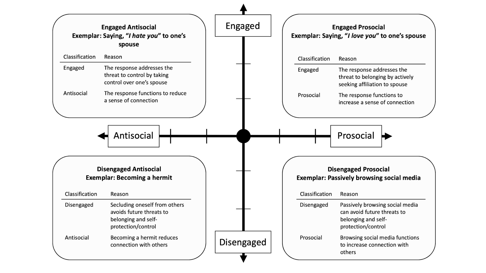

```{r bidr-setup, message=FALSE, warning=FALSE, include=FALSE}
# Chunk Options
knitr::opts_chunk$set(
	echo = FALSE,
	message = FALSE,
	warning = FALSE
)
# Load rmarkdown package to get `metadata`
library(rmarkdown)
```


# Overview

People have a fundamental need to belong---to be accepted, loved, and
cared for [@baumeisterNeedBelongDesire1995; @maslow1943]. Being forced to stay at home
during the COVID-19 pandemic, many people experienced threats to
belonging: an experience of feeling rejected, excluded, and unloved. At
the same time, more and more people bought and played video games.
Worldwide spending and Google search interests on video games hit an
all-time high for March, April, and May in 2020, coinciding with the
stay-at-home orders in the US [@beresford2020; @shanley2020;
@superdatastaff2020]. Media reports have suggested that people play
video games to cope with social isolation during the COVID-19 crisis
[@baraniuk2020; @gregory2020; @langille2020; @lazarus2020]. Existing
research supports that playing video games with others online (e.g., in
a multiplayer mode) can increase belonging [@kowert2015; @vella2015].
However, people can also play alone in a single-player mode (solo play),
and whether solo plays can increase belonging remains unknown.
Theoretically, solo plays can help people feel socially connected
through social surrogates: parasocial relationships with non-player
characters and social worlds where players can immerse themselves and
feel like a member of a collective in the game. This raises an empirical
question: Can a player replenish their belonging even when they play
alone themselves? I designed my dissertation to answer this question.

I structure my dissertation as follows. In Chapter 2, I present my
published work on the bi-dimensional rejection taxonomy [@sunami2019a]
to highlight the need for more evidence on the disengaged-prosocial
responses: indirect, and hands-off attempts that increase belonging. In
Chapter 3, I suggest that playing a video game in a single-player mode
is an unexamined disengaged-prosocial response to social rejection. I
draw from the social surrogacy hypothesis [@gabriel2017] and the video
games literature to suggest that solo plays can fulfill belonging. In
Chapter 4 (Study 1), I first validated the Heart Self-Assessment Manikin
(Heart Manikin), a single-item pictorial measure of belonging that I
used as a key outcome for Studies 2 and 3. In Chapter 4 (Study 2), I
examined whether recalling a video game with vs. without social
surrogates, would increase belonging following social rejection. In
Chapter 5 (Study 3), I let participants play a custom-made,
single-player role-playing game to examine whether parasocial
relationships or social worlds replenish belonging after social
rejection. In Chapter 6, I discuss the findings of my dissertation and
future avenues for research.

<!--chapter:end:index.Rmd-->

---
editor_options: 
  markdown: 
    wrap: 72
---

# The Bi-Dimensional Rejection Taxonomy

This chapter has been published as, Sunami, N., Nadzan, M. A., &
Jaremka, L. M. (2019). The bi‐dimensional rejection taxonomy: Organizing
responses to interpersonal rejection along antisocial--prosocial and
engaged--disengaged dimensions. Social and Personality Psychology
Compass. <https://doi.org/10.1111/spc3.12497>.

<center>
\begin{center}

Abstract

\end{center}
</center>

Responses to interpersonal rejection vary widely in form and function.
Existing theories of interpersonal rejection have exclusively focused on
organizing these responses on a single antisocial--prosocial dimension.
Accumulating evidence suggests a gap in this approach: variability in
social responses to rejection cannot solely be explained by the
antisocial--prosocial dimension alone. To fill this gap, we propose the
bi-dimensional rejection taxonomy, consisting of the
antisocial--prosocial *x*-axis and engaged-disengaged *y*-axis, a novel
contribution to the literature. We demonstrate that both the *x*- and
*y*-axes are necessary for understanding interpersonal responses to
rejection and avoiding erroneous conclusions. We also show how this new
framework allows researchers to generate more nuanced and accurate
hypotheses about how people respond when rejected. We further
demonstrate how existing research about individual differences and
situational factors that predict responses to rejection can be viewed in
a new light within the bi-dimensional rejection taxonomy. We conclude by
suggesting how the taxonomy inspires innovative questions for future
research.

\newpage
<center>
\begin{center}

The Bi-Dimensional Rejection Taxonomy:

Organizing Responses to Interpersonal Rejection along
Antisocial--Prosocial and Engaged--Disengaged Dimensions

\end{center}
</center>

Traveling with an incomplete map is not very efficient---a traveler may
end up in the wrong place because they are unsure where they are going.
This analogy can also be applied to scientific research---a researcher
is likely to arrive at an incorrect conclusion because they are using an
incomplete theoretical framework. In this paper, we suggest that the
rejection literature is operating with an incomplete theoretical
framework for understanding responses to interpersonal rejection.
Existing theories have already advanced our understanding of how people
respond to rejection, primarily focusing on a single
antisocial--prosocial dimension. Although this dimension is important,
we suggest that not all antisocial and prosocial responses are
identical. To account for this unexplained variability, we incorporate a
second dimension, the engaged--disengaged dimension, adopted from the
coping literature [@carverPersonalityCoping2010; @dijkstraEngagingRatherDisengaging2016]. Accordingly, we propose
the bi-dimensional rejection taxonomy, consisting of an
antisocial--prosocial *x*-axis and an engaged--disengaged *y*-axis
(Figure \@ref(fig:bidr-all)). Adding this second dimension provides a
more thorough theoretical framework for understanding responses to
rejection, equipping researchers with a more complete map for generating
new hypotheses.

(ref:bidr-all) Conceptual figure of the bi-dimensional rejection taxonomy. The antisocial--prosocial *x*-axis refers to rejection responses that function to reduce (antisocial) or promote (prosocial) social connection. The engaged--disengaged *y*-axis represents engaged (direct, active, "hands-on", approach-based) and disengaged (indirect, passive, "hands-off", avoidance-based) attempts to cope with the stressor (the current or future need-threat elicited by the rejection experience). The numbers in the figure represent quadrants: Quadrant 1 (engaged antisocial responses), Quadrant 2 (engaged prosocial responses), Quadrant 3 (disengaged antisocial responses), and Quadrant 4 (disengaged prosocial responses).

```{r bidr-all, out.width = '100%', fig.cap='(ref:bidr-all)'}
knitr::include_graphics("images/bidr-all.png")
```

Our new taxonomy benefits the rejection literature in three ways. First,
it provides a unified map for researchers to organize belonging-relevant
responses to interpersonal rejection. Without this map, researchers
would solely rely on the antisocial--prosocial *x*-axis, leading to
inaccurate conclusions about rejection-elicited responses, as
highlighted throughout the paper. For example, if a researcher only
assessed engaged prosocial responses to rejection, and rejected
participants didn't preferentially display these responses, the
researcher might erroneously conclude that rejection doesn't lead to
prosocial responses at all. Using the bi-dimensional rejection taxonomy,
we can see that rejected participants could still display prosocial
behavior, but in a disengaged manner. Thus, the engaged--disengaged
*y*-axis of the bi-dimensional rejection taxonomy creates a cohesive
framework, preventing researchers from reaching inaccurate conclusions
about rejection-elicited responses.

Second, having a bi-dimensional framework allows researchers to generate
more nuanced and accurate predictions about responses to rejection. In
the past, researchers focused exclusively on how rejection affected
antisocial and prosocial behavior (the *x*-axis) without differentiating
types of behavior within these categories. As a result, existing
hypotheses were limited in specificity. With the bi-dimensional
rejection taxonomy, researchers can generate more nuanced and innovative
hypotheses that incorporate both the antisocial--prosocial *x*-axis and
the engaged--disengaged *y*-axis. For example, without the taxonomy, a
researcher might hypothesize that both Situation A and Situation B lead
to prosocial responses following rejection. However, with the new
taxonomy, researchers can hypothesize that Situation A leads to engaged
prosocial responses (e.g., reaching out to close others for connection),
whereas Situation B leads to disengaged prosocial responses (e.g.,
watching their favorite TV program to feel socially connected). This
hypothesis highlights potential differences between Situation A and B
that would not be apparent without the taxonomy. Thus, the taxonomy arms
researchers with a comprehensive framework of potential response
options. Researchers can then use existing theoretical and empirical
work to generate more nuanced and accurate hypotheses.

Third, the bi-dimensional rejection taxonomy highlights types of
responses that are understudied in the rejection literature. As we
discuss later, the bulk of rejection research has focused on engaged
antisocial and prosocial responses. Using the lens of the bi-dimensional
rejection taxonomy, we can see that many disengaged responses are yet to
be examined in the context of rejection, highlighting the need for
further research.

In proposing the taxonomy, we rely on existing work demonstrating that
self-protective and belonging needs are fundamental to human nature, and
that interpersonal rejection threatens these needs, motivating
behavioral responses [@baumeisterNeedBelongDesire1995; @maslow1943; @murray2008;
@richmanReactionsDiscriminationStigmatization2009; @williamsOstracismTemporalNeedthreat2009]. Throughout this paper, we use
interpersonal rejection as an overarching phrase that encompasses
threats to belonging, including social exclusion, social rejection,
ostracism, and relational devaluation---referring to experiences when a
person feels like they aren't loved, cared for, or accepted
[@learySelfesteemInterpersonalMonitor1995]. [^bi-dr-1]

[^bi-dr-1]: While being denied a desired opportunity (e.g., employment,
    publication, etc.) is commonly referred to as rejection in lay
    terms, those types of experiences are outside the scope of this
    paper because they are not forms of interpersonal rejection; they do
    not convey to a person that they are uncared for or unloved.
    Similarly, intergroup rejection (a group excluded by a group) is
    outside the scope of this paper.

We exclusively focus on responses to rejection that are purposeful and
voluntary (in contrast to automatic and involuntary responses) since our
goal is to describe how people cope with rejection. This focus is
consistent with the coping literature (on which the *y*-axis is heavily
based) that defines coping as purposeful and conscious attempts to deal
with the stressor [@connor-smithResponsesStressAdolescence2000].
Automatic or involuntary responses (e.g., attentional bias to smiling
faces) are outside the scope of the taxonomy and thus outside the scope
of this paper.

We divide the current paper into two parts. In the first half, we review
previous research supporting the antisocial--prosocial *x*-axis and
introduce a novel engaged--disengaged *y*-axis. In the second half, we
highlight how the taxonomy allows researchers to see existing published
work through a new lens and discuss new directions for future research.

## Existing Dimension: The Antisocial--Prosocial *x*-Axis

In this section, we review existing empirical and theoretical literature
supporting the antisocial-prosocial *x*-axis. This dimension has been
discussed extensively elsewhere [e.g., @murrayOptimizingAssuranceRisk2006; @richmanReactionsDiscriminationStigmatization2009;
@williamsOstracismTemporalNeedthreat2009]. Accordingly, we briefly highlight relevant work on
interpersonal rejection and close relationships to support our use of
the antisocial-prosocial *x*-axis. We discuss the novel
engaged--disengaged *y*-axis in the next section.

### Foundational Theories in the Rejection Literature

The antisocial--prosocial *x*-axis of the bi-dimensional rejection
taxonomy stems from prior empirical research demonstrating that
rejection sometimes leads to antisocial behavior and, at other times,
prosocial behavior [@dewall2010; @dewall2009;
@romero-canyasPayingBelongWhen2010; @twenge2001; @warburton2006]. For
example, rejected participants blasted louder and longer noise to a
stranger in one study [an antisocial response; @twenge2001] and worked
harder on a collective task in another study [a prosocial response;
@williams1997] compared with non-rejected participants. Rejection
scholars have developed multiple theoretical frameworks for
understanding these interpersonal responses to rejection that fall along
the antisocial-prosocial *x*-axis. We refer readers to other theoretical
papers for more extensive discussions of this dimension [@richmanReactionsDiscriminationStigmatization2009;
@williamsOstracismTemporalNeedthreat2009] and summarize relevant theories here to support the
antisocial-prosocial *x*-axis of the bi-dimensional rejection taxonomy.

Many previous theories commonly highlight the existence of the
antisocial--prosocial *x*-axis. For example, the multimotive model
defines antisocial responses as those that function to diminish
belonging whereas prosocial responses as those that function to enhance
belonging [@richmanReactionsDiscriminationStigmatization2009]. The need-threat model also identifies
aggression (antisocial responses) and prosocial responses as primary
categories of responses to cope with interpersonal rejection
[@williamsOstracismTemporalNeedthreat2009]. Similarly, the reconnection hypothesis and the resource
redistribution model both agree that responses to rejection range in
function from antisocial to prosocial [@dewall2011; @shilling2015].
These theories all agree that motives to self-protect or regain control
predict antisocial responses, and motives to obtain belonging predict
prosocial responses [@dewall2011; @shilling2015; @williamsOstracismTemporalNeedthreat2009]. In sum,
rejection theories strongly support the existence of the
antisocial--prosocial dimension.

### Foundational Theories in the Close Relationships Literature

Close relationships researchers also support the existence of an
antisocial-prosocial *x*-axis. For instance, the investment model
suggests that responses to relationship decline within a romantic
relationship (a form of perceived rejection) can range from destructive
(e.g., relationship-damaging responses such as leaving the relationship;
similar to antisocial behavior) to constructive [e.g.,
relationship-repairing responses such as voicing a concern; similar to
prosocial behavior; @rusbult1982]. Similarly, risk regulation theory
suggests that couples' responses towards each other function to promote
or damage the relationships [@murrayOptimizingAssuranceRisk2006], akin to antisocial and
prosocial behavior within the romantic relationship.

The rapid marital coding system (RMICS) also supports the existence of
the antisocial-prosocial *x*-axis. The RMICS describes behaviors that
partners display towards each other on a continuum ranging from
hostility to positivity [@heyman2004]. On the left end of the continuum,
hostile responses function to reduce connection between partners,
similar to antisocial responses. On the right side of the continuum,
positive responses function to increase connection between partners,
similar to prosocial responses.

These close relationships theories strongly support the existence of the
antisocial--prosocial *x*-axis. This dimension has been identified in
different terms: destructive--constructive in the investment model
[@rusbult1982], self-protection--relationship promotion in risk
regulation theory [@murrayOptimizingAssuranceRisk2006], and hostilit*y*--positivity in the
RMICS [@heyman2004]. However, all of the terms reflect the same
underlying concept of behaviors that reduce (antisocial) or increase
(prosocial) connection with others. In addition, similar to the
rejection literature, risk regulation theory argues that antisocial
behaviors are motivated by self-protection concerns whereas prosocial
responses are motivated by belonging needs [@murrayOptimizingAssuranceRisk2006].

### Defining Antisocial and Prosocial Responses

As discussed above, multiple theories in the rejection and close
relationships literatures strongly support an antisocial--prosocial
dimension for understanding interpersonal responses to rejection. This
consensus provides a strong foundation for the *x*-axis in the
bi-dimensional rejection taxonomy. All theories consistently discuss how
antisocial responses function to reduce social connection between the
self and others, motivated by self-protection needs, and how prosocial
responses function to promote social connection, motivated by belonging
needs. Accordingly, we adopt these definitions in the bi-dimensional
rejection taxonomy. Telling someone "I hate you" would thus be an
antisocial response because it functions to reduce social connection
with the other person. On the other hand, telling someone "I love you"
would be a prosocial response because it functions to promote social
connection.

Note that the word prosocial is sometimes used to denote altruistic
behaviors that benefit the welfare of others---these behaviors may or
may not function to promote connection with others
[@batsonAltruismProsocialBehavior2003]. In this paper, we use the label
prosocial to refer to behaviors that promote social connection with
others, consistent with typical uses of the word in rejection research
[@blackhartRejectionImpactSelfdefeating2006;
@richmanReactionsDiscriminationStigmatization2009;
@williamsReactingOstracismRetaliation2005].

## A New Dimension: The Engaged--Disengaged *y*-Axis

A close inspection of existing empirical work reveals that there is
significant variability within antisocial and prosocial
responses---reflecting heterogeneous strategies for responding to
interpersonal rejection. For example, prior research demonstrated that
rejection sometimes leads to direct and active attempts to connect with
others [e.g., spending money to garner acceptance from others;
@manerDoesSocialExclusion2007; @romero-canyasPayingBelongWhen2010]. At
other times, rejection leads to indirect and passive attempts to connect
with others [e.g., experiencing nostalgia;
@derrickSocialSurrogacyHow2009]. No existing theories of interpersonal
rejection can distinguish between these varied responses---both types of
responses are categorized as prosocial in the context of existing
theories. The bi-dimensional rejection taxonomy makes a novel claim that
the antisocial--prosocial *x*-axis captures only one dimension of
responses, and that a new dimension is needed to fully understand
responses to rejection. In this section, we first review foundational
theories that suggest an additional possible dimension. Then, we define
our new engaged--disengaged *y*-axis at the end of this section.

### Foundational Theories

To understand the variation within antisocial and prosocial responses,
we rely on theoretical and empirical work in the coping literature. This
extensive literature describes the ways in which people cope with (i.e.,
voluntarily and purposefully respond to) stressors; thus, this
literature provides a rich foundation for building our *y*-axis.

Coping researchers have proposed various ways to classify coping
responses, including emotion-focused, problem-focused, proactive, and
meaning-focused coping [@aspinwallStitchTimeSelfregulation1997;
@lazarusStressAppraisalCoping1984;
@skinnerSearchingStructureCoping2003]. Using factor analyses and
theoretical discussions, researchers identified an engaged--disengaged
dimension as the critical factor underlying the majority of coping
responses [@carverPersonalityCoping2010;
@compasEffortfulInvoluntaryResponses1997;
@connor-smithResponsesStressAdolescence2000;
@dijkstraEngagingRatherDisengaging2016;
@scheierCopingStressDivergent1986; @skinnerSearchingStructureCoping2003;
@tobinHierarchicalFactorStructure1989]. According to this literature,
engaged coping strategies are direct and active behaviors that confront
the stressor with a "hands-on" approach. A person has used an engaged
coping strategy when they act out their frustrations on others (e.g.,
aggression), seek social support, or behave in other active and direct
ways [@carverPersonalityCoping2010;
@dijkstraEngagingRatherDisengaging2016]. On the other hand, disengaged
coping strategies refer to indirect and passive behaviors that aim to
avoid the stressor. Examples of disengaged coping are social withdrawal,
denial, and wishful thinking [@carverPersonalityCoping2010].

We can easily apply the distinction between engaged and disengaged
coping to understand how people respond to interpersonal rejection. In
the context of rejection, the stressor that people are coping with is
the threat to belonging and self-protection/control experienced by the
rejected person. As noted earlier, these need-threats are
well-documented consequences of experiencing rejection
[@williamsOstracismTemporalNeedthreat2009]. The threats to belonging or
self-protection/control can be present-oriented, when a person is trying
to cope with the current need-threat, or it can be future-oriented, when
a person is trying to pre-emptively cope with a potential future
need-threat. In coping with those stressors, people can respond in ways
that are more engaged versus disengaged. We adopt these ideas in
defining the *y*-axis, as described in the next section.

Although no past theories have explicitly differentiated responses to
rejection as engaged or disengaged, some researchers have implied the
existence of this distinction by separating social withdrawal from other
antisocial responses. For example, the multimotive model identifies
social withdrawal as a subtype of antisocial (belonging-diminishing)
responses that are separate from more overt antisocial responses such as
aggression [@richmanReactionsDiscriminationStigmatization2009].
Attachment theory also differentiated social withdrawal from other overt
forms of behavior (e.g., aggression) as a response to prolonged
rejection from an attachment figure [@bowlbySeparationAnxietyAnger2000;
@horneyNeuroticPersonalityOur1964]. These theories both support the
distinction proposed by the coping literature: disengaged antisocial
responses are different from engaged antisocial responses. As we
describe later, a benefit of formally defining the engaged--disengaged
*y*-axis is that it highlights additional forms of disengaged antisocial
responses that have been neglected by existing theories.

Another theory that supports differentiating antisocial and prosocial
responses is the investment model, a widel*y*-used theoretical model in
the romantic relationships literature. The investment model uses a
two-dimensional space, characterizing how romantic partners behave when
their romantic relationship is in decline [@rusbultExitVoiceLoyalty1982;
@rusbultInterdependenceAnalysisAccommodation1991;
@rusbultResponsesDissatisfactionClose1987]. Specifically, the investment
model proposes the destructive--constructive dimension (similar to our
antisocial--prosocial *x*-axis, as described previously) and the
active--passive dimension (similar to, but also different from, our
engaged--disengaged *y*-axis). Before discussing similarities and
differences between the multimotive model, the investment model, and our
new taxonomy, we first define the disengaged--engaged *y*-axis so that
the reader has a complete understanding of these terms. Then, in the
following section, we discuss how our model contributes over and above
existing work in advancing our understanding of responses to
interpersonal rejection.

### Defining Engaged--Disengaged Responses to Rejection

Based on the literature reviewed above, we propose the
engaged--disengaged *y*-axis that describes whether a response to
rejection represents an engaged or disengaged attempt to cope with the
stressor. Again, the stressor in the context of rejection is the current
or future need-threat [i.e., the threat to self-protection/control or
affiliation needs; @baumeisterNeedBelongDesire1995;
@williamsOstracismTemporalNeedthreat2009]. We define engaged responses
as direct and active attempts to deal with the stressor. They are
"hands-on", approach-based strategies to confront and face the stressor.
An example of an engaged antisocial response is behaving aggressively
towards one's romantic partner, because exerting control over one's
partner actively and directly replenishes the sense of
self-protection/control thwarted by rejection. An example of an engaged
prosocial response is seeking support from a loved one because this
response actively and directly replenishes the sense of belonging
thwarted by rejection [@murrayBalancingConnectednessSelfprotection2008;
@murrayWhenRejectionStings2002].

In contrast, we define disengaged responses as indirect and passive
attempts to handle the stressor. They are "hands-off", avoidance-based
strategies to evade and divert from the stressor. These responses help
to avoid threats to belonging or self-protection/control. An example of
a disengaged antisocial response is social withdrawal, because
withdrawing is a hands-off strategy that allows a person to avoid
further rejection (and thus further threats to belonging or
self-protection/control). An example of a disengaged prosocial response
is relying on social surrogates (e.g., parasocial relationships)---such
as watching one's favorite TV show or passively browsing social media to
obtain social connection. This qualifies as disengaged because social
surrogates allow people to passively and indirectly replenish belonging
while avoiding future rejection.

Importantly, the engaged--disengaged *y*-axis is defined by whether the
response itself is engaged (direct, active, hands-on) or disengaged
(indirect, passive, hands-off); it is not defined by the situation or
environment in which it occurs. At the same time, recognizing the
situation in which the response occurs is important because the
situation limits possible response options. In a person's da*y*-to-day
life, there is often a lot of flexibility in responding. For example, a
rejected person can choose whether to seek social support (an engaged
response) or watch their favorite TV show (a disengaged response) even
if they are in the same situation (e.g., at home with their romantic
partner on a Friday after work). This response flexibility is usually
absent among lab studies where participants are given only one option to
respond (e.g., participating in a noise blast task and deciding how much
noise to blast, but not being given any other response options). Thus,
the situation has the potential to constrain responses to be either
engaged or disengaged, especially in laboratory studies. Using the
engaged--disengaged *y*-axis, researchers can design studies that
include diverse response options, as we highlight in the future
directions section towards the end of the paper.

Together with the antisocial--prosocial *x*-axis, the
engaged--disengaged *y*-axis completes the bi-dimensional rejection
taxonomy. These two dimensions both describe the function of a given
response: whether a response functions to reduce or promote connection
(*x*-axis) and whether a response functions as a direct, active,
hands-on way of coping versus an indirect, passive, hands-off way of
coping with the stressor (*y*-axis). In the next section, we discuss how
the bi-dimensional rejection taxonomy compares with the existing
theories of social behavior. Then, we provide examples of responses
within each quadrant, demonstrating how the two dimensions are
independent from each other.

## Comparisons with Existing Theories

The bi-dimensional rejection taxonomy provides a novel lens through
which to view responses to rejection, incorporating both the
antisocial--prosocial and engaged--disengaged dimensions. How does the
taxonomy compare with other theories? In this section, we discuss the
advantages of the bi-dimensional rejection taxonomy over existing
theories in the rejection and close relationships literatures.

Compared with existing rejection theories, the bi-dimensional rejection
taxonomy provides a more nuanced and accurate depiction of responses to
interpersonal rejection. The main advantage of the taxonomy is its power
to differentiate engaged and disengaged responses, particularly
prosocial responses. Past literature showed that rejected people respond
in ways that qualify as disengaged and prosocial, such as thinking about
one's favorite TV program [e.g., @derrickSocialSurrogacyHow2009] and
that people can fulfill belonging in a variety of ways, including via
social surrogates (e.g., a fictional character; Gabriel & Valenti,
2017). However, no existing theories have formally differentiated these
types of prosocial responses from other more engaged responses (e.g.,
seeking social support from a loved one; Murray et al., 2008). The
bi-dimensional rejection taxonomy also differentiates disengaged
antisocial responses. Among disengaged responses, social withdrawal is
the only form of disengaged antisocial responses currently described by
existing rejection theories, such as the multimotive model
[@richmanReactionsDiscriminationStigmatization2009]. With the current
taxonomy, we can see that there are additional types of disengaged
antisocial responses not described by the multimotive model or any other
existing theory (e.g., passive aggressive behavior, as we describe in
detail later). The bi-dimensional rejection taxonomy thus accounts for
more responses than any other framework available in the rejection
literature.

The bi-dimensional rejection taxonomy also offers advantages over the
investment model in the close relationships literature. The investment
model suggests that responses to romantic relationship decline range
along a two-dimensional space: the destructive--constructive (i.e., how
a response damages or nurtures the romantic relationship) and
active--passive (i.e., how a response overtly or indirectly affects the
romantic relationship) dimensions [@rusbultExitVoiceLoyalty1982]. On the
surface, the bi-dimensional rejection taxonomy seems similar to the
investment model. However, the bi-dimensional rejection taxonomy is more
advantageous than the investment model in considering broader sources of
rejection and targets of the response. The investment model
characterizes situations when the romantic relationship partner is the
source of relationship decline, and it only characterizes responses
towards an existing relationship partner [@rusbultExitVoiceLoyalty1982].
The bi-dimensional rejection taxonomy captures threats to belonging from
any source while also characterizing responses towards any target, not
just the romantic partner. Finally, the engaged-disengaged *y*-axis of
the bi-dimensional rejection taxonomy more accurately captures variation
among antisocial and prosocial responses evident in the rejection
literature. Whereas saying "I hate you" to one's partner is a passive
response (on the bottom half of the *y*-axis) according to the
investment model [@rusbultExitVoiceLoyalty1982], this behavior would
quality as engaged (on the top half of the *y*-axis) according to the
bi-dimensional rejection taxonomy. The *y*-axis of the taxonomy is
founded on decades of work in the coping literature
[@carverPersonalityCoping2010; @compasEffortfulInvoluntaryResponses1997;
@connor-smithResponsesStressAdolescence2000;
@dijkstraEngagingRatherDisengaging2016;
@scheierCopingStressDivergent1986; @skinnerSearchingStructureCoping2003;
@tobinHierarchicalFactorStructure1989], and is also consistent with the
way existing rejection research classifies responses
[@richmanReactionsDiscriminationStigmatization2009].

## Plotting Existing Studies in a Bi-Dimensional Space

In the previous sections, we reviewed literature supporting the
antisocial--prosocial *x*-axis and introduced the engaged-disengaged
*y*-axis to the rejection literature. We also compared this taxonomy
with existing theories, and demonstrated that the taxonomy presents many
advantages. In this section, we discuss select evidence demonstrating
that interpersonal responses to rejection can be plotted in this
two-dimensional space, broadly categorized into four quadrants: engaged
antisocial responses (Quadrant 1), engaged prosocial responses (Quadrant
2), disengaged antisocial responses (Quadrant 3), and disengaged
prosocial responses (Quadrant 4). We present a hypothetical exemplar for
each dimension in \@ref(fig:bidr-exemplars) to illustrate the
differences among quadrants and help the reader understand each
quadrant. We also discuss existing research that falls into each
quadrant in this section. Since no past studies included both of these
new dimensions in their studies, we infer which quadrant a response
falls into based on the properties of the response. We begin by
reviewing existing empirical work that falls into Quadrant 1, and then
move to Quadrants 2, 3, and 4.

The bi-dimensional rejection taxonomy highlights types of responses that
have been understudied in the literature (e.g., passive aggressive
behavior and nostalgia). To better illustrate these new kinds of
responses, we discuss multiple examples for Quadrants 3 and 4 (i.e.,
disengaged antisocial and prosocial responses). Since past literature
has extensively discussed responses in Quadrant 1 and Quadrant 2 (i.e.,
engaged antisocial and prosocial responses, as discussed above), we
highlight only one representative example for these quadrants.

```{r bidr-exemplars,  out.width = '100%', fig.cap='Summary of exemplar responses across quadrants. For each exemplar, we present reasons why we characterize them as antisocial versus prosocial and engaged versus disengaged.'}

```

### Responses in Quadrant 1: Engaged Antisocial Responses

Past studies have demonstrated that rejected people respond in ways that
qualify as engaged and antisocial. For example, rejected people
allocated more hot sauce to a bystander who disliked spicy food,
compared with non-rejected people
[@aydukIndividualDifferencesRejection2008;
@dewallLittleAcceptanceGoes2010]. This response is antisocial because it
functions to reduce connection with others
[@warburtonWhenOstracismLeads2006;
@williamsOstracismTemporalNeedthreat2009]. It also qualifies as engaged
because it is a hands-on, approach-based and direct attempt to
re-establish threatened self-protection/control needs by exercising
dominance or control over others [@warburtonWhenOstracismLeads2006].

### Responses in Quadrant 2: Engaged Prosocial Responses

Past studies showed that people seek their romantic partner's support
when faced with potential rejection from that partner, especially among
people with higher self-esteem
[@murrayBalancingConnectednessSelfprotection2008;
@murrayWhenRejectionStings2002]. Applying our proposed taxonomy, we
suggest that this behavior qualifies as an engaged prosocial response
because seeking social support from a romantic partner functions to
increase social connection (a prosocial response) and actively confronts
the current threat to belonging by directly seeking social connection.

### Responses in Quadrant 3: Disengaged Antisocial Responses

One advantage of the taxonomy is that it highlights disengaged
antisocial responses that are not accounted for by existing theories; we
discuss several examples within this quadrant. Compared with
non-rejected participants, rejected participants desired to withdraw
from subsequent social interactions [@renEvidenceAnotherResponse2015].
This response functions to reduce social connection by avoiding further
social contact. In light of our taxonomy, they are disengaged responses
because they avoid future threats to belonging and
self-protection/control by isolating oneself from others.

In addition to withdrawing socially, rejected people can structure their
environment to prevent social encounters. For instance, rejected people
preferred room configurations that hindered social interactions,
presumably to avoid interacting with other people
[@meagherSeekingSafetySociofugal2017]. This response is antisocial since
doing so reduces opportunities for social connection, and the response
is disengaged since it functions to evade future belonging threats.

Another example of a disengaged antisocial response is being
passive-aggressive by not engaging in a behavior that can prevent harm
to another person [@parrottAddressingCriterionProblem2007;
@southrichardsonEverydayAggressionTakes2014]. For example, a rejected
person might intentionally not speak up to defend their partner when the
partner is insulted by others. This behavior is antisocial since doing
so reduces connection with the partner. It is also a disengaged response
since passive forms of aggression are "hands-off" and indirect means of
dealing with the stressor.

People who feel socially rejected are more prone to stop caring for
themselves by neglecting basic needs, a behavior called self-neglect,
another form of a disengaged antisocial response. Self-neglect refers to
inattention to personal hygiene and health (e.g., not showering or
wearing deodorant), often accompanied by behaviors such as hoarding and
refusal of help from others
[@abramsPredictorsSelfNeglectCommunityDwelling2002;
@dongCrosssectionalPopulationbasedStudy2010]. People who engage in
self-neglecting behavior often report desires to avoid losing control
[@band-wintersteinElderSelfNeglect2012;
@bozinovskiOlderSelfNeglectersInterpersonal2000]. Thus, self-neglect is
a disengaged antisocial response because neglecting one's hygiene or
habitat functions to reduce social connection with others, and it is an
indirect and passive way to avoid future threat to
self-protection/control needs.

### Responses in Quadrant 4: Disengaged Prosocial Responses

Many disengaged prosocial responses involve the use of social
surrogates---human or non-human targets with a psychological, but not
physical, connection [@gabrielSocialSurrogatesRejection2017;
@gabrielSocialSurrogatesSocial2016]. People turn to social surrogates to
obtain belonging [@gabrielSocialSurrogatesRejection2017;
@gabrielSocialSurrogatesSocial2016]. For example, remembering a fight
with a close other (i.e., perceived rejection) led people to think
longer about their favorite TV program (vs. a non-favorite TV program),
interpreted as a prosocial attempt to restore belonging
[@derrickSocialSurrogacyHow2009]. The bi-dimensional rejection taxonomy
regards this response as disengaged and prosocial, since relying on
social surrogates helps people passively avoid future threats to
belonging or control while simultaneously increasing perceived
connection with others.

Another disengaged prosocial response is experiencing nostalgia---a
sentimental yearning for the past and memories of social connections
[@abeytaLookingBackMove2015; @wildschutNostalgiaRepositorySocial2010].
Rejected participants experienced more nostalgia compared with accepted
participants [@wildschutNostalgiaRepositorySocial2010]. Nostalgia is a
disengaged prosocial response because it functions to increase perceived
social connection with other people, but it does so in a hands-off way
that allows people to avoid additional threats to belonging or
self-control.

Taken together, responses to interpersonal rejection can be placed into
the four quadrants of the bi-dimensional rejection taxonomy. Recognizing
these quadrants is important in planning and conducting studies. For
example, if a researcher provides engaged antisocial response options
and finds that rejected participants do not behave more antisocially
than included participants, they may incorrectly conclude that rejection
does not lead to antisocial responses. This conclusion may be inaccurate
because rejected participants may have instead used disengaged
antisocial responses if they were provided with the option to do so.
Researchers who incorporate the bi-dimensional rejection taxonomy can
avoid faulty conclusions and reach a more calibrated interpretation of
their findings.

## Using the Bi-Dimensional Rejection Taxonomy to Frame Existing Research

The bi-dimensional rejection taxonomy provides researchers with a more
nuanced and accurate understanding of responses to rejection.
Previously, researchers were constrained to conclude that certain
individual difference or situational factors caused either antisocial or
prosocial behavior following rejection, without the appropriate language
for specifying the type of antisocial or prosocial behavior being
displayed. In this section, we view past research within the new lens of
the taxonomy to look for individual differences and situational factors
that appear to predict variation along the engaged--disengaged *y*-axis.
In doing so, we make inferences about the *y*-axis post-hoc based on the
available evidence, since the *y*-axis was not a part of the lexicon at
the time those studies were conducted. We omit factors exclusively
predicting variation along the antisocial--prosocial *x*-axis, such as
need fortification [e.g., @williamsOstracismTemporalNeedthreat2009],
because they have been extensively discussed elsewhere
[@learyInterpersonalRejectionDeterminant2006;
@richmanReactionsDiscriminationStigmatization2009;
@williamsOstracismTemporalNeedthreat2009]. We divide this section into
two parts. The first part focuses on variation in engaged and disengaged
antisocial responses, and the second focuses on variation in engaged and
disengaged prosocial responses.

### Factors Predicting Engaged versus Disengaged Antisocial Responses (Figure \@ref(fig:bidr-antisocial))

```{r bidr-antisocial, out.width = '100%', fig.cap='Representative individual differences and situational factors predicting engaged and disengaged antisocial responses. For illustrative purposes, only the antisocial hemisphere is depicted in this diagram. Higher interpersonal sensitivity to rejection (assessed via rejection sensitivity or low self-esteem) predicts engaged antisocial responses. Social phobia and history of repeated prior rejection experiences predict disengaged antisocial responses.'}

```

**Interpersonal Sensitivity to Rejection (Rejection Sensitivity and
Self-Esteem).** Some people worry about being rejected more than others.
This tendency is present among people with higher rejection sensitivity
and lower self-esteem [@downeyImplicationsRejectionSensitivity1996;
@feldmanRejectionSensitivityMediator1994;
@learySelfesteemInterpersonalMonitor1995]. Although these constructs
have important differences, they share significant conceptual
underpinnings representing an overlapping construct, sensitivity to
rejection [@crockerCostlyPursuitSelfesteem2004;
@parkResponsesSelfthreatLinking2010]. For these reasons, we label this
construct as *interpersonal sensitivity to rejection* and discuss the
construct in reference to both indices.

People with higher interpersonal sensitivity to rejection may be more
likely to use engaged antisocial responses rather than disengaged
antisocial responses (Figure \@ref(fig:bidr-antisocial)). Specifically,
past evidence has demonstrated a consistent link between higher
interpersonal sensitivity and engaged antisocial behavior, such as
aggression [@aydukIndividualDifferencesRejection2008;
@downeyRejectionSensitivityChildren1998;
@downeyRejectionSensitivityMale2000;
@downeySelffulfillingProphecyClose1998; @murrayWhenRejectionStings2002].
A review of the rejection sensitivity literature concludes that people
high in rejection sensitivity respond to rejection in hostile and
overtly aggressive ways [@romero-canyasPayingBelongWhen2010]. Also,
following a romantic relationship threat, people with lower self-esteem
derogated their romantic partner as being more lazy and thoughtless
relative to those with higher self-esteem
[@murrayWhenRejectionStings2002]. These engaged antisocial responses may
be the result of a self-fulfilling prophec*y*---people fearfully
expecting rejection can act in ways that provoke rejection from others,
such as putting down their romantic partner during face-to-face
interactions or perpetrating intimate partner violence
[@downeyRejectionSensitivityMale2000;
@downeySelffulfillingProphecyClose1998].

**Social Phobia.** While the literature reviewed above consistently
demonstrates that people with higher interpersonal sensitivity to
rejection behave in engaged antisocial ways following rejection, related
literature shows the opposite pattern. Specifically, people with a
social phobia, an extreme form of interpersonal sensitivity to
rejection, often behave in disengaged antisocial ways. For example,
people with a social phobia often ruminate about social interactions
without engaging in them and avoid interacting with people (and thus
potential rejection) at all costs
[@clarkCognitivePerspectiveSocial2001]. In addition, people with a
social phobia tend to avoid eye contact and emotionally distance
themselves from others when experiencing interpersonal problems
[@aldenInterpersonalProcessesSocial2004]. Thus, at least some forms of
interpersonal sensitivity to rejection, in this case social phobia,
actually predict disengaged rather than engaged antisocial responses.

These subtle differences highlight the importance of the bi-dimensional
rejection taxonomy. Without the taxonomy, researchers would conclude
that people who are highly sensitive to rejection (both in terms of
rejection sensitivity, low self-esteem, and social phobia) behave in
antisocial ways following rejection. Using the bi-dimensional rejection
taxonomy, we can see that the most extreme form of sensitivity to
rejection (social phobia) leads to disengaged antisocial behavior,
whereas other forms of sensitivity to rejection (e.g., low self-esteem)
lead to engaged antisocial behavior. Noticing this subtle yet important
difference in responses allows researchers to begin asking why a
difference exists. For example, armed with the bi-dimensional rejection
taxonomy, we could begin asking whether methodological differences could
explain why interpersonal sensitivity led to engaged versus disengaged
antisocial responses (e.g., did each study provide participants with
both engaged and disengaged antisocial response options?). We could also
begin wondering whether there is something qualitatively different
between a more extreme, clinical interpersonal sensitivity versus those
in the normative range. Without the bi-dimensional rejection taxonomy
that differentiates disengaged and engaged antisocial responses,
researchers wouldn't be able to ask these important questions. The
taxonomy thus sheds light on an existing gap in our knowledge, spurring
future research.

**History of Repeated Rejection Experiences.** Another related
literature about repeated rejection experiences also highlights the
importance of the bi-dimensional rejection taxonomy. People have
different histories of being rejected---some have experienced rejection
more often than others (e.g., students who were bullied vs. those who
were not). A repeated history of rejection plays an important role in
promoting antisocial responses to rejection, as highlighted by existing
theories [@bowlbySeparationAnxietyAnger2000;
@horneyNeurosisHumanGrowth1991]. For example, children who experience
prolonged rejection from an attachment figure develop hostile views
towards others, which then promotes expression of anger and aggression
[@bowlbySeparationAnxietyAnger2000]. In addition, a history of repeated
rejection can foster a sensitivity to interpersonal rejection
[@londonSocialCausesConsequences2007], which leads to antisocial
responses. Thus, a researcher might conclude that both a repeated
history of rejection and an interpersonal sensitivity to rejection lead
to antisocial responses following rejection. This conclusion would be
reasonable prior to the existence of the bi-dimensional rejection
taxonomy. However, a close inspection of the literature, viewed through
the lens of the taxonomy, paints a different picture. Specifically,
repeated rejection results in feelings of helplessness, unworthiness,
submission, withdrawal, and avoidance of social interactions, described
as "going into a little shell" [@rivaChronicSocialExclusion2017;
@williamsOstracismTemporalNeedthreat2009;
@zadroOstracismEmpiricalStudies2004]. Thus, people who experienced
repeated rejection use more disengaged antisocial responses to rejection
(e.g., withdrawing from others), rather than engaged antisocial
responses (e.g., attacking others; Figure \@ref(fig:bidr-antisocial)).
Why would people with a history of repeated rejection behave in
disengaged antisocial ways, whereas those with high rejection
sensitivity behave in engaged antisocial ways---particularly because a
history of rejection can lead to rejection sensitivity? The
bi-dimensional rejection taxonomy offers a more nuanced understanding of
antisocial responses, identifies this knowledge gap, and allows
researchers to ask questions that would previously not have been
possible. Although the taxonomy itself does not directly answer these
questions, it provides researchers with the language needed to ask these
questions in the first place.

### Factors Predicting Engaged versus Disengaged Prosocial Responses (Figure \@ref(fig:bidr-prosocial))

```{r bidr-prosocial, out.width = '100%', fig.cap='Representative individual differences and situational factors predicting prosocial engaged and disengaged responses. Only the prosocial dimension is depicted in this diagram for illustrative purposes. Approach-oriented tendencies and individualistic cultural backgrounds predict engaged prosocial responses. On the other hand, avoidance-oriented tendencies and collectivistic cultural backgrounds predict disengaged prosocial responses.'}
knitr::include_graphics("images/bidr-prosocial.png")
```

**Approach-Avoidance Tendency.** People differ in their tendency to
approach or avoid a social outcome. In general, people with
approach-oriented tendencies actively pursue desirable outcomes, whereas
people with avoidance-oriented tendencies avoid undesirable outcomes
[@elliotApproachAvoidanceMotivation2006]. In the context of rejection,
the desired outcome is re-establishing belonging, and the undesired
outcome is experiencing further rejection. Ultimately, people must
balance these two goals to maintain meaningful interpersonal
relationships [e.g., @murrayOptimizingAssuranceRisk2006]. Prior to the
bi-dimensional rejection taxonomy, researchers would predict that
avoidance-oriented people would not display prosocial responses
following rejection, because the types of prosocial responses typically
studied have risks of further rejection (e.g., actively seeking
acceptance from another person). With the taxonomy, we can see that this
hypothesis may not be accurate. Theoretically, people with higher
avoidance tendencies would display prosocial responses, but they would
do so in disengaged ways (e.g., relying on social surrogates) because
this response style matches their general tendency to use hands-off,
avoidance-oriented strategies.

**Cultural Orientation.** Cultural contexts influence how people rely on
social support, a form of prosocial behavior motivated by a need for
affiliation [@choenaromRoleSenseBelonging2005;
@hagertyEffectsSenseBelonging1999; @kimCultureSocialSupport2008].
Compared with people with individualistic backgrounds (e.g., European
Americans), those with collectivistic backgrounds (e.g., Asian
Americans) sought more *implicit* forms of social support---emotional
comfort obtained through the existing social network without directly
discussing one's problems [@kimCultureSocialSupport2008]. Implicit
support seeking is disengaged because it is a passive behavior that
allows a person to avoid potential rejection and thus future threats to
belonging. On the other hand, explicit support seeking is engaged
because it involves direct communication of the need for support to
close others. Taken together, people with collectivistic backgrounds may
use more disengaged rather than engaged prosocial responses to
rejection, and people with individualistic backgrounds may use more
engaged rather than disengaged prosocial responses to rejection (Figure
\@ref(fig:bidr-prosocial)).

These cultural predictions further highlight the risk of neglecting the
engaged-disengaged *y*-axis, and how doing so could lead to incorrect
conclusions. If a researcher measures only engaged prosocial responses
(i.e., explicit support seeking), they would reach the erroneous
conclusion that people from a collectivistic background do not engage in
prosocial behavior following rejection. However, they theoretically
behave prosocially following rejection, but they do so in disengaged
ways (e.g., implicit support seeking). Considering both dimensions of
the bi-dimensional rejection taxonomy will prevent such faulty
conclusions.

## Using the Bi-Dimensional Rejection Taxonomy to Inspire New and More Accurate Hypotheses

As we highlight throughout the paper, the bi-dimensional rejection
taxonomy is an important advancement to the rejection literature because
it helps researchers generate more nuanced and accurate hypotheses and
prevents inaccurate conclusions. The taxonomy draws on available
theories to make predictions about which individual and situational
characteristics will predict when people will respond in one way or
another. In doing so, the taxonomy allows researchers to generate
innovative hypothesis incorporating all possible response options. In
this section, we discuss how the bi-dimensional rejection taxonomy
inspires new directions for future research. In contrast to the previous
sections that demonstrated how existing evidence could be viewed through
the lens of the taxonomy, this section purposefully highlights more
speculative and innovative avenues for new research that have yet to be
tested. Thus, the reader should take these future directions with a
grain of salt; they are meant to inspire new and exciting ways to apply
the taxonomy.

### Spontaneous Reactions to Rejection

Past rejection studies relied on laboratory experiments where behavioral
and self-reported response options were constrained. For example, in the
hot-sauce paradigm, participants had no choice but to allocate some
amount of hot sauce to a stranger without an option to respond
differently (Lieberman, Solomon, Greenberg, & McGregor, 1999). Questions
remain as to how rejected participants respond in real-life settings
where other response options are readily available (e.g., rejected
people can watch their favorite TV show, approach a friend, lash out
against the perpetrator, or withdraw from others). In addition, people
experiencing rejection may use multiple responses simultaneously (e.g.,
watching favorite TV shows and talking to friends after getting dumped).
The existing literature has not investigated which responses people
commonly use following rejection in the real world---an important next
step to advance the literature. One concrete recommendation is to have
at least four types of response options in rejection studies. For
example, daily diary or experience sampling studies could assess whether
rejection occurred that day, and if so, could ask how the participant
responded, ensuring that response options from each quadrant are
included.

Without the bi-dimensional rejection taxonomy, researchers interested in
prosocial responses may inadvertently fail to measure disengaged
prosocial responses (e.g., watching a favorite TV program) and may
instead solely focus on engaged prosocial responses (e.g., approaching a
friend). Doing so brings with it the danger of concluding that prosocial
responses do not happen in response to everyday rejection whereas, in
reality, they may be happening, but in disengaged rather than engaged
manners. Armed with the knowledge of the bi-dimensional rejection
taxonomy, researchers can now avoid this pitfall and include response
options that cover both dimensions.

An unexplored possibility is that people typically react to everyday
rejection in disengaged ways (e.g., social surrogacy and social
withdrawal). Past research has found that interpersonal rejection is
prevalent in everyday life, ranging from subtle ignorance in social
situations (e.g., no eye contact and being looked-through) to more
obvious ones [e.g., being ignored in conversations, emails, and online
messaging; @nezlekOstracismEverydayLife2012]. People need to regularly
cope with these rejection experiences to maintain their belonging. As
mentioned earlier, repeated experiences of rejection may promote
disengaged responses, particularly in the antisocial domain. We
speculate a similar pattern for the prosocial domain---people may use
disengaged prosocial responses, rather than engaged prosocial responses
for repeated everyday rejection. People can replenish belonging more
safely through disengaged prosocial responses because they function to
avoid future need threat (i.e., further rejection). The popularity of
TV, books, and social media may reflect people's preference in
satisfying belonging from these disengaged prosocial activities, a
provocative question for future research.

### Neurophysiological Markers

Neurophysiological correlates can provide mechanistic answers about why
rejection leads to responses that fall within the bi-dimensional
rejection taxonomy. Cortisol and testosterone are potentially relevant
hormonal markers that can predict rejection responses. The combination
of high testosterone and low cortisol levels jointly predict
dominance-seeking behaviors, often associated with engaged antisocial
behaviors (e.g., physical fights and violence;
[@mehtaTestosteroneCortisolJointly2010;
@platjeTestosteroneCortisolRelation2015;
@romero-martinezTestosteroneCortisolRatio2013]. When cortisol levels are
high, dominance responses are inhibited (and submission responses are
facilitated), regardless of testosterone levels. Thus, one unexamined
hypothesis is that high testosterone and low cortisol levels may
facilitate engaged antisocial responses to rejection. On the other hand,
high cortisol levels may inhibit engaged antisocial responses and may
instead facilitate disengaged antisocial responses (e.g., social
withdrawal and self-neglect).

Considering the interaction between cortisol and testosterone highlights
the importance of the bi-dimensional rejection taxonomy. If researchers
study cortisol and testosterone in the absence of the taxonomy and
measure only engaged antisocial responses, they may conclude that
cortisol levels do not affect antisocial responses at all. In light of
the current taxonomy, this conclusion may be unwarranted---since high
cortisol levels should theoretically facilitate disengaged antisocial
responses.

### Applying the Bi-Dimensional Rejection Taxonomy to Other Threats to Belonging

The bi-dimensional rejection taxonomy offers a blueprint for future
researchers who study responses to social stressors that threaten
belonging. Currently, the bi-dimensional rejection taxonomy is focused
on the responses to interpersonal rejection (e.g., feeling uncared for
or unloved). But, other social stressors can also threaten belonging,
such as separation distress [e.g., feelings of missing someone;
@diamondEveryTimeYou2008], death of a close other
[@stroebeRoleLonelinessSocial1996], and
discrimination[@richmanReactionsDiscriminationStigmatization2009]. One
interesting application of the bi-dimensional rejection taxonomy would
be to examine whether responses to these belonging threats also range
along the antisocial--prosocial and engaged--disengaged dimensions.
Doing so will facilitate a richer understanding of how humans respond to
belonging threats.

## Conclusion

Existing theories of interpersonal rejection have exclusively focused on
the *x*-axis, aiming to understand antisocial and prosocial responses to
interpersonal rejection. Accumulating evidence suggests a gap in this
approach: variability in social responses to rejection cannot solely be
explained by the antisocial--prosocial dimension alone. To fill this
gap, we propose the bi-dimensional rejection taxonomy, consisting of the
antisocial--prosocial *x*-axis and engaged--disengaged *y*-axis, a novel
contribution to the literature. This engaged--disengaged dimension
explains variation among prosocial and antisocial responses previously
unaccounted for, helps researchers to generate more nuanced and accurate
hypotheses about how people respond to rejection, and sheds light on the
types of responses that have been understudied in the literature. Thus,
the bi-dimensional rejection taxonomy is an important step forward for
the rejection literature. Overlooking the engaged--disengaged dimension
could result in omnibus hypotheses that lack specificity, leading to
erroneous and inaccurate conclusions. The bi-dimensional rejection
taxonomy helps researchers to see nuances among responses, better
calibrate conclusions, and test novel predictions. With this new map, we
can move the literature to new frontiers.

<!--chapter:end:02-Bi-DR.Rmd-->

---
always_allow_html: true
---


# References {-}

<div id="refs"></div>

<!--chapter:end:08-References.Rmd-->

---
always_allow_html: true
---

# (APPENDIX) APPENDIX {-}

```{r appendix-setup}
# Load package
library(tidyverse)
library(codebook) # to generate codebook
library(here)
library(car) # for the type III SS in ANOVA
library(emmeans)
library(effectsize) # for equivalence tests and effect size estimation
library(GGally) # for ggpairs
library(apastats)
library(corrr)
source(here("r", "namifunc.R"))

# Dodge positions for plots
dodge_pos <- position_dodge(width = .5)

# ggplot theme
ggplot2::theme_set(ggplot2::theme_minimal())

# Default width for the violin plot
default_violin_width <- 0.4

# Load Datasets
s1e_df <- read_rds(here("data_public", "Study1e_public.rds"))
s2_df <- read_rds(here("data_public", "Study2_public.rds"))
s3_df <- read_rds(here("data_public", "Study3_public.rds"))

# Study 1a - Correlations Tables
s1a_target_vars <- read_rds(here("data_public", "subset", "Study1a_public_target.rds"))
s1b_target_vars <- read_rds(here("data_public", "subset", "Study1b_public_target.rds"))
s1c_target_vars <- read_rds(here("data_public", "subset", "Study1c_public_target.rds"))
s1d_target_vars <- read_rds(here("data_public", "subset", "Study1d_public_target.rds"))
s1e_target_vars <- read_rds(here("data_public", "subset", "Study1e_public_target.rds"))

# Cor CI Tables
s1b_cor_CIs  <- read_rds(here("data_public", "aggregate", "s1b_cor_CIs.rds"))
s1c_cor_CIs  <- read_rds(here("data_public", "aggregate", "s1c_cor_CIs.rds"))
s1d_cor_CIs  <- read_rds(here("data_public", "aggregate", "s1d_cor_CIs.rds"))
s1e_cor_CIs  <- read_rds(here("data_public", "aggregate", "s1e_cor_CIs.rds"))

# Long Datasets
s1c_df_long <- read_rds(here("data_public", "s1c_df_long.rds"))
s1d_dfC_long <- read_rds(here("data_public", "s1d_dfC_long.rds"))
s1e_df_long <- read_rds(here("data_public", "s1e_df_long.rds"))
```


# Detailed Description of the Measures included in Study 1

## Study 1a: Mass Testing

```{r appendix-s1a}
# Get Cronbach's alphas
s1a_realiablities <- read_rds(here("data_public", "reliability", "s1a_reliability.rds"))
s1a_cronbach_APA <- get_cronbach_alphas(s1a_realiablities) %>% 
  map(~f.round(., 2, strip.lead.zeros = T))
```

**Center for Epidemiologic Studies Depression Scale (CES-D).** The Center for Epidemiologic Studies Depression Scale is a 20-item measure of depressive symptoms [@radloffCESDScaleSelfReport1977]. Participants answered how frequently they experienced a depressive symptom (e.g., "I was bothered by things that usually don't bother me.") over a past week on a 4-point scale (0 = Rarely or none of the time, 1 = Some or little of the time [1--2 days], 2 = Occasionally or a moderate amount of time [3--4 days], 3 = Most or all of the time [5--7 days]). I used the sum of the scores as an index. Cronbach's alpha for the current sample was `r s1a_cronbach_APA$CESD_sum`.

**Patient-Reported Outcomes Measurement Information System (PROMIS) Social Isolation---Short Form 8a** The study used the Social Isolation subscale of the Patient-Reported Outcomes Measurement Information System (PROMIS), Short Form 8a [@cellaPROMISAdultHealth2019; @hahnNewEnglishSpanish2014]. The scale had 8 statements (e.g., "I felt left out"). For each statement, participants answered how they felt in the past four weeks on a 5-point scale (1 = Never, 2 = Rarely, 3 = Sometimes, 4 = Usually, 5 = Always). I calculated the average score as an index of social isolation. Cronbach's alpha for the current sample was `r s1a_cronbach_APA$social_isolation_mean`. The social isolation subscale demonstrated concurrent validity with other measures of social functioning [@hahnNewEnglishSpanish2014].

**Beliefs about Biological Differences between Blacks and Whites Scale**. The Beliefs about Biological Differences between Blacks and Whites Scale is a 15-item measure of the false beliefs about biological differences between Blacks and Whites [@hoffmanRacialBiasPain2016]. For each item (e.g., "Blacks have a more sensitive sense of smell than Whites; they can differentiate odors and detect faint smells better than Whites."), participants indicated how true each item is on a 6-point scale (1 = definitely untrue, 6 = definitely true). Among the 15 items, 4 items were fillers that described true differences ("Whites are less susceptible to heart disease like hypertension than Blacks", "Blacks are less likely to contract spinal cord diseases like multiple sclerosis", "Blacks, on average, have denser, stronger bones than Whites", "Whites are less likely to have a stroke than Blacks"). I calculated the average of the 11 items that describe false beliefs as an index. Cronbach's alpha for the current sample was `r s1a_cronbach_APA$bio_diff_mean`.

**Interpersonal Reactivity Scale.** The Interpersonal Reactivity Scale is a 28-item measure of a tendency to react to another person's experience [@davisMultidimensionalApproachIndividual1980]. The scale consisted of four subscales: perspective taking (one's tendency to adopt another's perspective), fantasy (tendency to transport themselves into the feelings and actions of characters in media), empathic concern (tendency to feel sympathy for others in misfortune), personal distress (tendency to feel anxiety in tense situations). For each item, participants read a statement (e.g., "I often have tender, concerned feelings for people less fortunate than me.") and indicated how much it describes themselves on a 5-point scale (0 = (A) does not describe me very well, 4 = (E) describes me very well). I calculated an average score within each subscale. Cronbach's alpha for the current sample were `r s1a_cronbach_APA$reactivity_mean` for the total score, `r s1a_cronbach_APA$reactivity_perspective` for perspective taking, `r s1a_cronbach_APA$reactivity_fantasy` for fantasy, `r s1a_cronbach_APA$reactivity_empathy` for empathic concern, and `r s1a_cronbach_APA$reactivity_distress` for personal distress. 

**Self-Monitoring Scale.** The self-monitoring scale is a 24-item measure of a tendency to self-observe and control one's behavior according to social appropriateness [@snyderSelfmonitoringExpressiveBehavior1974]. For each item, participants read a statement (e.g., "I find it hard to imitate the behavior of other people") and indicated whether the statement was true or mostly true (T) or false or usually not true (F). Each answer that corresponded with self-monitoring received a score of 1. I calculated the sum of the scores as an index.

**Paradox Mindset Scale.** The Paradox Mindset Scale is a 9-item measure of one's tendency to accept and get excited by tensions [@miron-spektorMicrofoundationsOrganizationalParadox2018]. Participants read statements (e.g., "When I consider conflicting perspectives, I gain a better understanding of an issue.") then indicated their agreement on a 7-point scale (-3 = strongly disagree to 3 = strongly agree). I calculated an average across items. Cronbach's alpha for the current sample was `r s1a_cronbach_APA$paradoxical_mindset_mean`.

**Integrative Complexity Scale.** The Integrative Complexity Scale is a 11-item measure of the capacity to acknowledge the competing opinions and to integrate different perspectives on an issue in an organizational setting [@zhangParadoxicalLeaderBehaviors2015]. For each item, participants read a statement (e.g., "I believe in the value of dissent.") and indicated their agreement on a 7-point scale. I calculated an average across items. Cronbach's alpha for the current sample was `r s1a_cronbach_APA$integrative_complexity_mean`.

**Multiple Identity Scale.** Four items from the Exeter Identity Transitions Scales [@haslamMaintainingGroupMemberships2008] measured membership to different social groups. Participants indicate their agreement on a statement (e.g., "I am a member of lots of different social groups.") on a 7-point scale (1 = do not agree at all, 7 = agree completely). I calculated an average as an index of multiple identity. Cronbach's alpha for the current sample was `r s1a_cronbach_APA$multiple_identity_mean`.

## Study 1b: RAIv1

```{r appendix-s1b}
# Get Cronbach's alphas
s1b_realiablities <- read_rds(here("data_public", "reliability", "s1b_reliability.rds"))
s1b_cronbach_APA <- s1b_realiablities %>% get_cronbach_alphas() %>%
  map(~f.round(., 2, strip.lead.zeros = TRUE))
```

Cronbach's alsphas for the current sample was `r s1b_cronbach_APA$PROMIS_isolation_sum` for the PROMIS Social Isolation Scale.

**MacArthur Scale of Subjective Social Status.** The MacArthur Scale of Subjective Social Status is a single-item measure of subjective social status [@adlerRelationshipSubjectiveObjective2000]. Participants saw a ladder with 10 rungs that represented where people stand in the United States. Participants answered where they place themselves in this ladder on a 11-point scale (0 = at the ground to 100 = the top rung, with 10-point increments).

**Patient-Reported Outcomes Measurement Information System (PROMIS) Emotional Support, and Informational Support---Short Form 8a.** The study used the Emotional Support and Informational Support subscales of the Patient-Reported Outcomes Measurement Information System (PROMIS), Short Form 8a [@cellaPROMISAdultHealth2019; @hahnNewEnglishSpanish2014]. Each subscales had 8 statements (e.g., "I had someone who listened to me when I needed to talk" for emotional support, and "I had someone to give me good advice about a crisis if I needed it" for informational support). For each statement, participants answered how they felt in the past four weeks on a 5-point scale (1 = Never, 2 = Rarely, 3 = Sometimes, 4 = Usually, 5 = Always). I calculated the sum scores for each subscale. Cronbach's alpha for the current sample were `r s1b_cronbach_APA$PROMIS_emotional_sum` for emotional support, and `r s1b_cronbach_APA$PROMIS_informational_sum` for informational support. The social support subscale demonstrated concurrent validity with other measures of social functioning [@hahnNewEnglishSpanish2014]. People without comorbidities reported lower informational support than those with comorbidities, demonstrating a construct validity by known groups [@hahnNewEnglishSpanish2014].

**Couple Satisfaction Index---4-item version**. The Couples Satisfaction Index---4-item Version is a measure of the quality of a romantic relationship [@funkTestingRulerItem2007]. The scale consisted of four items, (1) "Please indicate the degree of happiness, all things considered, of your relationship with your romantic partner during the past four weeks", (2) "I had a warm and comfortable relationship with my partner during the past four weeks", (3) "How rewarding was your relationship with your partner during the past four weeks?", (4) "In general, how satisfied were you with your relationship with your romantic partner during the past four weeks?". Participants used a 7-point scale to answer the first item (0 = Extremely Unhappy, 6 = Perfect) and a 6-point scale for the Items 2, 3, and 4 (1 = Not at all to 6 = Completely true for Item 2, Not at all to 6 = Completely for Items 3 and 4). I calculated the aggregated average as an index. Cronbach's alpha for the current sample was `r s1b_cronbach_APA$couples_satisfaction_mean`. The scale showed a convergent validity (r = .84--.94) with the other scales measuring relationship satisfaction [@funkTestingRulerItem2007].

**Inclusion of Other in Self Scale.** The Inclusion of Other in Self Scale is a single-item measure of closeness between the self and the other person [@aronInclusionOtherSelf1992]. The scale consisted of 7 pairs of circles (labeled "Self" and "Other") with varying degrees of overlap to each other (1 = no overlapping between Self and Other, 7 = highest overlap between Self and Other). Participants were instructed to select the picture that best describes their feeling to the person they wrote about in the essay. The scale showed convergent validity with verbal measures of closeness, especially for romantic relationships [@aronInclusionOtherSelf1992]. The test-retest reliability over a 2-week period ranged from _r_ = .83 to _r_ = .86 [@aronInclusionOtherSelf1992].

**Romantic Partner Responsiveness.** The study adopted three items measuring romantic partner responsiveness from a previous longitudinal study [@gableSafelyTestingAlarm2012]. The items were, "My [ex-] romantic partner understood me", "My [ex-] romantic partner made me feel like he/she valued my abilities and opinions.", and "My [ex-] romantic partner made me feel cared for". Participants indicated their answers on a 5-point scale (1 = Not at all, 5 = Very much). I calculated an average across 3 items as an index of partner responsiveness. Cronbach's alpha for the current sample was `r s1b_cronbach_APA$partner_resp_mean`.

**Relationship Conflict Scale.** Study 1c used a 3-item ad-hoc measure of relationship conflicts in the past four weeks. Items were: "How often did you and your [ex-romantic] partner have arguments or disagreements?", "How often did you and your [ex-] romantic partner have arguments or disagreements that were serious enough to negatively affect your relationship?", and "How often did you and your [ex-] romantic partner have unresolved conflicts or disagreements?". Participants indicated their answers on a 7-point scale (1 = Never, 7 = Regularly). I used an aggregated average as an index. Cronbach's alpha for the current sample was `r s1b_cronbach_APA$conflict_mean`.

**Ostracism from Romantic Partner Scale.** Study 1c used an ad-hoc 10-item measure of ostracism from a romantic partner developed for the study. Participants indicated their experience in the past 4 weeks (e.g., "[My partner/ex-romantic partner] Treated me as if I was invisible") on a 5-point scale (1 = Never, 5 = Always). I used an aggregated average as an index of ostracism from a romantic partner. Cronbach's alpha for the current sample was `r s1b_cronbach_APA$ostracism_mean`.

**Abusive Behavior Inventory---Psychological Abuse & Physical Abuse Subscales.** Study 1c useda modified version of the Psychological Abuse and Physical Abuse subscales of the Abusive Behavior Inventory---Revised [@postmusAbusiveBehaviorInventory2015], for measuring the perpetration of abusive behavior by participants against their romantic partner. The Psychological Abuse and Psychological Abuse subscales had 12 items and 11 items, respectively. Participants reported how often they perpetrated psychological (e.g., "Call your ex-romantic partner a name and/or criticize him/her") and physical (e.g., "Threaten to hit or throw something at your ex-romantic partner") abusive behaviors to their current and ex-romantic partner (if any) in the past four weeks on a 5-point scale (1 = Never, 5 = Very Often). I used an aggregated average for each subscale. Cronbach's alphas for the curent sample were `r s1b_cronbach_APA$abuse_psychological_mean` for the psychological abuse subscale. I was not able to calculate Cronbach's alpha for the physical abuse subscale given the high invariance in responses.

**Controlling Behavior Scale---Modified.** Study 1c used a modified version of the Controlling Behavior Scale [@donnellanAssociationLonelinessBathing2015] measuring perpetration of controlling behavior in a close relationship in five categories (economic control, threats, intimidation, emotional control, and isolation). Participants were asked to indicate how often they did the actions described in each item on a 5-point scale (0 = Never, 4 = Always). Example items were, "Make it difficult for your [ex-] romantic partner to work or study" for economic control, "Threaten to harm your [ex-] romantic partner" for threatening control, "Try to make your [ex-] partner do things they didn't want to" for intimidating control, "Try to put your [ex-] partner down when getting 'too big for his or her boots'" for emotional control, and "Try to restrict time your [ex-] partner spent with family or friends" for isolating control. I used an aggregated average for each subscale. Cronbach's alphas were `r s1b_cronbach_APA$control_economic_mean` the economic control, `r s1b_cronbach_APA$control_emotional_mean` for the emotional control, and `r s1b_cronbach_APA$control_isolation_mean` for the isolating control subscales. I was not able to calculate Cronbach's alpha given the invariance in the responses for threatening control and initimidation control. The scale showed a construct validity by differentiating criminally violent perpetrators and non-perpetrators [@graham-kevanPhysicalAggressionControl2003].

**Modified Food Cravings Questionnaire---Trait Version.** Study 1c used a modified version of the Food Cravings Questionnaire---Trait Version [@cepeda-benitoDevelopmentValidationState2000] is a trait measure of food cravings. Study 1c used the following 6 subscales: (1) Intentions and Plans to Consume Food (3 items; e.g., "Food cravings invariably made me think of ways to get what I wanted to eat"), (2) Lack of Control Over Eating (6 items; e.g., "When I craved something, I knew I wouldn't be able to stop eating once I started"), (3) Thoughts or Preoccupation with Food (7 items; e.g., "I felt like I had food on my mind all the time"), (4) Emotions (4 items; e.g., "I craved foods when I felt bored, angry, or sad"), (5) Cues that Trigger Food Cravings (4 items; e.g., "Being with someone who was eating often made me hungry"), and (6) Guilt From Cravings and/or for Giving Into Them (3 items; e.g., "I hated it when I gave in to cravings"). For each item, participants indicate their agreement on a 5-point scale (1 = Strongly disagree, 5 = Strongly agree). I calculated an aggregated average for each subscale and an overall index. Cronbach's alphas were `r s1b_cronbach_APA$craving_intent` for the intentions, `r s1b_cronbach_APA$craving_control` for lack of control, `r s1b_cronbach_APA$craving_thoughts` for thoughts, `r s1b_cronbach_APA$craving_emotions` for emotions, `r s1b_cronbach_APA$craving_cues` for cues, and `r s1b_cronbach_APA$craving_guilt` guilt subscales (overall alpha = `r s1b_cronbach_APA$craving_mean`). The scale showed convergent validity with the Eating Questionnaire [@stunkardThreefactorEatingQuestionnaire1985].

**Dietary Social Support Scale.** The ad-hoc dietary support scale was a 9-item scale measuring how much participants received support from their current romantic partner on their eating habits over the past 4 weeks. Participants saw statements about their partner (e.g., "Complimented me on my eating habits") and indicated their answer on a 5-point scale (1 = Never or almost never, 5 = Almost always). I calculated an average across items as an index. Cronbach's alpha for the current sample was `r s1b_cronbach_APA$dietary_support_mean`.

**Body Image Questionnaire.** The Body Image Questionnaire consisted of 9 images of female and male body images corresponding to BMIs of 17, 19, 22, 24, 26, 29, 33, 37, and 40 (the image available at: <https://web.archive.org/web/20200817174630/https://www.windbercare.org/do-you-know-the-difference-between-bmi-and-body-fat/>). Participants were asked to choose which of the images best represented themselves.

**Godin-Shephard Leisure-Time Physical Activity Questionnaire.** The Godin Leisure-Time Exercise Questionnaire is a 3-item measure of physical activity [@godinGodinShephardLeisureTimePhysical2011; @godinSimpleMethodAssess1985]. Participants answered how many times they did strenuous, moderate, and mild exercise per week on average in the past month. I used the following formula to calculate the weekly leisure-time activity scores: (9 x Strenuous) + (5 x Moderate) + (3 x Mild). People with the scores of 24 and more had lower body fat percentage and higher maximum rate of oxygen consumption (VO<sub>2</sub> max) than those with scores of 23 or less [@amireaultGodinShephardLeisuretimePhysical2015].

**PROMIS Sleep Disturbance---Short Form 4a.** The PROMIS Sleep Disturbance---Short Form 4a is a 4-item measure of sleep disturbance [@cellaPROMISAdultHealth2019]. Participants were asked about their sleep over the past four weeks. For the first item, participants indicate their general sleep quality on a 5-point scale("My sleep quality was:" 1 = Very poor, 5 = Very good, reverse-coded). For the items 2--4, participants rated their sleep quality ("My sleep was refreshing" (reverse-coded), "I had a problem with my sleep", and "I had difficulty falling asleep"). I calculated the sum of the scores with higher scores representing higher sleep disturbance. Cronbach's alpha for the current sample was XX. The scale had a concurrent validity with a measure of general health [@cellaPROMISAdultHealth2019].

**Single-Item Narcissism Scale.** The Single-Item Narcissism Scale is a 1-item measure of narcissism [@konrathDevelopmentValidationSingle2014]. Participants were asked, "To what extent do you agree with the statement: 'I am a narcissist.'". The scale provided the definition of a narcissist ("Note: The word "narcissist" means egotistical, self-focused, and vain."). Participants answered on a 7-point scale (1 = Not very true of me, 7 = Very true of me). The scale has a convergent validity with other measures of narcissism [@konrathDevelopmentValidationSingle2014].

**Perceived Stress Scale.** The Perceived Stress Scale is a 14-item measure of perceived stress [@cohenGlobalMeasurePerceived1983]. Participants indicated how frequently they experienced a stressful event in the past four weeks (e.g., How often have you been upset because of something that happened unexpectedly?) on a 5-point scale (0 = Never, 4 = Very often). I calculated an aggregated average as an index. Cronbach's alpha for the current sample was `r s1b_cronbach_APA$stress_mean`. The scale has a convergent validity with measures of depression, stressful life events, and physical symptoms, such as headache, back ache, and acid stomach [@cohenGlobalMeasurePerceived1983].

## Study 1c: ARv1
```{r appendix-s1c}
# Get Cronbach's alphas
s1c_realiablities <- read_rds(here("data_public", "reliability", "s1c_reliability.rds"))
s1c_cronbach_APA <- get_cronbach_alphas(s1c_realiablities) %>% map(~f.round(., 2, strip.lead.zeros = T))
```

**Modified Need-Threat Scale---Essay Version.** Study 1d used a modified version of the Need-Threat Scale [@williamsOstracismTemporalNeedthreat2009]. The scale consisted of the original 20 statements of the Need-Threat Scale. The instructions asked participants to think about their feelings when they recalled and wrote their essay. Participants indicated their agreement with each statement on a 5-point scale (1 = Strongly disagree, 5 = Strongly agree). I calculated an aggregated average for each subscale, and an overall average. Cronbach's alphas for the current sample was `r s1c_cronbach_APA$nts_mean`. for the overall score (belonging = `r s1c_cronbach_APA$nts_belonging_mean`, self-esteem = `r s1c_cronbach_APA$nts_esteem_mean`, control = `r s1c_cronbach_APA$nts_control_mean`, and meaningful existence = `r s1c_cronbach_APA$nts_meaning_mean`).

## Study 1d: EVv1
```{r appendix-s1d}
# Get Cronbach's alphas
s1d_realiablities <- read_rds(here("data_public", "reliability", "s1d_reliability.rds"))
s1d_cronbach_APA <- get_cronbach_alphas(s1d_realiablities) %>% map(~f.round(., 2, strip.lead.zeros = T))
```

**Need for Closure Scale.** The Need for Closure Scale was a 15-item measure of a need for closure, a desire for an answer on any topic [@roetsItemSelectionValidation2011]. Participants answered their agreement on statements (e.g., "I don't like situations that are uncertain") on a 7-point scale (-3 = strongly disagree, +3 = strongly agree). I will use the average score across items as an index for need for closure. The scale showed convergent validity with constructs, such as need for structure and right-wing authoritarianism, related to need for closure [@roetsItemSelectionValidation2011]. Cronbach's alpha for the current sample was `r s1d_cronbach_APA$closure_mean`.

**Social Judgment Survey.** The Social Judgement Survey is a single-item measure of adherence to the traditional cultural values [@proulxCaseTransmogrifyingExperimenter2008; @rosenblattEvidenceTerrorManagement1989]. The survey asks participants to read a case brief of a defendant accused of prostitution, and answer how much bond should be assigned to the defendant. Higher amounts of bond indicates higher adherence to the traditional cultural values, and lower bond indicates lower adherence. The scale was found sensitive to the mortality salience and expectancy violation manipulations [@proulxCaseTransmogrifyingExperimenter2008; @rosenblattEvidenceTerrorManagement1989].

## Study 1e: NPSv2
```{r appendix-s1e}
# Get Cronbach's alphas
s1e_realiablities <- read_rds(here("data_public", "reliability", "s1e_reliability.rds"))
s1e_cronbach_APA <- get_cronbach_alphas(s1e_realiablities) %>% map(~f.round(., 2, strip.lead.zeros = T))
```


**Modified Need-Threat Scale.** I used a modified version of the Need-Threat Scale [@nadzanModifiedNeedThreatScale2017] to measure feelings of belonging, self-esteem, and control [@williamsOstracismTemporalNeedthreat2009]. The original Need-Threat Scale asked participants to retrospectively report their feelings during a Cyberball game. Instead, this modified version asks participants to answer according to how they feel at the moment ("right now"). Example items included "How accepted do you feel?" for belonging, "How confident do you feel?" for self-esteem, "How much control do you feel like you have?" for control, and "How important do you feel?". Participants indicated their answers on a horizontal slider ranging from 0 (The least I could possibly ever feel) and 100 (the most I could ever possibly feel), to minimize floor and ceiling effects. I calculated an average for each subscale as an index. The Cronbach's alpha for the current sample was `r s1e_cronbach_APA$nts_T3_belonging_mean` (Time 3) and `r s1e_cronbach_APA$nts_T5_belonging_mean` (Time 5) for belonging, `r s1e_cronbach_APA$nts_T3_esteem_mean` (Time 3) and `r s1e_cronbach_APA$nts_T5_esteem_mean` (Time 5) for self-esteem, `r s1e_cronbach_APA$nts_T3_control_mean` (Time 3) and `r s1e_cronbach_APA$nts_T5_control_mean` (Time 5) for control, and `r s1e_cronbach_APA$nts_T3_meaning_mean` (Time 3) and `r s1e_cronbach_APA$nts_T5_meaning_mean` (Time 5) for meaningful existence. This modified scale has not been validated.

**Experiences in Close Relationships Scale---Short Form.** The Experiences in Close Relationships Scale---Short Form is a 12-item measure of attachment avoidance and anxiety [@weiExperiencesCloseRelationship2007]. Participants were asked to indicate their agreement on sentences referring to concerns in intimate relationships on a 7-point scale (-3 = "Strongly disagree" to 3 "Strongly agree"). Example items included "I want to get close to others but I keep pulling back" for avoidance and "I find that people don't want to get as close as I would like" for anxiety. I calculated an average for each subscale as an index. Cronbach's alphas for the current sample were `r s1e_cronbach_APA$ECR_avoidance_mean` for the avoidance subscale and `r s1e_cronbach_APA$ECR_anxiety_mean` for the anxiety subscale. Both subscales showed convergent and discriminant validities [@weiExperiencesCloseRelationship2007].

**Fear of Negative Evaluation Scale---Brief Version.** The Fear of Negative Evaluation is a 15-item measure of apprehension in expecting negative judgment from others [@learyBriefVersionFear1983]. For each item, participants read a sentence (e.g., "I worry about what other people will think of me even when I know it doesn't make any difference.") and rated how characteristic it is of themselves on a 5-point scale (1 = "Not at all characteristic of me" and 5 = "Extremely characteristic of me"). I calculated an average across 15 items as an index of fear of negative evaluation. Cronbach's alpha for the current sample was `r s1e_cronbach_APA$FNES_mean`. The scale showed convergent validity with existing measures of social avoidance and anxiety [@learyBriefVersionFear1983].

**Rosenberg Self-Esteem Scale.** The Rosenberg Self-Esteem Scale is a 10-item measure of self-esteem [@rosenbergMeasurementSelfEsteem1965]. Participants answered how much they agreed to statements (e.g., "I feel that I am a person of worth, at least on an equal basis with others.") on a 7-point scale (-3 = "Strongly disagree" to 3 = "Strongly agree"). I calculated an average across 10 items as an index of self-esteem. Cronabch's alpha for the current sample was `r s1e_cronbach_APA$esteem_mean`. The scale has convergent validity with measures of optimism, life satisfaction, and narcissism [@rosenbergMeasurementSelfEsteem1965].

**Rejection Sensitivity Questionnaire---Short Version.** The Rejection Sensitivity Questionnaire---Short Version is an 8-item version of the Rejection Sensitivity Questionnaire [@downeyImplicationsRejectionSensitivity1996; @romero-canyasPayingBelongWhen2010]. The scale consisted of 8 scenarios describing a situation that can possibly evoke social rejection by another person (e.g., "You ask your parents for help in deciding what programs to apply to."). All items are relevant to the college student sample. For each scenario, participants rated (a) how concerned or anxious they were about how the other person would respond (1= Not at all concerned, 6 = Very concerned), and (b) how much they expected rejection to happen (1 = Very unlikely, 6 = Very likely) on a 6-point scale (ranging from 1 = Not at all concerned or very unlikely to 6 = very concerned or very likely). Following the scoring guidelines, I created a scale composite by multiplying the two responses for each scenario (a and b) and averaging across the multiplied scores. Cronbach's alpha for the current sample was `r s1e_cronbach_APA$RS_mean`.


# Supplementary Figures and Analyses by Study

## Study 1

### Study 1a

#### Correlations Table


```{r}
knitr::write_bib(c(.packages(), "bookdown"), "packages.bib")
```


```{r appendix-s1a-correlations-table}
# Means, SD, and Bivariate Correlations Table
# Reference: https://www.datadreaming.org/post/apa-tables-using-rmarkdown-part-3/
# Footnote for the table
s1a_footnote <- "Heart = Heart Manikin, Valence = Valence Self-Assessment Manikin,"
# Table Title
s1a_title <- "Study 1a - Descriptive Statistics and Correlations among Variables"
# N, Mean, SD Table
s1a_mnsdcor <- s1a_target_vars %>% get_nmsd_cor_table()
# Render table
s1a_mnsdcor %>% as_tibble() %>%
  render_APA_kable(col1_width = "1.5in",
                   title = s1a_title) %>%
  footnote(general_title = "", general = "CESD = Center for Epidemiological Studies - Depression Scale") %>% 
  footnote(general_title = "Note.",
           general = s1a_footnote,
           footnote_as_chunk = TRUE) %>%
  kable_styling_cortable()
```


### Study 1b

#### Correlations Table

```{r appendix-s1b-correlations-table}
# N, Mean, SD Table
s1b_mnsdcor <- s1b_target_vars %>% select(-id, -visit) %>% get_nmsd_cor_table()

# Footnote for the table
s1b_footnote <- paste(sep = " ",
                      "Heart = Heart Manikin, Valence = Valence Self-Assessment Manikin, SES = Subjective Socioeconomic Status,", "IOS = Inclusion of the Other in the Self Scale, CESD = Center for Epidemiological Studies - Depression Scale")

# Render table
s1b_mnsdcor %>% as_tibble() %>%
  render_APA_kable(col1_width = "1.5in",
                   title = "Study 1b - Descriptive Statistics and Correlations among Variables") %>%
  footnote(general_title = "Note.",
           general = s1b_footnote,
           footnote_as_chunk = TRUE, threeparttable = TRUE) %>% 
  kable_styling_cortable()


```

```{r appendix-s1b-forest, fig.cap='Study 1b (RAIv1) - Forest plot of correlation coefficients of the measured variables with the Heart Manikin Scores', fig.width=10, fig.height=12, chache=TRUE}
# Forest plot for all the correlations acros Times 1-3 (Appendix)
ggplot(s1b_cor_CIs,
       aes(y=label, x=estimate,
           color = type)) +
  #Add data points and color them black
  geom_point()+
  #add the CI error bars - 90%
  geom_errorbarh(aes(xmin = conf.low_model90, xmax = conf.high_model90), height = .5, size = .5) +
  #add the CI error bars - 95%
  geom_errorbarh(aes(xmin = conf.low_model95, xmax = conf.high_model95), height = .5, size = .5) +
  #Specify the limits of the x-axis and relabel it to something more meaningful
  scale_x_continuous(limits=c(-1,1), name='Correlation Coefficient with Heart Manikin')+
  #Give y-axis a meaningful label
  ylab('Variable') +
  # Legend
  scale_color_discrete(name = "Hypothesized\nValidity") +
  #Add a vertical dashed line indicating an effect size of zero, for reference
  geom_vline(xintercept=0, color='black', linetype='dashed') +
  #Create sub-plots (i.e., facets) based on levels of setting
  #And allow them to have their own unique axes (so authors don't redundantly repeat)
  ## Facet nested
  # facet_grid(type+time~outcome, scales= 'free', space='free') +
  ggh4x::facet_nested(type + time ~ outcome, scales= 'free', space='free') +
  ggtitle("Study 1b (RAIv1): Correlation Coefficients with the Heart Manikin\nacross Visits 1-3") +
  # Add SESOI lines
  SESOIgeom +
  # caption
  labs(caption = s1_caption_errorbars9095)
```

### Study 1c (ARv1)

#### Correlations Table

```{r appendix-s1c-correlations-table}
s1c_footnote <- "Heart = the Heart Manikin, SES = Subjective Socioeconomic Status, IOS = Inclusion of the Other in the Self Scale, NTS = the Need-Threat Scale"

# N, M, SD, Cor tables
s1c_mnsdcor <- s1c_target_vars %>% get_nmsd_cor_table()
# Render table
s1c_mnsdcor %>% as_tibble() %>%
  render_APA_kable(col1_width = "1.5in",
                   title = "Study 1c - Descriptive Statistics and Correlations among Variables") %>%
  footnote(general_title = "Note.",
           general = s1c_footnote,
           footnote_as_chunk = TRUE, threeparttable = TRUE) %>% 
  kable_styling_cortable()
```

#### Forestplot

```{r appendix-s1c-all-cors-plot, fig.cap='Study 1c - Forestplot of Correlation Coefficients between the Measured Variabels with the Heart Manikin', fig.width=9, fig.height=5}
# Forestplot - all correlations, except the ones for the mixed model
s1c_cor_CIs %>%
  ggplot(aes(y = label, x = estimate,
             color = type)) +
  # Dta points
  geom_point()+
  # CI error bars - 90%
  geom_errorbarh(aes(xmin = conf.low_model90, xmax = conf.high_model90), height = .3, size = .3) +
  # CI error bars - 95%
  geom_errorbarh(aes(xmin = conf.low_model95, xmax = conf.high_model95), height = .3, size = .3) +
  # Specify the limits of the x-axis and relabel it to something more meaningful
  scale_x_continuous(limits=c(-1,1), name='Correlation Coefficient with Heart Manikin')+
  #Give y-axis a meaningful label
  ylab('Variable') +
  # Legend labels
  scale_color_discrete(name = "Hypothesized\nValidity") +
  #Add a vertical dashed line indicating an effect size of zero, for reference
  geom_vline(xintercept=0, color='black', linetype='dashed') +
  # Facet nested
  ggh4x::facet_nested(type + time ~ outcome, scales= 'free', space='free') +
  ggtitle("Study 1c (ARv1): Correlation Coefficients with the Heart Manikin") +
  # Add SESOI
  SESOIgeom +
    # caption
  labs(caption = s1_caption_errorbars9095)
```

#### Heart & Valence Manikins Across Time

I explored whether the heart manikin scores changed across time by condition in a mixed model.

```{r appendix-s1c-mixed}
s1c_sensitivity_mixed_df <- tibble(outcome = c("heart", "valence")) %>%
  mutate(formula = paste0(outcome, "~ grouping_dummy * time + (1|id)")) %>%
  mutate(model = map(formula, ~lmer(formula = ., data = s1c_df_long))) %>%
  mutate(tidy = map(model, ~broom.mixed::tidy(.)),
         APA = map(model, ~describe.glm(.)))
```

```{r appnedix-s1c-belonging-across-time, fig.cap='Study 1c - Heart Manikin Scores Across Time and Conditions', fig.width=8, fig.height=11}
s1c_heart_across_time_plot <- s1c_df_long %>%
  ggplot(aes(x = time, y = heart, color = grouping_dummy, group = grouping_dummy)) +
  # Plot Data Points
  geom_point(position = position_jitterdodge(jitter.height = 1,
                                             jitter.width = .05, dodge.width = my_dodge_width),
             size = .2) +
  # Add line to connect the groups
  geom_line(stat = "summary", fun.data = mean_cl_normal, position = dodge_pos) +
  geom_errorbar(fun.data = mean_cl_normal, stat = "summary", width = .3,
                position = dodge_pos, color = "black") +
  # Plot means
  geom_point(stat = "summary", fun.data = mean_cl_normal,
             shape = 21, aes(fill = grouping_dummy), color = "black",
             position = dodge_pos) +
  # Labels
  xlab("Time") +
  ylab("Heart Manikin") +
  scale_fill_brewer(palette = "Set2") +
  scale_color_brewer(palette = "Set2", name = "Condition") +
  guides(fill = FALSE) +
  labs(caption = "Participants completed the essay between Time 1 and Time 2. \nErrorbars represent 95% confidence intervals")

s1c_valence_across_time_plot <- s1c_df_long %>%
  ggplot(aes(x = time, y = valence, color = grouping_dummy, group = grouping_dummy)) +
  # Plot Data Points
  geom_point(position = position_jitterdodge(jitter.height = 1,
                                             jitter.width = .05, dodge.width = my_dodge_width),
             size = .2) +
  # Add line to connect the groups
  geom_line(stat = "summary", fun.data = mean_cl_normal, position = dodge_pos) +
  geom_errorbar(fun.data = mean_cl_normal, stat = "summary", width = .3,
                position = dodge_pos, color = "black") +
  # Plot means
  geom_point(stat = "summary", fun.data = mean_cl_normal,
             shape = 21, aes(fill = grouping_dummy), color = "black",
             position = dodge_pos) +
  # Labels
  xlab("Time") +
  ylab("Valence Manikin") +
  scale_fill_brewer(palette = "Set2") +
  scale_color_brewer(palette = "Set2", name = "Condition") +
  guides(fill = FALSE) +
  labs(caption = "Participants completed the essay between Time 1 and Time 2. \nErrorbars represent 95% confidence intervals")

ggarrange(s1c_heart_across_time_plot,
          s1c_valence_across_time_plot,
          nrow = 2, labels = "AUTO")
```

### Study 1d (EVv1)

#### Correlations Table

```{r appendix-s1d-correlations-table}
s1d_footnote <- "Heart = the Heart Manikin, NTS = the Need-Threat Scale"

# N, Mean, SD Table
s1d_mnsdcor <- s1d_target_vars %>% get_nmsd_cor_table()
# Render table
s1d_mnsdcor %>% as_tibble() %>%
  render_APA_kable(title = "Study 1d - Descriptive Statistics and Correlations among Variables",
                   footnote = s1d_footnote) %>%
  kable_styling_cortable()
```

#### Forestplot

```{r appendix-s1d-all-forestplot, fig.cap='Study 1d - Forestplot of Correlation Coefficients between the Measured Scores and the Heart Manikin',fig.width=10, fig.height=12}
## Forestplot
s1d_cor_CIs %>%
  ggplot(aes(y = forcats::fct_inorder(label), x = estimate, color = type)) +
  # SESOI and ZERO
  geom_zeroSESOI +
  # Dta points
  geom_point()+
  # CI error bars - 90%
  geom_errorbarh(aes(xmin = conf.low_model90, xmax = conf.high_model90), height = .3, size = .3) +
  # CI error bars - 95%
  geom_errorbarh(aes(xmin = conf.low_model95, xmax = conf.high_model95), height = .3, size = .3) +
  # x-axis label and limits
  scale_x_continuous(limits=c(-1,1), name='Correlation Coefficient with Heart Manikin')+
  # y-axis label
  ylab("Measure") +
  # Legend Title
  scale_color_discrete(name = "Hypothesized \nValidity") +
  # Facet the graph by type, time, and outcome
  ggh4x::facet_nested(type + time ~ outcome, scales= 'free', space='free') +
  # Title
  ggtitle("Study 1d (EVv1) - Correlation Coefficients with \nthe Heart Manikin") +
  # Caption
  labs(caption = paste(sep = "\n",
                       "Errorbars represent 90% (inner tick) and 95% (outer tick) confidence intervals",
                       sprintf("The vertical dashed line represents the smallest effect size of interest (SESOI, |r| = %s)", SESOI_r),
                       "Participant Desire Manipulation happened between Times 1 and 2.",
                       "Rejection Manipulation happened between Times 2 and 3."))
```

#### Heart Manikin Across Time

```{r appendix-s1d-sensitivity-plot, fig.cap='Study 1d - Heart Manikin Across Time', fig.width=8, fig.height=6}
# s1d Plot - Heart by Condition across time
s1d_heart_across_time_plot <- s1d_dfC_long %>%
  ggplot(aes(x = time, y = heart, color = paste(rejection, confederate_desire), group = paste(rejection, confederate_desire))) +
  # Plot Data Points
  geom_point(position = position_jitterdodge(jitter.height = 1,
                                             jitter.width = .05, dodge.width = my_dodge_width),
             size = .2) +
  # Add line to connect the groups
  geom_line(stat = "summary", fun.data = mean_cl_normal, position = dodge_pos) +
  geom_errorbar(fun.data = mean_cl_normal, stat = "summary", width = .3,
                position = dodge_pos, color = "black") +
  # Plot means
  geom_point(stat = "summary", fun.data = mean_cl_normal,
             shape = 21, aes(fill = paste(rejection, confederate_desire)), color = "black",
             position = dodge_pos) +
  # Labels
  xlab("Time") +
  ylab("Heart Manikin") +
  scale_fill_brewer(palette = "Set2") +
  scale_color_brewer(palette = "Set2", name = "Condition") +
  guides(fill = FALSE) +
  labs(caption = "Participants completed the essay between Time 2 and Time 3.\nErrorbars represent 95% confidence intervals")

s1d_heart_across_time_plot

```

### Study 1e (NPSv2)

#### Correlations Table

```{r appendix-s1e-correlations-table}
# Footnote
s1e_footnote <- "Heart = the Heart Manikin, NTS = the Need-Threat Scale"
# Get nmsdtable
s1e_mnsdcor <- get_nmsd_cor_table(s1e_target_vars)
# Render table
s1e_mnsdcor %>% as_tibble() %>%
  render_APA_kable(title = "Study 1e - Descriptive Statistics and Correlation Coefficients",
                   footnote = s1e_footnote) %>%
  kable_styling_cortable()
```

#### Forestplot

```{r appendix-s1e-cor-forestplot, fig.cap='Study 1e - Forestplot of Correlations between the Measured Variables and the Heart Manikin Scores', fig.width = 14, fig.height = 14}
# Study 1e - Correlations Forest Plot
s1e_cor_CIs %>%
  ggplot(aes(y = label, x = estimate, color = type)) +
  # SESOI and Zero
  geom_zeroSESOI +
  # Data points
  geom_point()+
  # CI error bars - 90%
  geom_errorbarh(aes(xmin = conf.low_model90, xmax = conf.high_model90), height = .3, size = .3) +
  # CI error bars - 95%
  geom_errorbarh(aes(xmin = conf.low_model95, xmax = conf.high_model95), height = .3, size = .3) +
  # x-axis limits and label
  scale_x_continuous(limits=c(-1,1), name='Correlation Coefficient')+
  # y-axis label
  ylab('Variable') +
  # Legend Title
  scale_color_discrete(name = "Hypothesized \nValidity") +
  # Facet nested
  ggh4x::facet_nested(type + time ~ outcome, scales= 'free', space='free') +
  # Title
  ggtitle("Study 1e (NPSv2): Correlation Coefficients with Heart Manikin Scores") +
  # Caption
  labs(caption = "") +
  # Add SESOI
  SESOIgeom +
  # caption
  labs(caption = s1_caption_errorbars9095)
```

#### Heart Manikin Scores Across Time

I explored whether participants reported different levels of belonging across time, depending on the experimental conditions. Figure \@ref(fig:appendix-s1e-belonging-plot) shows the Heart Manikin scores across time and the conditions.

```{r appendix-s1e-belonging-plot, fig.cap='Study 1e - Heart Manikin Scores', fig.width=8, fig.height=5}
# s1e Plot - Heart by Condition across time
s1e_heart_plot <- s1e_df_long %>%
  mutate(across(c(rejection, confederate_desire), to_factor)) %>%
  ggplot(aes(x = time, y = heart, color = paste(rejection, confederate_desire),
             group = paste(rejection, confederate_desire))) +
  # Plot Data Points
  geom_point(position = position_jitterdodge(jitter.height = 1,
                                             jitter.width = .05, dodge.width = my_dodge_width),
             size = .2) +
  # Add line to connect the groups
  geom_line(stat = "summary", fun.data = mean_cl_normal, position = dodge_pos) +
  geom_errorbar(fun.data = mean_cl_normal, stat = "summary", width = .3,
                position = dodge_pos, color = "black") +
  # Plot means
  geom_point(stat = "summary", fun.data = mean_cl_normal,
             shape = 21, aes(fill = paste(rejection, confederate_desire)), color = "black",
             position = dodge_pos) +
  # Labels
  ggtitle("Heart Manikin Scores across Time") +
  xlab("Time") +
  ylab("Heart Manikin") +
  scale_fill_brewer(palette = "Set2") +
  scale_color_brewer(palette = "Set2", name = "Condition") +
  guides(fill = FALSE) +
  labs(caption = paste(sep = "\n",
                       "Participants completed the confederate desire manipulation between Times 2 and 3",
                       "Participants completed the rejection essay between Times 4 and 5",
                       "Errorbars represent 95% confidence intervals"))
s1e_heart_plot
```

I also explored whether participants reported different levels of need-threat between Time 3 and Time 5. Results are plotted in Figure \@ref(fig:s1e-nts-across-time-plot)

```{r s1e-exploratory-NTS-mixed, cache=TRUE}
# Exploratory Mixed Model with Time --------------------------------------------
# run model
NTS_vars <- c("nts_belonging_mean", "nts_esteem_mean",
              "nts_control_mean", "nts_meaning_mean",
              "nts_mean")
s1e_rejection_NTS_df <- tibble(outcome = NTS_vars) %>%
  mutate(formula = (paste0(outcome, " ~ desires_dummy * rejection * time + (1|id)"))) %>%
  mutate(fit = map(formula, ~lmer(formula = as.formula(.),
                                  data = s1e_df_long)))  %>%
  mutate(tidy = map(fit, broom::tidy)) %>%
  mutate(described = map(fit, describe.glm))

# Create Plots
## caption
s1e_across_time_caption <- paste(sep = "\n",
                                 "Participants completed the confederate desire manipulation before Time 3 and the rejection essay before Time 5",
                                 "Errorbars represent 95% confidence intervals")
## Belonging
s1e_nts_belonging_across_time_plot <- s1e_df_long %>%
  s1e_plot_across_time(y = nts_belonging_mean, ylab = "NTS Belonging")
## Self-Esteem
s1e_nts_esteem_across_time_plot <- s1e_df_long %>%
  s1e_plot_across_time(y = nts_esteem_mean, ylab = "NTS Self-Esteem")
## Control
s1e_nts_control_across_time_plot <- s1e_df_long %>%
  s1e_plot_across_time(y = nts_control_mean, ylab = "NTS Control")
## Meaningful Existence
s1e_nts_meaning_across_time_plot <- s1e_df_long %>%
  s1e_plot_across_time(y = nts_meaning_mean, ylab = "NTS Meaningful Existence")
## Combine all plots
s1e_nts_across_time_plot <- ggarrange(s1e_nts_belonging_across_time_plot,
                                      s1e_nts_esteem_across_time_plot,
                                      s1e_nts_control_across_time_plot,
                                      s1e_nts_meaning_across_time_plot, common.legend = T) %>%
  annotate_figure(fig.lab = s1e_across_time_caption,
                  fig.lab.pos = "bottom.right",
                  fig.lab.size = 7) +
  ggsave(here("figure", "s1e_nts_across_time_plots.png"),
         width = 10, height = 8)


# Time 5 Moderation by Self-Esteem --------------------------------------------
s1e_T5_moderation_by_esteem <- s1e_df %>%
  lm(data = ., formula = heart_T5 ~ desires_dummy*rejection*esteem_mean)

plot_fit <- function(fit, fig.lab){
  control_plot <- fit %>%
    sjPlot::plot_model(terms = c("esteem_mean", "desires_dummy", "rejection[0]"), type = "pred") +
    #scale_x_continuous(labels = c("Low Part-Low Conf", "High Part-High Conf", "High Part-Low Conf", "Low Part-High Conf")) +
    labs(y = "Heart Manikin after Social Rejection (Time 5)", color = "Self-Esteem (Mean, +-1SD)",
         x = "Conditions", title = "Control") +
    theme(axis.text.x = element_text(angle = 45))

  rejection_plot <- fit %>%
    sjPlot::plot_model(terms = c("esteem_mean", "desires_dummy", "rejection[1]"), type = "pred") +
    #scale_x_continuous(labels = c("Low Part-Low Conf", "High Part-High Conf", "High Part-Low Conf", "Low Part-High Conf")) +
    labs(y = "Heart Manikin after Social Rejection (Time 5)", color = "Self-Esteem (Mean, +-1SD)",
         x = "Conditions", title = "Rejection") +
    theme(axis.text.x = element_text(angle = 45))

  aggregated_plot <- ggarrange(control_plot,
                               rejection_plot,
                               common.legend = TRUE) %>%
    annotate_figure(fig.lab = fig.lab)
  return(aggregated_plot)
}
plot_fit <- function(fit, fig.lab){
  control_plot <- fit %>%
    sjPlot::plot_model(terms = c( "desires_dummy", "esteem_mean", "rejection[0]"), type = "pred") +
    #scale_x_continuous(labels = c("Low Part-Low Conf", "High Part-High Conf", "High Part-Low Conf", "Low Part-High Conf")) +
    labs(y = "Heart Manikin after Social Rejection (Time 5)", color = "Self-Esteem (Mean, +-1SD)",
         x = "Conditions", title = "Control") +
    theme(axis.text.x = element_text(angle = 45))

  rejection_plot <- fit %>%
    sjPlot::plot_model(terms = c("desires_dummy", "esteem_mean",  "rejection[1]"), type = "pred") +
    scale_x_continuous(labels = c("Low Part-Low Conf", "High Part-High Conf", "High Part-Low Conf", "Low Part-High Conf")) +
    labs(y = "Heart Manikin after Social Rejection (Time 5)", color = "Self-Esteem (Mean, +-1SD)",
         x = "Conditions", title = "Rejection") +
    theme(axis.text.x = element_text(angle = 45))

  aggregated_plot <- ggarrange(control_plot,
                               rejection_plot,
                               common.legend = TRUE) %>%
    annotate_figure(fig.lab = fig.lab)
  return(aggregated_plot)
}

s1e_T5_moderation_esteem_x_rejection_plot <- s1e_T5_moderation_by_esteem %>%
  sjPlot::plot_model(terms = c("esteem_mean", "rejection"), type = "pred") +
  scale_x_continuous()

s1e_NTS_T5_vars <- c("nts_T5_belonging_mean", "nts_T5_esteem_mean", 
                     "nts_T5_control_mean", "nts_T5_meaning_mean",
                     "nts_T5_mean")

s1e_NTS_moderation_by_esteem_df <- tibble(outcome = s1e_NTS_T5_vars) %>%
  mutate(formula = (paste0(outcome, " ~ desires_dummy * rejection * esteem_mean"))) %>%
  mutate(fit = map(formula, ~lm(formula = as.formula(.),
                                data = s1e_df))) %>%
  mutate(tidy = map(fit, tidy)) %>%
  mutate(described = map(fit, describe.glm)) %>%
  mutate(plot = map2(.x = fit, .y = outcome, ~plot_fit(.x, .y)))

s1e_NTS_moderation_by_esteem_nocond_df <- tibble(outcome = s1e_NTS_T5_vars) %>%
  mutate(labels = c("Belonging (T5)", "Self-Esteem (T5)", "Control (T5)", "Meaningful Existence (T5)", "Overall NTS (T5)")) %>%
  mutate(formula = (paste0(outcome, " ~ rejection * esteem_mean"))) %>%
  mutate(fit = map(formula, ~lm(formula = as.formula(.),
                                data = s1e_df))) %>%
  mutate(tidy = map(fit, tidy)) %>%
  mutate(described = map(fit, describe.glm)) %>%
  mutate(plot = map2(fit, labels, function(x = .x, title = .y){
    sjPlot::plot_model(x, terms = c("esteem_mean", "rejection"), type = "pred") +
      labs(title = title, x = "Self-Esteem", y = title)
  }))

s1e_NTS_T5_modbyesteem_plot <- ggarrange(s1e_NTS_moderation_by_esteem_nocond_df$plot[[1]],
                                         s1e_NTS_moderation_by_esteem_nocond_df$plot[[2]],
                                         s1e_NTS_moderation_by_esteem_nocond_df$plot[[3]],
                                         s1e_NTS_moderation_by_esteem_nocond_df$plot[[4]],
                                         common.legend = TRUE,
                                         labels = "AUTO") +
  ggsave(here("figure", "s1e_nts_T5_mod_by_esteem.png"))
```

```{r s1e-nts-across-time-plot, fig.cap='Need-Threat Scores Across Time and Condition', fig.width=10, fig.height=8}
## Combine the plots
s1e_nts_across_time_plot
```

I explored whether participants with higher (vs. lower) self-esteem reported different levels of need-threat at Time 5 (after rejection) in a regression model (predictors: the main effect of rejection, the main effect of self-esteem, and the interaction between rejection and self-esteem). Figure \@ref(fig:s1e-nts-t5-mod-by-esteem) shows the results. I did not find evidence of moderation by self-esteem for the effect of social rejection.

```{r s1e-nts-t5-mod-by-esteem, fig.cap='Study 1e - Self-Esteem as a Possible Moderator for the Effect of Rejection on Need-Threat'}
s1e_NTS_T5_modbyesteem_plot + ggsave(here("figure", "s1e_nts_T5_mod_by_esteem.png"))
```

## Study 2

### Correlations Table

```{r s2-correlations-table}
# Calculate means and standard deviations
s2_outcomes <- c("Heart (T1)"= "T1_Heart_1", "Heart (T2)" = "T2_Heart_1",
                 "Valence (T1)" = "T1_Valence_1", "Valence (T2)" = "T2_Valence_1",
                 "Arousal (T1)" = "T1_Arousal_1", "Arousal (T2)" = "T2_Arousal_1",
                 "Dominance (T1)" = "T1_Dominance_1", "Dominance (T2)" = "T2_Dominance_1")
s2_continuous_predictors <- c("IOS" = "IOS", "PSI" = "PSI",
                              "Narrative Eng." = "Narrative_Engagement",
                              "Immersion" = "Single_Immersion",
                              "Social World" = "OTF_Social_World", "Enjoyment" = "Enjoyment")
# Vector of variable names
s2_target_vars <- c(s2_outcomes, s2_continuous_predictors)
# Create a target columns-only df with renamed columns via `select`
s2_target_cols <- s2_df %>%
  filter(attention_all_correct, followed_VGinstructions == "Yes") %>%
  select(all_of(s2_target_vars))
# N, Mean, SD Table
s2_mnsdcor <- s2_target_cols %>% get_nmsd_cor_table()
# Render
s2_mnsdcor %>% as_tibble() %>%
  render_APA_kable(title = "Bivariate Correlations Among the Measures in Study 2",
                   footnote = NA,
                   col1_width = "1.5in") %>%
      footnote(general_title = "Note.",
      general = "The Ns for IOS and PSI are smaller since only people who indicated they interacted with a non-player character saw these questions. IOS = Inclusion of the Other in Self Scale. PSI = Parasocial Interactrion-Process Scale. Narrative Eng. = Narrative Engagement.",
      footnote_as_chunk = TRUE, threeparttable = TRUE) %>% 
  kable_styling_cortable()
```

### Bivariate Scatter Plot Matrix
```{r s2-matplot, fig.cap = "Matrix Plot for Study 2 Variables", fig.height=15, fig.width=15, message=FALSE, warning=FALSE, cache=TRUE}
# Study 2 - Matrix Plot
s2_df %>%
  select(essay_condition, T1_Heart_1, T1_Valence_1, T1_Arousal_1, T1_Dominance_1,
         T2_Heart_1, T2_Valence_1, T2_Arousal_1, T2_Dominance_1,
         IOS, PSI, Single_Immersion,Narrative_Engagement,
         OTF_Social_World, Enjoyment) %>%
  # Rename variables
  rename("Essay" = essay_condition, "T1 Heart" = T1_Heart_1, "T1 Valence" = T1_Valence_1,
         "T1 Arousal" = T1_Arousal_1, "T1 Dominance" = T1_Dominance_1,
         "T2 Heart" = T2_Heart_1, "T2 Valence" = T2_Valence_1,
         "T2 Arousal" = T2_Arousal_1, "T2 Dominance" = T2_Dominance_1,
         "IOS" = IOS, "PSI" = PSI, "Immersion" = Single_Immersion,
         "NE" = Narrative_Engagement,
         "Social World" = OTF_Social_World, "Enjoyment" = Enjoyment) %>%
  ggpairs(progress = FALSE,
          lower = list(continuous=wrap("smooth", position=position_jitter(height=3, width=3),
                                       size = .1)))
```


### World Cloud for Reported games

```{r s2-word-cloud, fig.cap='Word Cloud for Game Titles for the Social Surrogate Condition', fig.width=10, fig.height=9}
## Word Cloud
# create words df - one row = a game title
s2_game_names <- s2_df %>%
  filter(followed_VGinstructions == "Yes") %>%
  unnest_tokens(word, target_game_name_cl, token = "lines",
                to_lower = FALSE) %>%
  group_by(essay_condition) %>% count(word, sort = TRUE) %>%
  mutate(proportion = n/sum(n))

set.seed(2021)
# Word cloud for Social Surrogacy Condition
s2_game_names %>%
  filter(essay_condition == "Social Surrogacy") %>%
  with(wordcloud(word, n, rot.per = 0, min.freq = 1,
                 scale = c(4, .8), random.color = TRUE,
                 colors = brewer.pal(5, "Set2")))
```

```{r s2-word-cloud-nonsurrogate, fig.cap='Word Cloud for Game Titles for the Non-Social Surrogate Condition', fig.width=10, fig.height=9}
# Word cloud for Non-Social Surrogacy Condition
s2_game_names %>%
  filter(essay_condition == "Non-Social Surrogacy") %>%
  with(wordcloud(word, n, rot.per = 0, min.freq = 1,
                 scale = c(4, .8), random.color = TRUE,
                 colors = brewer.pal(5, "Set2")))
```

### Main Analysis with Excluded Participants

```{r s2-main-analysis-with-excluded}
# Welch's t-test on T2 Belonging comparing non-social surrogacy vs. social surrogacy groups
# Main Analysis t-test
t_results_all <- s2_df %>%
  # t-test comparing the T2 belonging between the essay conditions
  t.test(formula = T2_Heart_1 ~ essay_condition,
         data = .)

# Cohen's d - 90%CI
main_cohens_d_95_all <- s2_df %>%
  effectsize::cohens_d(x = T2_Heart_1 ~ essay_condition,
                       data = ., ci = .95)
# Cohen's d - 90%CI
main_cohens_d_all <- s2_df %>%
  effectsize::cohens_d(x = T2_Heart_1 ~ essay_condition,
                       data = ., ci = .90)
# Equivalence Testing
# Equivalence test using d (`equivalence_test.effectsize_table`)
equivalence_results_all <- equivalence_test(main_cohens_d_all, range = c(-Cohen_d_target, Cohen_d_target))

# Get mean and sd
s2_all_desc <- s2_df %>% describe_by_factor(essay_condition, vars = T2_Heart_1)

# Main Results List APA Text - with all
heart2_txt_all <- list(t_results = describe.ttest(t_results_all),
                       cohen_d = main_cohens_d_all$Cohens_d %>% round(2),
                       cohen_d_low = main_cohens_d_all$CI_low %>% round(2),
                       cohen_d_high = main_cohens_d_all$CI_high %>% round(2),
                       cohen_d_APA = describe_d_ci(main_cohens_d_all),
                       cohen_d_APA95 = describe_d_ci(main_cohens_d_95_all))
heart2_txt_all <- append(heart2_txt_all,
                         list(non_surrogate_msd = to_msd(heart2_txt_all$non_surrogate_mean,
                                                         heart2_txt_all$non_surrogate_sd),
                              surrogate_msd = to_msd(heart2_txt_all$surrogate_mean,
                                                     heart2_txt_all$surrogate_sd)))
# Plot
plot_T2_Heart <- s2_df %>%
  ggplot(aes(x = essay_condition, color = essay_condition,
             y = T2_Heart_1)) +
  # Violin, errorbar, datapoints
  default_violin +
  # Remove legend
  guides(color = FALSE) +
  # Labels
  labs(y = "Heart Manikin (Time 2)",
       x = "Essay Condition",
       caption = paste("Errorbars represent 95% confidence intervals",
                       paste(heart2_txt_all$t_results, heart2_txt_all$cohen_d_APA95, sep = ", "),
                       sep = "<br>")) +
  scale_x_discrete(labels = str_to_title) +
  # save
  ggsave(here("plot","s2_heart2_plot.png"), width = 6, height = 4)
```

In the main analysis, I excluded participants based on the preregistered exclusion procedure. Here, I report results including all participants. I used the entire dataset including excluded participats to perform Welch's *t*-test to compare the post-esaay Heart Manikin scores (Time 2) between the participants who wrote about the social surrogacy video game and those who wrote about the non-social surrogacy video game. Results were consistent with the analysis without the exculuded participants: participants who wrote about the social surrogacy game (`r heart2_txt_all$surrogate_msd`) reported similar levels of belonging compared with those who wrote about a non-surrogacy game (`r heart2_txt_all$non_surrogate_msd`, `r heart2_txt_all$t_results`).

### Natural Language Processsing for Essays

I used natural language processing to explore words used in the video game essays. Figure \@ref(fig:s2-nlp-plot) shows the proportion of the words used within each essay conditions.
Words such as "character" and "story" appeared more frequently in the social surrogate essays compared to non-social surrogate essays. On the other hand, words such as "cards", "goal" appeared more frequently in the non-social surrogate essays than in social surrogate essays.
```{r s2-nlp}
# Load Public text file - Anonymous
s2_VG_txt <- read_rds(here("data_public", "Study2_VG_txt.rds"))
# Convert to wide, one row is now condition x word
s2_VG_txt_wide <- s2_VG_txt %>% select(-n) %>%
  pivot_wider(names_from = essay_condition,
              values_from = proportion)
# Create a frequency plot
s2_VG_word_freq_plot <- s2_VG_txt %>%
  filter(n > 50) %>%
  mutate(word = reorder(word, n)) %>%
  ggplot(aes(n, word)) +
  geom_col() +
  labs(y = NULL) +
  facet_wrap(essay_condition ~ ., nrow = 2)
```

```{r s2-nlp-plot, fig.cap='Proportions of Words Used in Participants Essays Within Each Video Game Conditions. Words along the dashed line appeared equally in across social surrogacy and non-social surrogacy conditions. Words in the upper diagonal appeared more frequently in the social surrogacy condition than in the non-social surrogacy condition. Words in the lower diagnoal appeared more frequently in the non-social surrogacy condition.'}
# expect a warning about rows with missing values being removed
s2_VG_txt_wide %>%
  filter(!str_detect(word, "\\d+")) %>%
  ggplot(aes(x = `Non-Social Surrogacy`, y = `Social Surrogacy`)) +
  geom_abline(color = "gray40", lty = 2) +
  geom_jitter(alpha = 0.1, size = 2.5, width = 0.3, height = 0.3) +
  geom_text(aes(label = word), check_overlap = TRUE, vjust = 1.5) +
  scale_x_log10(labels = percent_format()) +
  scale_y_log10(labels = percent_format()) +
  scale_color_gradient(limits = c(0, 0.001),
                       low = "darkslategray4", high = "gray75") +
  theme(legend.position="none") +
  labs(y = "Social Surrogacy", x = "Non-Social Surrogacy")
```

### Exit Questions

Participants saw two debrief questions, one referring to the purpose of the study, and another asking them to share anything about the study. I presented the debriefing questions in a randomized order to explore whether participants provided different amount of information if they were asked about the purpose of the study first, or they were asked to share anything. Results are presented in Figure \@ref(fig:s2-exit-questions-plot). In writing about the purpose of the study, participants who were asked about the purpose of the study first left a longer answer than those who were asked to share anything first.

```{r s2-exit-questions}
# Summary df with means
s2_exit_q_summary <- s2_df %>%
  describe_by_factor(Exit_Q_Order, vars = c(Share_Anything_Len, Study_Purpose_Len)) %>%
  # User func
  get_APA_from_msd
# T tests may not be optimal given that the distribution is positively skewed
#t.test(Share_Anything_Len ~ Exit_Q_Order, data = s2_df)
#t.test(Study_Purpose_Len ~ Exit_Q_Order, data = s2_df)
```

```{r s2-exit-questions-plot, fig.cap='Study 2 - Lengths of Participant Answers to Exit Questions Across Question Order'}
# Share anything
s2_share_anything_plot <- s2_df %>% filter(!is.na(Exit_Q_Order)) %>%
  ggplot(aes(y = Share_Anything_Len, x = Exit_Q_Order, color = Exit_Q_Order)) +
  default_violin +
  ylab("Answer to 'Share Anything' Question\n(Number of Characters)") +
  xlab("Question Order") +
  labs(color = "Question Order")
# Study Purpose
s2_study_purpose_plot <- s2_df %>% filter(!is.na(Exit_Q_Order)) %>%
  ggplot(aes(y = Study_Purpose_Len, x = Exit_Q_Order, color = Exit_Q_Order)) +
  default_violin +
  ylab("Answer to 'Study Purpose' Question\n(Number of Characters)") +
  xlab("Question Order") +
  labs(color = "Question Order")
# Arrange the plots
ggarrange(s2_share_anything_plot, s2_study_purpose_plot,
          common.legend = TRUE)
```

## Study 3

### Correlations Table

```{r appendix-s3-correlations-table}
# Calculate means and standard deviations
s3_outcomes <- c("Heart (T1)"= "T1_Heart_1", "Heart (T2)" = "T2_Heart_1",
                 "Valence (T1)" = "T1_Valence_1", "Valence (T2)" = "T2_Valence_1",
                 "Arousal (T1)" = "T1_Arousal_1", "Arousal (T2)" = "T2_Arousal_1",
                 "Dominance (T1)" = "T1_Dominance_1", "Dominance (T2)" = "T2_Dominance_1")
s3_continuous_predictors <- c("IOS" = "IOS", "Immersion" = "Single_Immersion",
                              "Social World" = "OTF_Social_World",
                              "Identification" = "PC_Identification",
                              "Enjoyment" = "Enjoyment")
s3_target_vars <- c(s3_outcomes, s3_continuous_predictors)
# Target columns
s3_target_cols <- s3_df %>% filter(attention_all_correct) %>% select(all_of(s3_target_vars))
# N, Mean, SD Table
s3_nmsd_table <- s3_target_cols %>% summarise_descriptives()
# Correlation Table with stars
s3_cortable <- s3_target_cols %>% corstarsl
# Combine the two tables
s3_mnsdcor <- s3_nmsd_table %>% cbind(s3_cortable)
# Render
s3_mnsdcor %>% as_tibble() %>%
  render_APA_kable(title = "Bivariate Correlations among the Measures in Study 3") %>%
        footnote(general_title = "Note.",
      general = "*p .05. IOS = Inclusion of the Other in Self Scale. The N of IOS is smaller since only those interacted with an NPC answered this question. The Ns for dominance, social world, identification, and enjoyment are smaller due to programming errors and participants skipping questions.",
      footnote_as_chunk = TRUE,
      threeparttable = TRUE) %>% 
  kable_styling_cortable()
```

### Bivariate Scatter Matrix
```{r appendix-s3-ggpairs, fig.cap='Study 3 - Bivariate Scatter Plot Matrix',fig.height=15, fig.width=15, out.width='100%', message=FALSE, warning=FALSE, cache=TRUE}
# GG Pairs for Study 3
s3_df %>%
  select(parasocial, social_world, T1_Heart_1, T1_Valence_1, T1_Arousal_1, T1_Dominance_1,
         T2_Heart_1, T2_Valence_1, T2_Arousal_1, T2_Dominance_1,
         IOS, Single_Immersion,
         OTF_Social_World,
         PC_Identification) %>%
  # Rename variables
  rename("Parasocial" = parasocial, "Social World" = social_world,
         "Heart T1" = T1_Heart_1, "Valence T1" = T1_Valence_1,
         "Arousal T1" = T1_Arousal_1, "Dominance T1" = T1_Dominance_1,
         "Heart T2" = T2_Heart_1, "Valence T2" = T2_Valence_1,
         "Arousal T2" = T2_Arousal_1, "Dominance T2" = T2_Dominance_1,
         "IOS" = IOS, "Immersion" = Single_Immersion,
         "OTF SW" = OTF_Social_World,
         "PCID" = PC_Identification) %>%
  ggpairs(progress = FALSE,
          lower = list(continuous=wrap("smooth", position=position_jitter(height=3, width=3),
                                       size = .1)))
```

# Instituional Review Board Approval Letters

```{r, out.width='100%', fig.height='300px'}
knitr::include_graphics("IRB_letters/letter1.pdf")
```

```{r}
knitr::include_graphics("IRB_letters/letter2.pdf")
```

<!--chapter:end:09-Appendix.Rmd-->

